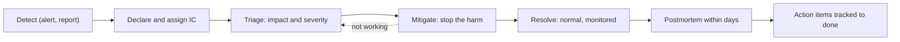

At 14:07 every API endpoint slows to several seconds. By 14:15 eleven engineers are in the incident channel. Four are staring at the same database dashboard, two are restarting different services, nobody has told customer support, and someone proposes a database failover while someone else is halfway through rolling back an unrelated service. The actual cause, a deploy from 13:40, is visible in the deploy log the whole time. The outage lasts 70 minutes; with coordination it would have lasted 25.

Incidents are coordination problems before they are technical problems. The skills that shorten them are the ones senior engineers are expected to bring: declaring early, separating command from debugging, mitigating before understanding, communicating on a clock, and then learning from the incident without blaming anyone. This lesson runs one incident minute by minute, writes its postmortem in full, follows the action items to done, and then shows how the paging and on-call machinery underneath works.

## The severity matrix

A shared scale decides who is woken up and how much process applies. Severity comes from two questions: how important is the broken function, and how many users does it hit?

| Function affected | Under 5% of users | 5–25% of users | Over 25% of users |
|---|---|---|---|
| Data loss, corruption or a security breach | SEV1 | SEV1 | SEV1 |
| Core flow (sign-in, checkout, playback, the main API) | SEV3 | SEV2 | SEV1 |
| Secondary feature, no workaround | SEV3 | SEV3 | SEV2 |
| Secondary feature, workaround exists | SEV3 | SEV3 | SEV3 |
| No user impact yet (a disk at 80%, a near miss) | SEV4 | SEV4 | SEV4 |

| Severity | Response |
|---|---|
| SEV1 | Page immediately; incident commander required; leadership and support told within 15 minutes; updates every 15 minutes; postmortem required, reviewed by leadership |
| SEV2 | Page on-call; incident commander; updates every 30 minutes; postmortem required |
| SEV3 | Business hours; a ticket; postmortem optional |
| SEV4 | Ticket; reviewed at the weekly operations meeting |

The thresholds are illustrative; every organisation tunes its own. Two rules make any version work. **Declare early and downgrade freely:** a false alarm costs a few minutes of process, while a late declaration costs uncoordinated responders and silent stakeholders. Google's SRE book gives a simple trigger: declare if a second team is needed, if customers can see the problem, or if it is still unsolved after an hour of focused analysis. And **severity follows user impact, not technical interest:** a fascinating kernel bug nobody notices is a SEV4.

## Roles

The structure comes from the Incident Command System, which Southern California fire agencies developed through the FIRESCOPE programme after the disastrous 1970 fire season ([Cal OES history](https://firescope.caloes.ca.gov/SiteCollectionDocuments/ICS%20History%20and%20Progression.pdf)), adapted for software. Google's SRE book (chapter ["Managing Incidents"](https://sre.google/sre-book/managing-incidents/)) bases its roles on it: incident command, an ops lead whose team is the only one modifying the system, communication, and planning. [PagerDuty's public incident-response documentation](https://response.pagerduty.com/before/different_roles/) cuts the roles differently, with a deputy, a scribe, subject-matter experts and separate customer and internal liaisons. The four below are the common core.

- **Incident commander (IC).** Owns coordination and decisions: priorities, assignments, which mitigation to try, when to escalate or stand down. The IC does *not* debug. The moment the IC starts reading logs, nobody is coordinating.
- **Operations lead.** Directs the technical investigation and gives specific tasks to the engineers debugging.
- **Communications lead.** Posts internal updates and the status page on a fixed cadence, and shields responders from "any update?" messages.
- **Scribe.** Keeps a timestamped log (UTC) of observations, hypotheses and actions. This log becomes the postmortem timeline.

In a small incident one person holds several roles; the first one to hand off is IC. Hand-offs are explicit: "Maya, you are IC as of 14:40; current state is...".

## Mitigate before you understand



The goal during an incident is to stop user harm, not to find the root cause. The most useful question is **"what changed?"** (deploys, config, flags, traffic, dependencies), because most incidents follow a change: Google's [SRE book](https://sre.google/sre-book/introduction/) reports that "roughly 70% of outages are due to changes in a live system". **One change at a time, announced:** two simultaneous mitigations make it impossible to know which worked, and they can interact badly.

| Mitigation | Time to effect | Risk | Destroys evidence? | Use when |
|---|---|---|---|---|
| Roll back a deploy | Minutes | Low if the deploy had no irreversible migration | Some | Anything deployed in the last few hours |
| Turn off a feature flag | Seconds | Lowest | No | The change was flagged |
| Fail over a region or replica | Minutes | Medium: failovers fail too | Some | One location is unhealthy |
| Add capacity | Minutes | Low, but can hide the cause | No | Load is legitimate and growing |
| Shed or block load at the edge | Minutes | Blocking real users | No | Abusive or runaway traffic |
| Fix forward | Tens of minutes or more | Highest: new code under pressure | No | Rollback is impossible or slower |

**Canaries limit how big an incident can get.** Progressive delivery turns many would-be incidents into a failed canary and an automatic rollback, as long as the canary sees representative traffic, which is exactly what failed in the incident below.

```viz
{"type": "system", "scenario": "canary",
 "title": "Rollback as the default mitigation",
 "caption": "A canary compares the new version against stable on the same window and rolls back automatically when it fails. It only protects code paths that the canary's traffic actually exercises."}
```

## One incident, minute by minute

A hypothetical, built on this app's authentication code, imagined at a hundred times its scale: four API instances behind a load balancer. The code really does hash passwords with Argon2id (about 19 MiB and tens of milliseconds per call) on Tokio's blocking pool, behind a semaphore with one permit per CPU (at least two). In this story, a refactor deployed at 13:40 moves the hash out of `spawn_blocking` and onto the async worker threads. Tokio starts one worker per core by default, so the semaphore that bounds memory now allows every worker to be busy hashing at once. At 14:05 a credential-stuffing attack begins from about 12,000 IP addresses, each staying under the per-IP limit of 30 attempts a minute and spreading guesses across accounts to stay under the per-account limit.

### Detection and declaration: 13:40 to 14:19

The first 39 minutes, from the change to the moment someone took command.

| Time (UTC) | Phase | What happened | Who and what was said |
|---|---|---|---|
| 13:40 | Change | Auth refactor deployed. The canary saw 3 logins in its 10-minute window and passed | Automated |
| 14:05 | Trigger | Login attempts rise from about 2 to about 300 a second | Nobody notices yet |
| 14:07 | Impact | p99 on all endpoints climbs from 90 ms to 2.5 s: lesson reads wait behind hashing on the same workers | Impact starts |
| 14:09 | Amplifier | Readiness probes time out on two instances; the load balancer removes them and the other two take all traffic | Automated |
| 14:12 | Detect | Latency SLO burn-rate alert pages the primary on-call | Dev paged |
| 14:14 | Acknowledge | Dev opens the database dashboards: normal | Dev investigates alone |
| 14:17 | | Dev sees API CPU at 100%; posts "something weird with the API" in #ops | |
| 14:19 | Declare | "I am taking IC. Impact: p99 above 2 s on all endpoints since about 14:07, logins failing. Core flow, most users: SEV1. Dev, ops lead. Sam, comms: status page and leadership in five minutes, then every 15. Lee, scribe." | Maya |

### Mitigation and resolution: 14:21 to 15:20

| Time (UTC) | Phase | What happened | Who and what was said |
|---|---|---|---|
| 14:21 | Diagnose | "Profile shows Argon2 frames on `tokio-runtime-worker` threads" | Dev |
| 14:22 | | "What changed in the last two hours?" | Maya |
| 14:23 | | "Auth refactor at 13:40. Login attempts ×150 since 14:05" | Lee |
| 14:24 | Decide | "Hypothesis: hashing is on the request threads and the attack starves them. Options: roll back, about five minutes and known-good; or block at the edge, but the IP list is still changing. Roll back now; edge block in parallel as a second track. Objections? None. Dev, roll back. Nobody else deploys to the API." | Maya |
| 14:25 | Communicate | Status page: "Investigating slow responses and failed sign-ins"; the same text to support and leadership | Sam |
| 14:31 | Mitigate | Rollback complete; probes pass; all four instances back in rotation | Dev |
| 14:33 | | p99 at 140 ms and falling. Attack continues at 300 a second, now on the blocking pool | Dev |
| 14:36 | Monitor | "Mitigated, monitoring. CPU is 75% from the attack alone, so the edge block stays urgent." | Maya |
| 14:52 | | Edge rule on the attack's request fingerprint deployed; attempts fall to about 5 a second | Dev |
| 15:20 | Resolve | Thirty minutes green. "Closing. Postmortem owner Dev, draft by Thursday." | Maya |

### Why it got this bad

At 75 attempts a second per instance and about 40 ms of CPU per hash, hashing alone needs 75 × 0.04 = 3 core-seconds every second on a 4-core instance. On the blocking pool that is heavy but survivable, because the four async workers stay free for other requests. On the workers it leaves roughly one core for every other request, and bursts take all four. The load balancer then made it worse: removing "unhealthy" instances concentrated the same attack on half the capacity.

### The intervals, and what they cost

| Interval | From → to | Duration | What drove it |
|---|---|---|---|
| Time to detect | Impact 14:07 → page 14:12 | 5 min | Burn-rate alert window |
| Time to acknowledge | 14:12 → 14:14 | 2 min | Normal |
| Time to declare | Impact → 14:19 | 12 min | Seven minutes from page to declaration, five of them investigating alone |
| Time to mitigate | Impact → 14:33 | 26 min | Rollback itself took 5 |
| Time to resolve | Impact → 15:20 | 73 min | Waiting for the edge block and a green half-hour |

The biggest lever was the seven minutes between the page and the declaration. Error budget turns the rest into a number: a 99.9% monthly latency objective allows 0.1% of 43,200 minutes, about 43 minutes of full burn. About 45% of requests missed the latency objective for 26 minutes, so the incident burned 26 × 0.45 ≈ 12 minutes, over a quarter of the month's budget in one afternoon. That number, not the drama of the call, sets how much the action items deserve. Averages of these intervals mislead, because a few long incidents dominate; track the distribution.

## Communicating on a clock

Updates go out on a fixed cadence even when nothing has changed, because silence reads as chaos:

```text
[SEV1] API latency degraded - update 2 - 14:36 UTC
Status: Mitigated, monitoring        (Investigating | Identified | Mitigated | Resolved)
Impact: From 14:07 UTC most requests were slow (over 2 seconds) and many sign-ins
        failed. Response times have been normal since 14:33.
Current action: We reversed a recent change and are blocking abusive sign-in traffic.
Customer guidance: If you could not sign in, please try again now.
Next update: 14:51 UTC, or sooner if the status changes.
```

External updates state impact and action in plain language: no internal system names, no speculation about cause, no blame. Internal updates can carry hypotheses, labelled as such.

## The postmortem, written in full

A postmortem is a written analysis whose goal is learning, not judgement. It is **blameless** for a practical reason: the people closest to a failure know the most about it, and if describing their actions honestly gets them punished, they stop describing them honestly. Google's SRE book (chapter ["Postmortem Culture"](https://sre.google/sre-book/postmortem-culture/)) makes the same argument: "an atmosphere of blame risks creating a culture in which incidents and issues are swept under the rug". Blameless does not mean accountability-free: people are accountable for completing the action items.

### Summary and impact

> **SEV1: API latency and failed sign-ins, 14:07–14:33 UTC.** A refactor moved Argon2 password hashing onto the async worker threads. A credential-stuffing attack 25 minutes later filled those threads with hashing, so every endpoint slowed to p99 above 2 s and many sign-ins failed. Readiness probes on the same threads timed out, and the load balancer removed two of four instances, concentrating the load. Rolling back mitigated it at 14:33; an edge rule stopped the attack at 14:52. **Impact:** about 45% of requests missed the latency objective for 26 minutes (about 12 minutes of error budget, 27% of the month); an estimated 6,000 sign-ins failed; no data was lost or exposed.

### Five whys, and where it stops being enough

1. Why were requests slow? The async worker threads were busy.
2. Why were they busy? They were running Argon2 hashes, about 40 ms of CPU each.
3. Why were hashes on the workers? The refactor removed `spawn_blocking`.
4. Why did review not catch it? The diff looked like a tidy-up, and nothing in the review checklist asks about blocking work on async threads.
5. Why was there no automated check? Nothing tests or lints for CPU-bound work on the runtime's workers.

The chain is true and ends in a useful fix (a test). It also misses most of what made this an outage rather than a blip, because five whys follows one causal path. Asking "why was it not caught?" and "why was it so large?" opens other branches, and those are the contributing factors.

### Contributing factors

| # | Factor | Kind | Question it answers |
|---|---|---|---|
| 1 | The refactor removed `spawn_blocking`; nothing detects CPU-bound work on async workers | Technical | Why was the mistake easy to make? |
| 2 | The semaphore's size (one permit per CPU) equals the default worker count, so it could not protect the runtime | Technical | Why did an existing defence not help? |
| 3 | The canary saw 3 logins in its window; canary analysis compared totals, not the changed path | Process | Why was it not caught before full rollout? |
| 4 | Readiness probes ran on the saturated runtime, so the load balancer removed busy instances | Technical | Why was it so large? |
| 5 | No runtime-saturation dashboard; the first responder spent his first minutes on database dashboards | Detection | Why did it take 12 minutes to declare? |
| 6 | Per-IP and per-account limits both sat above what a 12,000-IP attack needs | Technical | Why did the attack reach hashing at all? |

**Where we got lucky:** it happened in working hours, with the refactor's author online. Luck is an unfixed contributing factor.

### Went well, went poorly

Went well: a single IC from 14:19; rollback chosen within five minutes of the hypothesis; changes frozen; status updates on time. Went poorly: seven minutes from page to declaration, five of them investigating alone; the second track (edge block) took 28 minutes because no runbook existed for it.

## Action items, and following them through

| # | Action | Type | Owner | Priority | Due | Status at day 30 |
|---|---|---|---|---|---|---|
| 1 | Restore `spawn_blocking`; add a test that fails if hashing runs on an async worker | Prevent | Dev | P1 | +7 days | Done |
| 2 | Serve readiness probes from a path independent of request saturation | Mitigate | Lee | P1 | +14 days | Done |
| 3 | Canary analysis includes synthetic logins; fail the canary if a changed path saw no traffic | Detect | Ana | P1 | +30 days | In progress; synthetic logins live, gating next sprint |
| 4 | Export Tokio worker saturation; alert on it | Detect | Dev | P2 | +30 days | Done |
| 5 | Edge-block runbook for credential stuffing; practise it once | Mitigate | Sam | P2 | +45 days | Re-scoped: vendor bot-detection rule instead; new ticket linked |

Good action items are specific, owned, dated, prioritised, and tracked in the normal backlog, not in the postmortem document where they go to die. "Be more careful with async code" and "add more monitoring" are not action items. Cover detect and mitigate as well as prevent: you will not prevent every failure, but you can always shorten the next one.

Follow-through is a mechanism, not a virtue. A weekly operations review walks open P1 items from every postmortem; any P1 past its date needs an owner's explanation in that meeting; a re-scoped item links to its replacement, as item 5 does, so it does not silently vanish. Track the completion rate of P1s within their due date. An organisation that writes excellent postmortems and closes 30% of the actions is not learning, and the next team to remove a `spawn_blocking` will not have read your channel, so share the review beyond the team.

## Under the hood: paging, rotations and on-call load

**The alert pipeline.** Metrics feed alerting rules; a router ([Prometheus Alertmanager](https://prometheus.io/docs/alerting/latest/alertmanager/) is a common open-source one) groups related alerts, suppresses alerts implied by others that are already firing (inhibition), and applies silences; a paging service then runs an **escalation policy**: notify the primary, and if nobody acknowledges within a set timeout (a per-policy setting; [PagerDuty's default](https://support.pagerduty.com/main/docs/escalation-policies) is 30 minutes), notify the secondary, then a manager. An acknowledged page stops the escalation; an unacknowledged one keeps climbing.

**What should page.** Page on symptoms users feel, when a human must act now. Everything else becomes a ticket. Google's SRE Workbook (chapter ["Alerting on SLOs"](https://sre.google/workbook/alerting-on-slos/)) recommends multi-window burn-rate alerts: page when the error budget is burning at 14.4 times the sustainable rate over an hour (2% of a 30-day budget gone), or 6 times over six hours (5%); open a ticket at about 1 times over three days (10%). Each long window is paired with a short one a twelfth as long (5 minutes, 30 minutes and 6 hours), and both must be burning for the alert to fire. The short window confirms the burn is still happening, so the page stops soon after the problem does. The 14:12 page above was a fast-burn alert.

**How rotations are sized.** Google's SRE book (chapter "Being On-Call") describes the reasoning behind its guidance: an incident with its follow-up work takes about six hours on average, so a 12-hour shift can absorb about two; a single-site rotation needs at least eight engineers so each spends roughly one week a month on call (six per site for a two-site team); and on-call should take no more than 25% of an SRE's time, with at least 50% left for engineering ([the chapter](https://sre.google/sre-book/being-on-call/)). Beyond that load, responders stop investigating and start silencing.

**Handoffs.** Weekly primary and secondary shifts, a written handoff (open incidents, recent risky changes, noisy alerts), and follow-the-sun rotations across time zones where the team spans them, so nobody is paged at 3 a.m. for work a colleague could do at 11 a.m.

A senior engineer watches these numbers for the team and treats a noisy alert as a bug to fix, not weather to endure. [Resilience patterns](/learn/system-design/building-blocks/resilience-patterns), [designing for failure](/learn/system-design/senior-design-skills/designing-for-failure) and [observability](/learn/system-design/building-blocks/observability) cover making incidents smaller in the first place, and [AI-assisted debugging and incidents](/learn/ai-assisted-engineering/senior-engineering-with-ai/ai-assisted-debugging-and-incidents) covers where assistants help during one.

## Response failure modes

| Failure | Symptom | Diagnosis | Fix |
|---|---|---|---|
| Late declaration | Page acknowledged, channel silent for ten minutes, then a crowd | Responders feel declaring is an admission | Rule: declare on any user impact; downgrading is free and praised |
| IC who debugs | Nobody answers "what are we doing?"; two mitigations collide | Command and investigation in one head | Hand IC to someone else the moment you want to read logs |
| Uncoordinated mitigations | Restart, failover and rollback at once; nobody knows what worked | No single decider; no freeze | IC announces each change; everything else frozen |
| Status silence | Support learns from customers; executives ping engineers directly | No comms lead or cadence | Comms role assigned at declaration; fixed-interval updates |
| Postmortem theatre | Excellent documents; the same incident class recurs | Action items live in the doc, not the backlog | Items in the backlog; P1 review weekly; completion rate reported |
| Alert fatigue | Pages acknowledged and ignored; real pages missed | Cause-based alerts (CPU above 80%) that need no action | Symptom and burn-rate alerts; every page must be actionable |

## Interviewer follow-ups

**"Tell me about the worst incident you were part of."** Model answer: your role, the minute you knew it was serious, what you decided and why (mitigation before root cause), how you communicated, the contributing factors, and one action item you drove to done. Common wrong answer: a debugging war story ending in "the root cause was a bug in X's code", which tells the interviewer you fixed a bug and learned nothing about the system.

**"How do you keep a postmortem blameless when one person's change caused it?"** Model answer: treat the error as the start of the analysis: what made it easy to make, hard to detect, and expensive; name conditions and actions, not people; accountability means owning the action items. Common wrong answer: "we leave names out", which is anonymised blame, or "we held them accountable", which ends the honest reporting.

**"Your team gets 30 pages a week. What do you do?"** Model answer: sort a month of pages by source and by whether anyone acted; delete or demote non-actionable ones to tickets; replace cause alerts with symptom and burn-rate alerts; fix the top sources; report pages per shift against a target. Common wrong answer: "add people to the rotation", which spreads the noise without reducing it.

**"When would you not roll back?"** Model answer: when the deploy included a migration that already wrote data the old version cannot read, when a flag is faster, or when the cause is outside your system (a provider outage); then fix forward, one small reviewed change at a time. Common wrong answer: "never roll back until we know the root cause".

## What mid-level engineers get wrong

- **Investigating alone before declaring.** In the worked incident, seven of the twelve minutes before anyone coordinated came after the page.
- **Chasing root cause during the incident.** Users stay broken while the team reads code.
- **Changing several things at once.** The team cannot tell which change fixed it, or which made it worse.
- **Writing "human error" as the cause.** Nothing systemic changes, and the next person makes the same mistake.
- **Writing action items nobody can finish.** "Improve monitoring" has no done state.
- **Treating noisy alerts as normal.** The real page gets missed among the ignored ones.

## Exercise: classify an incident

```exercise
id: incident-severity
title: From impact to severity and response
prompt: |
  Classify an incident with the lesson's severity matrix and return the
  response it requires. `incident` has:
  `users_pct` (number, 0 to 100), `core_flow` (bool), `data_or_security`
  (bool), and `workaround` (bool).

  Severity:
  - "SEV1" if `data_or_security` is true, or `core_flow` is true and
    `users_pct` is greater than 25.
  - otherwise "SEV2" if `core_flow` is true and `users_pct` is at least 5,
    or `core_flow` is false, `users_pct` is greater than 25 and there is
    no workaround.
  - otherwise "SEV3" if `users_pct` is greater than 0.
  - otherwise "SEV4".

  Response by severity (page, ic, update_minutes, postmortem):
  SEV1: true, true, 15, "required". SEV2: true, true, 30, "required".
  SEV3: false, false, null, "optional". SEV4: false, false, null, "none".

  Return `{"sev": ..., "page": ..., "ic": ..., "update_minutes": ...,
  "postmortem": ...}`.
languages: [python, javascript]
entry: classify_incident
starter:
  python: |
    def classify_incident(incident):
        # your code here
        return {"sev": "SEV4", "page": False, "ic": False, "update_minutes": None, "postmortem": "none"}
  javascript: |
    function classify_incident(incident) {
      // your code here
      return { sev: "SEV4", page: false, ic: false, update_minutes: null, postmortem: "none" };
    }
tests:
  - args: [{"users_pct": 45, "core_flow": true, "data_or_security": false, "workaround": false}]
    expected: {"sev": "SEV1", "page": true, "ic": true, "update_minutes": 15, "postmortem": "required"}
    label: most users, core flow
  - args: [{"users_pct": 12, "core_flow": true, "data_or_security": false, "workaround": true}]
    expected: {"sev": "SEV2", "page": true, "ic": true, "update_minutes": 30, "postmortem": "required"}
    label: a workaround does not lower a core-flow outage
  - args: [{"users_pct": 0.5, "core_flow": false, "data_or_security": true, "workaround": false}]
    expected: {"sev": "SEV1", "page": true, "ic": true, "update_minutes": 15, "postmortem": "required"}
    label: a data or security incident is SEV1 at any size
  - args: [{"users_pct": 60, "core_flow": false, "data_or_security": false, "workaround": true}]
    expected: {"sev": "SEV3", "page": false, "ic": false, "update_minutes": null, "postmortem": "optional"}
    label: secondary feature with a workaround
  - args: [{"users_pct": 0, "core_flow": true, "data_or_security": false, "workaround": false}]
    expected: {"sev": "SEV4", "page": false, "ic": false, "update_minutes": null, "postmortem": "none"}
    label: no user impact yet
  - args: [{"users_pct": 25, "core_flow": true, "data_or_security": false, "workaround": false}]
    expected: {"sev": "SEV2", "page": true, "ic": true, "update_minutes": 30, "postmortem": "required"}
    hidden: true
    label: exactly 25% of a core flow is SEV2
  - args: [{"users_pct": 30, "core_flow": false, "data_or_security": false, "workaround": false}]
    expected: {"sev": "SEV2", "page": true, "ic": true, "update_minutes": 30, "postmortem": "required"}
    hidden: true
    label: secondary feature, many users, no workaround
  - args: [{"users_pct": 4.9, "core_flow": true, "data_or_security": false, "workaround": false}]
    expected: {"sev": "SEV3", "page": false, "ic": false, "update_minutes": null, "postmortem": "optional"}
    hidden: true
    label: slightly under the core-flow threshold
hints:
  - "Check the conditions from SEV1 downwards and stop at the first that holds."
  - "Keep the response table as a dictionary keyed by severity so the two concerns stay separate."
  - "Watch the boundaries: SEV1 needs strictly more than 25%, SEV2 on a core flow needs at least 5%."
```

## Senior signals

- You declare early, assign an IC who does not debug, and name every role explicitly.
- You ask "what changed?" first and reach for rollback, flags, failover or load shedding before root cause, one announced change at a time.
- You communicate on a fixed cadence with a consistent shape, keeping external facts separate from internal hypotheses.
- You write blameless postmortems with a timeline of what responders believed, five whys where it helps and contributing factors where it does not, and "where we got lucky".
- You quantify incidents in error budget, and you run action items through a weekly review until they are done or explicitly re-scoped.
- You treat paging policy and on-call load as engineering problems: symptom and burn-rate alerts, actionable pages, sustainable rotations.

## Check yourself

```quiz
- q: >-
    Twelve minutes into an incident, the engineer acting as incident commander starts reading application logs to find the bug. What is the problem?
  options: ["Nobody is coordinating, so work and communication stall", "The IC should escalate to a manager before any diagnosis", "Debugging should wait until the incident is fully over", "Logs lag too far behind; the IC should read metrics"]
  answer: 0
  explanation: >-
    The IC's job is coordination and decisions. When they switch to debugging, responders duplicate work, updates stop and nobody approves mitigations. Debugging during the incident is right; the IC doing it is the problem, so hand IC over first.
- q: >-
    In the worked incident, a semaphore allowed one Argon2 hash per CPU. Why did it not protect the service once hashing moved onto the async workers?
  options: ["The attack came from many IPs, so the permits were shared out", "Tokio runs one worker per core, so every one of them could hash", "The semaphore was released too early, before the hash had finished", "Semaphores only limit memory use, never CPU time on any thread"]
  answer: 1
  explanation: >-
    One permit per CPU equals the default number of async worker threads, so the bound designed for memory allowed all workers to be busy hashing at once, starving every other request. On the blocking pool the same bound leaves the workers free. The permits are held for the whole hash and are not tied to IP addresses.
- q: >-
    A 99.9% monthly latency objective allows about 43 minutes of budget. An incident makes 45% of requests miss the objective for 26 minutes. Roughly how much budget does it consume?
  options: ["About 43 minutes, all of it", "About 26 minutes, 60% of it", "About 12 minutes, 27% of it", "About 5 minutes, 12% of it"]
  answer: 2
  explanation: >-
    26 minutes × 45% ≈ 11.7 minutes of full-outage equivalent, about 27% of the monthly budget. Weighting by the fraction of requests affected is what makes partial degradations comparable with full outages.
- q: >-
    Why does the postmortem list contributing factors instead of stopping at the five-whys chain?
  options: ["Five whys is not accepted as evidence in a blameless postmortem", "Contributing factors are needed only when several teams were involved", "Five whys follows one path and misses why it was large and late", "The chain ended in a person, so it had to be replaced entirely"]
  answer: 2
  explanation: >-
    The chain correctly leads to a missing test, but it cannot explain the canary that saw no logins, the probes that removed healthy instances, or the seven minutes from page to declaration. Asking why it was not caught and why it was so large opens those branches. The chain is still useful; it is not sufficient.
- q: >-
    Which action item is most likely to reduce future risk?
  options: ["A test that fails if hashing runs on async workers; Dev; P1; 7 days", "Hold a meeting about code quality; tech lead; P1; next sprint", "Be more careful when refactoring async code; whole team; P2; ongoing", "Add more monitoring to the auth service; SRE team; P2; this quarter"]
  answer: 0
  explanation: >-
    Good action items are specific, verifiable, owned, prioritised and dated. An owner and a date do not rescue an exhortation, a vague monitoring goal or a meeting, because none of them has a done state. The test prevents this exact failure.
- q: >-
    Your burn-rate alert pages when a 30-day error budget burns at 14.4 times the sustainable rate over an hour. What fraction of the monthly budget has that hour consumed?
  options: ["About 50%", "About 2%", "About 14%", "About 0.1%"]
  answer: 1
  explanation: >-
    A sustainable rate spends the budget evenly over 720 hours, so one hour spends 1/720 of it. At 14.4 times that rate, one hour spends 14.4/720 = 2%. That is fast enough to warrant waking someone, since the whole budget would be gone in about two days.
```
