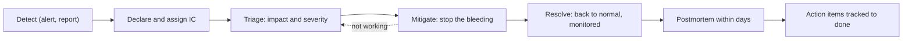

At 14:07 every API endpoint slows to several seconds. By 14:15 eleven engineers are in the incident channel. Four are staring at the same database dashboard, two are restarting different services, nobody has told customer support, and someone proposes a database failover while someone else is halfway through rolling back an unrelated service. The actual cause, a deploy from 13:40, is visible in the deploy log the whole time. The outage lasts 70 minutes; with coordination it would have lasted 25.

Incidents are coordination problems before they are technical problems. The skills that shorten them are the ones senior engineers are expected to bring: declaring early, separating command from debugging, mitigating before understanding, communicating on a clock, and then learning from the incident without blaming anyone. This lesson gives you the structure and the templates, and works through one incident end to end.

## Severity levels

A shared severity scale decides who is woken up and how much process applies. A typical scale:

| Severity | Definition | Examples | Response |
|---|---|---|---|
| SEV1 | Critical: core functionality down, data loss, or security breach affecting many users | Checkout failing for most users; data corruption; leaked credentials | Page immediately; incident commander required; leadership and support notified; updates every 15–30 minutes; postmortem required |
| SEV2 | Major: significant degradation, or a key feature down for a subset of users | Login failing intermittently; one region degraded; p99 latency 50× normal | Page on-call; incident commander; updates hourly or faster; postmortem required |
| SEV3 | Minor: limited impact, workaround exists | A report delayed; a non-critical batch job failing | Business hours; ticket; postmortem optional |
| SEV4 | No user impact yet | A replica's disk at 80%; a near miss | Ticket; review at the weekly operations meeting |

Two rules make the scale work. **Declare early and downgrade freely:** the cost of declaring an incident that turns out to be minor is a few minutes of process, while the cost of declaring late is uncoordinated responders and silent stakeholders. And **severity follows user impact, not technical interest:** a fascinating kernel bug with no user impact is a SEV4.

## Roles

The structure comes from the incident command systems used by emergency services, adapted for software:

- **Incident commander (IC).** Owns coordination and decisions: sets priorities, assigns work, approves mitigations, decides when to escalate or stand down. The IC does *not* debug. The moment the IC starts reading logs, nobody is coordinating.
- **Operations lead.** Directs the technical investigation and hands out specific tasks to the engineers debugging.
- **Communications lead.** Posts internal updates and the external status page on a fixed cadence, and shields responders from "any update?" messages.
- **Scribe.** Keeps a timestamped log (in UTC) of observations, hypotheses and actions. This log becomes the postmortem timeline.

In a small incident one person holds several roles; the first one to hand to someone else is IC. Hand-offs are explicit: "Maya, you are IC as of 14:40; current state is..."

## The lifecycle



**Mitigate before you understand.** The goal during the incident is to stop user harm, not to find the root cause. The standard mitigations are few: roll back a recent change, turn off a feature flag, fail over to a healthy region or replica, add capacity, shed or block abusive load. The most useful question is **"what changed?"** (deploys, configuration, flags, traffic patterns, dependencies), because most incidents follow a change, which is why a rollback is the default first move for anything deployed in the last few hours. Root cause analysis can happen tomorrow with a clear head.

**One change at a time, announced.** Two simultaneous mitigations make it impossible to know which worked, and can interact badly. The IC announces each action before it happens and freezes unrelated changes.

**Canaries limit how big an incident can get.** Progressive delivery turns many would-be incidents into a failed canary and an automatic rollback, as long as the canary sees representative traffic, which is exactly what failed in the worked incident below.

```viz
{"type": "system", "algorithm": "canary",
 "title": "Rollback as the default mitigation",
 "caption": "A canary compares the new version against stable on the same window and rolls back automatically when it fails. It only protects code paths that the canary's traffic actually exercises."}
```

## A worked incident: running the call

The incident from the opening, run well. (It is a hypothetical, built on this app's authentication code.) A refactor deployed at 13:40 accidentally moved Argon2 password verification out of Tokio's blocking pool and onto the async worker threads. At 14:05 a credential-stuffing attack starts sending about 300 login attempts per second.

> **14:12** Latency alert pages the on-call engineer, Dev.
>
> **14:19 Maya (IC):** I am taking IC. Impact: p99 above 5 seconds on all API endpoints since about 14:07, and logins are failing. Declaring SEV2. Dev, you are ops lead. Sam, comms: first update to support and the status page within five minutes, then every fifteen. Lee, please scribe.
>
> **14:21 Dev:** Database metrics are normal. API hosts are at 100% CPU and the profile shows Argon2 running on the async worker threads.
>
> **14:22 Maya:** What changed in the last two hours?
>
> **14:23 Lee:** The auth refactor deployed at 13:40. Login attempts jumped to about 300 per second at 14:05.
>
> **14:24 Maya:** Working hypothesis: the refactor put hashing on the request threads and the login spike is starving them. Two options: roll back the refactor, about five minutes and known-good, or block the attacking IP ranges at the edge, faster but the list is still changing. Proposal: roll back now and work on the edge block in parallel. Objections? *(pause)* None. Dev, roll back. Nobody else deploys to the API until I say so.
>
> **14:31 Dev:** Rollback complete. p99 is falling, 900 ms now.
>
> **14:36 Maya:** p99 has been at 85 ms for five minutes and all four instances pass health checks. Moving to monitoring. Sam, please post "mitigated, monitoring". Edge blocking continues as a follow-up. Postmortem owner is Dev, draft by Thursday. I will close the channel at 15:00 if we stay green.

What the IC did: stated impact and severity, assigned every role by name, asked "what changed?", framed options with their costs, announced the action and froze other changes, and closed with an owner and a date.

## Communicating on a clock

Updates go out on a fixed cadence even when nothing has changed, because silence is interpreted as chaos. The communications lead uses a fixed shape:

```text
[SEV2] API latency degraded - update 2 - 14:34 UTC
Status: Mitigated, monitoring            (Investigating | Identified | Mitigated | Resolved)
Impact: Since 14:07 UTC most API requests were slow (over 5 seconds) and many
        logins failed. Latency has been normal since 14:33.
Current action: We rolled back a recent change and are blocking abusive login traffic.
Customer guidance: Users who could not log in can retry now.
Next update: 15:00 UTC, or sooner if the status changes.
```

External updates state impact and actions in plain language, with no internal system names, no speculation about cause and no blame. Internal updates can carry hypotheses, but label them as such.

## Measuring incidents

Four intervals describe the response: **time to detect** (impact starts to alert fires), **time to declare**, **time to mitigate**, and **time to resolve**. In the worked incident: impact at 14:07, page at 14:12 (5 minutes), declared at 14:19 (12 minutes), mitigated at 14:31 (24 minutes). The biggest lever was the seven minutes between the page and the declaration, spent investigating alone.

Averages of these intervals mislead, because a few long incidents dominate; track the distribution and the worst cases. Tie impact to the error budget. A 99.9% monthly latency objective allows about 43 minutes of full "budget burn" per 30 days (0.1% of 43,200 minutes). This incident degraded about 38% of requests for about 30 minutes, roughly 30 × 0.38 ≈ 11 minutes of budget: about a quarter of the month's allowance in one afternoon. That number, not the drama of the call, is what should drive how much the team invests in the action items. The [observability](/learn/system-design/building-blocks/observability) lesson covers error budgets and burn-rate alerts.

## Blameless postmortems

A postmortem is a written analysis of an incident whose goal is learning, not judgement. It is **blameless** for a practical reason: the people closest to a failure have the most information about it, and if describing their actions honestly gets them punished, they will stop describing them honestly, and the organisation stops learning. "Human error" is where an investigation starts, not where it ends. The useful questions are what made the error easy to make, what made it hard to detect, and what made it expensive. Blameless does not mean accountability-free: people are accountable for completing the action items.

Prefer **contributing factors** to a single root cause. Real incidents need several conditions at once, and "five whys" tends to follow one convenient chain and stop. Also record where you got lucky; luck is an unfixed contributing factor.

```text
POSTMORTEM: <title>          Severity: <SEV>    Date: <date>    Status: Draft | Reviewed
Authors: <names>             Incident commander: <name>

Summary        3-5 sentences: what happened, impact, duration, main contributing factors, current state.
Impact         Users affected, failed or slow requests, duration, error budget consumed, data effects.
Timeline (UTC) Detection, declaration, hypotheses, actions, mitigation, resolution.
               Record what responders believed at each point, not only what turned out to be true.
Contributing factors
               Technical and organisational conditions that made this possible, larger, or slower to fix.
Detection      How we found out, how long it took, how we could have known sooner.
Response       What helped, what slowed us down.
Went well / Went poorly / Where we got lucky
Action items   # | Action | Type (detect / mitigate / prevent / process) | Owner | Priority | Due | Ticket
```

For the worked incident, the contributing factors might read:

1. The refactor removed `spawn_blocking`, and nothing (test, lint, review checklist) detects blocking work on async worker threads.
2. Canary analysis compared overall latency and errors, but canary instances received almost no login traffic, so the changed path was never exercised.
3. Nothing bounded concurrent hashing, so an attack could consume every CPU.
4. Health checks ran on the same saturated runtime, so the load balancer removed busy-but-healthy instances and concentrated load on the rest, amplifying the outage.
5. The first responder spent seven minutes on database dashboards because no dashboard showed runtime saturation.

Where we got lucky: it happened during working hours, with the refactor's author online.

## Action items that reduce risk

| # | Action | Type | Priority |
|---|---|---|---|
| 1 | Restore `spawn_blocking`; add a test that fails if hashing runs on an async worker | Prevent | P1 |
| 2 | Bound concurrent hashing with a semaphore; add per-account and per-IP login limits | Prevent | P1 |
| 3 | Export runtime worker saturation; alert on it | Detect | P2 |
| 4 | Serve health checks independently of request saturation | Mitigate | P2 |
| 5 | Include synthetic login traffic in canary analysis | Detect | P2 |

Good action items are specific, owned, dated, prioritised and tracked in the normal backlog, not in the postmortem document where they go to die. "Be more careful with async code" and "add more monitoring" are not action items. Aim for a handful of strong items over twenty weak ones, cover detection and mitigation as well as prevention (you will not prevent every failure, but you can always shorten the next one), and review the completion rate of P1 items; an organisation that writes excellent postmortems and closes 30% of the actions is not learning. Share the lessons beyond the team, because the next team to remove a `spawn_blocking` will not have read your channel.

## On-call health

Incident response depends on an on-call rotation that people can sustain. Every page should be actionable and should represent user-visible symptoms (error rate, latency, SLO burn), not causes like "CPU above 80%". A common guideline is no more than a couple of incidents per 12-hour shift; beyond that, responders stop investigating and start silencing. Hand-offs between shifts should include open issues and recent changes. A senior engineer watches these numbers for the team and treats noisy alerts as bugs to fix, not weather to endure. The [resilience patterns](/learn/system-design/building-blocks/resilience-patterns) and [designing for failure](/learn/system-design/senior-design-skills/designing-for-failure) lessons cover making incidents smaller in the first place, and [AI-assisted debugging and incidents](/learn/ai-assisted-engineering/senior-engineering-with-ai/ai-assisted-debugging-and-incidents) covers where assistants help and where they need guardrails during an incident.

## Senior signals

- You declare early, assign an IC who does not debug, and name every role explicitly.
- You ask "what changed?" first and reach for rollback, flags, failover or load shedding before root cause.
- You announce each mitigation, change one thing at a time, and freeze unrelated changes.
- You communicate on a fixed cadence with a consistent update shape, separating external facts from internal hypotheses.
- You write blameless postmortems with contributing factors, "where we got lucky", and a few specific, owned action items across detect, mitigate and prevent.
- You quantify incidents in error budget and track action-item completion, not just incident counts.

## Check yourself

```quiz
- q: >-
    Twelve minutes into an incident, the engineer acting as incident commander starts reading application logs to find the bug. What is the problem?
  options: ["Logs are too slow to help", "ICs are not allowed to read logs", "It should have been escalated to a manager", "Nobody is coordinating anymore: priorities, assignments and communication stall while the IC debugs"]
  answer: 3
  explanation: >-
    The IC's job is coordination and decisions. When they switch to debugging, responders duplicate work, communication stops and nobody approves mitigations. Hand the IC role over if you need to debug.
- q: >-
    Latency spiked 25 minutes after a deploy, and the cause is not yet understood. What is the best first mitigation?
  options: ["Keep investigating until the root cause is certain", "Roll back the recent deploy, announcing it and freezing other changes", "Restart every service at once", "Fail over the database as a precaution"]
  answer: 1
  explanation: >-
    Most incidents follow a change, and rollback is the fastest known-good mitigation. Understanding can wait until users are no longer affected. Restarting everything or failing over at the same time adds risk and destroys evidence.
- q: >-
    A 99.9% monthly latency objective allows about 43 minutes of budget. An incident degrades 20% of requests for 50 minutes. Roughly how much budget does it consume?
  options: ["About 5 minutes", "About 10 minutes", "About 25 minutes", "About 50 minutes"]
  answer: 1
  explanation: >-
    50 minutes × 20% of requests ≈ 10 minutes of full-outage equivalent, close to a quarter of the monthly budget. Weighting by the fraction affected is what makes partial degradations comparable with full outages.
- q: >-
    A postmortem concludes "root cause: engineer error; the engineer forgot spawn_blocking". What is the main weakness?
  options: ["It stops at human error instead of asking why the mistake was easy to make and hard to detect, so nothing systemic changes", "It is too short", "It names the wrong engineer", "Postmortems should not mention code"]
  answer: 0
  explanation: >-
    Blameless analysis treats the error as a starting point. The useful findings are the missing test or lint, the canary that did not exercise the path, and the lack of saturation alerts, which the action items can fix.
- q: >-
    Which action item is most likely to reduce future risk?
  options: ["Be more careful when refactoring async code", "Add more monitoring", "Add a test that fails if password hashing runs on an async worker thread; owner Dev; P1; due in one week", "Hold a meeting about code quality"]
  answer: 2
  explanation: >-
    Good action items are specific, verifiable, owned, prioritised and dated. Exhortations and vague monitoring goals cannot be completed or checked.
```
