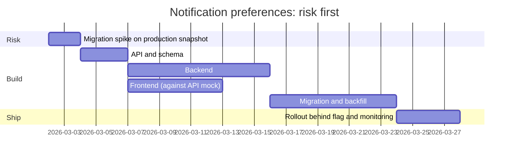

"How long will the notification preferences page take?" "About three weeks." Seven weeks later it ships. Nobody lied. The engineer added up the most likely duration of each of five tasks (16 working days), forgot that a working week contains about three days of focused project time, did not mention that the data migration could take two days or twelve, and gave a single number that everyone upstream wrote down as a promise. Marketing had already booked the launch.

An estimate is a probability distribution communicated under social pressure. Senior engineers are trusted to estimate not because they guess better, but because they break work down until the unknowns are visible, express uncertainty as ranges with a confidence level, schedule the riskiest unknowns first, and renegotiate scope rather than quality when reality diverges. And because there is always more work than capacity, they prioritise with explicit criteria and say no in a way that keeps trust intact.

## Why estimates go wrong

- **Durations are right-skewed.** A task you expect to take four days can rarely finish in two but can easily take twelve. Adding up "most likely" values systematically underestimates the total, because the long tails do not cancel.
- **Invisible work.** Code review, test data, environments, the deploy pipeline, documentation, the dependency on another team's API. None of it is in the mental picture of "writing the feature".
- **The focus factor.** Meetings, reviews, interviews, on-call and interruptions consume a large share of each week. Around three focused project days per five-day week is a reasonable default; on-call weeks are lower.
- **The planning fallacy.** People estimate their own plans by imagining them going well, even when they know similar projects did not.
- **Anchoring.** The first number spoken in a meeting sticks, especially if a manager says it hopefully.

## Break it down until the unknowns show

Decompose until each task is no more than two or three days. A task you cannot break down that far is not a task; it is an unknown, and the right plan for it is a **spike**: a time-boxed investigation ("two days to prototype the migration on a copy of production data") whose output is an estimate. Include the invisible work explicitly: design review, tests, migration and backfill, rollout, monitoring and documentation are line items.

## Three-point estimates

For each task, estimate an optimistic (O), most likely (M) and pessimistic (P) duration. The PERT approximation treats each as a skewed distribution with mean E = (O + 4M + P) / 6 and standard deviation σ = (P − O) / 6. For the notification preferences page, in ideal engineer-days:

| Task | O | M | P | E | σ |
|---|---|---|---|---|---|
| API design and schema | 1 | 2 | 4 | 2.17 | 0.50 |
| Backend implementation | 3 | 5 | 10 | 5.50 | 1.17 |
| Data migration and backfill | 2 | 4 | 12 | 5.00 | 1.67 |
| Frontend | 2 | 3 | 6 | 3.33 | 0.67 |
| Rollout and monitoring | 1 | 2 | 5 | 2.33 | 0.67 |
| **Total** | | **16** | | **18.33** | **2.30** |

The total σ is not the sum of the σ values; for independent tasks the *variances* add, so σ = √(0.50² + 1.17² + 1.67² + 0.67² + 0.67²) = √5.28 ≈ 2.30 days. Treating the total as roughly normal:

- About 84% confidence at E + 1σ ≈ 20.6 ideal days.
- About 95% confidence at E + 1.645σ ≈ 22.1 ideal days.

Now apply the focus factor. At three focused days per five-day week (0.6), 20.6 ideal days is about 34 working days: **roughly seven calendar weeks** for one engineer, against the "three weeks" that came from summing the most likely column. Notice that the migration task, with the widest range, contributes more than half the total variance (2.78 of 5.28). That is where a spike pays off: two days of prototyping that narrows it to 3 to 6 days cuts the overall uncertainty dramatically.

The independence assumption is optimistic. If one unknown (say, a messy legacy schema) would slow the backend, the migration and the frontend at once, the tasks are correlated and the real spread is wider. Say so when you present the numbers.

## Reference classes and track records

The cheapest correction for optimism is history. Ask how long the last few similar projects took *relative to their estimates*. If your team's last five migrations took 1.4×, 1.8×, 2.2×, 1.5× and 1.3× their original estimates, the median overrun is 1.5×, and a new migration estimate should be multiplied accordingly until the team demonstrably estimates better. Keep a simple log of estimate versus actual per project; after a year it is the most valuable planning data you have.

## Monte Carlo from throughput

For a backlog of many similar-sized items (tickets in a migration, pages to port), you can skip task-level estimation entirely and simulate from the team's actual throughput:

```python
import random

history = [4, 7, 3, 6, 5, 8, 2, 5]      # items finished in each of the last 8 weeks
backlog = 40

def weeks_to_finish():
    done, weeks = 0, 0
    while done < backlog:                # terminates: every sampled week adds at least 2
        done += random.choice(history)
        weeks += 1
    return weeks

runs = sorted(weeks_to_finish() for _ in range(100_000))
```

Average throughput is 5 per week, so the naive answer is "8 weeks". The simulation shows that 8 weeks is roughly a coin flip: about 54% of runs finish within 8 weeks, 84% within 9, and 96% within 10. The honest communication is "50/50 by week 8; I would commit to week 10". This method needs stable item sizes and a stable team, and it needs no estimation meetings at all.

## Communicating estimates

- **Give a range with a confidence level**, never a bare number: "50% by March 14, 90% by April 4", or "seven weeks, likely between six and nine".
- **Name the drivers of uncertainty and when the range will narrow:** "The migration is the wide part; after the spike next Wednesday I will narrow this."
- **Separate estimate, target and commitment.** The estimate is the distribution. The target is what the business wants. The commitment is the point on the distribution you promise, usually a high-confidence one. Many planning conflicts are these three words being used interchangeably.
- **Report slips the day you know them**, with options:

```text
Update: preferences page, week 4 of 7
Status: at risk for April 4 (was on track)
Why: the legacy preferences table has 3 incompatible formats; migration now 8-10 days, not 4.
Options:
  1. Keep scope, move launch to April 18 (90% confidence).
  2. Keep April 4, launch without email-digest settings; add them April 18.
  3. Add a second engineer to the migration: saves ~3 days, costs ~2 days of ramp-up.
Recommendation: option 2; digest settings are used by under 5% of users.
Decision needed by: Friday, so marketing can adjust.
```

## Planning around risk

Sequence work so the riskiest, least-understood parts come first: spikes, the integration with another team, the migration on real data. Define milestones that either deliver something usable or retire a risk ("migration proven on a production snapshot"), never milestones like "backend 80% done", which say nothing.



Keep a short risk register next to the plan:

```text
Risk                            Likelihood  Impact  Mitigation                         Owner  Trigger to act
Legacy table formats vary       High        High    Spike on prod snapshot in week 1   Dev    Spike finds more than 1 format
Email team API not ready        Medium      Medium  Build against a mock; weekly sync  Ana    Not in staging by week 3
Launch date fixed by marketing  High        Medium  Agree a phased scope up front      Lead   Any slip above 3 days
```

When reality diverges, the levers are scope (cut or phase it), time, and people. Adding people late usually helps less than expected, because new people need ramp-up and every added person adds coordination; the extra engineer in the slip update above buys three days and costs two. Quality is not a lever, and quietly cutting tests or monitoring to hit a date just moves the cost into the next incident.

## Prioritisation

**RICE** scores an item as Reach × Impact × Confidence ÷ Effort. Three candidate items for next quarter:

| Item | Reach (users / quarter) | Impact (0.25–3) | Confidence | Effort (person-weeks) | Score |
|---|---|---|---|---|---|
| A. Saved-search alerts | 5,000 | 2 | 80% | 4 | 2,000 |
| B. Faster lesson page load | 20,000 | 0.5 | 100% | 2 | 5,000 |
| C. Bulk export for admins | 300 | 3 | 50% | 3 | 150 |

B wins despite its small per-user impact, because it touches everyone and is cheap. RICE is a conversation tool, not an oracle: it rewards the visible and undervalues risk reduction, security work and enabling work whose value arrives through other projects.

**Cost of delay** handles ordering when value depends on time. Divide the weekly cost of *not* having something by its duration (a method often called CD3). Project X is worth $50k a week once live and takes 5 weeks (50 ÷ 5 = 10). Project Y is worth $20k a week and takes 1 week (20 ÷ 1 = 20). Doing Y first costs 1 week of Y's delay plus 6 weeks of X's: 20 + 300 = $320k. Doing X first costs 5 weeks of X's delay plus 6 of Y's: 250 + 120 = $370k. The "less valuable" project goes first and saves $50k, because it is short.

**Maintenance and technical debt** rarely win item-by-item against features, so give them an explicit capacity allocation (for example 20% of each cycle) rather than making them compete.

## Saying no

Every yes is an implicit no to something else, so a senior "no" is really a visible trade-off:

> **Product manager:** Sales needs SSO for a big customer. Can we fit it into this quarter?
>
> **Senior engineer:** We can, but not on top of everything else. SSO is about three weeks for us including security review. If it goes in, the options are: move the preferences page to next quarter, or ship preferences without the digest settings and do SSO in the gap. The third option is a smaller SSO covering only the customer's identity provider, about a week and a half, and we generalise it next quarter.
>
> **Product manager:** The customer only uses one provider.
>
> **Senior engineer:** Then I would recommend the smaller SSO now. I will write down that the general version is deferred, so nobody assumes we built it.

The shape is always the same: yes to the goal, a clear statement of what it displaces, two or three options with costs, a recommendation, and a written record. If a manager or executive overrules you after hearing the trade-off, that is their call to make; disagree, commit, and keep the record.

## Roadmaps

Long-range roadmaps are best expressed as **now / next / later** with decreasing precision: committed work with dates for the current cycle, sequenced intentions for the next, and themes beyond. Phrase items as outcomes ("reduce time to first lesson for new users by half") rather than outputs ("build onboarding v2"), so the team keeps room to find the cheapest route. Revisit the roadmap on a fixed cadence, and treat changes to it as normal rather than as failures. The [capacity planning and cost](/learn/system-design/senior-design-skills/capacity-planning-and-cost) lesson applies the same range-based thinking to infrastructure.

## Senior signals

- You give ranges with confidence levels, name the drivers of uncertainty, and say when the range will narrow.
- You break work down until unknowns become visible, and turn irreducible unknowns into time-boxed spikes.
- You apply a focus factor and a reference-class correction instead of trusting a sum of most-likely values.
- You sequence the riskiest work first and define milestones that deliver value or retire risk.
- You report slips as soon as you know, with options and a recommendation, and trade scope rather than quality.
- You prioritise with explicit criteria (RICE, cost of delay) while naming what those methods undervalue, and you say no by making the trade-off visible.

## Check yourself

```quiz
- q: >-
    Five tasks have most-likely durations summing to 16 days. Why is 16 days a poor estimate of the total?
  options: ["Most-likely values are always padded, so the sum overstates the total", "Estimates should be in hours, and rounding each task to days loses accuracy", "The tasks run in parallel, so the total should be the longest single task", "Durations are right-skewed, so summing modes understates the expected total"]
  answer: 3
  explanation: >-
    Pessimistic tails pull each task's mean above its mode, so the sum of most-likely values understates the expected total: about 18.3 ideal days here. It also ignores the focus factor: ideal days must then be converted to calendar time at perhaps 60% focus. Most-likely values are optimistic, not padded.
- q: >-
    Three independent tasks have standard deviations of 3, 4 and 0 days. What is the standard deviation of their total?
  options: ["12 days", "7 days", "5 days", "3.5 days"]
  answer: 2
  explanation: >-
    For independent tasks the variances add: 9 + 16 + 0 = 25, and the square root is 5. Adding standard deviations directly (7) overstates the spread of a sum of independent tasks.
- q: >-
    A Monte Carlo forecast shows 54% of runs finishing within 8 weeks and 96% within 10. What should you tell stakeholders?
  options: ["It cannot be estimated until the work starts", "8 weeks, since that is the most likely outcome", "About even odds by week 8; commit to week 10", "Between 8 and 10 weeks, with no confidence level"]
  answer: 2
  explanation: >-
    Pairing dates with confidence levels lets stakeholders choose how much risk to take. A bare "8 weeks" is a coin flip presented as a promise.
- q: >-
    Project X is worth $50k per week once live and takes 5 weeks; project Y is worth $20k per week and takes 1 week. Which order minimises the total cost of delay?
  options: ["Either order, because the total value delivered is the same", "X first, because its weekly value is two and a half times Y's", "Y first, because its value per week of duration is higher", "Both in parallel at half speed, so neither waits in the queue"]
  answer: 2
  explanation: >-
    Y's value per week of duration is 20 against X's 10. Y first costs 20 + 300 = $320k of delay; X first costs 250 + 120 = $370k. Short, valuable work goes first even when it is less valuable in absolute terms. Splitting both in parallel delays both.
- q: >-
    Midway through a project you learn the migration will take twice as long as planned. What is the senior response?
  options: ["Work weekends quietly to protect the date without alarming anyone", "Wait until nearer the deadline, in case the estimate turns out pessimistic", "Cut back the test plan to recover the time and keep the date", "Report the slip now with options (date, scope, help) and your recommendation"]
  answer: 3
  explanation: >-
    Early, option-based communication (move the date, phase the scope, add help, plus your recommendation) lets the business choose the trade-off while choices still exist. Waiting removes options, and hidden heroics and silently dropping quality both move the cost somewhere worse.
```
