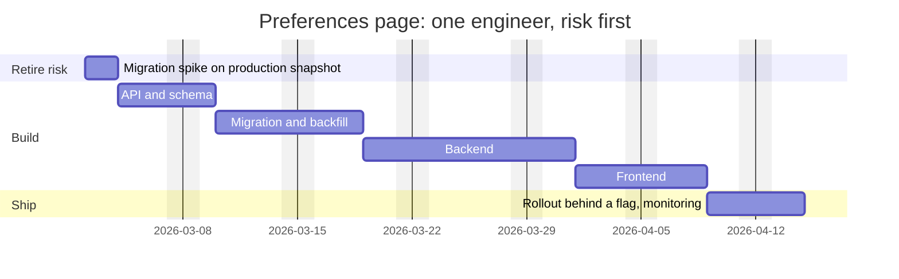
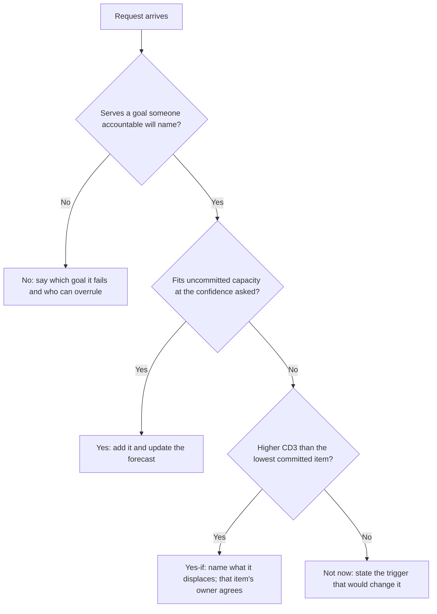

"How long will the notification preferences page take?" "About three weeks." Seven weeks later it ships. Nobody lied. The engineer added up the most likely durations of five tasks (16 days), forgot that a working week holds about three days of focused project time, did not mention that the data migration could take two days or twelve, and gave a single number that everyone upstream wrote down as a promise. Marketing had already booked the launch.

An estimate is a probability distribution communicated under social pressure. Senior engineers are trusted with estimates not because they guess better but because they break work down until the unknowns show, state ranges with a confidence level, schedule the riskiest unknowns first, and trade scope rather than quality when reality diverges. Because work always exceeds capacity, they also rank it with explicit criteria and say no without burning trust. This lesson works all of that on one illustrative project.

## Why estimates go wrong

- **Durations are right-skewed.** A four-day task rarely finishes in two but can take twelve. The tails do not cancel, so a sum of most-likely values sits below the expected total.
- **Invisible work.** Review, test data, the deploy pipeline and another team's API are missing from "writing the feature".
- **The focus factor.** Meetings, reviews, interviews and on-call take a large share of the week; three focused days in five (0.6) is a fair default until you measure your own.
- **The planning fallacy.** Kahneman and Tversky's name for imagining your plan going well even when similar plans did not. Anchoring makes it worse: the first number spoken sticks.

## Break it down until the unknowns show

Decompose until each task is at most two or three days. A task you cannot break down that far is an unknown, and the plan for an unknown is a **spike**: a time-boxed investigation whose output is an estimate ("two days running the migration against a copy of production data"). Invisible work becomes line items:

```text
Notification preferences page                        ideal days (O / M / P)
1. API design and schema, including design review         1 / 2 / 4
2. Backend: endpoints, validation, tests                  3 / 5 / 10
3. Data migration and backfill of legacy settings         2 / 4 / 12   <- widest: spike it first
4. Frontend against the API, including accessibility      2 / 3 / 6
5. Rollout behind a flag, dashboards, alerts, docs        1 / 2 / 5
Excluded: the email team's digest API (a dependency, tracked as a risk)
```

Estimate in **ideal days**, uninterrupted engineering time, and convert to calendar time once, at the end. Write down what is excluded: that line stops "the digest API was late" turning into "your estimate was wrong".

## Three-point estimates

For each task, estimate optimistic (O), most likely (M) and pessimistic (P) durations. PERT, built for the US Navy's Polaris programme in the late 1950s, models each as a skewed distribution with mean E = (O + 4M + P) / 6 and σ = (P − O) / 6:

| Task | O | M | P | E | σ | σ² |
|---|---|---|---|---|---|---|
| API design and schema | 1 | 2 | 4 | 2.17 | 0.50 | 0.25 |
| Backend | 3 | 5 | 10 | 5.50 | 1.17 | 1.36 |
| Data migration and backfill | 2 | 4 | 12 | 5.00 | 1.67 | 2.78 |
| Frontend | 2 | 3 | 6 | 3.33 | 0.67 | 0.44 |
| Rollout and monitoring | 1 | 2 | 5 | 2.33 | 0.67 | 0.44 |
| **Total** | | **16** | | **18.33** | **√5.28 = 2.30** | **5.28** |

Trace the migration: E = (2 + 16 + 12) / 6 = 5.00 and σ = 10 / 6 = 1.67. The mean sits a day above the mode because the pessimistic tail is eight days and the optimistic one two; every row does this, so the modes sum to 16 and the means to 18.33.

**Variances add; standard deviations do not.** Each variance is (P − O)² / 36, so for independent tasks the total is (9 + 49 + 100 + 16 + 16) / 36 = 190 / 36 = 5.28 and σ = √5.28 ≈ 2.30 days, not the 4.67 you get by adding the σ column ([probability for engineers](/learn/foundations/math-for-engineers/probability-for-engineers) has the rule). The total is roughly normal, so a commitment at confidence z sits at E + zσ; the focus factor converts it to calendar time:

| Confidence | z | Ideal days | Working days at 0.6 | Weeks |
|---|---|---|---|---|
| 50% | 0 | 18.3 | 30.6 | 6.1 |
| 84% | 1.00 | 20.6 | 34.4 | 6.9 |
| 90% | 1.28 | 21.3 | 35.5 | 7.1 |
| 95% | 1.645 | 22.1 | 36.9 | 7.4 |

The honest answer was "six weeks at even odds, seven at 90%". Even the sum of modes, converted, is 16 ÷ 0.6 ≈ 26.7 working days (5.3 weeks): the skew costs a week, the missing conversion the rest.

The migration holds 2.78 of the 5.28 variance, 53%. If a two-day spike on a production snapshot narrows it to 3 / 4 / 6, the total becomes 17.5 ± 1.66 days and the 90% point falls from 21.3 to 19.6. Spike the largest variance, not the largest mean.

### What the formulas assume

Dividing by 6 treats O and P as three standard deviations either side: near-certain bounds. Calibration research has long found stated ranges too narrow, so your P is more likely a 90th percentile. If O and P are the 10th and 90th percentiles, σ = (P − O) / 2.56, and this table's total σ is 5.38 days, not 2.30. Ask for P as "the value you would exceed one time in ten" and divide by 2.56.

## Simulating the schedule

A Monte Carlo simulation drops the normal approximation and can model correlation: sample every task, sum, repeat 100,000 times, read percentiles off the sorted totals. Tasks are sampled from a **PERT-beta** distribution, not a triangular one, because its mean equals the table's (O + 4M + P) / 6. A triangular distribution on the same points weights the extremes more (mean (O + M + P) / 3, 20.67 days in total): the conservative choice if you distrust your P values.

The script adds a risk the table leaves out. Suppose, illustratively, a 30% chance the legacy schema is messy, making backend, migration and frontend each take 50% longer. Three variants: no schema risk, the risk drawn independently per task, and the realistic one, a single draw shared by all three.

```python
import random

# (optimistic, most likely, pessimistic) in ideal engineer-days; illustrative
TASKS = {
    "api":      (1, 2, 4),
    "backend":  (3, 5, 10),
    "migrate":  (2, 4, 12),
    "frontend": (2, 3, 6),
    "rollout":  (1, 2, 5),
}
EXPOSED = {"backend", "migrate", "frontend"}  # tasks a messy legacy schema slows
P_MESSY, SLOWDOWN = 0.3, 1.5                  # illustrative: 30% chance, +50% each
RUNS = 100_000

def pert(rng, o, m, p):
    """PERT-beta sample on [o, p] with mode m; its mean is (o + 4m + p) / 6."""
    a = 1 + 4 * (m - o) / (p - o)
    b = 1 + 4 * (p - m) / (p - o)
    return o + (p - o) * rng.betavariate(a, b)

def project(rng, mode):
    shared = rng.random() < P_MESSY           # one draw for the whole project
    total = 0.0
    for name, (o, m, p) in TASKS.items():
        d = pert(rng, o, m, p)
        if mode != "none" and name in EXPOSED:
            messy = shared if mode == "shared" else rng.random() < P_MESSY
            if messy:
                d *= SLOWDOWN
        total += d
    return total

def pct(xs, q):                               # xs is sorted
    return xs[min(len(xs) - 1, int(q * len(xs)))]

results = {}
for mode in ("none", "independent", "shared"):
    rng = random.Random(42)                   # same seed, so every run reproduces
    xs = sorted(project(rng, mode) for _ in range(RUNS))
    results[mode] = xs
    mean = sum(xs) / RUNS
    ps = " ".join(f"P{int(q*100)} {pct(xs, q):4.1f}" for q in (0.5, 0.8, 0.9, 0.95))
    hit = sum(x <= 21.3 for x in xs) / RUNS  # the table's normal-approx P90
    print(f"{mode:<11} mean {mean:5.2f}  {ps}  P(<=21.3) {hit:.0%}")

print("\ndays    independent                     shared")
for lo in range(12, 36, 2):
    cells = []
    for mode in ("independent", "shared"):
        share = sum(lo <= x < lo + 2 for x in results[mode]) / RUNS
        cells.append(f"{share:5.1%} {'#' * round(share * 100):<25}")
    print(f"{lo}-{lo + 2:<3}  " + "  ".join(cells).rstrip())
```

`a` and `b` are the standard PERT-beta shape parameters, which put the mode at M and the mean at (O + 4M + P) / 6. The `shared` draw happens once per project, before the task loop; that line is the whole difference between the two risk variants. Each variant gets its own `random.Random(42)`, so the output reproduces on the same Python version (3.14 here):

```text
none        mean 18.33  P50 18.2 P80 20.4 P90 21.6 P95 22.6  P(<=21.3) 88%
independent mean 20.40  P50 20.1 P80 23.1 P90 24.9 P95 26.4  P(<=21.3) 64%
shared      mean 20.39  P50 19.5 P80 23.8 P90 26.6 P95 28.7  P(<=21.3) 66%

days    independent                     shared
12-14    1.0% #                           1.8% ##
14-16    6.9% #######                    10.4% ##########
16-18   17.4% #################          20.8% #####################
18-20   23.8% ########################   21.7% ######################
20-22   21.8% ######################     15.7% ################
22-24   14.8% ###############            10.3% ##########
24-26    8.2% ########                    7.4% #######
26-28    3.9% ####                        5.5% ######
28-30    1.5% ##                          3.5% ###
30-32    0.6% #                           1.8% ##
32-34    0.1%                             0.8% #
34-36    0.0%                             0.2%
```

## Reading the simulation

**The skew survives the sum.** With no schema risk, the simulated P90 is 21.6 ideal days against the normal approximation's 21.3, and P95 is 22.6 against 22.1: only 88% of runs finish by the table's "90%" date. Small, but it sits in the tail, where commitments live.

**Correlation moves the tail, not the mean.** Both risk variants average 20.4 days, as they must, since each task has the same chance of the same slowdown in both (by hand, 18.33 + 0.3 × 0.5 × (5.5 + 5.0 + 3.33) = 20.41). The shared version has a *lower* median (19.5 against 20.1), because 70% of projects escape entirely, and a fatter tail: P90 26.6 against 24.9, P95 28.7 against 26.4. In the histogram the shared column is taller below 18 days and above 26, shorter between. Assuming independence when one cause drives several tasks puts your P95 more than two days early.

**A risk left out costs more than a correlation mis-modelled.** The table's 90% date survives the named risk only 64% to 66% of the time.

## The cone of uncertainty

Barry Boehm published the shape in *Software Engineering Economics* (1981): the range of possible outcomes is widest at a project's start and narrows as it defines itself. Steve McConnell named it the cone of uncertainty and popularised it, most fully in *Software Estimation: Demystifying the Black Art* (2006), with these ranges for effort relative to the eventual actual:

| Milestone | Range (width) |
|---|---|
| Initial concept | 0.25× to 4× (16-fold) |
| Approved product definition | 0.5× to 2× (4-fold) |
| Requirements complete | 0.67× to 1.5× (2.25-fold) |
| User interface design complete | 0.8× to 1.25× (1.6-fold) |
| Detailed design complete | 0.9× to 1.1× (1.2-fold) |

The cone is a **best case**, the accuracy a skilled estimator can reach at each stage, and it **narrows only when decisions are made**. Its milestones are decisions that remove variability (which channels, which formats, which screens), not dates: a project in week six with an open product definition is still 4-fold wide.

The same project, re-estimated at three milestones (illustrative):

| Milestone | Decision that narrowed it | Point | Range (ideal days) | What you say |
|---|---|---|---|---|
| Concept, day 0 | None: "let users control notifications" | 20 | 5 to 80 | "Two weeks to six months. Two days of product definition gets this to 4-fold." |
| Definition, day 3 | Email and push only; per-category toggles; digest; migrate existing users | 18 | 9 to 36 | "Three to twelve weeks; Monday's migration spike narrows it." |
| Requirements and spike, day 8 | Two legacy formats found; API agreed | 17.5 | 12 to 26 | "Six weeks likely; I commit to seven." |

At the third milestone the bottom-up 90% interval, 14.8 to 20.2 ideal days, is much narrower than the cone's 12 to 26. That gap is a warning: three-point numbers price only the unknowns you listed. The seven-week commitment (21 ideal days) sits between the bottom-up P90 and the cone's edge on purpose; the difference went on a third legacy format the snapshot lacked.

## Reference classes and track records

The cheapest correction for optimism is history: Kahneman's outside view, which Bent Flyvbjerg developed into reference class forecasting for infrastructure projects. If your last five migrations came in at 1.4×, 1.8×, 2.2×, 1.5× and 1.3× their estimates, the sorted ratios are 1.3, 1.4, 1.5, 1.8, 2.2: median 1.5×, worst 2.2×. Multiply the next migration estimate by 1.5 for even odds. Apply a ratio only to the kind of estimate it was measured against: a history of actuals against summed modes, applied to PERT means, corrects the skew twice. Log estimate, actual and cause for every project.

## Forecasting from throughput

For many similar-sized items, such as migration tickets, skip task estimates and simulate from measured throughput, which already includes meetings, on-call and review:

```python
import random

history = [4, 7, 3, 6, 5, 8, 2, 5]  # items finished in each of the last 8 weeks
RUNS = 100_000

def weeks_to_finish(rng, backlog):
    done, weeks = 0, 0
    while done < backlog:           # terminates: every sampled week adds at least 2
        done += rng.choice(history)
        weeks += 1
    return weeks

for backlog in (40, 50):            # 50: the backlog grows 25% as you learn
    rng = random.Random(7)
    runs = sorted(weeks_to_finish(rng, backlog) for _ in range(RUNS))
    pcts = "  ".join(f"P{int(q * 100)} wk {runs[int(q * RUNS)]}" for q in (0.5, 0.8, 0.9, 0.95))
    print(f"backlog {backlog}: {pcts}")
    for w in range(7, 13):
        share = sum(r <= w for r in runs) / RUNS
        print(f"  done by week {w:>2}: {share:6.1%}")
```

```text
backlog 40: P50 wk 8  P80 wk 9  P90 wk 10  P95 wk 10
  done by week  7:  18.4%
  done by week  8:  53.9%
  done by week  9:  83.5%
  done by week 10:  96.3%
  done by week 11:  99.4%
  done by week 12: 100.0%
backlog 50: P50 wk 10  P80 wk 11  P90 wk 12  P95 wk 13
  done by week  7:   0.1%
  done by week  8:   3.5%
  done by week  9:  21.5%
  done by week 10:  53.5%
  done by week 11:  81.1%
  done by week 12:  94.8%
```

Average throughput is 5 a week, so the naive answer for 40 items is 8 weeks. Week 8 is a coin flip (53.9%), week 9 is 83.5% and week 10 is 96.3%: "50/50 by week 8; I commit to week 10." Backlogs grow as you learn: if 40 items become 50, the 90% date moves from week 10 to week 12. The `100.0%` at week 12 is rounding, not certainty. The method needs stable item sizes and a stable team, and no estimation meeting.

## Choosing an estimation method

| Method | Cost | Needs | Captures | Misleads when | Use for |
|---|---|---|---|---|---|
| Gut single number | Seconds | Experience | The mode, anchored | Always: it is read as a promise | Nothing external |
| Breakdown and three-point | Hours | Tasks you can list | Listed unknowns and their spread | Tasks correlate; P is not a bound | Committing one project |
| Reference class | Minutes, given a log | Estimate-versus-actual history | Systematic optimism | The team or technology is new | Correcting any estimate |
| Throughput Monte Carlo | Minutes | Eight or more weeks of throughput | Real delivery rate | Item size, team or backlog changes | Many-item backlogs |
| Slice and count (#NoEstimates: Woody Zuill, Vasco Duarte) | Continuous | Items sliced to a day or two | Flow, with no estimation meetings | Work that will not slice | Teams with steady flow |

## Communicating estimates

- **A range with a confidence level**, never a bare number: "50% by 13 April, 90% by 20 April".
- **The drivers of uncertainty and when the range narrows**: "The migration is the wide part; Monday's spike narrows it."
- **Estimate, target and commitment differ.** The estimate is the distribution, the target is what the business wants, and the commitment is the point you promise, usually P80 to P90. If the target sits at your P20, say so: "that date happens about one time in five".
- **Report slips the day you know them**, with options:

```text
Update: preferences page, week 4 of 7
Status: at risk for 20 April (was on track)
Why: backfill on full production data hit a third legacy format the snapshot
     did not contain; migration now 8-10 days, not 4.
Options:
  1. Keep scope, move launch to 4 May (90% confidence).
  2. Keep 20 April, launch without email-digest settings; add them 4 May.
  3. Add a second engineer to the migration: saves ~3 days, costs ~2 days
     of the current engineer's time on ramp-up.
Recommendation: option 2; digest settings are used by under 5% of users.
Decision needed by: Friday, so marketing can adjust.
```

## Planning around risk

Put the riskiest work first: spikes, other teams' integrations, the migration on real data. A risk found in week one leaves every option open; in week six it leaves only the date. Milestones deliver something usable or retire a risk ("migration proven on a production snapshot"), never "backend 80% done". For one engineer, risk-first moves the migration ahead of the backend; each bar is the post-spike mean ÷ 0.6, rounded (backend 5.5 ÷ 0.6 ≈ 9 days):



Rank the risk register by exposure, probability × impact. Its first row is the simulation at lower resolution: 30% × 7 days = 2.1 days, the gap between the simulated means.

```text
Risk                        P     Impact   Exposure  Mitigation                          Owner  Act when
Legacy schema messy         30%   +7 days  2.1 days  Spike on prod snapshot, week 1      Dev    Spike finds >1 format
Email team API late         40%   +4 days  1.6 days  Build against a mock; weekly sync   Ana    Not in staging by week 3
Launch date fixed by sales  90%   scope    -         Agree the phased scope up front     Lead   Forecast P90 passes date
```

When reality diverges, the levers are scope, time and people. Brooks's law from *The Mythical Man-Month* (1975), "adding manpower to a late software project makes it later", has a mechanism: newcomers take ramp-up time from the people who know the code, and coordinating pairs grow as n(n − 1)/2, from 6 with four people to 15 with six. Quality is not a lever: cutting tests to hit a date moves the cost into the next incident.

## Prioritisation with RICE

Intercom's RICE scores Reach × Impact × Confidence ÷ Effort on published scales: reach is people or events per period; impact is 3 (massive), 2 (high), 1 (medium), 0.5 (low) or 0.25 (minimal); confidence is 100%, 80% or 50%; effort is person-months in Intercom's version, calendar engineer-weeks here (the scale of scores changes, not their order). An illustrative backlog, reach per quarter:

| Item | Reach × Impact × Conf. ÷ Effort | Score | Rank |
|---|---|---|---|
| A. Saved-search alerts | 5,000 × 2 × 0.8 ÷ 4 | 2,000 | 2 |
| B. Faster lesson page load | 20,000 × 0.5 × 1.0 ÷ 2 | 5,000 | 1 |
| C. Bulk export for admins | 300 × 3 × 0.5 ÷ 3 | 150 | 6 |
| D. SSO for a deal closing this quarter | 800 × 2 × 0.8 ÷ 4 | 320 | 5 |
| E. Database upgrade; support ends in 4 months | 20,000 × 0.25 × 1.0 ÷ 10 | 500 | 4 |
| F. Event pipeline that next quarter's push needs | 5,000 × 0.25 × 0.8 ÷ 10 | 100 | 7 |
| G. Onboarding checklist | 6,000 × 1 × 0.5 ÷ 4 | 750 | 3 |

B wins on reach and low effort. What sinks is instructive: D, whose value is a contract with a date; E, whose value is avoiding an outage on an unsupported database; F, whose value arrives through other projects. RICE has no term for time and scores invisible work as "minimal" however much risk it removes.

## Cost of delay, CD3 and WSJF

Don Reinertsen's *The Principles of Product Development Flow* (2009) argues that if you quantify one thing, it should be **cost of delay**: the value lost per week something is not live. Order jobs by cost of delay divided by duration, which Reinertsen calls weighted shortest job first; the ratio is often called CD3. X is worth $50k a week once live and takes 5 weeks (CD3 10); Y is worth $20k a week and takes 1 (CD3 20). Y first: Y waits 1 week and X waits 6, so 20 × 1 + 50 × 6 = $320k. X first: 50 × 5 + 20 × 6 = $370k. The shorter, less valuable project goes first and saves $50k. Moving Y ahead of X changes the total by CoD_X × D_Y − CoD_Y × D_X, here 50 × 1 − 20 × 5 = −50: an exchange argument, as in [greedy and exchange arguments](/learn/algorithms/greedy/greedy-and-exchange-arguments).

Dollar costs of delay are rarely known, so SAFe defines a relative version: cost of delay is user-business value + time criticality + risk reduction or opportunity enablement, each on a modified Fibonacci scale (1, 2, 3, 5, 8, 13, 20), scored one column at a time with the smallest item set to 1. WSJF divides that by job size, a duration proxy on the same scale:

| Item | Value | Time | Risk / enable | CoD | Size | WSJF | Rank |
|---|---|---|---|---|---|---|---|
| A. Alerts | 8 | 2 | 1 | 11 | 2 | 5.5 | 4 |
| B. Page load | 13 | 1 | 1 | 15 | 1 | 15.0 | 1 |
| C. Bulk export | 2 | 1 | 1 | 4 | 2 | 2.0 | 7 |
| D. SSO deal | 8 | 13 | 2 | 23 | 2 | 11.5 | 2 |
| E. DB upgrade | 1 | 8 | 20 | 29 | 5 | 5.8 | 3 |
| F. Event pipeline | 1 | 3 | 13 | 17 | 5 | 3.4 | 6 |
| G. Onboarding | 5 | 1 | 1 | 7 | 2 | 3.5 | 5 |

Trace D: (8 + 13 + 2) ÷ 2 = 11.5. Its time criticality alone matches B's entire value score.

## When the frameworks disagree

With 28.8 engineer-weeks of roadmap capacity and a commit line at about 20 (derived below), walk each ranking down, adding effort, and stop at the first item that does not fit:

| Ranking | Committed (cumulative effort) | Stretch | Not this quarter |
|---|---|---|---|
| RICE | B (2), A (6), G (10), E (20) | D (24), C (27) | F |
| WSJF | B (2), D (6), E (16), A (20) | G (24) | F, C |

The rankings agree on B, A and E and split on the deal: RICE leaves D in stretch, the part of the plan allowed to miss, and starts E last, the wrong end of the quarter for a four-month deadline. Neither commits F: both score items independently, and "next quarter depends on this" is a sequencing decision no score expresses.

Use the disagreement as a question. D's contract date and E's end of support are constraints, so filter them in first ([articulating trade-offs](/learn/system-design/senior-design-skills/articulating-trade-offs): must-haves never go inside a weighted sum), then rank the rest. Is the deal's date real? What does the customer lose if SSO is a month late? That answer settles more than a score. WSJF has its own flaw: ordinal Fibonacci scores are added as if they were ratios, and whoever wants an item can inflate its risk column, so publish the scores.

## Saying no

Every yes is an implicit no to something else, so a senior no is a visible trade-off:

> **Product manager:** Sales needs SSO for a big customer. Can we fit it into this quarter?
>
> **Senior engineer:** Probably, but not on top of everything else. What does the customer need on the day they sign: every identity provider, or theirs?
>
> **Product manager:** Only theirs. The contract signs at the end of the quarter.
>
> **Senior engineer:** Then three options. General SSO is about three weeks with security review and moves the preferences page to next quarter. Or preferences ships without digest settings and general SSO fills the gap. Or SSO for their provider only, about a week and a half, generalised next quarter. I recommend the third: it meets the date and displaces nothing committed.
>
> **Product manager:** Agreed.
>
> **Senior engineer:** I will write down that the general version is deferred, so nobody assumes we built it.

The shape: a question that shrinks the request to its real need, options priced in time and displacement, a recommendation, a written record. Overruled after the trade-off is heard? Disagree, commit, keep the record ([leading without authority](/learn/senior-craft/technical-leadership/leading-without-authority)).

### A harder one: a fixed date from a VP

Italics say what each move does:

1. **VP:** "The CEO told customers team workspaces launch in five weeks. Hit it." *A public date is a constraint; scope is still open.*
2. **You:** "Understood, the date is fixed. What exactly was promised?" *Accepts the constraint; moves from date to scope.*
3. **VP:** "Invites, up to ten members, shared saved searches." *The must-have is smaller than the spec.*
4. **You:** "The full spec, with roles, per-seat billing and migrating existing teams, is 9 weeks at even odds and 12 at 90%. Five is not on that distribution." *The gap, with confidence levels and no apology.*
5. **You:** "What fits: invites and shared searches on web, behind a flag, billing handled manually at launch. About 85% by the date." *A slice sized to the date at a stated confidence.*
6. **VP:** "Can't we add people and do all of it?" *The standard lever.*
7. **You:** "Two more engineers need about two weeks each before they help, taken from the four who know the code, and coordination pairs go from 6 to 15. They help phase two, not this date." *The lever's mechanism, redirected to where it helps.*
8. **You:** "The cost: preferences moves to next quarter, and the last week is hardening. Confirm, and I will write it up today." *Names the displacement, keeps quality out, gets a decision on record.*
9. **VP:** "Do it. Full version by year end?" *A commitment asked from the wide end of the cone.*
10. **You:** "I will give you a 90% date two weeks after launch, once the migration spike is done. Today: December is likely, not certain." *Commits to when the range narrows, not to a date.*

The numbers are illustrative; the moves are not. The engineer never says "no": the VP hears yes to the goal, a price and a choice.

### Yes, yes-if, not now, no



A hard constraint (a contract, a regulation, an end of support) enters the CD3 step with high time criticality, so it usually becomes a yes-if. "Not now" carries a trigger ("when the event pipeline ships", "if a second customer asks"); "no" carries the reason and who can overrule it. Write both down.

## Roadmaps: now, next, later

A now / next / later roadmap is the cone of uncertainty drawn as a plan. **Now** is this cycle's committed work, dated at P80 to P90. **Next** is sequenced intentions with ranges, typically at the approved-definition stage. **Later** is themes without dates, because a concept-stage item has a 16-fold range and any date would be read as a promise.

```text
NOW (this quarter, committed)        NEXT (ranges)                        LATER (themes)
B  Faster lesson page                F  Event pipeline, 5-20 eng-weeks    Push notifications
D  SSO for the enterprise deal       C  Bulk export, if a 2nd customer    Admin self-serve analytics
E  Database upgrade, before support     asks
   ends
A  Saved-search alerts
Stretch: G, onboarding checklist.
Outcome for the quarter: halve the time from sign-up to first saved search.
```

Phrase goals as outcomes, like the last line above, rather than outputs ("build onboarding v2"), so the team keeps room to find the cheapest route; revisit on a fixed cadence. [Capacity planning and cost](/learn/system-design/senior-design-skills/capacity-planning-and-cost) applies the same range thinking to infrastructure.

## Under the hood: how planning cycles run

Most large companies plan quarterly or half-yearly inside an annual budget; the names differ (OKRs, operating plans, SAFe's PI planning), the mechanics rhyme. Some are public: Google's OKR guidance separates committed objectives, expected in full, from aspirational ones; *Working Backwards*, by two former Amazon executives, describes Amazon's annual OP1 and OP2 plans; Netflix's culture memo argues for teams "highly aligned, loosely coupled", led by context rather than control. The common shape:

1. **Top-down envelope.** Leadership sets a few goals and a headcount budget per organisation, usually before teams estimate anything. Headcount is the real currency: your capacity for the half was fixed months ago.
2. **Bottom-up asks.** Teams list candidate work with rough sizes (T-shirts or engineer-weeks, at cone stage one or two) and what they need from other teams.
3. **Reconciliation.** Asks almost always exceed capacity. The PM argues value and customer commitments, the EM capacity and team health, the tech lead feasibility, risk and estimate width; leadership arbitrates across teams. A dependency counts only if it is on the other team's committed list.

Your leverage is estimate width: a concept-stage item should not get a commit date, so name the spike or decision that would move it to stage three before the cycle closes ([cross-team and organisational impact](/learn/senior-craft/technical-leadership/cross-team-and-organisational-impact) covers the negotiation).

### Commit, stretch and what happens on a slip

The output is a committed list, a stretch list allowed to miss, and a "not doing" list. The commit line comes from a capacity sheet (illustrative):

```text
Quarter capacity, 3 engineers, 13 weeks                      engineer-weeks
Raw: 3 x 13                                                            39.0
Leave and public holidays (this team's history)                        -3.0
KTLO and tech-debt allocation, 20% of the remaining 36                 -7.2
Roadmap capacity                                                       28.8
Commit line: 70%, because the last 4 quarters lost ~30% to
unplanned work                                                         20.2
Stretch                                                                 8.6
```

Calendar engineer-weeks already include meetings; bottom-up ideal days convert with the focus factor (17.5 ÷ 0.6 ÷ 5 ≈ 5.8 engineer-weeks).

Commitments are reviewed weekly or fortnightly as red, amber or green with a forecast date. Amber needs a recovery plan; red gets the options update above, and leadership picks scope, date or people. At the end commitments are graded, and the hit rate sets the next commit line: a team committing at P90 should miss about one in ten. One that never misses commits too little; one that misses half is committing at P50.

## Production failure modes

| Failure | Symptom | Diagnosis | Fix |
|---|---|---|---|
| Hallway number becomes a launch | Marketing books a date from "about three weeks" | Estimate, target and commitment conflated | Ranges with confidence; commitments in writing, at P80 to P90 |
| Watermelon status | Green for six weeks, red in the seventh | Progress measured as effort spent; risks retired late | Risk-first order; milestones that retire risk; weekly re-forecast |
| Dependency stall | Your part is done; integration waits weeks | The dependency was never on the other team's committed list | Get it on their list, or build against a mock with a trigger |
| Sandbagging | Every commitment hit, every quarter, as scope shrinks | Commitments far above P90, padding hidden in tasks | Publish P50 and P90; expect to miss one P90 commitment in ten |
| Priority thrash | Many items 60% done; lead time rising | Every escalation gets a yes; nothing displaced | Yes-if with a named displacement; limit work in progress |

## Interviewer follow-ups

**"Tell me about a time your estimate was badly wrong."** Model answer: the estimate as given, the actual, and the mechanism: "I said three weeks from summed modes; it took seven. A messy legacy schema slowed three tasks at once, and I had not spiked it." Then when you saw it, how you communicated (options in week four) and what you changed (spike the widest task first; keep an estimate log). Common wrong answer: "we worked weekends and made it", or blaming another team.

**"How do you say no to a VP?"** Model answer: rarely to the goal. Treat a fixed date as a constraint, find what was promised, offer a slice sized to the date at a stated confidence, name what it displaces, get the decision in writing; if overruled, disagree and commit. Common wrong answer: "I push back hard with data", or "I say yes and find a way", which turns a planning problem into overtime.

**"How do you prioritise tech debt against features?"** Model answer: in the same currency. A flaky deploy pipeline costing five engineer-hours a week has that as its cost of delay, and a three-week fix (120 hours) pays back in 24 weeks. Keep a standing allocation for upkeep, score large items with WSJF's risk column, and attach debt to feature work in the same code. Common wrong answer: "we always reserve 20%" with nothing measured, or "when there is time", which is never.

**"Your PM wants a date for something nobody has designed."** Model answer: a cone-stage range and the decision that narrows it: "Today, one to six months; after product definition and a spike, within about ±50%." Common wrong answer: one number "to be helpful", or refusing to estimate.

## What mid-level engineers get wrong

- **Summing most-likely values and quoting ideal days as calendar time.** "Three weeks" becomes seven.
- **Adding standard deviations, or assuming independence.** The first overstates the spread (4.67 against 2.30); the second puts P95 two days early when one cause drives several tasks.
- **Committing at P50.** Half your commitments miss by construction.
- **Hiding buffer inside tasks.** Invisible padding gets used up, and the plan still has no visible slack.
- **Reporting a slip when it is certain, not when it is likely.** The cheap options (phase, re-order) have expired.
- **Splitting a team across two priorities to avoid choosing.** In the X and Y example, half speed on both costs $340k even if the team regroups on X once Y ships, against $320k for Y first.

## Exercise: from three-point estimates to a commitment

```exercise
id: three-point-commitment
title: From three-point estimates to a commitment date
prompt: |
  Turn three-point task estimates into a commitment.

  - `tasks` is a list of `[optimistic, most_likely, pessimistic]` durations in
    ideal days, each with O <= M <= P. It may be empty.
  - A task's PERT mean is (O + 4M + P) / 6 and its standard deviation is
    (P - O) / 6.
  - Treat the tasks as independent: the total mean is the sum of the means, and
    the total standard deviation is the square root of the sum of the variances.
  - The commitment in ideal days is `mean + z * sigma`.
  - `focus` (0 < focus <= 1) is the share of each working day spent on project
    work, so `working_days = ceil(commitment / focus)`, computed from the
    unrounded mean and sigma.
  - Work starts on a Monday, which is calendar day 1; Saturdays and Sundays are
    not working days. `commit_day` is the calendar day on which working day
    number `working_days` falls, or 0 when `working_days` is 0.
  - `riskiest` is the index of the task with the largest variance (the lowest
    index on a tie), or -1 when there are no tasks.

  Return `{"mean": m, "sigma": s, "riskiest": i, "working_days": w,
  "commit_day": d}` with `mean` and `sigma` rounded to 2 decimal places.
languages: [python, javascript]
entry: commit_plan
starter:
  python: |
    import math

    def commit_plan(tasks, z, focus):
        # your code here
        return {"mean": 0, "sigma": 0, "riskiest": 0, "working_days": 0, "commit_day": 0}
  javascript: |
    function commit_plan(tasks, z, focus) {
      // your code here
      return { mean: 0, sigma: 0, riskiest: 0, working_days: 0, commit_day: 0 };
    }
tests:
  - args: [[[1, 2, 4], [3, 5, 10], [2, 4, 12], [2, 3, 6], [1, 2, 5]], 1.28, 0.6]
    expected: {"mean": 18.33, "sigma": 2.3, "riskiest": 2, "working_days": 36, "commit_day": 50}
    label: "the lesson's table at about 90% confidence"
  - args: [[[1, 2, 4], [3, 5, 10], [2, 4, 12], [2, 3, 6], [1, 2, 5]], 0, 0.6]
    expected: {"mean": 18.33, "sigma": 2.3, "riskiest": 2, "working_days": 31, "commit_day": 43}
    label: "z = 0 commits at the mean, about a coin flip"
  - args: [[[4, 6, 11]], 1, 0.8]
    expected: {"mean": 6.5, "sigma": 1.17, "riskiest": 0, "working_days": 10, "commit_day": 12}
    label: "the last working day is a Friday"
  - args: [[], 1.645, 0.6]
    expected: {"mean": 0, "sigma": 0, "riskiest": -1, "working_days": 0, "commit_day": 0}
    label: "no tasks"
  - args: [[[3, 3, 3]], 2, 0.8]
    expected: {"mean": 3, "sigma": 0, "riskiest": 0, "working_days": 4, "commit_day": 4}
    label: "a certain task has no spread"
  - args: [[[2, 4, 8], [1, 1, 7], [3, 3, 3]], 1.645, 0.5]
    expected: {"mean": 9.33, "sigma": 1.41, "riskiest": 0, "working_days": 24, "commit_day": 32}
    label: "equal variances: the lower index is riskiest"
    hidden: true
  - args: [[[1, 2, 3], [2, 3, 5], [3, 6, 30], [1, 1, 2], [2, 3, 4], [5, 8, 13], [1, 2, 6]], 1.645, 0.65]
    expected: {"mean": 29.67, "sigma": 4.82, "riskiest": 2, "working_days": 58, "commit_day": 80}
    label: "one task dominates the variance"
    hidden: true
hints:
  - "Accumulate the means and the variances separately, and take the square root once, at the end."
  - "Round up to whole working days: a commitment of 35.46 working days needs day 36, so use ceil, not round."
  - "Each full week before the last working day adds a weekend: day = w + 2 * floor((w - 1) / 5). Check w = 5 (Friday, day 5) and w = 6 (Monday, day 8)."
```

## Senior signals

- You give **ranges with confidence levels** and say which decision will narrow them, and when.
- You add **variances, not standard deviations**, spike the largest variance share, and ask whether your P values are bounds or 90th percentiles.
- You **simulate when tasks share a cause**: correlation leaves the mean alone and moves the P90 and P95 you commit to.
- You place estimates on the **cone of uncertainty**, treat a bottom-up range far narrower than the cone as a warning, and correct with a **reference class**.
- You sequence **risk first**, report slips early with options, and rank with **RICE and WSJF** side by side, filtering deadlines in as constraints first.
- You say no as **"yes, if"**: goal accepted, price named, choice handed back, decision written down.

## Check yourself

```quiz
- q: >-
    In the lesson's table the backend has the largest mean (5.5 days) and the migration the widest range (2 to 12 days). You have two days for one spike. Which task should it target?
  options: ["The migration: it holds over half the total variance", "Rollout: its tail is the longest relative to its mode", "The frontend: it comes last, so it absorbs every slip", "The backend: it holds the largest share of the mean"]
  answer: 0
  explanation: >-
    The migration contributes 2.78 of the 5.28 total variance, 53%, so narrowing it to 3 / 4 / 6 cuts the total σ from 2.30 to 1.66 days and the 90% point from 21.3 to 19.6 ideal days. The backend is longer but better understood. A spike buys information, and information is worth most where the spread is.
- q: >-
    A simulation gives each of three tasks a 30% chance of a 50% slowdown. In one variant the three draws are independent; in the other, one shared draw (a messy legacy schema) applies to all three. How do the totals compare?
  options: ["Lower mean and a narrower tail with the shared draw", "Higher mean with the shared draw; the same P95", "Same mean; the shared draw widens the P95 tail", "Same mean and same P95, since each task matches"]
  answer: 2
  explanation: >-
    Each task has the same chance of the same slowdown in both variants, so the means match (20.4 days in the lesson's run). The shared draw makes the slowdowns arrive together or not at all: the median falls from 20.1 to 19.5 while P95 rises from 26.4 to 28.7. Matching per-task distributions do not imply a matching total; the dependence between tasks shapes the tail you commit to.
- q: >-
    At the initial concept stage you estimate 20 ideal days. Three weeks later nobody has decided the scope. What range should you still quote?
  options: ["About 10 to 40 days, as three weeks have passed", "About 5 to 80 days, as nothing has been decided", "About 16 to 24 days, as three-point ranges apply", "About 18 to 22 days, as the team knows the code"]
  answer: 1
  explanation: >-
    McConnell's cone runs from 0.25× to 4× at initial concept, and it narrows only when decisions remove sources of variability, such as approving the product definition. Elapsed time with no decisions leaves the range where it was. A narrow range at this stage prices only the unknowns someone has listed.
- q: >-
    An SSO item for an enterprise deal closing this quarter ranks fifth of seven by RICE and second by WSJF. What explains the gap?
  options: ["RICE double-counts effort; WSJF divides by size", "WSJF inflates reach for any revenue-linked item", "RICE has no term for a deadline; WSJF scores it", "RICE applies confidence; WSJF assumes certainty"]
  answer: 2
  explanation: >-
    RICE multiplies reach, impact and confidence, none of which changes as a contract date approaches, so 800 users at high impact score 320. SAFe's WSJF adds time criticality (13 here) to value and risk reduction, for a cost of delay of 23 over a job size of 2. Both divide by size, and WSJF has no reach term at all. The senior move goes further: treat a real contract date as a constraint before ranking anything.
- q: >-
    PERT sets σ = (P − O) / 6. You discover your team's pessimistic values are exceeded about one time in ten, and optimistic values undercut about as often. What should you do to the σ you present?
  options: ["Shrink it: divide the range by about 12 instead", "Widen it: divide the range by about 2.56 instead", "Ignore it: only the mean feeds the commit date", "Keep it: PERT already assumes that level of risk"]
  answer: 1
  explanation: >-
    Dividing by 6 treats O and P as about three standard deviations from the middle, near-certain bounds. If they are really the 10th and 90th percentiles, the range spans 2 × 1.28 standard deviations, so σ = (P − O) / 2.56; for the lesson's table the total σ becomes 5.38 days rather than 2.30. The commitment is the mean plus zσ, so an understated σ pulls the date in directly.
- q: >-
    A VP says the CEO has announced a launch in five weeks. Your 90% forecast for the full scope is twelve weeks. What is the strongest first response?
  options: ["Decline, since the forecast shows the date cannot be met", "Accept the date, ask what was promised, size a slice", "Agree to the date and trim the testing and rollout plan", "Commit to five weeks and add two engineers to the team"]
  answer: 1
  explanation: >-
    A public date is a constraint, so the negotiation moves to scope: find what was actually promised, size a slice to the date at a stated confidence, and name what it displaces. Adding people late costs ramp-up and grows coordination pairs from 6 to 15 when four people become six, which is Brooks's point. A flat refusal leaves the VP no options, and cutting tests moves the cost into the next incident.
```
