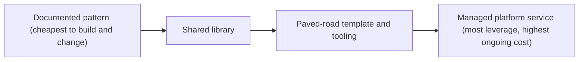

Five product teams each wrote their own HTTP retry logic. Three retried on every error, including `400 Bad Request`. Two used no jitter. One retried forever. One afternoon a shared dependency slowed down, and with two layers of services each making up to three attempts, a single user request became up to nine calls on the struggling dependency. A slowdown became a two-hour outage. Nobody's code was wrong by their own team's standards; the organisation simply had no standard.

The fix was not a sixth retry implementation. A senior engineer wrote a small shared client with retry budgets, exponential backoff with jitter and a rule never to retry non-idempotent requests, made it the default in the service template, opened the migration pull requests for all five teams herself, and published a dashboard of retry rates per service. Within two quarters that class of incident had disappeared.

That is organisational impact: solving a problem once, for everyone, and making the solution stick. At top companies, senior engineers are expected to show some of it, and it is the core of staff-level work. It takes different skills from building features: judging when a shared solution is worth its cost, driving adoption across teams you do not control, and communicating with product managers and executives in their terms.

## When a shared solution is worth it

A shared solution is a product with users. It needs documentation, support, versioning, migrations and often an on-call rotation, forever. Build one too early and you have frozen a guess into a dependency every team must work around. The questions that decide it:

- **How many teams have the problem, really?** "Rule of three": generalise after the third real instance, not the first imagined one.
- **How much does it cost each of them today?** In engineer time and in incidents.
- **How similar are the needs?** Five teams that "all need a queue" may need three different things.
- **What is the lightest form that solves it?**



Choose the leftmost option that solves the problem. For the retry case, the arithmetic was straightforward. Without a standard: five teams spending about two engineer-weeks a year maintaining their own retry code (10 weeks), plus two incidents a year costing about 20 engineer-hours each (about 1 week), so about 11 engineer-weeks a year. With a library: 3 weeks to build, half a week per team to migrate (2.5 weeks), and about 1 week a year to maintain. The first year costs 6.5 weeks, every later year about 1. It pays for itself in the first year, before counting the outages it prevents.

## Paved roads, not golden cages

Netflix popularised the idea of a **paved road**: a well-supported default path (libraries, templates, deployment tooling, observability) that teams are free to leave, provided they take on the cost of owning whatever they build instead. The alternative, mandating a platform and forbidding everything else, tends to produce a platform that stops improving because it has no competition.

The paved-road principle for any shared solution: **make the right thing the easy thing.** New services generated from the template get the shared client, the standard logging and the default alerts with zero decisions. Opting out is allowed and explicit. The platform earns adoption by being better than what teams would build themselves, and you measure it the way a product is measured: adoption rate, time for a new service to reach production, and incidents in the class it was meant to prevent.

## Making standards stick

A standard that nobody adopts is a wiki page. The recipe that works:

1. **Evidence.** Incidents, costs and time lost, with numbers.
2. **An RFC with a final comment period**, so the decision is explicit and teams have been heard (see [design docs and RFCs](/learn/senior-craft/technical-leadership/design-docs-and-rfcs)).
3. **A reference implementation that is better** than what teams already have, not merely compliant.
4. **Automation:** linters, CI checks, templates and codemods that make compliance the default and drift visible.
5. **Migration support:** you open the pull requests, run office hours and answer questions quickly.
6. **A deprecation policy** with dates, so the old way actually ends.
7. **A visible progress dashboard.**

A deprecation timeline you can adapt:

```text
Deprecation: legacy HTTP client (lib-http v1)
T+0      Announce: RFC accepted, migration guide and codemod published, office hours weekly.
T+4 wks  Warn: CI prints a warning on new imports of v1; dashboard lists remaining users.
T+8 wks  Block new use: CI fails on new v1 imports; existing ones allowed.
T+16 wks Support ends: no fixes for v1 except security; owners of remaining services notified by name.
T+24 wks Remove: v1 deleted from the monorepo; any stragglers migrated by the platform team.
```

## Org-wide migrations and the long tail

Most organisation-wide migrations have the same shape. The majority of services migrate quickly: they are actively maintained and their owners want the improvement. The last 10 to 20% take as long as all the rest together: services owned by teams that have been reorganised, services nobody fully understands, and special cases the new system does not support. Plan for the tail from day one.

Suppose 40 services must move to the new client. In the first six weeks, 25 migrate themselves using the codemod. Ten more need help, and a two-person migration squad spends about two weeks on each pair, around ten weeks in total. The final five are genuine special cases: two need a feature added to the new client, and three are candidates for deletion, which requires finding someone with the authority to delete them. Without a funded squad and an executive sponsor for the last few, the migration stalls at around 90% indefinitely, and the organisation now maintains two clients instead of one.

Track the migration in a table everyone can see (service, owning team, status, blocker, target date), send a short weekly update, and celebrate teams publicly as they finish. The [migrations and evolution](/learn/system-design/senior-design-skills/migrations-and-evolution) lesson covers the technical patterns (strangler fig, dual writes, backfills) that make each individual migration safe.

## Conway's law and team boundaries

Systems tend to mirror the communication structure of the organisations that build them (Conway's law). Two teams that rarely talk produce a clumsy interface between their services; one team owning two services tends to couple them. The practical consequences for a senior engineer:

- **Cross-team friction is often an architecture signal.** If every feature requires coordinated changes by three teams, the boundaries are probably in the wrong place.
- **Team design is architecture design.** Organisations can deliberately shape teams to get the architecture they want (the "inverse Conway manoeuvre"). The *Team Topologies* model names four team types (stream-aligned, platform, enabling and complicated-subsystem) that are a useful vocabulary for these conversations.
- **Platforms need a clear interaction mode.** A platform team that is consulted on every change becomes a bottleneck; one that offers self-service with good defaults scales.

## Working with product managers

Product managers own *what* and *why*; engineers own *how* and the long-term health of the system; the two share the *when*. The relationship works best when engineers bring product thinking (what users need, what the business measures) and product managers get early visibility into technical constraints and opportunities. Invite your PM to design reviews; ask to see the metrics the product is judged on.

Technical work competes for the same capacity as features, so frame it in the same currency: outcomes, costs and payback. A pitch template:

```text
Proposal: <what>
Problem: <what hurts, for whom>
Evidence: <numbers: hours lost, incidents, latency, cost>
Cost of doing nothing: <what gets worse, and how fast>
Proposal and cost: <scope, engineer-weeks>
Payback: <when the investment is returned>
Risks: <what could go wrong, how we would know>
```

For example: flaky tests make engineers re-run CI about 70 times a week at roughly 12 minutes each, around 14 engineer-hours a week, or about a third of an engineer. Fixing the ten worst tests is about two engineer-weeks (80 hours) and pays for itself in under six weeks (80 ÷ 14 ≈ 5.7), then keeps returning a third of an engineer indefinitely. Few product managers say no to that when it is presented in those terms.

Be a partner, not only a gatekeeper of feasibility. The most valued senior engineers also bring opportunities: "the event stream we built for the migration makes real-time progress notifications nearly free; do you want them this quarter?"

## Working with leadership

Executives have little time and many contexts. Communication that works for them leads with the conclusion, makes any ask explicit, uses numbers, and never surprises them. A status update shape that respects that:

```text
TL;DR: Auth client migration is AMBER: 31 of 40 services done; tail at risk for the Q3 date.
Status: AMBER because 5 services have no active owner.
Since last update: 6 services migrated; codemod handles the async client too.
Next: migration squad finishes 4 assisted services by Aug 15.
Risks: 5 ownerless services. Mitigation: platform team migrates 2, 3 are deletion candidates.
Ask: a decision from you on deleting the 3 unused services (list attached) by Aug 1.
```

In a two-minute conversation the same structure holds: "We are amber on the auth migration. We are at 31 of 40, and the risk is five services nobody owns. I need one decision from you: can we delete three that have had no traffic for six months? With that, we finish in August."

Managing up is part of the same skill: tell your manager about problems while they are small, bring options rather than only problems, and understand what your manager is measured on, so your work makes their goals easier to reach. Making your work legible is not self-promotion; it is how the organisation knows where to invest.

## Measuring organisational impact

Impact beyond your team needs evidence beyond your team. Useful measures include adoption (percentage of services on the paved road), incident classes eliminated, engineer-hours saved, infrastructure cost saved, and delivery metrics such as the four popularised by the DORA research programme: deployment frequency, lead time for changes, change failure rate and time to restore service. Capture before-and-after numbers at the start of the work, not when you write your promotion case.

And write. At organisational scale, work that is not written down did not happen: an internal post on how the retry storm was eliminated reaches teams you have never met, recruits allies for the next standard, and becomes the record of your impact. The [observability in code](/learn/senior-craft/software-craft/observability-in-code) lesson shows the kind of shared instrumentation that often becomes the first paved road, and [the first 90 days](/learn/senior-craft/getting-the-job/the-first-90-days) covers building the relationships this work depends on when you join a new company.

## Senior signals

- You choose the lightest shared solution that works (pattern, library, template, platform) and justify it with cost arithmetic.
- You make the right thing the easy thing: defaults, templates and automation instead of mandates.
- You drive standards with evidence, an RFC, a better reference implementation, migration help, deprecation dates and a visible dashboard.
- You plan and fund the long tail of migrations from the start.
- You read cross-team friction as a possible boundary problem and can discuss team topology as part of architecture.
- You pitch technical work to product in outcome and payback terms, and update leadership with the conclusion first, a status, risks and an explicit ask.

## Check yourself

```quiz
- q: >-
    Two teams have built similar internal caching wrappers. A colleague proposes a company-wide caching platform service. What is the strongest senior response?
  options: ["Leave each team's wrapper alone, since two copies cost less than any shared code", "Start with a documented pattern or shared library; generalise once more teams need it", "Build the platform service now, before more teams diverge and the migration gets harder", "Mandate the better of the two wrappers for every team and forbid new caching code"]
  answer: 1
  explanation: >-
    Two instances is thin evidence that the needs are the same, and a platform carries permanent cost: documentation, support, migrations and often on-call. A shared library or pattern captures the common part cheaply and leaves room to learn before committing to a service. Building the platform now freezes a guess from two data points into a dependency every team must work around; the rule of three says generalise after the third real instance.
- q: >-
    An org-wide migration reached 90% of services in two months and has been stuck there for five. What was most likely missing from the plan?
  options: ["More frequent announcements so the lagging teams know the migration deadline", "A more capable codemod that migrates the remaining services automatically", "Funding for the long tail: a migration squad, a sponsor and deprecation dates", "A second reference implementation so teams could pick the client that suits them"]
  answer: 2
  explanation: >-
    The last services are the ones without active owners or with special cases, and they do not respond to announcements or codemods, which only speed up services that were going to move anyway. Funded help (a migration squad), an executive sponsor with authority to decide deletions, and deprecation dates with consequences are what finish migrations.
- q: >-
    Flaky tests cost your team about 14 engineer-hours a week. Fixing the worst ones would take about 80 engineer-hours. How should you pitch it to your product manager?
  options: ["As an investment that pays back in six weeks and then frees about a third of an engineer", "By asking the engineering manager to mandate the work over the roadmap", "As an engineering-quality principle, since flaky tests erode the team's trust in CI", "By fixing them quietly inside feature estimates so the roadmap is unaffected"]
  answer: 0
  explanation: >-
    Framing technical work in the same currency as features (cost, payback, capacity regained) lets the PM compare it honestly: 80 ÷ 14 ≈ 5.7 weeks to break even, then roughly a third of an engineer returned every week. A quality principle is true but gives the PM nothing to weigh against features, and quietly padding estimates hides the trade-off from the person who owns the priorities.
- q: >-
    Every new feature in your area needs coordinated changes by three different teams, and planning is slow and contentious. What might a senior engineer suspect?
  options: ["The teams need a shared channel and a common backlog to cut hand-offs", "The teams need more planning meetings to coordinate their roadmaps earlier", "The product manager is writing tickets that are too vague to split cleanly", "Service or team boundaries are misaligned with how the product changes"]
  answer: 3
  explanation: >-
    Conway's law links communication structure and system structure. Persistent cross-team coupling for routine changes often means boundaries are in the wrong place, which is an architecture problem as much as a process one; fixing it may mean moving ownership or redrawing APIs. More meetings or shared channels treat the symptom and leave the coupling in place.
- q: >-
    Which opening is best for a written update to a VP about an at-risk project?
  options: ["A list of every ticket completed, showing that the team is still delivering", "A request for a meeting, since risk is better discussed live than in writing", "A TL;DR with status colour and reason, the risks, and the one decision you need", "A detailed chronology of the last month, so the VP can see how the risk developed"]
  answer: 2
  explanation: >-
    Executives need the conclusion, the risk and the ask first: a TL;DR with the status colour and reason, then risks with mitigations and one explicit decision. Chronologies and ticket lists push the decision-relevant information to the end, and a meeting request without content wastes the first half of the meeting.
```
