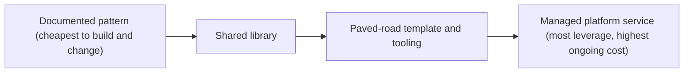

Five product teams each wrote their own HTTP retry logic. Three retried on every error, including `400 Bad Request`. Two used no jitter. One retried forever. One afternoon a shared dependency slowed down, and with two layers of services each making up to three attempts, a single user request became up to nine calls on the struggling dependency. A slowdown became a two-hour outage. Nobody's code was wrong by their own team's standards; the organisation had no standard. (The scenario is illustrative; the arithmetic is not.)

The fix was not a sixth retry implementation. A senior engineer wrote an RFC for one shared client with a retry budget, jittered backoff and a rule never to retry non-idempotent requests ([design docs and RFCs](/learn/senior-craft/technical-leadership/design-docs-and-rfcs) works that RFC end to end), then made it the default in the service template, opened migration pull requests for other teams, and published adoption and incident numbers every week. This lesson is about the part after the RFC is accepted: deciding whether a shared solution is worth it, getting forty services onto it, measuring whether it worked, and explaining all of it to people who will read one page.

## When a shared solution is worth it

A shared solution is a product with users. It needs documentation, support, versioning, migrations and often an on-call rotation, indefinitely. Build one too early and you freeze a guess into a dependency every team must work around. The questions that decide it:

- **How many teams have the problem, really?** Generalise after the third real instance, not the first imagined one.
- **How much does it cost each of them today?** In engineer time and in incidents.
- **How similar are the needs?** Five teams that "all need a queue" may need three different things.
- **What is the lightest form that solves it?**



Choose the leftmost option that solves the problem, and do the arithmetic. Without a standard: five teams spend about two engineer-weeks a year each maintaining retry code (10 weeks), plus two incidents a year at about 20 engineer-hours each (1 week): about 11 engineer-weeks a year. With a library: 3 weeks to build, half a week per team to migrate (2.5 weeks), about 1 week a year to maintain. Year one costs 6.5 weeks and every later year about 1, so it pays back inside the first year before counting the outages it prevents. These are estimates that depend on the team and codebase; the shape of the comparison is what matters, and it goes in the RFC.

## Paved roads, not golden cages

Netflix engineers have described in public talks and posts the idea of a **paved road**: a well-supported default path (libraries, templates, deployment tooling, observability) that teams are free to leave, provided they take on the cost of owning whatever they build instead. Mandating a platform and forbidding everything else tends to produce a platform that stops improving, because it has no competition.

The principle for any shared solution: **make the right thing the easy thing.** New services generated from the template get the shared client, the standard logging and the default alerts without anyone deciding to. Opting out is allowed and explicit. The platform earns adoption by being better than what teams would build, and you measure it as a product: adoption, time for a new service to reach production, and incidents in the class it was meant to prevent.

## A platform-adoption plan

The organisation has 40 services owned by nine teams. The plan starts by segmenting them, because each segment needs a different kind of help.

| Segment | Services | Who does the work | What makes it cheap | Target |
|---|---|---|---|---|
| New services | All future ones | Nobody: the template | Library is the template default | From week 2 |
| Maintained, standard code | 25 | Owning team, about half a day each | Codemod, migration guide, weekly office hours | Weeks 2–8 |
| Maintained, unusual code | 10 | Platform squad of two, paired with the owner | Platform opens the PR; owner reviews | Weeks 6–16 |
| Special cases | 5 | Platform plus a sponsor | 2 need a library feature; 3 look unused and are deletion candidates | Weeks 12–20 |

The plan also says what happens at each stage of the deprecation, so the old way actually ends:

```text
Deprecation: hand-written retry helpers (lib-http v1)
Week 0   RFC accepted; guide, codemod and office hours published
Week 4   CI warns on new imports of v1; tracker lists remaining users by team
Week 8   CI fails on new v1 imports; existing ones allowed
Week 16  Support ends: v1 gets security fixes only; remaining owners named in the tracker
Week 24  v1 deleted; any stragglers migrated by the platform squad
```

And it names the sponsor: the director over all nine teams, who has agreed to decide deletions and to review the tracker in her weekly staff meeting. The reason is the long tail below.

## The long tail, with numbers

Organisation-wide migrations tend to have the same shape. Actively maintained services move quickly, because their owners want the improvement. The last 10 to 20% often take as long as the rest together: services owned by teams that were reorganised, services nobody fully understands, and special cases the new system does not support.

Applied to the plan: 25 services migrate themselves in the first eight weeks. The ten unusual ones cost the two-person squad about two weeks per pair, around ten weeks. The final five need a feature or a deletion, and a deletion needs someone with authority to say "this service is dead". Without a funded squad and a sponsor, the migration stalls at about 90% indefinitely, and the organisation now maintains two clients instead of one, which is worse than either. The [migrations and evolution](/learn/system-design/senior-design-skills/migrations-and-evolution) lesson covers the technical patterns (strangler fig, dual writes, backfills) that make each individual migration safe.

## From RFC to adoption: the metrics

Count adoption as a funnel, one row per service, updated weekly:

| Stage | Definition | Leading or lagging |
|---|---|---|
| Aware | Owning team has acknowledged the RFC and has a date | Leading |
| Trial | One environment (staging) runs the library | Leading |
| Adopted | Production traffic goes through the library | Lagging |
| Complete | Old retry code deleted; lint enforces it | Lagging |

Four numbers matter more than the rest:

1. **Adoption by traffic, not only by count.** At week 10 the tracker showed 31 of 40 services adopted (77%) but only 58% of outbound calls, because one legacy service that had not moved carried a quarter of all traffic. Count alone would have declared victory while the riskiest caller was still on the old code.
2. **Time in stage.** A service four weeks in "trial" is stuck, and the blocker is usually not technical: a team with no capacity, or no owner at all.
3. **The bottleneck stage.** Whichever stage holds the most unfinished services is where the next week's effort goes. In weeks 1–4 it was "aware" (teams had not scheduled it); by week 10 it was "trial" (unusual code).
4. **The outcome metric.** Adoption is a means. The end is the incident class: peak load multiplication on a dependency during its slowdowns, which went from up to 9× before to about 1.2× after (the arithmetic is in the RFC). Report both, and lead with the outcome.

The weekly update to the teams is one table (service, owner, stage, weeks in stage, blocker, date) plus one sentence about what changed. Teams that finish get named in it.

### The tracker over twenty weeks

The same funnel, sampled across the migration (illustrative numbers, consistent with the plan; the three deleted services count as complete):

| Week | Not started | Aware | Trial | Adopted | Complete | By count | By traffic | Bottleneck |
|---|---|---|---|---|---|---|---|---|
| 2 | 22 | 12 | 4 | 2 | 0 | 5% | 3% | Not started |
| 4 | 8 | 14 | 10 | 8 | 0 | 20% | 14% | Aware |
| 8 | 2 | 5 | 9 | 22 | 2 | 60% | 41% | Trial |
| 10 | 1 | 3 | 5 | 26 | 5 | 77% | 58% | Trial |
| 16 | 0 | 2 | 3 | 20 | 15 | 87% | 70% | Trial |
| 20 | 0 | 0 | 2 | 8 | 30 | 95% | 99% | Trial |

Read it the way a sponsor would. Weeks 2 to 8 are the self-serve segment: the codemod does its job and count climbs fast. From week 8 the curve bends, because what is left is unusual code, and effort moves to the squad. Traffic trails count until the legacy service moves between weeks 16 and 20, which is the single most important event in the table and the one a count-only report would have hidden. By week 20 two services remain, both waiting on a library feature: the plan named them in week 0.

## Conway's law and team boundaries

Systems tend to mirror the communication structure of the organisations that build them, as Melvin Conway observed in 1968. Two teams that rarely talk produce a clumsy interface between their services; one team owning two services tends to couple them. For a senior engineer that has three consequences:

- **Cross-team friction is often an architecture signal.** If every feature needs coordinated changes by three teams, the boundaries are probably in the wrong place.
- **Team design is architecture design.** Organisations can shape teams to get the architecture they want (the "inverse Conway manoeuvre"). *Team Topologies* (Skelton and Pais) names four team types, stream-aligned, platform, enabling and complicated-subsystem, which is useful vocabulary for these conversations.
- **Platforms need an interaction mode.** A platform team that must be consulted on every change becomes a bottleneck; one that offers self-service with good defaults scales. The adoption plan above is deliberately self-service for 25 of 40 services.

## Working with product managers

Product managers own *what* and *why*; engineers own *how* and the long-term health of the system; the two share *when*. Technical work competes for the same capacity as features, so frame it in the same currency: outcome, cost, payback.

```text
Proposal: fix the ten flakiest CI tests
Problem: engineers re-run CI about 70 times a week at ~12 minutes each
Evidence: CI rerun counts by test, last 8 weeks (link)
Cost of doing nothing: ~14 engineer-hours a week, rising as the suite grows
Proposal and cost: ~2 engineer-weeks (80 hours)
Payback: 80 / 14 = ~5.7 weeks, then ~a third of an engineer returned every week
Risks: some flakes are real race conditions; those become bugs with owners
```

Few product managers say no to that when it arrives in those terms. Be a partner, not only a gatekeeper of feasibility: the most valued senior engineers also bring opportunities ("the event stream we built for the migration makes live progress notifications nearly free; do you want them this quarter?"). [Estimation, planning and prioritisation](/learn/senior-craft/technical-leadership/estimation-planning-and-prioritisation) covers how that capacity is traded.

## Writing for executives: one page from a technical doc

Executives have little time and many contexts. Communication that works for them leads with the conclusion, makes the ask explicit, uses a few numbers, and never surprises them. Here is the opening of the technical RFC, then the same content rewritten for the director who must fund the migration squad.

```text
BEFORE (the RFC's opening, for engineers)
RFC-0142 proposes a shared HTTP client implementing full-jitter exponential
backoff and a per-client token-bucket retry budget (ratio 0.1), restricting
retries of non-idempotent methods to requests carrying an Idempotency-Key.
Current implementations vary across five teams (see appendix A); the
multiplicative effect of per-layer retry policies (3 attempts x 2 layers)
produced 9x amplification during the February incident. Phases 0-4 below...
```

```text
AFTER (one page, for the director)
DECISION NEEDED: fund a two-person migration squad for one quarter.

Why it matters: in February a slowdown in one service became a two-hour outage,
because our services retry failed calls in ways that multiply load up to 9x.
The fix is agreed (one shared client) and 25 of our 40 services can adopt it
themselves in eight weeks.

The gap: 15 services cannot. Ten have unusual code; five need a feature or
look unused. Without help, migrations like this stall at about 90% and we
run two clients indefinitely.

The ask: two engineers for one quarter (~24 engineer-weeks), and your
decision on deleting three services with no traffic in six months (list
attached) by August 1.

What you get: the outage class removed (worst-case load 9x -> ~1.2x), one
client to maintain instead of five, and a weekly one-line status in your
staff meeting.

Risks: a library bug would affect every service; we roll out one service at
a time behind a flag.
```

| Change | Before | After | Why |
|---|---|---|---|
| Order | Mechanism first, ask never stated | Decision first | The reader may stop after one line |
| Vocabulary | Token bucket, full jitter, idempotency | "Retry in ways that multiply load" | Mechanism is for the appendix |
| Numbers | Many, all technical | Four: 9×, 25 of 40, 90%, 24 engineer-weeks | Each one supports the decision |
| The ask | Implicit | Two explicit asks with a date | An executive's job is to decide |
| Risk | In a later section | Named, with its mitigation | Surprises cost more trust than bad news |

The same structure holds in a two-minute conversation: "One decision from you. Retries caused the February outage; the fix is agreed and 25 of 40 services can do it alone. The other 15 need two engineers for a quarter, and I need a yes on deleting three dead services by August 1." Amazon's publicly described "working backwards" practice, which starts a project from a press release and FAQ written for the customer, applies the same discipline: write for the reader's decision, not the author's effort.

Managing up is the same skill at a smaller distance: tell your manager about problems while they are small, bring options rather than only problems, and know what your manager is measured on, so your work makes their goals easier to reach. A status update to leadership keeps the shape: a TL;DR with status colour and reason, what changed, risks with mitigations, and one explicit ask. Move to amber the week you see risk, not the week before the date: an executive who sees red without amber first stops trusting the colours.

## Under the hood: how organisations fund and judge cross-team work

**Headcount is decided in planning, and platforms need a funding model.** Capacity is allocated in annual or half-year planning, when leaders trade headcount between teams. Platform teams are commonly funded centrally, as a tax on the organisation, and sometimes by showback or chargeback, where consuming teams see or pay the cost. Central funding makes the platform easy to adopt and hard to hold accountable; chargeback does the reverse. Either way, a platform team defends its headcount with the numbers from the funnel: adoption by traffic, engineer-weeks saved, incidents removed.

**Executives read through operating reviews.** Many leadership teams run a weekly or monthly review of a fixed set of metrics and project statuses. A one-line entry in that review is worth more than a long document nobody asks for, which is why the sponsor's agreement to review the tracker weekly was part of the plan.

**Staff-level impact is judged by other teams.** Promotion cases at staff level lean on evidence from outside the candidate's team: feedback from the leads who adopted the work, adoption and outcome numbers, and the written trail (RFC, adoption plan, postmortems). An engineer who shipped a library and cannot show who uses it has shown senior scope, not staff scope; [what senior means](/learn/senior-craft/technical-leadership/what-senior-means) covers how packets are read.

**Delivery metrics give the organisation a baseline.** The DORA research programme popularised four: deployment frequency, lead time for changes, change failure rate and time to restore service. Capture before-and-after numbers at the start of the work, not when you write your promotion case.

## Measuring the impact, and writing it down

Capture the baseline before the work starts; after the fact nobody can reconstruct it. For the retry work, two quarters apart (illustrative):

| Measure | Before | After | Source |
|---|---|---|---|
| Peak load on a failing dependency, per user request | Up to 9× | About 1.2× | Load-test replay of the February incident |
| Incidents in the class (retry amplification) per quarter | 2 | 0 | Postmortem tags |
| Retry implementations maintained | 5 | 1 | Code search |
| Engineer-weeks a year spent on retry code | ~10 | ~1 | Team estimates, before and after |
| Share of outbound calls through the library | 0% | 99% | Library metrics |

Then write it in one paragraph that someone outside your team could verify: "Led RFC-0142 (link) and its adoption across nine teams: 38 of 40 services and 99% of outbound calls on one client in 20 weeks; retry-amplification incidents from two a quarter to none; five implementations retired." At organisational scale, work that is not written down did not happen. An internal post on how the retry storm was removed reaches teams you have never met, recruits allies for the next standard, and becomes the record a promotion committee reads.

## Choosing an adoption strategy

| Strategy | Speed to 90% | Commitment from teams | Cost to the platform team | Risk | Use when |
|---|---|---|---|---|---|
| Voluntary paved road | Slow | High: teams chose it | Low | Stalls at the long tail | The new way is better and not urgent |
| Incentives (template default, better support) | Medium | High | Medium | Tail still needs help | Most standards |
| Platform does the migration | Fast | Medium: teams review, not own | High | Owners do not learn the new way | Mechanical changes with a codemod |
| Mandate with a deadline | Fast on paper | Low: compliance | Low until enforcement | Backlash; workarounds | Security and compliance deadlines |

Most successful migrations combine the middle two and hold the mandate in reserve for the last few services.

## Failure modes

| Failure | Symptom | Diagnosis | Fix |
|---|---|---|---|
| Platform nobody uses | Adoption flat after launch; teams keep their own versions | Built before the third real use; solved the platform team's problem | Start from a pattern or library; recruit two teams as design partners |
| Stalled at 90% | Months at the same count; old and new both maintained | No squad, no sponsor, no deprecation dates | Fund the tail from day one; sponsor decides deletions |
| Vanity adoption | Tracker says 90%; incidents in the class continue | Counting services, not traffic or outcome | Report adoption by traffic and the outcome metric |
| Platform as bottleneck | Teams wait weeks for the platform team to act | Consultation interaction mode | Self-service defaults, docs, codemods |
| Executive surprise | Project jumps from green to red | Status reported by effort, not risk | Amber when risk appears, with a mitigation and an ask |
| Mandate backlash | Teams comply minimally and route around the standard | Mandate without evidence or migration help | Evidence, RFC, better reference implementation, then deadlines |

## Interviewer follow-ups

**"Tell me about a time you had impact beyond your team."** Model answer: the organisational problem in numbers, why a shared solution and why that form of it, how you drove adoption (segments, tooling, the tail), and the outcome metric, with the adopting teams named. Common wrong answer: "I built a library that other teams could use", with no adoption or outcome numbers.

**"How do you get teams to adopt something they did not ask for?"** Model answer: evidence that the problem is theirs too, a reference implementation better than what they have, the new way as the default, you doing much of the work, visible progress, and deprecation dates for the end. Common wrong answer: "get leadership to mandate it", which buys compliance and backlash.

**"How do you decide between a platform and letting each team solve it?"** Model answer: count real instances, cost per team today, similarity of needs, and the ongoing cost of owning the shared thing; pick the lightest form that works and show the payback arithmetic. Common wrong answer: "always standardise", or "always let teams choose".

**"How do you tell an executive that your project is slipping?"** Model answer: early, in one page, conclusion first: status and reason, what changed, options with costs, your recommendation, and the decision you need by a date. Common wrong answer: a detailed chronology, or waiting until the date is certain to be missed.

## What mid-level engineers get wrong

- **Building the platform first.** Two teams' needs are frozen into a dependency for nine.
- **Counting services, not traffic.** The tracker says done while the biggest caller has not moved.
- **Planning for the 80% only.** The migration stalls at 90% and the organisation maintains both versions.
- **Pitching technical work as a principle.** "Tests should not be flaky" loses to a feature; "5.7-week payback" does not.
- **Writing for executives the way they write for engineers.** The ask is on page three and never read.
- **Reporting green until it is red.** The first sign of risk arrives too late to act on.

## Exercise: read the adoption tracker

```exercise
id: adoption-funnel
title: How adopted is it, really?
prompt: |
  `services` is a list of objects `{"name": s, "stage": st, "calls": c,
  "weeks": w}` where `st` is one of "aware", "trial", "adopted",
  "complete", `c` is the service's share of outbound calls as an integer
  percentage (the shares sum to 100 when the list is not empty), and `w` is
  the number of weeks the service has spent in its current stage.

  A service is on the library when its stage is "adopted" or "complete".
  Return:
  - `by_count`: floor of 100 × (services on the library) / (all services),
    or 0 for an empty list.
  - `by_traffic`: the sum of `calls` over services on the library.
  - `stalled`: names of services not on the library with `weeks` >= 4,
    sorted alphabetically.
  - `bottleneck`: whichever of "aware" and "trial" holds more services;
    "aware" on a tie; null (Python `None`) if neither holds any.
languages: [python, javascript]
entry: adoption_status
starter:
  python: |
    def adoption_status(services):
        # your code here
        return {"by_count": 0, "by_traffic": 0, "stalled": [], "bottleneck": None}
  javascript: |
    function adoption_status(services) {
      // your code here
      return { by_count: 0, by_traffic: 0, stalled: [], bottleneck: null };
    }
tests:
  - args: [[{"name": "search", "stage": "complete", "calls": 20, "weeks": 3}, {"name": "profile", "stage": "adopted", "calls": 10, "weeks": 1}, {"name": "billing", "stage": "trial", "calls": 45, "weeks": 5}, {"name": "feed", "stage": "adopted", "calls": 25, "weeks": 2}]]
    expected: {"by_count": 75, "by_traffic": 55, "stalled": ["billing"], "bottleneck": "trial"}
    label: three of four services, but the biggest caller is stuck
  - args: [[]]
    expected: {"by_count": 0, "by_traffic": 0, "stalled": [], "bottleneck": null}
    label: empty tracker
  - args: [[{"name": "a", "stage": "aware", "calls": 50, "weeks": 6}, {"name": "b", "stage": "trial", "calls": 30, "weeks": 1}, {"name": "c", "stage": "complete", "calls": 20, "weeks": 9}]]
    expected: {"by_count": 33, "by_traffic": 20, "stalled": ["a"], "bottleneck": "aware"}
    label: a tie between stages goes to aware, and complete services never stall
  - args: [[{"name": "x", "stage": "complete", "calls": 60, "weeks": 10}, {"name": "y", "stage": "complete", "calls": 40, "weeks": 12}]]
    expected: {"by_count": 100, "by_traffic": 100, "stalled": [], "bottleneck": null}
    label: fully migrated
  - args: [[{"name": "orders", "stage": "trial", "calls": 5, "weeks": 4}, {"name": "cart", "stage": "trial", "calls": 5, "weeks": 3}, {"name": "auth", "stage": "aware", "calls": 70, "weeks": 8}, {"name": "ads", "stage": "adopted", "calls": 20, "weeks": 2}]]
    expected: {"by_count": 25, "by_traffic": 20, "stalled": ["auth", "orders"], "bottleneck": "trial"}
    hidden: true
    label: four weeks counts as stalled, and names are sorted
  - args: [[{"name": "m1", "stage": "adopted", "calls": 1, "weeks": 1}, {"name": "m2", "stage": "adopted", "calls": 1, "weeks": 1}, {"name": "legacy", "stage": "aware", "calls": 98, "weeks": 12}]]
    expected: {"by_count": 66, "by_traffic": 2, "stalled": ["legacy"], "bottleneck": "aware"}
    hidden: true
    label: two thirds by count, two percent by traffic
hints:
  - "Decide once, per service, whether it is on the library; every output depends on that."
  - "Use integer arithmetic for by_count: multiply by 100 before dividing, then round down."
  - "Count services in aware and trial separately, then compare the two counts."
```

## Senior signals

- You choose the lightest shared solution that works and justify it with payback arithmetic in the RFC.
- You make the right thing the easy thing: defaults, templates, codemods and you opening the pull requests.
- You segment an adoption plan, fund the long tail and get a sponsor for deletions before starting.
- You measure adoption as a funnel, by traffic as well as count, with time in stage, and you lead with the outcome metric.
- You read cross-team friction as a possible boundary problem and can discuss team topology as architecture.
- You write for executives with the decision first, four numbers, an explicit ask and the risk named, and you go amber when risk appears.

## Check yourself

```quiz
- q: >-
    Two teams have built similar internal caching wrappers. A colleague proposes a company-wide caching platform service. What is the strongest senior response?
  options: ["Build the platform now, before more teams diverge and migration grows", "Mandate the better of the two wrappers and forbid new caching code", "A documented pattern or library first; generalise at the third need", "Leave both wrappers alone, since two copies cost less than sharing"]
  answer: 2
  explanation: >-
    Two instances is thin evidence that the needs are the same, and a platform carries permanent cost: documentation, support, migrations and often on-call. A pattern or library captures the common part cheaply and leaves room to learn. Building the platform now freezes a guess from two data points into a dependency every team must work around.
- q: >-
    The tracker shows 31 of 40 services adopted, but only 58% of outbound calls go through the new client. What does that tell you?
  options: ["The unmigrated services carry heavy traffic, so risk remains", "Adoption is complete enough to announce and start deprecation", "The count is what matters, so the migration is 77% successful", "The traffic figure is noise, since call volumes vary daily"]
  answer: 0
  explanation: >-
    Risk follows traffic, not service count. One legacy service carrying a quarter of the calls still retries the old way, so the outage class has not been removed. Reporting by count alone is the vanity-adoption failure mode.
- q: >-
    An org-wide migration reached 90% of services in two months and has been stuck there for five. What was most likely missing from the plan?
  options: ["More frequent announcements so lagging teams know the deadline", "A more capable codemod to migrate the remaining services", "Funding for the tail: a squad, a sponsor, deprecation dates", "A second reference implementation so teams could choose"]
  answer: 2
  explanation: >-
    The last services are the ones without active owners or with special cases, and they do not respond to announcements or codemods, which only speed up services that were going to move anyway. A funded squad, a sponsor with authority to decide deletions, and deprecation dates are what finish migrations.
- q: >-
    Flaky tests cost your team about 14 engineer-hours a week. Fixing the worst would take about 80 hours. How should you pitch it to your product manager?
  options: ["As a six-week payback, then a third of an engineer back", "By fixing them quietly inside feature estimates to avoid debate", "As an engineering-quality principle that erodes trust in CI", "By asking the engineering manager to mandate it over the roadmap"]
  answer: 0
  explanation: >-
    Framing technical work in the same currency as features lets the PM compare honestly: 80 ÷ 14 ≈ 5.7 weeks to break even, then roughly a third of an engineer returned every week. A principle gives the PM nothing to weigh, and padding estimates hides the trade-off from the person who owns the priorities.
- q: >-
    In the rewrite for the director, what is the most important change from the RFC's opening?
  options: ["Every technical term is removed, including all of the numbers", "The document is shortened by moving the risks into an appendix", "The mechanism is explained in plainer words so she can review it", "The decision needed comes first, with explicit asks and a date"]
  answer: 3
  explanation: >-
    The reader's job is to decide, so the decision and asks lead and each remaining number supports them. Four numbers stay in, the mechanism moves to the appendix rather than being re-explained, and the main risk stays on the page with its mitigation, because surprises cost more trust than bad news.
- q: >-
    Every new feature in your area needs coordinated changes by three teams, and planning is slow and contentious. What might a senior engineer suspect?
  options: ["The teams need a shared channel and backlog to cut hand-offs", "The product manager writes tickets too vague to split cleanly", "Service boundaries are misaligned with how the product changes", "The teams need more planning meetings to align roadmaps earlier"]
  answer: 2
  explanation: >-
    Conway's law links communication structure and system structure. Persistent cross-team coupling for routine changes often means boundaries are in the wrong place, which is an architecture problem as much as a process one. More meetings or shared channels treat the symptom and leave the coupling in place.
```
