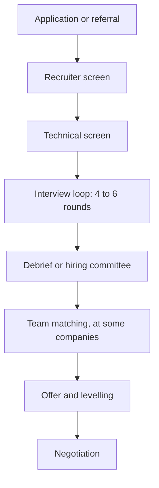

You have solved two hundred problems and drawn a dozen system designs. Then the loop happens, and the outcome is decided by machinery you never see: five or six interviewers who each write feedback on their own, a debrief or committee you are not in, a levelling decision made separately from the hire decision, and sometimes a team-matching phase after all of it. Candidates who understand that machinery prepare differently. They know which round decides their level, why a single weak round can sink a strong loop, why saying things out loud matters more than getting them right silently, and why a rejection is weaker evidence about their ability than it feels.

This lesson describes the typical large-company process for a senior software engineer. Companies differ in the details and change them over time, so treat it as the common shape and confirm the specifics with your recruiter, who will usually tell you exactly what to expect if you ask.

## The stages



| Stage | Typical length | What it is for |
|---|---|---|
| Recruiter screen | 20–30 minutes | Fit for the role and level, motivation, logistics, compensation expectations |
| Technical screen | 45–60 minutes, sometimes two | A coding bar check; sometimes a hiring-manager conversation instead of or as well as this |
| Loop (onsite or virtual) | 4–6 rounds of 45–60 minutes, often on one day or split over two | The actual assessment |
| Decision | Days to a couple of weeks | Hire or no-hire, and at what level |
| Team matching | Days to weeks | At companies that hire into the company first and match to a team afterwards |
| Offer and negotiation | One to two weeks | Terms, level, start date |

From first call to signed offer, four to eight weeks is common, and longer is not unusual when team matching or scheduling drags. Plan your job search around that: running several processes in parallel so that offers arrive together is the single most useful thing you can do for your negotiating position, as [Negotiation](/learn/senior-craft/getting-the-job/negotiation) explains.

## What each round measures

| Round | Format | What it is really measuring | What senior looks like |
|---|---|---|---|
| Coding (usually 2) | One problem, sometimes multi-part, in a shared editor | Problem solving, code quality, testing, communication under time pressure | Drives the session, states trade-offs, tests unprompted, handles follow-ups from the mechanism |
| System design (1–2) | An open prompt such as "design a notification system" | Turning ambiguity into decisions, justified by numbers; depth where it matters | Leads the conversation, sizes the problem, names what will break and what they would not build |
| Behavioural or leadership (1–2) | Questions about past situations | Ownership, scope, judgement, conflict, influence, growth | Stories with cross-team scope, real trade-offs, measurable results and honest reflection |
| Hiring manager (some companies) | Conversation, often part behavioural, part project deep-dive | Team fit, motivation, how you work | Clear about what they want; asks sharp questions about the team |
| Domain or specialty (some roles) | Deep-dive in ML, mobile, infrastructure, security and so on | Depth in the area the team needs | Can go several levels down on their own past work |
| Project deep-dive (some companies) | You present a system you built; they probe | Whether your claimed scope and depth are real | Explains the alternatives rejected and the reasons; knows the numbers |

Two points are easy to miss.

**Level is mostly decided outside the coding rounds.** At many large companies the coding bar for mid-level and senior is similar. Level is driven mainly by system design and behavioural signals, because those show scope and judgement most directly. A candidate with excellent coding rounds and small-scope stories is a classic down-level. [Senior signals in coding rounds](/learn/interview-patterns/interview-execution/senior-signals-in-coding-rounds) explains how a coding round can still pull a level down.

**Each round is scored independently.** The system design interviewer does not know how your coding went. That is good news: a bad round does not contaminate the next one unless you let it. Reset between rounds; you rarely know how a round actually went, and candidates are poor judges of their own performance.

## How the decision is made

### Independent written feedback first

After each round, the interviewer writes feedback and a rating, usually before talking to anyone else about you. Companies do this deliberately to avoid anchoring, where the first strong opinion in a room pulls everyone else towards it. A typical scale runs from "strong no hire" through "no hire", "lean no hire" and "lean hire" to "hire" and "strong hire". Ascend's mock interviews use a similar five-point verdict, from "no hire" to "strong hire".

The practical consequence is simple: **the interviewer can only write down what they saw and heard.** A clever idea you considered and rejected silently does not exist in the feedback. A trade-off you weighed but did not voice earns no credit. That is the real reason every lesson on this platform tells you to narrate decisions.

Here is an illustrative example (not from any specific company) of what a coding write-up looks like:

```text
Round: Coding 2                  Rating: Hire (close to Strong Hire)
Problem: Merge intervals, then a streaming follow-up

+ Clarified touching intervals and input mutation before coding
+ Stated O(n log n), sort-dominated; offered a sorted-structure design for streaming
+ Clean single-pass code; found and fixed own bug on the containment case
+ Tested unprompted: example, empty input, containment, touching
- Needed a small nudge on the amortised cost of the streaming version

Level signal: drove the session; follow-up discussion was senior-consistent
```

Every line is evidence tied to an observed moment. Hiring committees are trained to discount feedback that says "seemed smart" without evidence.

### Debrief or committee

Companies combine feedback in one of two broad ways, and many use a mix.

- **Debrief.** The interviewers and the hiring manager (often with the recruiter) meet, read each other's feedback, discuss disagreements and reach a decision. The hiring manager usually has the most weight.
- **Hiring committee.** A group that did *not* interview you reviews a written packet (the feedback, your resume, sometimes the recruiter's notes) and decides. Google is the best-known example of this model. Committees are meant to make decisions more consistent across teams, at the cost of speed, and they judge the packet rather than the person, which again means evidence in the written feedback is what counts.

Some companies add a designated guardian of the bar. Amazon's Bar Raiser, which the company describes publicly, is an experienced interviewer from outside the hiring team who takes part in the loop and the debrief and can block a hire that does not raise the overall bar.

### How mixed feedback resolves

Loops rarely come back unanimous. Rough patterns, which vary by company:

- A single "strong no" backed by solid evidence often sinks a loop even when the other rounds are positive. Companies generally accept false negatives to avoid false positives, because a bad hire costs far more than a missed good one.
- A loop of "lean hire" ratings with no strong advocate is often a no. Committees look for someone who is confident about you.
- A loop that is split along a clear line (strong coding, weak design) sometimes leads to an extra round, and sometimes to an offer at a lower level.
- A cooling-off period before you can reapply, commonly somewhere between six and twelve months, applies after a rejection at many companies. Ask the recruiter.

### Levelling

The level decision is related to the hire decision but separate from it. Interviewers usually record a level signal alongside their rating, and the debrief or committee sets a level based on the whole packet, particularly design depth and the scope of your behavioural stories. If you receive an offer below your target level, ask which feedback drove that, and see [Negotiation](/learn/senior-craft/getting-the-job/negotiation) for how to respond.

Senior titles map to different internal levels at different companies. Commonly cited equivalents are L5 at Google, E5 at Meta and L6 (SDE III) at Amazon, but check a current public source such as levels.fyi rather than relying on a table, since ladders change.

### Team matching

Some companies hire into the company and then match you with a team after the hiring decision. Google and Meta are the most commonly cited examples. Others, including Amazon, Netflix and most smaller companies, hire for a specific team from the start. If team matching applies, treat those conversations as two-way interviews. You are choosing your manager and your problem space for the next few years, and that choice matters more to your growth than the logo does.

## Preparing for the loop as a system

Treat the loop as a project with a plan, not an exam you cram for.

**Ask the recruiter everything.** How many rounds of each type? Which language, and in what environment: a shared editor, an IDE, a whiteboard? Can you run code? Are AI tools allowed in any round? Some companies have started experimenting with AI-assisted coding rounds, and you want to know in advance. Is there a system design round at your level, or two? Is there preparation material? Recruiters want you to succeed, because their metrics depend on it, and most will answer in detail.

**Allocate your preparation by what decides the outcome.** For a senior candidate, a reasonable split over eight to twelve weeks is roughly 40% coding, 35% system design and 25% behavioural. Candidates who have been out of interviewing for a while tend to overspend on coding, because it is the most measurable, and underspend on behavioural, because it feels like it needs no practice. It does.

| Week | Coding | System design | Behavioural |
|---|---|---|---|
| 1–3 | Patterns, one module a week; 2 timed problems a day | Building blocks, back-of-envelope estimation | Draft 8–10 stories in the STAR+ worksheet |
| 4–6 | Mixed problems, timed; 1 mock a week | One case study every two days; 1 mock a week | Tell each story aloud; tighten to 2–3 minutes |
| 7–9 | Mocks only, at the target difficulty | Mocks; deep dives on weak areas | Mock behavioural rounds; drill follow-ups |
| 10+ | Maintenance: 3 problems a week | Maintenance | Refresh stories for the specific company |

**Practise under realistic conditions.** Ascend's mock interviews at `/interviews` cover all three main round types: a 45-minute coding round (solo, or AI-assisted if you expect that format), a 45-minute system design round, and a 30-minute behavioural round. Each is graded afterwards against the senior bar with a hire/no-hire verdict and dimension scores. Use the report the way a committee uses a packet: look for the evidence behind each score. The [design interview method](/learn/system-design/building-blocks/the-design-interview-method) and the [interview execution](/learn/interview-patterns/interview-execution/the-45-minute-protocol) module give you the protocols to practise.

**Schedule strategically.** Put your most important loop after one or two others, so it is not your first real round in years. Try to schedule final loops within a two- to three-week window so the offers overlap. Take the recruiter's offer of a break between rounds, and use it to eat and reset, not to replay the previous round.

**Keep a log.** After every round, write down the question, what went well, what did not, and what you would do differently. Over a job search this becomes your most valuable preparation material, because it is specific to you.

## Loops are noisy

Be honest with yourself about what a result means. Each round is one interviewer's judgement of 45 minutes, on one problem, on one day. Interviewers differ in calibration, problems differ in how well they suit you, and companies deliberately tune their processes to reject some good candidates rather than risk hiring bad ones. A rejection is real information, but it is a noisy sample, not a verdict on your ability. Strong engineers are rejected by one top company and hired by another the same month.

Two consequences. First, apply to enough companies that no single loop matters too much. Second, after a rejection, ask the recruiter for feedback. Many companies share little or nothing, but some will tell you which area to strengthen, and a clear "system design was the gap" is worth having.

## Senior signals

- You ask the recruiter for the exact loop format, environment and AI policy, and prepare for that format rather than a generic one.
- You know that level is mostly decided by design and behavioural rounds, and you allocate preparation accordingly.
- You narrate decisions in every round, because the written feedback can only contain what the interviewer observed.
- You schedule loops so offers overlap, and treat team-matching conversations as interviews of the team.
- You reset between rounds and treat each result as a noisy sample, not a verdict.

## Check yourself

```quiz
- q: >-
    Why do many companies have interviewers write feedback before discussing the candidate with each other?
  options: ["To speed up the process", "Because the interviewers do not know each other", "To avoid anchoring, where the first strong opinion pulls the others towards it", "So that the candidate can read the feedback"]
  answer: 2
  explanation: >-
    Independent written feedback keeps each interviewer's judgement based on what they saw rather than on the loudest voice in the debrief. It also means the written record, not your general impression, is what decides the outcome, which is why narrating your reasoning matters.
- q: >-
    A candidate has excellent coding rounds but small-scope behavioural stories and a shallow system design round. What is the most likely outcome for a senior role?
  options: ["An offer at the level below, or a rejection for senior", "A senior offer, because coding is what matters most", "An automatic extra coding round", "The outcome depends only on the hiring manager's round"]
  answer: 0
  explanation: >-
    Level is driven mainly by design depth and the scope shown in behavioural stories. Strong coding clears the bar but does not establish senior scope, which makes this a classic down-level pattern.
- q: >-
    What distinguishes a hiring committee from a team debrief?
  options: ["The committee members did not interview the candidate and decide from the written packet", "The committee only reviews coding rounds", "The committee always includes the candidate", "There is no difference"]
  answer: 0
  explanation: >-
    A committee reviews written feedback, the resume and other notes without having met the candidate, which aims for consistency across teams. That makes the evidence written in each round's feedback decisive.
- q: >-
    Which preparation split best fits a senior candidate with eight to twelve weeks?
  options: ["90% coding, 10% system design, no behavioural preparation", "Equal time on every topic in the job description", "All behavioural, since coding is only a bar check", "About 40% coding, 35% system design, 25% behavioural"]
  answer: 3
  explanation: >-
    Coding still has to clear the bar, but level is decided mostly by design and behavioural rounds, which candidates tend to under-prepare. Skipping behavioural preparation is one of the most common and avoidable senior failures.
- q: >-
    You are rejected after a loop where you felt most rounds went well. What is the most accurate interpretation?
  options: ["You are not senior-level", "The process is random, so the result means nothing", "It is real but noisy information: one sample of your performance, from a process tuned to accept false negatives; ask for feedback and look for a pattern across loops", "The recruiter made an error"]
  answer: 2
  explanation: >-
    Loops are deliberately conservative and each round is a small sample, so a single rejection carries limited information. It is not meaningless, though; feedback and patterns across several loops show you what to work on.
```
