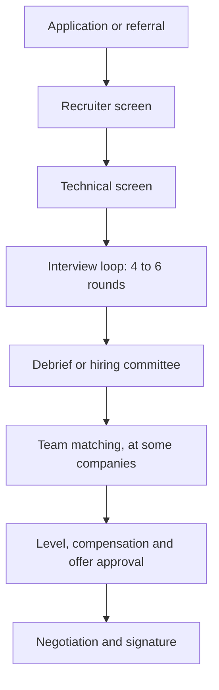

You have solved two hundred problems and drawn a dozen system designs. Then the loop happens, and the outcome is decided by machinery you never see: five or six interviewers who each write feedback alone, a packet assembled from those forms, a debrief or committee you are not in, a level decision made separately from the hire decision, sometimes a team-matching phase after all of it, and an offer that needs its own approval. Candidates who understand that machinery prepare differently. They know which round decides their level, why one weak round can sink a strong loop, why a trade-off they weighed silently does not exist, and why a rejection is weaker evidence about their ability than it feels.

This lesson describes the common shape of a large-company process for a senior software engineer, built from what companies have described publicly (Google's hiring committees, Amazon's Bar Raiser and Leadership Principles, Meta's bootcamp) and what candidates commonly report. Companies differ and change their processes, so treat it as a shape rather than a specification, and confirm the specifics with your recruiter, who will usually tell you what to expect if you ask. Every packet, candidate and timeline below is illustrative.

## The stages



| Stage | Typical length, as commonly reported | What it is for |
|---|---|---|
| Recruiter screen | 20–30 minutes | Fit for the role and level, motivation, logistics, compensation expectations |
| Technical screen | 45–60 minutes, sometimes two | A coding bar check before the company spends five or six interviewer-hours on you |
| Loop (onsite or virtual) | 4–6 rounds of 45–60 minutes, one day or split over two | The assessment itself |
| Decision | Days to a couple of weeks | Hire or no hire, and at what level |
| Team matching | Days to weeks | Only where the company hires first and matches to a team afterwards |
| Offer and negotiation | One to two weeks | Terms, level, start date |

From first call to signed offer, four to eight weeks is common, and ten or more is not unusual when a committee meets on a fixed cadence or team matching drags. The timeline walk-through below shows where those weeks go. Running several processes in parallel so that offers arrive together is the most useful thing you can do for your negotiating position, as [Negotiation](/learn/senior-craft/getting-the-job/negotiation) explains; [Resumes, referrals and screens](/learn/senior-craft/getting-the-job/resume-and-screens) covers everything before the loop.

## What each stage measures

| Stage or round | What it measures | Evidence that counts | Mid-level versus senior |
|---|---|---|---|
| Recruiter screen | Fit for the role and level; motivation; logistics | A coherent reason for the move; a level target the resume supports | Mid: "open to anything". Senior: names the scope they want and why their record supports it |
| Technical screen | The coding bar, cheaply | Working, tested code within the time | Largely the same bar; the senior finishes with time for the follow-up |
| Coding (usually 2) | Problem solving, code quality, testing, communication under time | Timestamped lines: who clarified, who tested, who found the bug | Mid does the right thing when asked; senior does it before being asked |
| System design (1–2) | Turning ambiguity into decisions justified by numbers | Sizing before choosing; named failure modes; what they would not build | Mid follows a template; senior leads, sizes, and goes deep where it matters |
| Behavioural (1–2) | Ownership, judgement, conflict, influence, growth, at a scope | Specific actions attributed to "I", with scope, results and reflection | Mid: own-team stories. Senior: cross-team, ambiguous start, real trade-offs |
| Hiring manager | Team fit, motivation, how you work | What you ask; what you want next | The senior interviews the manager back |
| Project deep-dive or domain | Whether claimed depth and scope are real | Rejected alternatives, numbers, what broke | Can go three levels down on their own system |

Two points are easy to miss.

**Level is mostly decided outside the coding rounds.** At many large companies the coding bar for mid-level and senior is similar, and level is driven by design and behavioural evidence, where scope and judgement show directly. Excellent coding with small-scope stories is the classic down-level. [Senior signals in coding rounds](/learn/interview-patterns/interview-execution/senior-signals-in-coding-rounds) shows how a coding round can still pull a level down.

**Each round is scored independently.** The design interviewer does not know how your coding went, so a bad round does not contaminate the next unless you let it. Candidates are poor judges of their own rounds; reset between them.

## Under the hood: from requisition to packet

Behind the rounds sit a handful of artefacts, and knowing them explains most of what candidates find mysterious.

- **The requisition.** A loop exists because headcount (a "req") was approved for a team or, at hire-then-match companies, for a pool. The req carries a level range. That is why the recruiter asks your level target early: a senior candidate on a req capped below senior can only be offered the lower level unless someone moves the req.
- **Recruiter and coordinator.** The recruiter owns your candidacy: the screen, the level target, your preparation and later your case at offer time. A coordinator or scheduling team books interviewers. When anything stalls, ask the recruiter.
- **The interview plan.** Before the loop, someone (the recruiter, the hiring manager or a loop lead) gives each interviewer a focus so the loop covers every competency once. Amazon's [candidate preparation material](https://www.aboutamazon.com/news/workplace/amazon-interview-best-tips) says its interviews are "rooted in behavioral-based questions" guided by the Leadership Principles, and candidates commonly report each interviewer covering different principles. The plan is why two behavioural interviewers ask different questions, and why retelling a story another interviewer already heard can leave a competency with no evidence at all.
- **The feedback form.** Each interviewer submits a rating on a fixed scale (commonly from "strong no hire" to "strong hire"), the evidence behind it, and often a separate level signal, usually before reading anyone else's form so that the first strong opinion cannot anchor the rest. Google's [re:Work guidance on structured interviewing](https://rework.withgoogle.com/intl/en/guides/a-guide-to-structured-interviewing-for-better-hiring-practices) describes the same principles: vetted questions relevant to the role, standardised scoring rubrics, recorded feedback, and interviewer training and calibration.
- **Interviewer calibration.** Interviewers are commonly trained before they run rounds alone, often by shadowing experienced interviewers and then being shadowed, and their ratings are compared with the eventual decisions over time. That is why forms share one scale and one vocabulary, and why an interviewer who rates everyone "hire" learns to be discounted.
- **The packet.** The forms are assembled with your resume, screen notes and sometimes referral notes, often under a short summary from the recruiter. Whoever decides reads the packet; a committee reads only the packet.

An illustrative coding form:

```text
Round: Coding 2                  Rating: Hire (close to Strong Hire)
Problem: Merge intervals, then a streaming follow-up

+ Clarified touching intervals and input mutation before coding
+ Stated O(n log n), sort-dominated; offered a sorted-structure design for streaming
+ Clean single-pass code; found and fixed own bug on the containment case
+ Tested unprompted: example, empty input, containment, touching
- Needed a small nudge on the amortised cost of the streaming version

Level signal: drove the session; follow-up discussion was senior-consistent
```

Every line is tied to an observed moment. The interviewer can only write what they saw and heard, which is the real reason every lesson on this platform tells you to narrate decisions.

## Under the hood: who decides, and on what

**Debrief.** The interviewers and the hiring manager, often with the recruiter, meet, read each other's forms, argue the disagreements and decide. The hiring manager usually carries the most weight. This is common where hiring is for a specific team.

**Hiring committee.** Google is the best-known example. Laszlo Bock describes the model in *Work Rules!* (2015): a group of experienced people who did not interview you reads the packet and decides, and a hiring manager cannot hire on their own. The argument is that it removes one manager's urgency to fill a seat and keeps the bar consistent across teams; the cost is time, and judging a document rather than a person. Bock also describes a further senior-leadership review above the committee at the time.

**Bar Raiser.** Amazon [describes](https://www.aboutamazon.eu/news/working-at-amazon/what-is-a-bar-raiser-at-amazon) a trained interviewer, typically from outside the business the candidate would join, who interviews in the loop and guides the debrief. Former Amazon executives Colin Bryar and Bill Carr [add](https://workingbackwards.com/concepts/bar-raiser-hiring/) that the Bar Raiser runs the debrief and has "veto power over the hiring manager" for a candidate who would not raise the bar. It is a debrief with an independent guardian.

**Levelling is its own decision.** The level is set from the whole packet, weighted towards design depth and behavioural scope, and can differ from both your target and the hire decision: "hire, one level below" is a common outcome. Senior maps to different internal levels (commonly cited: L5 at Google, E5 at Meta, SDE III or L6 at Amazon); check a current source such as levels.fyi, remembering its data is self-reported.

**Offer approval.** Compensation is set within the band for the level and approved outside the team, by a compensation function or a senior leader, which is why a "yes" takes days to become a number.

**Team matching.** At Google, candidates approved by the committee commonly report calls with hiring managers until one team and the candidate agree. Meta has described a [bootcamp](https://www.metacareers.com/blog/mobile-en/) through which new engineers explore teams before choosing their first one, and candidates report a matching step before the offer for some roles in recent years. Amazon, Netflix and most smaller companies hire for a specific team from the start.

**Cool-down.** After a no-hire, many companies ask you to wait before reapplying; six to twelve months is commonly reported, and it varies by company and by how far you got.

## Walk-through: one packet

Here is an illustrative packet for candidate R, targeting senior. Each row shows the rating, the level signal, and the evidence line that ends up carrying the argument.

| Round | Rating | Level signal | Evidence line that matters |
|---|---|---|---|
| C1 Coding | Hire | Senior | "Clarified mutation and empty input unprompted; tested the update path before I asked; concurrency follow-up answered with its cost" |
| C2 Coding | Lean hire | Mid | "Needed a hint for the key insight at 18:00; clean code afterwards; complexity correct when asked" |
| D1 System design | Hire | Senior | "Sized to 20k writes/s before choosing storage; raised the hot-partition risk unprompted; deep dive on idempotent retries" |
| B1 Behavioural (ownership, conflict) | Lean hire | Mid | "Migration story told in 'we'; at the third probe could not say which decisions were theirs" |
| B2 Behavioural (influence, ambiguity) | Hire | Senior | "Led a schema change across three teams; named what they gave up and who disagreed" |
| HM Hiring manager | Strong hire | Senior | "Great fit for our roadmap; very excited about the problem space" |

To trace the resolution by hand, track two things per round. **Bar:** does the rating clear it (lean hire or better)? **Level:** is the senior signal backed by an affirmative, observed line? This is a tracing device, not any company's formula.

Before anyone meets: all six rounds clear the bar. Senior signals come from four rounds (C1, D1, B2, HM), but the HM line describes enthusiasm, not something R did. Mid signals come from two (C2, B1).

## Resolving the packet: debrief versus committee

**(a) A debrief led by the hiring manager.**

| Step | What happens in the room | Hire case | Senior-level case |
|---|---|---|---|
| 1 | Ratings read: 1 strong hire, 3 hire, 2 lean hire, no negatives | Clears the bar | Open |
| 2 | HM opens: "strong hire, exactly what the roadmap needs" | An advocate exists | HM counts: 4 for (C1, D1, B2, HM) |
| 3 | C2 explains the hint; C1 says coding was strong in their round | Coding closed as one hard problem | No change: coding is a bar check |
| 4 | B1: "I couldn't separate their decisions from the team's" | No change | 1 against |
| 5 | B2 quotes the three-team schema change; HM: "that's the scope we need" | No change | B2 outweighs B1 in the room |
| 6 | Decision | **Hire** | **Senior** |

**(b) A committee that never met R.**

| Step | What the committee reads | Hire case | Senior-level case |
|---|---|---|---|
| 1 | Ratings: no negatives | Clears the bar | Open |
| 2 | HM form: no observed evidence | Read as advocacy, not data | HM removed: 3 for (C1, D1, B2) |
| 3 | C1 against C2 | Coding meets the bar, not strongly | Coding weighs little for level: C1 is support only; 2 primary (D1, B2) |
| 4 | D1's sizing and hot-partition lines | Strong | Senior design confirmed |
| 5 | B1 against B2 | No change | One behavioural round each way; B1's line is specific, so B2 may be the exception |
| 6 | Decision | **Hire** | **One level below**, or one more leadership round to settle level |

The same six forms produce two outcomes. In the debrief, the lines that carried were the manager's advocacy and B2's quote. In the committee, the manager's form carried nothing, and B1's third-probe line carried the level down. That asymmetry is why committees are described as more consistent and debriefs as faster and more team-driven.

### Change one line

| Change to the packet | Debrief | Committee |
|---|---|---|
| B1 reads "named the two migration decisions they made and one they lost" | Hire, senior | Hire, senior |
| B1 reads "claimed to lead the migration; at the third probe a colleague had designed it" (lean no hire, credibility) | Likely no hire, or an extra round | No hire: a credibility doubt taints the other stories |
| C2 reads "no working solution after two hints" (no hire) | Often no hire despite the advocate | No hire: the bar is not cleared |

Large companies commonly describe accepting false negatives to avoid false positives, because a bad hire costs far more than a missed good one. So a single well-evidenced "no" sinks a loop, a packet of lean hires with no advocate is often a no, and a clear split (strong design, weak coding) leads to an extra round or a lower level. In every variant, the argument was settled by specific lines, not adjectives: "strong" and "solid" are easy to discount, while "could not say which decisions were theirs" is hard to argue with.

## Writing your own packet

You cannot see the forms, but you can decide which lines they are likely to contain. Before the loop, write the line you want in each form, then plan the moment that produces it.

| Round | The line you want in the form | The moment that produces it |
|---|---|---|
| Coding | "Tested the breaking case unprompted" | Name the case that breaks the solution at the start of testing, before the interviewer picks one |
| Coding | "Follow-up answered with mechanism and cost" | Reach the follow-up by about minute 25, which means clarifying in under five |
| System design | "Sized the problem before choosing" | A two-minute estimate that changes a decision, such as the data fitting in memory on one node |
| System design | "Named what they would not build" | One explicit cut, with the condition under which you would revisit it |
| Behavioural | "Said which decisions were theirs" | "I decided X; the team decided Y; I lost the argument on Z" |
| Behavioural | "Scope: three teams, two quarters" | Numbers in the first twenty seconds of the situation |
| Hiring manager | "Asked sharp questions about the team" | Two questions on their roadmap and on-call load, prepared from public material |

This is not performance. Each line describes something senior engineers do at work, and the form can only record it if it happens where the interviewer can see it. A loop in which every form carries one such line gives any decision model something to argue with: the debrief gets an advocate with evidence, and the committee gets independent senior lines that do not depend on anyone's enthusiasm.

## Walk-through: application to signed offer

An illustrative timeline for a hire-then-match company, from a referral:

| Day | Event | Waiting on | What you do |
|---|---|---|---|
| 0 | Referral submitted | Recruiter review | Start two more processes this week |
| 5 | Recruiter screen | Nothing | Ask for loop format, level target, AI policy and timeline |
| 15 | Technical screen, booked late at your request | Your preparation | Log the question and your answer afterwards |
| 18 | Pass; loop to be scheduled | Coordinator finding five interviewers | Offer several dates; align with your other loops |
| 32 | Loop | Forms, usually within a day or two | Reset between rounds; log each one |
| 40 | Committee meets on its weekly cadence | Decision | Tell other companies you are at the final stage |
| 42 | Approved at senior; matching starts | Hiring managers' calendars | Treat each call as a two-way interview |
| 58 | Mutual match after three calls | Compensation proposal | Share competing timelines with the recruiter |
| 65 | Verbal offer | You | Do not accept on the call; ask for it in writing |
| 74 | One counter, one revision, signed | Approval of the revision | See [Negotiation](/learn/senior-craft/getting-the-job/negotiation) |

Seventy-four days, of which R spent under eight hours in interviews. The waits are scheduling (14 days), committee cadence (8), matching (16) and approvals (about 15 across the offer and its revision). A hire-for-team company removes the matching; a debrief company usually decides within days of the loop rather than on a cadence. When a recruiter gives you a date, follow up the day after it passes, not before, and ask what the decision is waiting on.

## Trade-offs: how companies combine feedback

| Model | Speed | Consistency across teams | Bias control | Candidate experience | Level accuracy |
|---|---|---|---|---|---|
| Debrief led by the hiring manager | Fast: often days | Varies with the manager | Weakest: urgency to fill the seat, anchoring in the room | Early, direct contact with the team | Depends on the manager's calibration |
| Hiring committee (Google-style) | Slower: cadence, then matching | Highest: one group reads many packets | Strong: deciders never met you and do not own the req | Longer; team unknown until matching | Good with evidence-rich forms, poor with thin ones |
| Debrief with a Bar Raiser (Amazon-style) | Fast to moderate | Moderate to high: trained guardians move across teams | Strong on the bar, but one person's judgement | Similar to a debrief | Moderate: the guardian's focus is the bar |

| | Hire for a team | Hire, then match |
|---|---|---|
| What you know when you sign | Manager, team, problem | Level and company; the team comes later, or in a matching phase before the offer |
| Time to offer | Shorter | Longer by the matching phase |
| Main risk | The req closes and the process dies | Approved but unmatched |
| Choice of team | One | Several, if matching goes well |

What this means for your preparation: at a debrief company, the hiring manager's opinion carries the most weight, so the manager conversation deserves the preparation of a technical round. At a committee company, only the written evidence travels, so unprompted, quotable moments matter more than rapport. Where a Bar Raiser takes part, expect one round from outside the team that probes hardest on the competencies the company publishes, and prepare stories for each of them.

## Failure modes

**Symptom: silence for two weeks after the loop.** Diagnosis: the packet is waiting on a late form, a committee date, an extra round for a split, or approval; it is rarely a decision nobody has told you. Fix: ask the recruiter "is the decision waiting on feedback, a committee date or something else?", and tell them about competing deadlines, which often moves a packet up.

**Symptom: an offer one level below, with feedback that coding was strong.** Diagnosis: coding is a bar check, so the level case rested on design and behavioural rounds, and those were team-scoped or template-shaped. Fix: ask which rounds drove the level; if the evidence was thin rather than negative, some companies will run one more round to reassess; otherwise rebuild your stories for scope ([Behavioural interviews for seniors](/learn/senior-craft/getting-the-job/behavioral-interviews-for-seniors)).

**Symptom: "no hire" with no negative round.** Diagnosis: a packet of lean hires and no advocate; every interviewer saw a pass and nobody saw a line worth fighting for. Fix: plan one quotable, unprompted moment per round: a question that changes the design, a test nobody asked for, a trade-off stated with its cost.

**Symptom: the format surprised you.** You drilled puzzle problems and got a multi-part practical build in an IDE, or expected a greenfield design and got a deep-dive on your own system. Diagnosis: you never asked the recruiter for the format. Fix: ask the questions in the preparation section below, then run a mock on `/interviews` in the matching mode.

**Symptom: approved, then weeks of matching with no team.** Diagnosis: matching favours packets that line up with open headcount, and narrow location or team preferences shrink the pool; approvals are commonly reported to lapse after some months. Fix: ask which teams have headcount, widen preferences, and treat each call as an interview with prepared questions.

## Preparing for the loop as a system

**Ask the recruiter everything.** How many rounds of each type, and in what order? Which language and environment: a shared editor, an IDE, a whiteboard? Can you run code? Are AI tools allowed in any round ([The AI-native interview](/learn/ai-assisted-engineering/senior-engineering-with-ai/the-ai-native-interview))? One design round at your level, or two? Is there preparation material? Recruiters' metrics depend on your success, and most answer in detail.

**Allocate by what decides the outcome.** An illustrative split over eight to twelve weeks is 40% coding, 35% system design and 25% behavioural. Candidates returning to interviewing overspend on coding, because it is measurable, and underspend on behavioural, because it feels like it needs no practice.

| Week | Coding | System design | Behavioural |
|---|---|---|---|
| 1–3 | Patterns, one module a week; 2 timed problems a day | Building blocks, back-of-envelope estimation | Draft 8–10 stories in the STAR+ worksheet |
| 4–6 | Mixed timed problems; 1 mock a week | A case study every two days; 1 mock a week | Tell each story aloud; tighten to 2–3 minutes |
| 7–9 | Mocks only, at the target difficulty | Mocks; deep dives on weak areas | Mock behavioural rounds; drill follow-ups |
| 10+ | Maintenance: 3 problems a week | Maintenance | Refresh stories for the specific company |

**Practise under realistic conditions.** Ascend's mock interviews at `/interviews` run a 45-minute coding round (solo or AI-assisted), a 45-minute system design round and a 30-minute behavioural round, each graded against the senior bar with a verdict and dimension scores. Read the report as a committee reads a packet: find the evidence behind each score. The [design interview method](/learn/system-design/building-blocks/the-design-interview-method) and the [45-minute protocol](/learn/interview-patterns/interview-execution/the-45-minute-protocol) give you the protocols.

**Schedule strategically.** Put your most important loop after one or two others, and keep final loops within a two- to three-week window so offers overlap. Use breaks to eat and reset, not to replay the last round.

**Keep a log.** After every round, write the question, what went well, what did not and what you would change. Over a search it becomes your most specific preparation material.

## Recruiter and interviewer follow-ups

**"Why are you leaving your current role?"** Model answer: a pull rather than a push: the scope or problem you want next, why this role offers it, and at most one neutral sentence about the constraint where you are. Common wrong answer: grievances about your manager or company, which read as poor judgement and a preview of how you will describe this employer.

**"What level are you targeting, and why?"** Model answer: name the level on their ladder ("senior, which I understand is L5 here"), give two lines of scope evidence ("I led a migration across three teams and own the design of our ingestion path"), and ask how the loop assesses it. Common wrong answer: "whatever you think fits", which hands the anchor to the company and often lands one level low, or citing your current title, which does not travel between companies.

**"What other processes are you in, and how far along?"** Model answer: honest stage and timing without figures: "two others, both at the loop stage, with decisions expected within three weeks; I'd like to align timelines." That gives the recruiter a reason to move your packet. Common wrong answer: bluffing about offers you do not have, which collapses when they ask for details, or "none", which removes your only timing lever.

**"Why this company?"** Model answer: specific to the team or product, drawn from public material such as the engineering blog, and tied to your own experience in one or two sentences. Common wrong answer: prestige or pay, or a recited mission statement.

## What mid-level engineers get wrong

- **Treating the loop as six exams rather than one packet.** Each round is optimised to pass, and the packet ends up with no advocate.
- **Preparing mostly for coding because it is measurable.** The loop clears the bar and levels them below senior.
- **Never asking the recruiter about format.** They meet an IDE-based practical round with whiteboard habits.
- **Retelling one story in two behavioural rounds.** The second interviewer's competency gets no evidence.
- **Answering "what level?" with "whatever fits".** The company sets the anchor, and it is rarely above the target.
- **Reading silence as rejection, or a rejection as a verdict.** They stop following up or stop applying, when both are noisy signals.

## What a result means

Each round is one interviewer's judgement of 45 minutes, on one problem, on one day. Interviewers differ in calibration, problems differ in how well they suit you, and companies deliberately tune their processes to reject some good candidates rather than risk bad hires. A rejection is real information and a noisy sample; strong engineers are turned down by one top company and hired by another in the same month. Apply widely enough that no single loop matters too much, and after a rejection ask what to strengthen. Many companies share little, but "system design was the gap" is worth having.

## Senior signals

- You ask the recruiter for the exact format, environment, AI policy and decision process, and prepare for that loop rather than a generic one.
- You know the packet is what gets judged, so every round produces at least one quotable, unprompted line.
- You know level is argued mostly from design and behavioural evidence, and you allocate preparation accordingly.
- You distinguish a debrief from a committee and know an evidence-free "great fit" carries nothing in front of a committee.
- You name your target level on the company's ladder with scope evidence, and schedule loops so offers overlap.
- You treat team-matching calls as interviews of the team and every result as a noisy sample.

## Check yourself

```quiz
- q: >-
    A candidate's packet shows strong coding in both rounds, a design round that followed a standard template, and behavioural stories confined to their own team. What is the most likely outcome for a senior role?
  options: ["Hire at senior, because two strong coding rounds set the level", "Hire, one level below, because level rests on scope evidence", "An automatic extra coding round to confirm the strong signal", "No hire, because coding is weighted least of all the rounds"]
  answer: 1
  explanation: >-
    Coding is largely a bar check at many large companies, so it clears the bar without establishing senior scope. Level is argued from design depth and behavioural scope, and template-shaped design with team-scoped stories gives the level case nothing to stand on. Coding does not count for nothing: it cleared the bar, which is why this is a hire rather than a no.
- q: >-
    The hiring manager's form reads "great fit for our roadmap; very excited about the problem space" and rates strong hire. How much does it move a hiring committee that never met the candidate?
  options: ["Little, since the line records enthusiasm, not observed evidence", "Little, since committees ignore the hiring manager's round entirely", "A great deal, since strong hire outranks every other rating", "A great deal, since the manager owns the requisition"]
  answer: 0
  explanation: >-
    Committees judge the packet, and a form without an observed behaviour gives them nothing to weigh; the same line can carry a manager-led debrief, where the manager has the most weight in the room. Committees do read the manager's form; what they discount is advocacy without evidence.
- q: >-
    In an otherwise positive packet, one behavioural form changes to "claimed to lead the migration; at the third probe a colleague had designed it". What does this line most likely do?
  options: ["Triggers an extra coding round, since the concern is about depth", "Lowers the level by one, since only one round is affected", "Nothing, since the other five rounds still clear the bar", "Triggers a no hire, since credibility doubts taint other stories"]
  answer: 3
  explanation: >-
    A specific credibility concern is not a local weakness; it makes every other self-reported story less trustworthy, and companies prefer false negatives to false positives. A thin story lowers level; an inflated one ends loops. That is why exact attribution of I and we matters.
- q: >-
    An illustrative application-to-offer timeline runs 74 days at a company that hires first and matches to a team afterwards. Which wait disappears at a company that hires for a specific team?
  options: ["The team matching, since the requisition already names the team", "The loop scheduling, since the team books the interviewers", "The committee cadence, since hire-for-team firms have no review", "The offer approval, since the team sets its own compensation"]
  answer: 0
  explanation: >-
    Hire-for-team companies interview against a requisition that already belongs to a team, so there is no matching phase; scheduling and offer approval still take time because interviewers must be found and compensation is approved outside the team. Some hire-for-team companies still add independent review, such as a Bar Raiser.
- q: >-
    What does an Amazon-style Bar Raiser add to a debrief, compared with a debrief led only by the hiring manager?
  options: ["An outside interviewer who can block a hire below the bar", "A senior leader who sets the level and approves the offer", "A committee that decides from the packet without the team", "A second hiring manager who breaks ties between the forms"]
  answer: 0
  explanation: >-
    Amazon describes the Bar Raiser as a trained interviewer from outside the hiring team who takes part in the loop and guides the debrief, and former Amazon executives describe a veto over the hire. It targets the bias a manager-led debrief is weakest on, the urgency to fill a seat, while keeping a debrief's speed. A committee that never met the candidate is the Google-style model, a different design.
- q: >-
    The recruiter asks what level you are targeting. Which answer protects you best?
  options: ["The highest level, to leave room to negotiate downwards", "Their name for senior, with two lines of scope evidence", "My current title, since it reflects my existing scope", "Whatever level the loop decides fits, to seem open"]
  answer: 1
  explanation: >-
    Naming the level on their ladder with scope evidence sets the requisition and the interview plan to assess you at that level. Deferring hands the anchor to the company, a title from another company does not map reliably, and overreaching invites an interview plan you will not meet.
```
