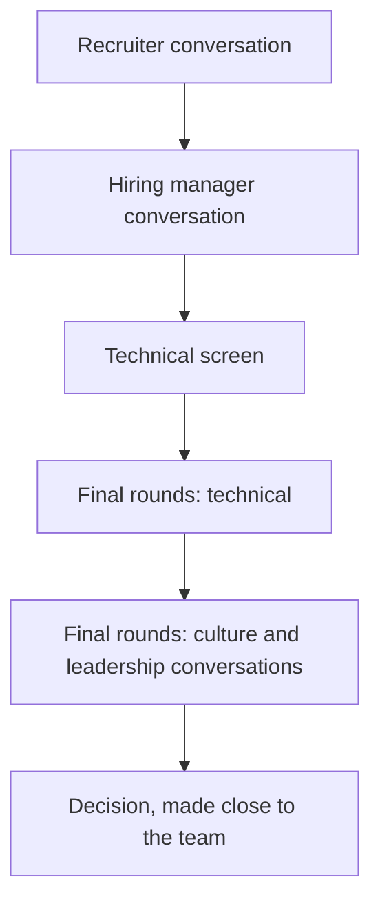

Most companies say they value ownership, candour and high performance. Netflix wrote down, in public and in unusual detail, what it means by those words and what it does about them, including the uncomfortable parts: that adequate performance gets a generous severance package, that managers are expected to ask themselves whether they would fight to keep each person, and that the company prefers to pay people at the top of their market rather than hand out bonuses. For a candidate that is a gift. The lens your interviewers will use is published. You can read it, test your own stories against it, and decide before the loop whether it is a place you actually want to work.

This lesson covers only what Netflix has publicly documented about its culture, through its culture memo and the book its co-founder co-wrote about it, plus the loop shape that candidates commonly report. It does not claim any inside knowledge of how particular interviewers or teams run their rounds. Processes vary by team and change over time; your recruiter is the authority on the process you will actually go through.

## The sources

Three public sources are worth your time, in this order:

1. **The culture memo** on Netflix's jobs site. It is the current, official statement, and it is revised periodically, so read the current version rather than a summary.
2. **The original culture deck.** In 2009 Reed Hastings, Netflix's co-founder, and Patty McCord, then its chief talent officer, published a slide deck titled "Netflix Culture: Freedom & Responsibility". It was shared very widely and became one of the most-discussed documents about company culture in the industry. The memo replaced it, but the deck explains the reasoning behind many ideas that are still there.
3. ***No Rules Rules*** (2020), by Reed Hastings and Erin Meyer. A book-length account of how the practices work in day-to-day use, with examples, including where they went wrong.

Read the memo twice before your loop. The rest of this lesson is a guide to what to look for in it, not a substitute for it.

## The core ideas

### Talent density and the dream team

The foundation of the culture is the claim that the best thing a company can do for its employees is to surround them with exceptional colleagues. Netflix describes the goal as a "dream team", and the deck compared the company to a professional sports team rather than a family: a team where you are expected to perform, and where the people around you are chosen for their performance. Most of the other practices follow from this. If everyone is highly capable, you can remove rules; if you remove rules, you need everyone to be highly capable.

### Freedom and Responsibility

Instead of rules and approvals, employees get freedom and are expected to use it responsibly. The best-known examples are policies that are deliberately not policies. The travel and expense guidance is famously short, summarised in *No Rules Rules* as "act in Netflix's best interest", and the original deck described vacation as untracked. The underlying bet is that rules protect a company from its worst employees at the cost of slowing down its best ones, and that with high talent density the trade is not worth it.

### Context, not control

Managers are expected to give their teams context (the strategy, the metrics, the assumptions, the stakes, how clearly defined the goal is) rather than control through approvals and oversight. If someone makes a poor decision, the first question is what context the manager failed to give. A related phrase from the culture documents is "highly aligned, loosely coupled": teams agree on goals and strategy, then act independently on tactics without constant cross-team sign-off.

### Informed captains and farming for dissent

*No Rules Rules* describes decisions as owned by an "informed captain": one person who gathers input, actively seeks out disagreement ("farming for dissent"), and then makes the call and owns the result. Big decisions are often written up in memos that invite comments. The expectation that you actively look for people who disagree with you, rather than build consensus or avoid conflict, is distinctive and worth preparing for.

### Candour

Feedback is expected to flow constantly and in every direction, including upwards to managers and executives. *No Rules Rules* describes guidelines for doing it well, summarised as the "4A" feedback guidelines: when giving feedback, aim to assist and make it actionable; when receiving it, appreciate it and then accept or discard it. The book also describes leaders "sunshining" their own mistakes, discussing them openly so that others learn from them and feel safe doing the same.

### The keeper test

This is the idea people know best, and the one to think about most carefully. The memo describes managers applying a "keeper test": if a member of their team were leaving for a similar role at another company, would the manager fight hard to keep them? If not, the person should be given a generous severance so that the team can find someone who would pass. The original deck put it more bluntly: adequate performance gets a generous severance package. *No Rules Rules* also describes employees being encouraged to ask their managers the test directly: "If I were thinking of leaving, how hard would you work to change my mind?"

### Pay at the top of the personal market

Netflix has said publicly that it aims to pay people at the top of their personal market: roughly, what the best competing offer for that person would be, reviewed regularly. *No Rules Rules* describes a preference for high salaries over performance bonuses, on the argument that bonuses encourage people to optimise for metrics set in advance rather than for what is actually best, and describes letting employees choose how much of their compensation to take as stock options rather than cash. Details of compensation programmes change, so confirm the current structure with your recruiter, and see [Negotiation](/learn/senior-craft/getting-the-job/negotiation) for how to evaluate it.

### Senior-heavy hiring

For many years Netflix was known for hiring mostly experienced engineers, with a single "senior software engineer" title covering most individual contributors. That fits the culture: freedom with minimal process works best with people who already know how to use it. Public reporting in recent years indicates the company has added engineering levels and some early-career hiring, so read the current posting for the level you are being considered for. The expectation behind the old model is still the useful one for a senior candidate: you will be given context, not a tightly specified ticket, and trusted to work out what to do.

## What this implies for how candidates are assessed

Nothing here requires inside knowledge; it follows from the published culture. If a company operates on context rather than control, candour, and the keeper test, it will want evidence that you:

- **Exercise judgement with little direction.** You have made significant decisions without waiting for approval, and they were mostly good ones.
- **Give and receive candid feedback well.** You have told a peer or manager something hard, usefully, and you have heard hard feedback and changed.
- **Seek out disagreement.** You have looked for the people most likely to disagree with you before committing to a decision.
- **Own outcomes, including failures.** You talk about your mistakes openly and specifically.
- **Operate at a high level independently.** You are the kind of colleague a manager would fight to keep.
- **Communicate clearly, including in writing.** A culture of memos and informed captains relies on it.

## The typical shape of the loop

Candidates commonly describe a process along these lines. It varies by team and organisation, and it changes over time, so treat this as a typical shape rather than a specification.



- **Hiring is usually for a specific team.** You apply to a role on a particular team, and the hiring manager is typically involved early and throughout, rather than appearing only at the end.
- **Technical rounds** usually include coding, which is often practical (building or extending a working component) rather than puzzle-style, and system design. Some roles include a deep dive into a system you built.
- **Culture-focused conversations** are a substantial part of the final rounds, often with several people, sometimes including partners from outside engineering and more senior leaders. Some candidates report the final stage being split across two sessions, with the second weighted towards these conversations.

Ask your recruiter for the exact structure: how many rounds, which types, whether AI tools are permitted in any of them, and whether the final stage is split.

## Preparing for the culture conversations

### Map your stories to the memo

Take the story bank from [Behavioural interviews for seniors](/learn/senior-craft/getting-the-job/behavioral-interviews-for-seniors) and test it against the memo. For each major idea, you want at least one real story that shows it. The question examples below are ordinary behavioural questions that these ideas naturally produce; they are not a claim about what any particular Netflix interviewer asks.

| Published idea | The kind of question it tends to produce | The story you need |
|---|---|---|
| Context, not control | "Tell me about an important decision you made without your manager's sign-off." | A decision you owned, the context you had, and how it turned out |
| Candour | "Tell me about hard feedback you gave a peer or your manager." / "The hardest feedback you've received?" | Feedback you gave that helped; feedback you received and acted on |
| Farming for dissent | "How do you make a decision that others disagree with?" | Seeking disagreement before deciding; changing your mind, or not, for reasons |
| Informed captain | "Tell me about a call you made that went badly." | Owning a decision and its consequences in public |
| Freedom and Responsibility | "Tell me about a time you took a significant risk." | Using freedom well, and what you did when it did not work |
| Keeper test and talent density | "How have you handled a teammate who was not performing?" | Candid, early, humane handling of performance |

The memo also lists valued behaviours. Versions have included around ten, such as judgement, communication, curiosity, courage and selflessness. Read the current list and check each one against your stories.

### Be candid in the room

The most practical implication of a candid culture is that you should be candid in the interview. Say what you actually think. If you disagree with an interviewer's assumption in a design round, say so politely and explain why. If you do not know something, say that. If a past decision of yours was wrong, say it was wrong. Rehearsed positivity and agreement with everything reads poorly in a culture that prizes candour.

### Have an honest view of the culture itself

You may be asked what you think of the culture, or of the keeper test specifically. A thoughtful, honest view, with the trade-offs, is better than enthusiasm. For example: "I like the clarity. I'd rather know where I stand than find out in a review cycle. The cost is less security, and I'd want to understand how the test is applied on this team: how often people hear where they stand, and how early."

## Preparing for the technical rounds

- **Practical coding.** Expect to build something that works and then extend it, such as a small cache, a rate limiter, a parser or an iterator, and to be judged on code structure as well as correctness. The [interview execution](/learn/interview-patterns/interview-execution/clarifying-and-scoping) module covers scoping and multi-part problems.
- **System design at Netflix's scale.** Streaming, microservices and resilience are natural topics. The case studies on [video streaming](/learn/system-design/case-studies/video-streaming-netflix) and [Netflix-style microservices and resilience](/learn/system-design/case-studies/netflix-microservices-and-resilience) are built from publicly documented architecture, which is the right material to prepare with.
- **Deep dives into your own work.** Be ready to go several levels down on a system you built: the alternatives you rejected, the numbers, what broke, and what you would change.

Practise both kinds of round in Ascend's mock interviews at `/interviews`. The system design mock uses Netflix-scale prompts, and the behavioural mock probes ownership, judgement and conflict with follow-ups, which is close to the evidence a candour-and-judgement culture looks for.

## Is it the right place for you?

Be as honest with yourself as the culture asks you to be with others. The published model is a deliberate trade:

| You get | You give up |
|---|---|
| Pay aimed at the top of your personal market | Some job security: the keeper test is applied, and adequate is not enough |
| High autonomy and little process | The comfort of clear rules and approval gates |
| Colleagues selected for high performance | Room for a slow year |
| Candid, frequent feedback | Feedback that can feel blunt, including in public |

Some engineers thrive under that trade and some are miserable. Neither is a character flaw. Use the loop to find out which you would be, with questions like:

- "How does the keeper test show up on this team in practice? How would I know where I stand?"
- "What context does the team get, and from whom? Can you give an example of a decision someone on the team made without sign-off?"
- "What does someone who is struggling here hear, and when?"
- "What's something the team disagreed about recently, and how was it decided?"

## The offer

Because the published philosophy is to pay at the top of each person's market, the conversation tends to centre on what your market actually is. Evidence helps: competing offers, and public compensation data for comparable roles. See [Negotiation](/learn/senior-craft/getting-the-job/negotiation) for evaluating a salary-heavy offer against equity-heavy ones, and remember that a cash-heavy package with optional stock options behaves very differently from four years of vesting RSUs.

## Senior signals

- You have read the current culture memo, not only summaries, and can connect specific ideas to specific stories of your own.
- You can describe decisions you made with context rather than approval, and how you sought out dissent before making them.
- You give examples of candid feedback in both directions, including feedback that changed your behaviour.
- You are candid in the interview itself: you disagree when you disagree and say plainly when you do not know.
- You hold an honest, reasoned view of the keeper test and ask how it works on the team you would join.
- You claim no inside knowledge; you prepare from public material and ask the recruiter about the process.

## Check yourself

```quiz
- q: >-
    According to Netflix's published culture, what is the "keeper test"?
  options: ["An annual performance review in which engineers are stack-ranked against peers", "A probation period in which new hires must prove themselves before they are confirmed", "A regular review of whether each system is worth keeping or should be rewritten", "Managers asking whether they would fight to keep each person, with severance if not"]
  answer: 3
  explanation: >-
    The memo describes the keeper test as a question managers ask about each person: if they were leaving for a similar role elsewhere, would I fight hard to keep them? Those who do not pass get a generous severance. It is not a ranking exercise or a probation period, and it concerns people, not systems.
- q: >-
    What does "context, not control" mean for how Netflix expects managers and engineers to work?
  options: ["Teams build consensus across the org before acting, so everyone stays aligned", "Engineers get only the information their tasks need, so they can stay focused", "Managers give strategy, metrics and stakes, and people make their own decisions", "Managers give detailed direction and approve significant decisions before they ship"]
  answer: 2
  explanation: >-
    Context replaces approvals: people are trusted to decide once they understand the strategy, metrics, assumptions and stakes, and a poor decision prompts the question of what context was missing. Teams align on goals but act independently on tactics rather than seeking consensus. That is why interviewers look for evidence of good independent judgement rather than good rule-following.
- q: >-
    How should you prepare for Netflix's culture-focused conversations?
  options: ["Focus on technical preparation, since culture fit cannot be prepared for", "Prepare to show enthusiastic agreement with every part of the culture", "Read the current culture memo and map specific real stories to its ideas", "Memorise a list of the questions Netflix interviewers are known to ask"]
  answer: 2
  explanation: >-
    The culture is published, so the best preparation is to test your own stories against its ideas, such as context over control, candour, farming for dissent and ownership of failures. There is no reliable public question list, and uncritical enthusiasm reads poorly in a culture that values candour.
- q: >-
    An interviewer asks what you think of the keeper test. Which answer fits the culture best?
  options: ["Say it is unfair and that you would push to change it once you joined", "Say it is perfect and that you have no concerns, to show strong culture fit", "Give an honest view with its trade-offs, then ask how it works on the team", "Decline to comment, since opinions on policy are risky in an interview"]
  answer: 2
  explanation: >-
    A candid, reasoned view that acknowledges both sides (for example, valuing the clarity while noting the reduced security) shows the judgement and candour the culture asks for. Cheerleading and declining to engage both avoid the question, and an outright attack with no nuance suggests poor fit rather than candour.
- q: >-
    Which statement about Netflix's published compensation philosophy is most accurate?
  options: ["It pays at the market median and relies on equity upside for top performers", "It aims for the top of each person's market, favouring salary over bonuses", "It fixes pay by level with no individual variation, to keep things transparent", "It pays large performance bonuses tied to metrics agreed at the start of each year"]
  answer: 1
  explanation: >-
    The memo and No Rules Rules describe top-of-personal-market pay, a preference for salary over performance bonuses (which encourage optimising for metrics set in advance), and employee choice over the stock-option portion. Programme details change, so confirm the current structure with the recruiter.
```
