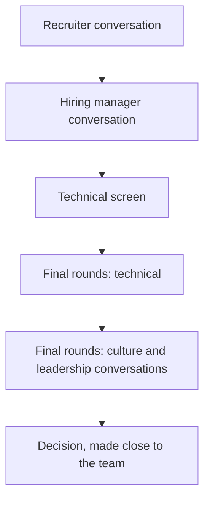

Most companies say they value ownership, candour and high performance. Netflix wrote down, in public and in unusual detail, what it means by those words and what it does about them, including the uncomfortable parts: that managers ask whether they would fight to keep each person and part ways quickly when the answer is no, that the company models itself on a professional sports team rather than a family, and that it aims to pay each person at the top of their personal market. For a candidate that is a gift. The lens your interviewers are likely to use is published. You can read it, test your own stories against it line by line, and decide before the loop whether it is a place you want to work.

This lesson uses only what Netflix has published about its culture (the culture memo on its jobs site, checked at the time of writing, and the 2009 culture deck), the book its co-founder co-wrote about it, and the loop shape candidates commonly report. It claims no inside knowledge of how particular interviewers or teams run their rounds, and where it describes how the culture shapes hiring, that is inference from public material and says so. Processes vary by team and change over time; your recruiter is the authority on the process you will go through. Every story and candidate below is illustrative.

## The sources, and what changed

Three public sources are worth your time, in this order:

1. **The culture memo** at [jobs.netflix.com/culture](https://jobs.netflix.com/culture). It is the current, official statement and is revised periodically. At the time of writing it is built on four core principles (The Dream Team, People Over Process, Uncomfortably Exciting, and Great and Always Better), with artistic expression as a subsection of its own, and lists eight valued behaviours: selflessness, judgement, candour, creativity, courage, inclusion, curiosity and resilience.
2. **The 2009 culture deck**, ["Netflix Culture: Freedom & Responsibility"](https://www.slideshare.net/slideshow/culture-1798664/1798664), published by Reed Hastings, Netflix's co-founder, and widely credited to him and Patty McCord, then its chief talent officer. It was shared very widely and explains the reasoning behind many ideas that survive in the memo.
3. ***No Rules Rules*** (2020), by Reed Hastings and Erin Meyer: a book-length account of how the practices work day to day, with examples, including where they went wrong.

| Theme | 2009 deck | Current memo, at the time of writing |
|---|---|---|
| Form and tone | A long slide deck, blunt in places | Shorter prose around four core principles |
| Performance | The keeper test, and in so many words: adequate performance earns a generous severance | The keeper test in two forms: would I fight to keep them, and would I hire them again; parting ways quickly is described as fairer to everyone; managers judge the whole record, not the bets that did not pay off; regular conversations to avoid surprises |
| Valued behaviours | Nine, including judgement, communication, curiosity, courage and selflessness | Eight, now including inclusion and resilience |
| Decisions | Context, not control; highly aligned, loosely coupled | The same, plus informed captains, farming for dissent, and disagreeing then committing |
| Pay | Pay at the top of the market | The top of each person's market for the role and location |
| New themes | — | Experimentation and discomfort; supporting artistic expression across the whole slate, including content an employee may disagree with; improving the culture rather than preserving it |

Read the current memo twice before your loop. Quoting the 2009 deck as current policy is a small but telling sign that you prepared from summaries.

## The core ideas: people and pay

### The dream team and talent density

The foundation is the claim that the best thing a company can do for its employees is surround them with exceptional colleagues. The memo describes modelling the company on a professional sports team, not a family: you are expected to perform, and the people around you are chosen for their performance. *No Rules Rules* frames the rest as a sequence: build talent density first, then increase candour, then remove controls. If everyone is highly capable you can remove rules, and if you remove rules you need everyone to be highly capable.

### The keeper test

This is the best-known idea and the one to think about most carefully. The memo describes managers asking of each person: if they wanted to leave, would I fight to keep them? Or: knowing everything I know today, would I hire them again? If the answer is no, the memo says it is fairer to everyone to part ways quickly; the deck and the book describe a generous severance. Two details in the current memo matter for interviews. Managers are asked to judge the whole record rather than the mistakes or bets that did not pay off, so an owned failure is not disqualifying. And employees are encouraged to talk with their managers regularly about what is going well and what is not, so that nobody is surprised. *No Rules Rules* also describes employees asking the test of their manager directly: if I were thinking of leaving, how hard would you work to change my mind?

### Pay at the top of the personal market

The memo says Netflix pays at the top of each person's market for the role and location: roughly, what the best competing offer for that person would be. *No Rules Rules* describes a preference for high salaries over performance bonuses, on the argument that bonuses reward optimising for targets set in advance rather than doing what is best, and describes employees choosing how much of their pay to take as stock options. Programme details change, so confirm the current structure with your recruiter, and see [Negotiation](/learn/senior-craft/getting-the-job/negotiation) for comparing a salary-heavy offer with one built on vesting stock.

## The core ideas: decisions and feedback

### People over process, and freedom with responsibility

Instead of rules and approvals, employees get freedom and are expected to use it responsibly; the deck's title named the pairing, and the memo says it takes an unusually responsible person to thrive on that much freedom. The best-known examples are policies that are deliberately not policies: expenses come down to acting in Netflix's best interests, and the deck and the book describe vacation as untracked. The bet is that rules protect a company from its worst employees at the cost of slowing its best, and that with high talent density the trade is not worth it.

### Context, not control; highly aligned, loosely coupled

Managers are expected to give their teams context (strategy, metrics, assumptions, stakes, how well defined a goal is) rather than control through approvals. When someone makes a poor decision, the first question is what context the manager failed to give. Teams agree on goals and strategy, then act independently on tactics without constant cross-team sign-off. The memo also says Netflix is proud of how few decisions its senior leaders make.

### Informed captains, farming for dissent, disagree then commit

For each significant decision, one person, the informed captain, gathers input, actively seeks out disagreement ("farming for dissent"), makes the call and owns the result. After the decision, the memo expects everyone, including those who argued for something else, to disagree then commit. The memo also describes sharing information internally "through memos where they can comment and ask questions", which makes written communication part of the job ([Design docs and RFCs](/learn/senior-craft/technical-leadership/design-docs-and-rfcs)).

### Candour, the 4A guidelines and sunshining

The memo lists candour as a valued behaviour and describes constructive feedback as part of everyday work. *No Rules Rules* describes it flowing in every direction, including upwards to executives, and gives guidelines summarised as the 4As: when giving feedback, aim to assist and make it actionable; when receiving it, appreciate it, then accept or discard it. The book also describes leaders "sunshining" their mistakes, discussing them openly so others learn and feel safe doing the same, and live group feedback sessions on some teams.

## Under the hood: how the culture plausibly shapes the process

None of this is inside knowledge. It is what the published culture implies, checked against what candidates commonly report.

**Hiring is team-specific and manager-led.** You apply to a role on a particular team, and candidates commonly report the hiring manager involved early and throughout. That fits the informed-captain model and the memo's pride in few decisions by senior leaders: a hire is a significant decision, and the person closest to it plausibly owns it, gathering input from the interviewers rather than handing it to a committee of strangers. The practical consequence is more variation between teams than a committee model produces, so the recruiter's description of this team's process beats any general account, this one included.

**The bar is the keeper test, applied in advance.** A manager who will later ask "would I fight to keep this person?" has every reason to ask a version of it before hiring. Expect the loop to look for people who need context rather than direction, and who would pass that test within a year, not in five.

**Culture conversations carry real weight.** Candidates commonly report that conversations about how you work, give feedback and make decisions are a substantial share of the final rounds, sometimes with people from outside engineering and more senior leaders.

**The pay conversation centres on your market.** If the aim is the top of your personal market for the role and location, the useful question is what that market is, and the evidence is competing offers and public data for comparable roles. Recruiters commonly ask about it directly.

**Senior used to mean nearly everyone.** For many years Netflix was widely reported to hire mostly experienced engineers under a single senior title, meaning someone who operates independently with context and little oversight ([What senior means](/learn/senior-craft/technical-leadership/what-senior-means)). Public reporting describes engineering levels added in 2022 and some early-career hiring, and current job postings carry the level in the title (for example "Software Engineer 4/5"), so read the posting for the level you are being considered for. The old expectation remains the useful one: you will get context, not a tightly specified ticket.

## The typical shape of the loop

Candidates commonly describe a process along these lines. It varies by team and changes over time, so treat it as a typical shape, not a specification.



- **Technical rounds** usually include coding, often practical (build or extend a working component) rather than puzzle-style, and system design. Some roles add a deep dive into a system you built.
- **Culture-focused conversations** are commonly reported to be a substantial part of the final stage, which some candidates describe as split across two sessions with the second weighted towards them.
- Ask the recruiter for the structure: how many rounds and which types, whether AI tools are permitted in any, and whether the final stage is split.

## Walk-through: one story against the memo

Take one illustrative story from a candidate's bank, written as most engineers first write it:

> "Our recommendations API was timing out at peak, p99 around 800 ms. I proposed adding a caching layer in front of the ranking service. I wrote a design doc, got approval from my manager and then from the architecture review board, and implemented it over two months with one other engineer. p99 dropped to about 200 ms and the timeouts stopped. Everyone was really happy with the result, and my manager mentioned it in my review."

Nothing is wrong with it at a company that runs on approvals. Test it against the memo's ideas one at a time:

| Idea | What the story shows | The gap | The fix |
|---|---|---|---|
| Context, not control | Approval from the manager and the review board | The decision seems to belong to the approvers | The context you had (goal, target, cost) and that you made the call; reviews were input, not permission |
| Informed captain, farming for dissent | No disagreement at all | Nobody consulted who might say no | Who you asked to find the holes, and what changed because of them |
| Judgement | One option and a result | No alternatives, no cost | The options you rejected and the price you paid |
| Candour | "Everyone was really happy" | No hard feedback in either direction | Feedback you gave or received during the work |
| Whole record, sunshining | No mistake | A flawless story reads as edited | The bet that did not pay off, and how you shared it |
| Responsibility | Implementation only | No rollout or ownership after launch | The flag, the canary, and what you owned afterwards |
| Dream team | Praise in a review | Recognition is the result | The effect on other people's work |

The revised telling, same facts, more of them:

> "Our recommendations API was timing out at peak: p99 about 800 ms against a 300 ms target, and the quarter's goal was session length, which the timeouts were cutting. I owned the fix. I weighed three options: tuning the ranking service, precomputing recommendations offline, and caching ranked results for 60 seconds. I chose caching because it could ship in weeks and staleness matters little for recommendations; precomputing would have taken a quarter. Before committing, I asked the ranking team, the people most likely to object, to find the holes. They did: stale results after a catalogue update. So I added invalidation on catalogue events, which changed the design. I shared the doc with my manager and the review group for comment, then made the call. In week three I told my manager my estimate was two weeks short, and why. We shipped behind a flag with a canary; the first invalidation path had a bug that served stale rows for an hour, which I wrote up and posted to the team. After launch p99 was about 200 ms and the timeouts stopped, and the ranking team later reused the invalidation approach. I'd involve them a week earlier next time: their objection was the most valuable input I got."

Every row of the table now has a line to point at, and nothing was invented; the first draft had left out the parts that are evidence for this culture.

## Worked example: context, not control

The same decision, deprecating an internal API used by four teams, told two ways by an illustrative candidate.

> **Approval-seeking.** "Our team's old reporting API cost us a lot of on-call time, so I asked my manager whether we could deprecate it. She said to check with the director. I put some slides together, the director approved it, and I announced a three-month deadline to the four teams that used it. One team complained it was too short, so I escalated to the director, who told them to prioritise it. We turned it off on schedule."

> **Context-driven.** "The quarter's goal was cutting operational load, and the old reporting API caused about a third of our pages, which made it my call. I wrote a one-page memo with the page data, the replacement and a three-month plan, and shared it for comment with the four consuming teams, starting with the heaviest user, since they were most likely to object. They did: their year-end reporting fell inside my window. I moved their cut-over by six weeks and kept the others on schedule. I told my manager the plan and the exception; she didn't need to approve it. On switch-off day one consumer broke; I had the rollback ready, restored it within twenty minutes, and fixed their client myself."

| Element | Approval-seeking | Context-driven |
|---|---|---|
| Why it mattered | "Cost us on-call time" | Tied to the quarter's goal, with a number |
| Who decided | Manager, then director | The candidate, informed by the goal |
| Dissent | A complaint, escalated upwards | Sought out first, from the team most likely to object |
| Response to the objection | Authority overrides it | The plan changes |
| Manager's role | Gatekeeper | Informed, not asked |
| Responsibility | Deadline met | Rollback ready; the broken consumer fixed personally |

The context-driven version is not "I did it without telling anyone". Everyone affected was informed and consulted; what changed is who owned the decision and how disagreement was used. That distinction is the second failure mode below.

## Preparing for the culture conversations

Map your story bank from [Behavioural interviews for seniors](/learn/senior-craft/getting-the-job/behavioral-interviews-for-seniors) to the memo. The questions below are ordinary behavioural questions these ideas naturally produce, not a claim about what any Netflix interviewer asks.

| Published idea | The kind of question it tends to produce | The story you need |
|---|---|---|
| Context, not control | "Tell me about an important decision you made without your manager's sign-off." | A decision you owned, the context you had, the outcome |
| Candour | "Hard feedback you gave a peer or your manager?" / "The hardest you've received?" | Feedback given that helped; feedback received and acted on |
| Farming for dissent | "How do you make a decision others disagree with?" | Seeking disagreement before deciding; changing your mind, or not, for reasons |
| Informed captain, whole record | "Tell me about a call you made that went badly." | Owning a decision and its consequences in public |
| Uncomfortably exciting | "Tell me about a significant risk you took." | Using freedom well, and what you did when it did not work |
| Keeper test, dream team | "How have you handled a teammate who wasn't performing?" | Candid, early, humane handling of performance |

Then check each of the eight valued behaviours against your bank; an empty one is a gap.

**Be candid in the room.** Say what you think. If you disagree with an interviewer's assumption in a design round, say so politely and explain why. If you do not know, say so. If a past decision was wrong, say it was wrong.

**Hold an honest view of the culture itself.** You may be asked what you think of it, or of the keeper test. A reasoned view with its trade-offs beats enthusiasm; the follow-ups below include a model answer.

## Preparing for the technical rounds

- **Practical coding.** Expect to build something that works and then extend it (a small cache, a rate limiter, a parser, an iterator) and to be judged on structure as well as correctness. [Clarifying and scoping](/learn/interview-patterns/interview-execution/clarifying-and-scoping) covers multi-part problems.
- **System design at Netflix's scale.** Streaming, microservices and resilience are natural topics. The case studies on [video streaming](/learn/system-design/case-studies/video-streaming-netflix) and [Netflix-style microservices and resilience](/learn/system-design/case-studies/netflix-microservices-and-resilience) are built from publicly documented architecture, which is the right material to prepare with.
- **Deep dives into your own work.** Be ready to go several levels down on a system you built: rejected alternatives, numbers, what broke, what you would change.

Practise both on `/interviews`: the system design mock uses Netflix-scale prompts, and the behavioural mock probes ownership, judgement and conflict with follow-ups, close to the evidence a candour-and-judgement culture looks for.

## Trade-offs: the Netflix model against a typical large company

| Axis | Netflix, as published | Typical large company |
|---|---|---|
| Job security | Lower: the keeper test, and parting ways quickly | Higher day to day: longer performance processes, though layoffs happen everywhere |
| Autonomy | High: context, not control; informed captains | Moderate: approvals, review boards, planning cycles |
| Process | Minimal: few rules, expenses judged by the company's best interests | More: policies, approval chains, promotion packets |
| Feedback | Constant, in every direction, sometimes live and in groups | Periodic reviews; upward feedback often through surveys |
| Pay structure | Top of personal market; salary-heavy; employee choice on stock options, as described | Bands by level: base, bonus and stock vesting over years |
| Levelling | Historically one senior level; levels added, per public reporting | Detailed ladders with promotion processes |
| Hiring decision | Close to the team (inference from public material) | Debrief, committee or Bar Raiser ([The FAANG loop](/learn/senior-craft/getting-the-job/the-faang-loop)) |
| Who tends to thrive | People who want clarity about their standing and high autonomy | People who value predictability and structured growth |

Neither column is better. Some engineers thrive under the first and are miserable under the second, and the reverse; the loop is your chance to find out which you are.

## Failure modes

**Symptom: the interviewer keeps asking "what would your critics say?" and the conversation goes flat.** Diagnosis: rehearsed positivity; every story ends happily, nobody disagreed, and you praise everything, the culture included, which reads as a lack of candour. Fix: keep the real friction in your stories, state opinions with reasons, and say "I don't know" when you don't.

**Symptom: probes like "who knew you were doing this?" and "what happened when it broke?"** Diagnosis: a freedom story without responsibility: you acted without sign-off, nobody affected was informed, there was no rollback, and you moved on after shipping. That is going rogue, not context over control. Fix: tell who you informed and consulted, what context you acted on, and how you owned the consequences, as in the context-driven telling above.

**Symptom: after your candour story, the interviewer asks how the other person reacted, and you are not sure.** Diagnosis: candour confused with bluntness: public correction, no aim to assist, no follow-through; or criticising a former employer to demonstrate honesty. Fix: tell feedback stories through the 4As: private, aimed to assist, actionable, followed up; describe former employers with the same fairness you would want.

**Symptom: "what does that look like in your own work?"** Diagnosis: reciting memo phrases ("as an informed captain, I farmed for dissent") in place of evidence, or citing what "Netflix interviewers ask" from forums. Fix: tell your stories in your own words and let the interviewer make the mapping; refer to public material as public.

**Symptom: at "what questions do you have?", you ask only about the tech stack, and months later the culture surprises you.** Diagnosis: you treated the culture as a test to pass, not a trade to evaluate. Fix: ask how the keeper test shows up on this team, how people know where they stand, and what the team disagreed about recently and how it was decided.

## Interviewer follow-ups

**"What do you think of the keeper test?"** Model answer: an honest view with both sides: "I like the clarity; I'd rather know where I stand than find out in a review cycle. The cost is less security. I'd want to know how often people on this team hear where they stand, and how early." Common wrong answer: unqualified enthusiasm, which avoids the question, or a condemnation that ignores the reasoning behind it.

**"Tell me about a time you gave your manager hard feedback."** Model answer: the specific feedback, why it mattered, how you gave it (privately, aimed to help, with something they could act on), what they did, and what changed, including the risk you took. Common wrong answer: praise in disguise ("I told her she works too hard"), or a story of correcting your manager in public.

**"Tell me about a decision you made without sign-off."** Model answer: the context you acted on, who you informed and sought disagreement from, the call, and how you owned the outcome, including what went wrong. Common wrong answer: "I shipped it because the process was slow", with nobody informed, or a story in which you had sign-off after all.

**"How would you handle a teammate who isn't performing?"** Model answer: early, specific, private feedback to the person, asking what is in the way; if nothing changes, tell your manager, telling the teammate first, because the keeper decision is the manager's and needs accurate information. Common wrong answer: covering for them silently, which hides the problem, or going to the manager without ever telling the person.

## What mid-level engineers get wrong

- **Preparing from summaries.** They quote the 2009 deck as current policy and miss the current memo's whole-record and no-surprises lines.
- **Treating the culture conversations as soft.** Preparation goes to coding, and the rounds commonly reported to be a substantial share of the final stage get improvised answers.
- **Performing agreement.** Enthusiasm for everything reads as a lack of candour, a behaviour the memo names explicitly.
- **Mistaking autonomy for no communication.** Their best "decision without sign-off" story shows nobody informed, which is evidence against them.
- **Negotiating as though for a stock-vesting package.** They argue about grant size when the conversation is about their personal market.
- **Assuming the historical single level.** They prepare for a different level from the one on the posting.

## Is it the right place for you?

Use the loop to find out, with questions like:

- "How does the keeper test show up on this team? How would I know where I stand, and how often?"
- "What context does the team get, and from whom? What is a recent decision someone here made without sign-off?"
- "What does someone who is struggling here hear, and when?"
- "What did the team disagree about recently, and how was it decided?"

When the offer comes, expect the conversation to centre on what your market is. Competing offers and public data for comparable roles are the evidence ([Negotiation](/learn/senior-craft/getting-the-job/negotiation)), and a salary-heavy package with optional stock options behaves very differently from four years of vesting stock. If you join, [The first 90 days](/learn/senior-craft/getting-the-job/the-first-90-days) covers asking your manager the keeper question early.

## Senior signals

- You have read the current memo, know what changed since the 2009 deck, and connect specific ideas to specific stories of your own.
- You describe decisions made with context rather than approval, including whom you informed and whose dissent you sought.
- Your freedom stories carry their responsibility: rollback, follow-through, ownership of what broke.
- You give candid feedback stories in both directions, told through the 4As, including feedback that changed you.
- You are candid in the interview itself and hold a reasoned view of the keeper test, with questions about how it works on the team.
- You claim no inside knowledge; you prepare from public material and ask the recruiter about the process.

## Check yourself

```quiz
- q: >-
    The current memo asks managers to judge the whole record rather than the bets that did not pay off. What does that imply for a failure story in a Netflix interview?
  options: ["Only failures older than five years are safe to discuss", "Frame the failure as a strength, since strengths count most", "Avoid failure stories, since any failure fails the keeper test", "An owned failed bet is fine; hiding or deflecting it is not"]
  answer: 3
  explanation: >-
    The published model separates the outcome of a bet from the judgement and ownership around it, and the memo's candour and the book's sunshining both reward talking about mistakes openly. A flawless bank reads as edited; deflection or a disguised strength fails the candour the culture names. Recency does not change that.
- q: >-
    Two tellings of the same API deprecation differ only in who decided and how objections were handled. Which is evidence for context, not control?
  options: ["The candidate decided alone and told nobody to avoid delay", "The team voted, and the majority view overruled the objectors", "The director approved it, and a complaint was escalated upwards", "The candidate decided, sought dissent first and changed the plan"]
  answer: 3
  explanation: >-
    Context, not control puts the decision with the person who has the context, who then farms for dissent and owns the result; the manager is informed rather than asked. Approval chains are control, acting without informing anyone is freedom without responsibility, and a vote is consensus, which the informed-captain model deliberately avoids.
- q: >-
    A candidate says "I shipped the change without telling anyone, because our review process was slow" as a freedom story. How is it most likely read?
  options: ["As strong ownership, since the culture removes approvals", "As candour, since the candidate admits skipping the process", "As freedom without responsibility, since no one was informed", "As neutral, since process speed was not the candidate's fault"]
  answer: 2
  explanation: >-
    Removing approvals does not remove the duty to inform, consult and own consequences; the memo pairs freedom with an unusually responsible person. The story invites probes about who knew and what happened when it broke, and without answers it reads as going rogue.
- q: >-
    Which feedback story best fits the 4A guidelines described in No Rules Rules?
  options: ["Saving several concerns for the annual review, so they are complete", "Telling your manager the team felt demotivated, without examples", "Private, specific feedback aimed to help, then checking back", "Pointing out a peer's error in the design review, so all hear it"]
  answer: 2
  explanation: >-
    The 4As are aim to assist and actionable when giving, appreciate and accept or discard when receiving. Private, specific feedback with a follow-up meets both giving criteria. Public correction confuses candour with bluntness, vague feedback is not actionable, and saving it up defeats constant feedback.
- q: >-
    Given the published aim of paying at the top of each person's market for the role and location, what evidence matters most in the offer conversation?
  options: ["Competing offers, since they reveal your personal market", "The size of the stock grant, since vesting sets total pay", "Your internal level, since pay is fixed by level band", "Your current salary, since pay is set as a raise on it"]
  answer: 0
  explanation: >-
    A personal-market model asks what the best competing offer for you would be, so competing offers and market data for the role and location are the evidence. The published model is salary-heavy with optional stock options rather than a vesting grant, and it is described as personal rather than a fixed band.
- q: >-
    Candidates commonly report the hiring manager involved from the first conversation to the decision. Which published idea is that most consistent with?
  options: ["People over process, since interviews have no fixed rounds", "Informed captains, since the closest owner makes the call", "The keeper test, since managers must approve every hire", "Highly aligned, since all teams must agree on each hire"]
  answer: 1
  explanation: >-
    The memo assigns significant decisions to an informed captain who gathers input and decides, and prides itself on how few decisions senior leaders make; a hire owned by the manager closest to it fits. This is inference from public material, and it predicts more variation between teams than a committee model.
```
