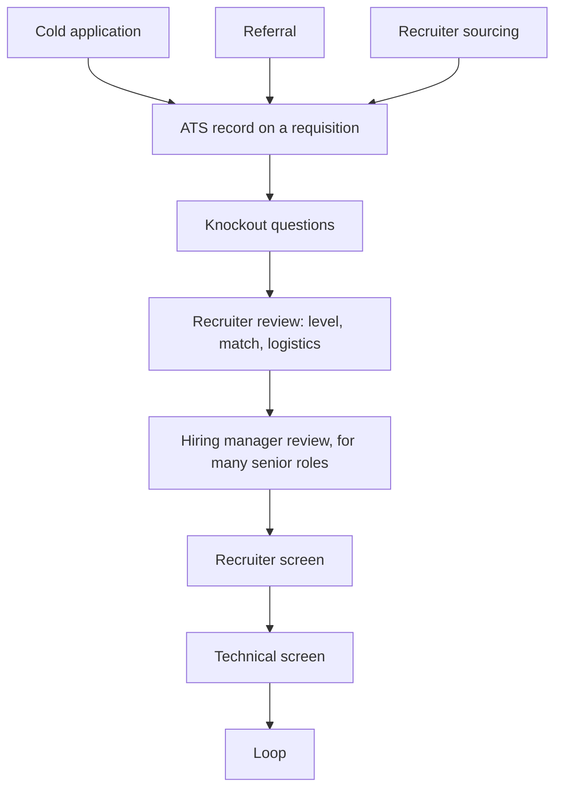

A recruiter working several open roles gives a new application a first pass that recruiters commonly describe as well under a minute. In that pass they are answering three questions: is this person at the level we need, have they done work like ours, and is there evidence they did it well? A resume that lists responsibilities ("worked on the payments service; participated in code reviews; responsible for CI") answers none of them, however strong the engineer behind it. A resume whose first three bullets say what you led, at what scale and what changed as a result answers all three before the recruiter reaches the bottom of the page.

Then come the screens, and each one is a small assessment with its own note: the recruiter's (level, motivation, logistics), sometimes the hiring manager's (scope and fit), and the technical screen's (the coding bar). This lesson covers everything between deciding to look and walking into the loop: what happens to an application behind the scenes, a senior resume and the formula behind its bullets, one role rewritten and re-scored step by step, referrals, and the three screens with scripts and annotated exchanges. Every resume, candidate and exchange below is illustrative.

## Under the hood: where an application goes



1. **The intake.** Before a role opens, the recruiter and the hiring manager usually agree the must-haves, the nice-to-haves and the level range. That list is what the recruiter scans for, which is why a posting's first few requirements deserve your first few bullets.
2. **The record.** An applicant tracking system (ATS; Greenhouse, Lever and Workday are common products) is a database with a search interface. Each application becomes a record attached to a requisition, the approved opening described in [The FAANG loop](/learn/senior-craft/getting-the-job/the-faang-loop). The ATS parses your resume into fields (employers, titles, dates, skills), keeps the original file, and records a **source**: applied, referral, sourced by a recruiter, or agency.
3. **Knockout questions.** Work authorisation, location and similar yes-or-no questions can reject an application automatically. This is the part that really is automatic, so answer them accurately.
4. **Search and review.** Recruiters search and filter records by keyword, title, employer and stage, including past applicants. They read for **level** (scope, titles, trajectory), **match** (domain and stack) and **logistics**, and they advance, reject, or move you to a different requisition, sometimes one at a lower level.
5. **Hiring-manager review.** For many senior roles the manager reads the shortlist, or every resume. Managers read the bullets for decisions and scope: what the recruiter scans, the manager probes.
6. **Memory.** Notes and outcomes stay attached to your record. A later recruiter can read how your last process went, and cool-down periods after a rejection are enforced through the same record.

The popular belief that an ATS silently rejects resumes for their formatting is mostly a misunderstanding: automatic rejection usually comes from knockout questions. Formatting matters for a different reason. A garbled parse is what the recruiter sees and searches, and a skill buried in a graphic cannot match a search.

## Under the hood: three ways into the pipeline

**Cold applications** arrive in the largest volume and are read in bulk, in whatever order the recruiter works the queue.

**Referrals** arrive tagged with the source and the referrer's answers to a short form, which commonly asks how they know you and whether they would work with you again. Many companies ask recruiters to review referred candidates promptly, and many run referral bonus programmes, which is why employees are generally glad to refer people they rate. A referral changes how fast and how carefully you are read. It does not change the bar.

**Sourcing** runs the other way: a recruiter searches LinkedIn and the ATS for titles, skills and employers, and messages people who match. Your public profile is a second resume that is searched the same way, so keep its bullets in step with the real one.

In many systems the first recorded source sticks. If you apply cold and then ask for a referral, the application may stay tagged as cold. Ask for the referral first and let the referral link or form create the record.

## What a senior resume must prove

A senior resume has one job: to make a busy reader believe you operate at senior scope, quickly enough that they read further. Five things should be visible:

1. **Scope.** The size of what you owned: systems, teams, users, traffic, money.
2. **Ownership.** Verbs that show you decided and led, not only participated.
3. **Impact.** What changed because of your work, with numbers.
4. **Relevant depth.** The technologies and problem domains the role needs, in plain text where a search finds them.
5. **Trajectory.** Growing scope from one role to the next.

Duties are not evidence. Everyone on a payments team "worked on the payments service". What only you can claim is what you changed.

## Structure and format

- **Header.** Name, location or "remote", email, LinkedIn. GitHub only if it shows something you would want an interviewer to read.
- **Summary (optional, two lines).** Useful when your titles understate your scope or you are changing domain: "Backend engineer, six years in payments; designed the multi-currency ledger schema three teams build on; led the move to automated reconciliation with finance." Skip adjectives such as "passionate" and "results-driven".
- **Experience,** in reverse chronological order. Four to six bullets for the current role, two to four for the one before, one or two for older roles. The last three to five years carry nearly all the weight.
- **Skills.** One or two lines, grouped: languages; data stores; infrastructure. No proficiency bars.
- **Education.** One line.

**Length.** One page for most engineers with under about ten years of experience; two at most beyond that. A third page says you could not decide what mattered.

**Format.** A single column, standard section headings, a common font, a PDF unless the posting asks for another format, no photo, no text inside images, headers or text boxes, and one date format throughout. Each of these keeps the parsed record identical to what you wrote.

## The bullet formula

```text
<Verb showing ownership> + <what you built or changed> + <the key technical decision>
  + <scale or context> + <measurable result>  [+ <your role, if it was a team effort>]
```

Each slot answers one reader's question. The verb answers "did they lead it?" (*led, designed, drove, cut, replaced, proposed*; not *helped with, participated in, was responsible for*). The decision answers the hiring manager's "do they know why it worked?" The scale answers the recruiter's "is this our size?" The result answers "did it matter?", and the role slot keeps a team achievement honest. A bullet that fills every slot is also the opening line of a behavioural story, and interviewers will treat it as one, so write only bullets you can talk about for ten minutes ([Behavioural interviews for seniors](/learn/senior-craft/getting-the-job/behavioral-interviews-for-seniors)).

## Before and after, annotated

| Before | What the reader takes from it | After | What the reader takes from it |
|---|---|---|---|
| Worked on the payment retry system | "On the team; role and level unknown" | Redesigned payment retries around idempotency keys and exponential backoff, cutting duplicate charges from about 40 a week to zero across 2M monthly transactions | "Owned a design; knows the mechanism; payment scale; a business result to ask about" |
| Improved API performance | "Unmeasured; could be a one-line fix" | Cut p99 latency of the catalogue API from 850 ms to 210 ms by replacing N+1 ORM queries with batched loaders and a read-through cache; unblocked the mobile home-page launch | "Diagnosed a real cause; measures the tail; tied to a launch" |
| Migrated services to Kubernetes | "Participant or leader? How many?" | Led the migration of 14 services from VMs to Kubernetes across 3 teams over 2 quarters; wrote the playbook the other teams followed and cut deploy time from 40 to 8 minutes | "Cross-team scope and duration; a multiplier; a result" |
| Mentored junior engineers | "Everyone writes this" | Mentored 3 engineers through their first on-call rotations and wrote the team's incident runbooks; median time to mitigate fell from 48 to 19 minutes over two quarters | "Mentoring with an operational outcome" |
| Responsible for CI | "A duty, no outcome" | Rebuilt CI with test sharding and dependency caching, taking the main pipeline from 35 to 9 minutes for 60 engineers, about 300 engineer-hours a month | "Leverage across an organisation, quantified" |

**Numbers you can defend.** Estimate honestly and signal it ("about", "roughly"), use relative terms ("halved"), or use proxies for scale (services, teams, requests per second). Know the derivation: "about 300 engineer-hours a month" is 26 minutes saved per run times roughly 700 pipeline runs a month, from the CI dashboard. Never invent a figure; a number you cannot explain in the interview costs more credibility than no number.

## Walk-through: mining one role

An illustrative engineer, Sam, has this section for their current role, *Software Engineer II, Payments Platform, 2023 to present*:

1. Worked on the ledger service (Go, Postgres, Kafka)
2. Participated in the reconciliation project
3. Responsible for on-call for the payments platform
4. Did code reviews and helped with hiring
5. Improved performance of the settlement batch job

**Step 1: score it.** One point per criterion that the bullet itself shows; trajectory is judged across roles, so it is scored once for the whole resume.

| Bullet | Scope | Ownership | Impact | Depth | Score |
|---|---|---|---|---|---|
| 1. Ledger service | – | – | – | Go, Postgres, Kafka | 1 |
| 2. Reconciliation | – | – ("participated") | – | – | 0 |
| 3. On-call | – ("the platform") | – ("responsible for") | – | – | 0 |
| 4. Reviews, hiring | – | – ("helped") | – | – | 0 |
| 5. Settlement job | – | – ("improved") | – | – | 0 |
| **Total** | | | | | **1 / 20** |

**Step 2: interview yourself.** For each bullet, answer four questions in notes: what changed, what did I decide, how big was it, and how do I know?

| Bullet | Sam's notes |
|---|---|
| 1 | Designed the multi-currency schema change for the double-entry ledger; wrote the RFC; 3 consuming teams; 1.2M entries a day; it enabled the EUR and GBP launches |
| 2 | Proposed automated reconciliation against the banks' settlement files; led it with one other engineer; finance's month-end check went from 2 days to 2 hours; found 3 classes of silent mismatch |
| 3 | Pages about 45 a week; replaced threshold alerts with SLO burn-rate alerts, deleted non-actionable ones; about 12 a week after; wrote runbooks for the top 10 alerts |
| 4 | Trained interviewer, 30+ loops; wrote the take-home rubric; 2 other teams adopted it |
| 5 | Nightly settlement job ran 5 h 40 min and sometimes missed the 6 a.m. bank cut-off; partitioned by merchant, ran partitions in parallel; 1 h 50 min; no missed cut-off since |

Every number in the notes has a source Sam can name: the RFC, the finance team's calendar, the paging dashboard, the job's run history.

## Walk-through: rewriting and re-scoring

**Step 3: fill the formula for one bullet.** Bullet 5, slot by slot:

| Slot | Content |
|---|---|
| Verb | Cut |
| What | the nightly settlement job |
| Scale and result | from 5 h 40 min to 1 h 50 min |
| Decision | by partitioning by merchant and running partitions in parallel |
| Business link | ending missed 6 a.m. bank cut-offs |

Result: "Cut the nightly settlement job from 5 h 40 min to 1 h 50 min by partitioning by merchant and running partitions in parallel, ending missed 6 a.m. bank cut-offs." The slots can move to keep the sentence readable; none can go missing.

**Step 4: the rewritten section.**

1. Designed the multi-currency schema for the double-entry ledger (Go, Postgres, Kafka; 1.2M entries a day), adopted by 3 consuming teams; enabled the EUR and GBP launches
2. Proposed and led automated reconciliation against bank settlement files, replacing a manual month-end check: 2 days to 2 hours, and 3 classes of silent mismatch found and fixed
3. Cut the nightly settlement job from 5 h 40 min to 1 h 50 min by partitioning by merchant and running partitions in parallel, ending missed 6 a.m. bank cut-offs
4. Reduced pages from about 45 to 12 a week by replacing threshold alerts with SLO burn-rate alerts; wrote runbooks for the top 10 alerts
5. Trained interviewer (30+ loops); wrote the team's take-home rubric, since adopted by 2 other teams

**Step 5: re-score.**

| Bullet | Scope | Ownership | Impact | Depth | Score |
|---|---|---|---|---|---|
| 1 | 1.2M entries a day, 3 teams | Designed | Two launches | Ledger schema, Go, Kafka | 4 |
| 2 | Finance month-end, bank files | Proposed and led | 2 days to 2 hours | Reconciliation | 4 |
| 3 | Nightly settlement, bank cut-off | Cut, by a stated method | 5 h 40 to 1 h 50 | Partitioning, parallelism | 4 |
| 4 | Team paging | Reduced, replaced | 45 to 12 a week | SLO burn-rate alerting | 4 |
| 5 | 30+ loops, 2 teams | Wrote | Adopted elsewhere | – | 3 |
| **Total** | | | | | **19 / 20** |

Nothing was invented; every point came from Sam's notes. For a reliability-focused role, bullets 4 and 3 move to the top; for a ledger role, 1 and 2. That reordering, plus the posting's vocabulary where it is true, is most of tailoring: about twenty minutes per role you care about. Never add experience you do not have; the technical screen will find it.

## Referrals

**Who to ask.** Former colleagues first, then people who have seen your work in other ways (open source, conferences, customers). A stranger cannot answer "would you work with them again?", so ask a stranger for fifteen minutes about the team instead, and let a referral follow if it fits.

**How to ask.** Make it easy to say yes and easy to say no, and write the form's answer for them:

```text
Hi Priya, hope the new team is treating you well.

I'm starting to look at senior backend roles, and the Payments Platform
opening at <Company> (<link>) looks like a strong fit: I've spent the last
three years on ledger and settlement systems.

Would you be comfortable referring me? I haven't applied yet, so your
referral would create the application. I've attached my resume and three
lines you can paste into the form. If it's not a good fit or you'd rather
not, no problem at all, and I'd still love fifteen minutes to hear how
you're finding it there.

Thanks,
Sam
```

A strong referral says how the referrer knows your work: "I worked with Sam for two years; they led our reconciliation redesign." A weak one says "I know of them". Recruiters read the difference.

## The recruiter screen

Usually 20 to 30 minutes, not technical, and still an assessment: the recruiter checks level fit, motivation, logistics and compensation alignment, and whether you can explain your work briefly and in plain terms. They are also your best source of information and often your advocate. An illustrative screen for Sam:

| Minute | Exchange | Recruiter's note | A weaker answer, and its note |
|---|---|---|---|
| 1 | "Tell me about yourself." A 75-second pitch: present, past, why this role | "clear; senior scope (ledger design, 3 teams); specific motivation" | Four minutes of chronology: "rambled; scope unclear" |
| 4 | "What level are you targeting?" "Senior, which I understand is L5 here. I designed our ledger's multi-currency schema across three teams." | "target senior; resume supports it" | "Whatever fits": "open to mid; consider the mid-level req" |
| 7 | "Walk me through the reconciliation work." Forty seconds, with numbers | "matches resume; depth available" | "It was a team effort": "role unclear" |
| 12 | "Salary expectations?" Defers and asks for the range | "deferred politely; shared posted range" | Current pay volunteered: offer anchored to it |
| 15 | Notice period, location, work authorisation | "logistics fine" | |
| 18 | Sam asks: what the level means here, loop format, language and environment, AI policy, timeline, team matching | "prepared; asked about format" | No questions: "low engagement" |

The pitch, in full:

> "I'm a backend engineer with six years in payments. For the last three I've been on the payments platform, where I designed the ledger's multi-currency schema, which three teams build on, and led the move to automated reconciliation, which took finance's month-end check from two days to two hours. Before that I spent three years on checkout. I'm looking for a senior role where I own a larger distributed system, and your platform team's work on <specific thing> is that kind of problem."

**The salary question.** Norms and law depend on where you are and where the job is. Several US states, including California, Colorado, New York and Washington, require pay ranges in job postings, and many US jurisdictions bar employers from asking about salary history. The EU pay transparency directive, which member states were required to bring into national law by June 2026, gives applicants the right to information on the starting pay or its range, for example in the posting or before the interview, and bars questions about pay history; national rules and timing vary. A sound default:

> "I'd like to understand the level and scope before we talk numbers, and I'm confident we'll find something fair if it's the right match. Could you share the range for this role?"

If pressed, give a researched range whose bottom you would be happy with. Where you are not required to, do not volunteer current pay; it anchors the offer to your past. [Negotiation](/learn/senior-craft/getting-the-job/negotiation) covers the rest.

## The hiring-manager screen

Some companies put a conversation with the manager before or beside the technical screen: part project deep-dive, part behavioural, part the manager deciding whether they want you. The central question is usually "walk me through your most relevant project".

| Manager asks | Weaker answer | Stronger answer | Manager's note on the stronger one |
|---|---|---|---|
| "Walk me through the project." | Architecture tour of the whole system | The problem, its cost, the decision that was Sam's, the result, in two minutes | "structured; led with the decision" |
| "Why partition by merchant?" | "It was faster" | "Settlement for one merchant never touches another's rows, so partitions need no coordination. The limit is skew: the largest merchant is about a third of the volume, so its partition is most of the 1 h 50 min" | "knows the mechanism and its limit" |
| "What would you do differently?" | "Nothing, it went well" | "Measure skew before choosing the key. I'd split the largest merchant by account, which should bring the floor well below 1 h 50 min" | "reflective; specific; reasons from the numbers" |
| "What do you want to ask me?" | "What's the stack?" | "What would make you say, six months in, that this hire was a great decision?" | "thinking about outcomes" |

Prepare two further questions for them: the biggest problem the team has not solved, and how technical decisions get made. This is your future manager, so their answers are data for you.

## The technical phone screen

Usually 45 to 60 minutes of coding in a shared editor, sometimes two problems or a practical one. It is a bar check: "is it worth five more interviewers' time?" An illustrative form:

```text
Technical screen - Rating: Hire
Problem: merge overlapping intervals; follow-up: intervals arrive as a stream
+ Clarified touching intervals and empty input before coding
+ Working, tested solution at 27:00; stated O(n log n), sort-dominated
+ Streaming follow-up: proposed a sorted structure and stated its cost
- Off-by-one found in own test and fixed
Recommendation: proceed to loop at the senior level
```

The form carries a level signal even at this stage, so the habits that produce senior lines in the loop apply here: clarify, state complexity with its assumptions, test unprompted, and reach the follow-up with time left ([The 45-minute protocol](/learn/interview-patterns/interview-execution/the-45-minute-protocol), [Senior signals in coding rounds](/learn/interview-patterns/interview-execution/senior-signals-in-coding-rounds)). Use a reliable connection, a headset and a readable editor font, and ask which environment and language are used and whether AI tools are allowed. Choose the language you are fastest and most accurate in ([Choosing an interview language](/learn/senior-craft/languages-for-senior-engineers/choosing-an-interview-language)). Practise with solo coding mocks at medium difficulty on `/interviews` until you finish and test inside 35 minutes consistently.

## Trade-offs: routes into the loop

The route changes who reads your resume first and how carefully. It never changes the bar.

| Route | Speed of first look | How carefully it is read | Your effort | Main risk |
|---|---|---|---|---|
| Cold application | Slowest; depends on the queue | Scanned with many others | Low | Never read closely |
| Referral from someone who worked with you | Fast | Carefully, with the referrer's context | Moderate: a message and a summary | Spending a relationship on a poor fit |
| Referral from someone who "knows of you" | Fast | Scanned; the form adds little | Low | Reads as a favour, not evidence |
| Recruiter outreach (sourced) | Fast | The recruiter already matched you | None to start | The role may be mis-levelled for you |
| Message to the hiring manager | Varies | Carefully, if they reply | Moderate | Bypassing the recruiter irritates some companies |

## Failure modes

**Symptom: dozens of applications, almost no replies.** Diagnosis: the resume reads as duties, the level is not visible in the top third, or the role's core skills are missing in plain text; sometimes the roles are the wrong level. Fix: score your bullets as in the walk-through, rewrite until each scores three or four, reorder per role, and route your top companies through referrals.

**Symptom: good recruiter screens, then you are moved to a mid-level requisition.** Diagnosis: titles and bullets show team-scoped work, and you did not state a target. Fix: a two-line summary with scope, a stated level on their ladder, and bullets that show cross-team work where it exists.

**Symptom: the interviewer asks about a bullet and you run out of detail at the second question.** Diagnosis: an inflated or borrowed bullet, or a number you cannot derive. Fix: keep only bullets you can defend for ten minutes, and write down each number's source before the loop.

**Symptom: a referral, then weeks of silence.** Diagnosis: you applied first so the record was tagged cold, the referral was weak, or the requisition closed. Fix: referral before applying, a pasteable summary for the referrer, and a polite question to the recruiter about status after a week or two.

**Symptom: you fail technical screens on problems you can solve.** Diagnosis: treated as a formality, an unfamiliar editor, or no timed practice. Fix: timed mocks in the same kind of environment, and the same protocol you would use in the loop.

## Interviewer follow-ups

**"Walk me through your resume."** Model answer: two minutes, most recent first, one sentence per older role, ending on why this role. Common wrong answer: a chronological tour from university, which spends the screen on the least relevant years.

**"How did you measure that?"** (pointing at a number) Model answer: the source and the derivation, such as "26 minutes saved per run, about 700 runs a month from the CI dashboard, so roughly 300 hours". Common wrong answer: "it was in a report somewhere", which turns a strong bullet into a credibility question.

**"Why three jobs in four years?"** Model answer: one honest sentence per move, each a pull towards something (a reorganisation, a scope you wanted), and why you intend to stay. Common wrong answer: blaming former employers, or a vague "wanted a change" repeated three times.

**"What are you making now?"** Model answer: where the question is not allowed, redirect politely to the role's range; elsewhere, redirect to what you are looking for at this level. Common wrong answer: an exact current figure volunteered where you were not required to give it.

**"If you had to give a number?"** Model answer: a researched range for the level and location, bottom above your walk-away. Common wrong answer: a single number below the range the company would have offered.

## What mid-level engineers get wrong

- **Listing duties.** The recruiter cannot see level, and the resume is filed with every other list of duties.
- **Unexplainable numbers.** A figure they cannot derive becomes the interviewer's first probe and their first doubt.
- **Applying before asking for the referral.** The application may stay tagged as cold.
- **"Whatever level fits."** The recruiter picks the safer, lower requisition.
- **Treating the technical screen as a formality.** They fail the bar check before anyone sees their design skills.
- **Asking no questions.** The recruiter's note says "low engagement", and they walk into a loop format they never asked about.

## Senior signals

- Each bullet shows ownership, the key decision, the scale and a measured result, and opens a story you can defend.
- You know every number's source and can derive it on request.
- You understand the ATS as a searchable record, and you ask for referrals before applying, with the form's text supplied.
- In the recruiter screen you give a tight pitch, state your target level with evidence and handle the salary question deliberately.
- You treat the manager screen as a two-way interview and the technical screen as a loop round.

## Check yourself

```quiz
- q: >-
    Which resume bullet is strongest for a senior role?
  options: ["Owned the payments service, its on-call rotation and roadmap", "Worked closely with the team to improve payment reliability", "Expert in Go, Kafka, Postgres, Kubernetes, Redis and AWS", "Redesigned retries with idempotency keys; duplicates 40 a week to 0"]
  answer: 3
  explanation: >-
    It fills the formula's slots: an ownership verb, the key technical decision and a measured result, and it opens a story. Owning a service is a duty however large, working with the team hides your role behind the team, and a keyword list shows no evidence of use.
- q: >-
    What does an applicant tracking system mostly do with your resume?
  options: ["Stores and parses it so recruiters can search it", "Rejects it if it uses two columns or any tables", "Holds it unread until a referral is attached", "Scores its format and silently rejects low scores"]
  answer: 0
  explanation: >-
    An ATS is a database with search: it parses the resume into fields, records the source and tracks stages. Automatic rejection usually comes from knockout questions such as work authorisation; formatting matters because a garbled parse is what the recruiter sees and searches.
- q: >-
    A former colleague offers to refer you. Why ask them to do it before you apply?
  options: ["Referrals are only valid for roles not yet posted", "In many systems the first recorded source sticks", "Applying first lowers the bar for the referrer", "Recruiters delete cold applications after a week"]
  answer: 1
  explanation: >-
    If the cold application creates the record, it may stay tagged as cold and lose the referral's faster, more careful review. Referrals do not change the bar, and cold applications are not deleted; they are read in bulk.
- q: >-
    Asked for a target level in the recruiter screen, you say "whatever fits". What does the recruiter's note most likely lead to?
  options: ["A delay until the hiring manager decides", "Consideration for the lower-level requisition", "Nothing, since level is set in the loop alone", "A senior interview plan, to be safe"]
  answer: 1
  explanation: >-
    The recruiter matches you to a requisition and an interview plan early, and without a stated target and evidence the safer choice is the lower one. Level is argued in the loop, but the plan you are interviewed against is set before it.
- q: >-
    An interviewer points at "about 300 engineer-hours a month" on your resume and asks how you know. What is the strongest answer?
  options: ["The manager calculated it for the quarterly review", "Minutes saved per run times monthly runs, from CI data", "It is an estimate, so the exact figure does not matter", "It came from a report, so it should be accurate"]
  answer: 1
  explanation: >-
    Giving the derivation and its source (26 minutes saved times about 700 runs a month from the dashboard) turns the number into evidence. Deferring to a report or someone else's calculation, or waving it away, makes the bullet a credibility question.
- q: >-
    Early in a recruiter screen you are asked for your salary expectations. What is a sound default?
  options: ["Name the highest figure you have heard, so the anchor is high", "Refuse to discuss pay until a written offer is in your hand", "State your current salary, so the offer has a verified anchor", "Ask for the role's range; if pressed, give a researched one"]
  answer: 3
  explanation: >-
    Deferring until you know the level and asking for the range avoids anchoring the offer to your past pay, and many jurisdictions require posted ranges or bar salary-history questions. Refusing outright creates friction, and an unfounded extreme number damages credibility.
```
