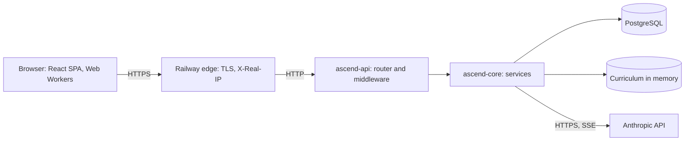

You join a team on Monday. By Wednesday you are reviewing a pull request against a service you have never seen, and on Friday someone in a design review asks whether it survives ten times the traffic. Nobody gives you a week to read the code. What separates a senior engineer here is not reading speed; it is knowing *what* to read, in *which order*, and what to be suspicious of.

This track practises that on a codebase you already know from the outside: the one serving this page. Ascend is small enough to hold in your head (roughly 8,000 lines of Rust and 22,000 lines of TypeScript at the time of writing, 17,000 of which are the visualisation engine) and real enough to contain trade-offs, shortcuts and a history of bugs you can read in its fix commits. This lesson gives you the map, the one boundary that organises the backend, and a reading protocol you can reuse anywhere. The rest of the module walks a request, the content engine, authentication and the data model in depth.

## The system on one screen



Three facts shape almost every other decision:

1. **One process, nearly stateless.** A single binary serves the JSON API under `/api` and the built React app for every other path. Apart from an in-process rate limiter, nothing important lives in its memory that another replica would need.
2. **The hottest reads never touch the database.** The curriculum is Markdown compiled into the binary and parsed once at boot into an immutable graph behind an `Arc`. Serving a lesson is a hash lookup plus JSON serialisation. Postgres only holds per-user rows: progress, submissions, sessions, conversations.
3. **Learner code never runs on the server.** Python (Pyodide) and JavaScript run in Web Workers in the browser; the API records what the browser reports. Module 2 covers the consequences in [Running code in the browser](/learn/case-study-ascend/product-systems/running-code-in-the-browser).

## The map

| Path | What lives there | Read it when |
|---|---|---|
| `crates/core` | Domain layer: config, `AppError`, SeaORM entities, content engine, auth, AI client, services. No HTTP server types. | You change behaviour |
| `crates/api` | HTTP adapter: router, middleware, extractors, routes, static SPA hosting. A library plus a thin `main.rs`. | You add an endpoint or change request handling |
| `crates/api/tests/api.rs` | Integration tests that drive the production router in-process against a real Postgres | You want to know what the API actually promises |
| `migration` | SeaORM migrations, append-only | You touch the schema |
| `content` | Curriculum and practice problems as Markdown with YAML front matter, plus the authoring contract | You write or fix content |
| `web` | React SPA, code runners (`web/src/runner`), visualisation engine (`web/src/viz`) | You change the UI |
| `scripts` | Problem validator that executes every reference solution | CI fails on content |
| `docs` | `ARCHITECTURE.md` and four architecture decision records | First, before any code |
| `Dockerfile`, `.railway/railway.ts`, `.github/workflows/ci.yml` | How it is built, deployed and gated | You need to know what "done" means |

## A one-hour reading protocol

| Minutes | Read | Question it answers |
|---|---|---|
| 0–10 | README, architecture doc, ADRs | What did the authors intend, and what did they decide against? |
| 10–15 | Build manifests | What is the stack, and which capabilities were pulled in? |
| 15–25 | The entry point | What happens at boot, in what order, and what makes it refuse to start? |
| 25–35 | The router | What is the public surface, and what wraps it? |
| 35–50 | One vertical slice, route to SQL | Where does logic live, and how does an error travel? |
| 50–60 | Tests, CI and recent fix commits | What is guaranteed, as opposed to claimed, and where has it broken before? |

The order is deliberate: intent first, evidence last. Documentation records what someone believed when they wrote it; code and tests record what is true today. Reading in this order turns every sentence of the docs into a question you can check.

### Docs are claims to verify

The four ADRs in `docs/adr/` are the most valuable ten minutes in the repository: one Rust binary with embedded content (0001), server-side sessions instead of JWTs (0002), running learner code in the browser (0003), and bounded, cache-friendly LLM usage (0004). Each lists the alternatives considered, and the rejected alternatives are where the design actually lives. Each also ends with a "Revisit when" section: the conditions under which the decision should be reopened (a second replica, content editors who do not use Git, a second model provider). A decision that states its own expiry conditions is rarer, and more useful, than one that states its reasons; [Documentation and ADRs](/learn/senior-craft/software-craft/documentation-and-adrs) covers the format. Write each claim down as a question. `ARCHITECTURE.md` says "the service is stateless apart from the in-process rate limiter": is it? (Nearly. The hourly session sweeper runs in every process, which is harmless, and an in-flight AI reply lives in a task inside the process that started it. Since the latest fixes, shutdown waits up to 30 seconds for those tasks, so a deploy only cuts off a reply that is still streaming after that.)

### Manifests show the stack in forty lines

The workspace `Cargo.toml` groups its dependencies by purpose, and reading it tells you most of the architecture before you open a source file: Axum and tower-http for HTTP, SeaORM on Postgres, `governor` for in-process rate limiting, `argon2`, `sha2`, `rand` and `secrecy` for credentials, `include_dir` and `gray_matter` for content compiled into the binary, and `reqwest` plus `eventsource-stream` for a streaming AI client.

Now check the manifest against the code, because that check has already paid off once. Until the latest fix commit (`7154e9f`), the manifests also listed `moka`, an in-memory cache, as a dependency of both `ascend-core` and `ascend-api`. A search of both `src` trees found no use of it. A dead dependency costs compile time and supply-chain surface, and it is a small signal about intent: someone planned a cache that was never built. The fix removed `moka`, replaced `once_cell` with the standard library's `LazyLock`, and dropped `async-stream` and `thiserror` from the API crate, which never used them. Two fossils survive in the workspace file: a `# --- caching ---` heading with nothing under it, and `pulldown-cmark`, declared for the workspace but used by no crate. Manifests tell you what was *planned*; only the code tells you what was *done*.

### Boot order is a design decision

`crates/api/src/main.rs`, inside `main`:

```rust
dotenvy::dotenv().ok();
let config = Config::from_env().map_err(|e| anyhow::anyhow!("configuration: {e}"))?;
telemetry::init(config.log_json);

tracing::info!(env = ?config.env, addr = %config.bind_addr, "booting ascend-api");

let db = state::connect_db(&config).await?;
tracing::info!("running migrations");
migration::Migrator::up(&db, None).await?;

let content_source = match std::env::var("CONTENT_DIR") {
    Ok(dir) => ascend_core::content::ContentSource::Disk(dir.into()),
    Err(_) => ascend_core::content::ContentSource::Embedded,
};
let curriculum = ascend_core::content::load_curriculum(&content_source)?;
```

Four things to notice:

- **Configuration fails at boot, not at the first request.** `Config::from_env` validates eagerly; in production it refuses to start with insecure cookies. A missing variable is a crash-loop with a clear message instead of a 500 an hour later.
- **Migrations run before the server binds.** A process that answers its readiness probe therefore has a current schema. If a migration fails the process exits non-zero, and Railway keeps the previous deployment serving.
- **The same binary validates its own content.** Earlier in `main`, `--check-content` loads the embedded curriculum strictly and exits; the Docker build runs it, so a broken lesson fails the build rather than the deploy.
- **The order has a flaw.** Loading content is pure and takes milliseconds; running migrations mutates a shared database. Cheap, side-effect-free checks should come first. Today it costs nothing, because the build already validated the embedded content, but with `CONTENT_DIR` pointing at a broken directory the process would apply a migration and then crash. Swapping the two blocks is a one-line improvement you could propose in your first week.

### The router is the table of contents

`crates/api/src/app.rs` mounts eight route modules under `/api` (about forty endpoints) and falls back to the SPA for everything else. The middleware wrapped around them is the subject of [Anatomy of a request](/learn/case-study-ascend/the-system/anatomy-of-a-request); for now, notice that the whole public surface fits on one screen, and that is itself a design goal.

### One vertical slice

Pick the most common write: marking a lesson complete. The route in `crates/api/src/routes/progress.rs`:

```rust
async fn set_lesson(
    State(state): State<AppState>,
    CurrentUser(user): CurrentUser,
    Path((t, m, l)): Path<(String, String, String)>,
    AppJson(body): AppJson<LessonBody>,
) -> ApiResult<Json<ascend_core::entities::lesson_progress::Model>> {
    Ok(Json(state.progress.set_lesson_status(user.id, &format!("{t}/{m}/{l}"), body.status).await?))
}
```

The handler's signature *is* its contract: it requires a session (`CurrentUser`), three path segments and a JSON body (`AppJson`, a thin wrapper whose parse errors use the API's error shape), and it does exactly one thing with them. The service it calls validates the slug against the in-memory curriculum, records today in the learner's activity log and performs a single-statement upsert; [Data and migrations](/learn/case-study-ascend/the-system/data-and-migrations) shows the SQL. If the slug does not exist, the service returns `AppError::NotFound("lesson")` and the API maps it to a 404 in one place. Fifteen minutes on one slice like this tells you more about the codebase's conventions than an hour of browsing directories.

### Tests say what is guaranteed

The integration test names in `crates/api/tests/api.rs` read like a specification: `auth_lifecycle_and_session_storage`, `login_errors_do_not_leak_account_existence`, `csrf_rejects_requests_without_header_or_with_foreign_origin`, `lesson_payload_hides_quiz_answers`, `ai_budget_reservation_cannot_be_overshot_by_concurrency`, `concurrent_registrations_for_one_email_yield_one_account_and_conflicts`, `a_learner_has_at_most_one_active_interview_and_solo_locks_the_coach`, `deleting_an_account_requires_the_password_and_keeps_discussions_readable`, `throttled_responses_say_when_to_retry`, `content_etag_revalidates_and_names_the_build`, and ten more. CI (`.github/workflows/ci.yml`) runs formatting, Clippy, those tests against a Postgres service, strict content validation, every practice problem's reference solution, the web typecheck and unit tests (including one that renders every visualisation in the curriculum), a Playwright smoke test against a running server, and a Docker build. One detail shows care: the integration tests skip themselves when no database is configured, which keeps `cargo test` usable offline, but they assert that this never happens when the `CI` variable is set, so CI cannot go green by skipping.

Anything not in that list is a hope. The interview service's transcript append is documented as safe when two background tasks persist replies at the same moment, and the SQL supports the claim, but no test runs two appends concurrently, so today the claim rests on reading. Compare the heading anchors: the content engine's source used to say its anchors "follow the same rule the frontend uses", no test checked it, and they did not. The fix came with unit tests that pin the algorithm and a crawl that checks every table-of-contents link, which is the difference between a claim and a guarantee ([The content engine](/learn/case-study-ascend/the-system/the-content-engine) tells the story).

### History shows where it has broken

The last ten minutes are also when to read `git log`. Fix commits are a map of where a codebase has been fragile, written by the people who paid for it. One Ascend commit, "fix: security and robustness findings from the code review", lists in a single message a CSRF check that matched origins by prefix, a timeout that answered with the wrong status code, request IDs that clients could choose, a JSON extractor whose errors bypassed the API's error format, and a progress write that took an extra round trip. A neighbouring commit replaced a budget check that could be overshot under concurrency. The latest, "fix: data integrity, account deletion and stricter content validation", fixed a streak computed from a column that every update overwrote, a race that could leave a learner with two active interviews, a cascade that deleted other people's comments, a registration race that answered 500, and heading anchors that pointed nowhere. Most of those appear later in this track as before-and-after examples, because the diff between a plausible design and a correct one is where the learning is.

## The core and api boundary

The backend is two crates with one rule. `crates/core/src/lib.rs` opens with it:

```rust
//! # ascend-core
//!
//! The domain layer of Ascend. Everything here is transport-agnostic: no Axum,
//! no HTTP types. The API crate is a thin adapter that maps HTTP to these
//! services and back. That boundary is what makes the domain testable without
//! a web server and reusable from other binaries (CLI tools, workers).
```

Services in `crates/core/src/services` each own one bounded context (progress, quizzes, submissions, comments, roadmap, interviews, plus a small `activity` module that the others call), take a cloned `DatabaseConnection` (a pool handle) and an `Arc<Curriculum>`, and return `AppResult<T>`. The API crate wires them together exactly once, in `crates/api/src/state.rs`:

```rust
Ok(Self {
    auth: AuthService::new(db.clone(), config.session_ttl),
    progress: ProgressService::new(db.clone(), curriculum.clone()),
    quiz: QuizService::new(db.clone(), curriculum.clone()),
    submissions: SubmissionService::new(db.clone(), curriculum.clone()),
    comments: CommentService::new(db.clone(), curriculum.clone()),
    roadmap: Arc::new(RoadmapService::new(curriculum.clone())),
    interviews: InterviewService::new(db.clone(), curriculum.clone()),
    coach,
    limiter: Arc::new(crate::middleware::rate_limit::Limiters::new()),
    tasks: tokio_util::task::TaskTracker::new(),
    content_etag: crate::build_info::content_etag(&curriculum.version, crate::app::index_html()).into(),
    config,
    db,
    curriculum,
})
```

This is a *composition root*: the one place that knows how the pieces fit (the general pattern is covered in [Architecture and boundaries](/learn/senior-craft/software-craft/architecture-and-boundaries)). Every field is an `Arc`, a pool handle or a handle with an `Arc` inside (the `TaskTracker` that tracks background AI work), so cloning `AppState` into each handler is a few reference-count increments. The last two fields arrived with the latest fixes, and both are HTTP concerns: which spawned tasks shutdown must wait for, and the validator for content responses. That they live in the API crate's state, not in a core service, is the boundary rule working.

**Why it pays.** The boundary is already used by a second binary: `crates/core/examples/validate_content.rs` loads and reports on the curriculum with no web server at all, and CI runs it. Swapping Axum for another framework would touch only `crates/api`. Every business rule ("a progress row must reference a real lesson") lives in one service instead of being re-checked in each handler.

**What was rejected.** The first alternative is a single crate where handlers query the database directly. It is faster to start, but rules spread across handlers and drift apart, and nothing is reusable from a CLI or a worker. The second is full ports-and-adapters: a repository trait per table, services generic over them, mocks in unit tests. It is clean, and for a one-maintainer codebase the indirection costs more than it buys. Ascend chose the middle: a real domain crate, concrete SeaORM types inside it, and integration tests against a real Postgres instead of mocks.

**What it costs.** Services depend on a concrete `DatabaseConnection`, so there are no fast unit tests of service logic with in-memory fakes; the pure functions (streaks, slugify, token checks) have unit tests, and everything else is tested through the API with a database. That is a defensible trade, and you should be able to say it out loud.

**Where the rule bends.** Run `cargo tree -p ascend-core -i http` and you find that `http`, `hyper` and even `tower-http` *are* in core's dependency graph, pulled in by `reqwest` for the Anthropic client. The rule is really "no *inbound* transport types in the domain's API": no Axum extractors, no status codes, no request objects. An outbound HTTP client living inside the domain crate is a reasonable shortcut at this size. At a larger size you would move the AI client behind a trait in its own crate and turn the rule into a check that CI enforces, because a rule enforced only by review decays the first time someone is in a hurry. The exercise builds that check.

```exercise
id: forbidden-dependencies
title: A dependency fitness function
prompt: |
  The repository rule "crates/core must not depend on HTTP types" is only enforced by review. Write the check CI could run instead.

  `graph` maps a crate name to the list of crates it depends on directly; a crate with no entry has no dependencies. Return the **sorted** list of names from `forbidden` that are reachable from `start` by following one or more dependency edges. The graph can contain cycles and shared dependencies, so visit each crate at most once.
languages: [python, javascript]
entry: forbidden_reachable
starter:
  python: |
    def forbidden_reachable(graph, start, forbidden):
        # your code here
        return []
  javascript: |
    function forbidden_reachable(graph, start, forbidden) {
      // your code here
      return [];
    }
tests:
  - args: [{"ascend-api": ["ascend-core", "axum", "migration"], "ascend-core": ["sea-orm", "reqwest", "serde"], "reqwest": ["http", "hyper"], "axum": ["http", "hyper", "tower"], "sea-orm": ["sqlx"], "migration": ["sea-orm-migration"], "sea-orm-migration": ["sea-orm"]}, "ascend-core", ["axum", "http", "hyper", "tower"]]
    expected: ["http", "hyper"]
    label: core reaches http through reqwest
  - args: [{"ascend-api": ["ascend-core", "axum", "migration"], "ascend-core": ["sea-orm", "reqwest", "serde"], "reqwest": ["http", "hyper"], "axum": ["http", "hyper", "tower"], "sea-orm": ["sqlx"], "migration": ["sea-orm-migration"], "sea-orm-migration": ["sea-orm"]}, "ascend-api", ["axum", "http", "hyper", "tower"]]
    expected: ["axum", "http", "hyper", "tower"]
    label: the adapter may depend on anything
  - args: [{"ascend-api": ["ascend-core", "axum", "migration"], "ascend-core": ["sea-orm", "reqwest", "serde"], "reqwest": ["http", "hyper"], "axum": ["http", "hyper", "tower"], "sea-orm": ["sqlx"], "migration": ["sea-orm-migration"], "sea-orm-migration": ["sea-orm"]}, "sea-orm", ["axum", "http", "hyper", "tower"]]
    expected: []
  - args: [{"a": ["b"], "b": ["a", "x"]}, "a", ["x"]]
    expected: ["x"]
    label: cycles terminate
  - args: [{"a": ["b"]}, "b", ["a"]]
    expected: []
    hidden: true
    label: a leaf crate reaches nothing
  - args: [{"a": ["b", "c"], "b": ["d"], "c": ["d"], "d": ["http"]}, "a", ["http", "d"]]
    expected: ["d", "http"]
    hidden: true
    label: diamond dependency, visited once
hints:
  - "This is reachability in a directed graph: a DFS or BFS from `start` with a visited set."
  - "Seed the traversal with the neighbours of `start`, not `start` itself, so the start only counts if a cycle leads back to it."
  - "Intersect the visited set with `forbidden`, then sort."
```

## One binary, one database

ADR 0001 records the decision: a single Rust binary serves the API and the built SPA, with the curriculum compiled in, and Postgres is the only stateful dependency. The alternatives it rejects are worth rehearsing, because you will argue each of them in design reviews.

| Alternative | What it buys | Why it lost here | Failure mode the chosen design prevents |
|---|---|---|---|
| SPA on a CDN, API as a separate service | Edge caching of assets, independent deploys | Two pipelines, CORS, cross-origin cookies | Front end and back end drifting apart between deploys |
| Content in a database or headless CMS | Non-developers can edit | Content needs migrations, backups and a sync story; no review or CI | "Content missing in prod"; unreviewed edits |
| Microservices (auth, content, AI) | Independent scaling and ownership | No team or traffic reason; each hop adds latency and failure modes | Distributed failures in a system run by one person |

Compare Ascend with the textbook web stack. Step through it, then map each box.

```viz
{"type": "system", "algorithm": "request-flow", "title": "The textbook request path", "caption": "Map each box to Ascend: the CDN is the browser cache plus immutable hashed assets, the load balancer is Railway's edge in front of one replica, and there is no Redis because the hot data is compiled into the binary."}
```

The textbook needs Redis because its lessons live in Postgres; Ascend's lessons live in the process, so the cache is the binary itself. The textbook needs a CDN for static assets; Ascend sets `Cache-Control: public, max-age=31536000, immutable` on content-hashed files under `/assets/` and `no-cache` on `index.html`, which gets most of the benefit for a single-region product.

One claim deserves a correction. Shipping the SPA inside the API binary does not fully remove version skew: a browser tab opened before a deploy keeps running the old JavaScript against the new API until the user reloads. The mitigation is discipline, not architecture: additive API changes, and fields that old clients can ignore.

## What changes at 100x

| Concern | Today | At 100x | Why |
|---|---|---|---|
| Replicas | One, in one region | Several behind Railway's balancer | Availability during deploys and failures |
| Rate limiting | `governor` in process | A shared store such as Redis; the `Limiters` type is the seam | N replicas would otherwise allow N times the limit |
| Database connections | Pool of 20 per process | A connection pooler and a budget per replica | 20 x N must stay under Postgres's `max_connections` |
| Lesson responses | Serialised and compressed per request | Pre-serialised and pre-compressed at boot, assets on a CDN | CPU per request goes to zero for the hottest path |
| AI streaming | A tracked task inside the web process, drained for up to 30 s on shutdown | A job queue and worker, streaming through a broker | No reply is cut off by a deploy, however long it runs |
| Migrations | Run by every booting process | A separate release step holding a lock | Replicas booting together race each other |

None of these are needed today, and doing them early would be waste. Knowing the order in which they become necessary is the point: the rate limiter is the first thing that is *wrong* with two replicas; everything else is merely slower.

## When comments and code disagree

When this track was first drafted, reading Ascend closely turned up four places where a comment made a claim the code did not keep:

| Where | What the comment claimed | What the code did |
|---|---|---|
| `crates/api/src/app.rs` | The body limit sits between the timeout and compression | It is applied only to the `/api` sub-router |
| `crates/api/src/middleware/rate_limit.rs` | Limits are "by client IP (and by user for AI routes)" | Every limiter is keyed by `IpAddr`; the per-user cap is the daily budget, a different mechanism |
| `crates/core/src/content/blocks.rs` | Heading ids "follow the same rule the frontend uses" | The frontend used a different algorithm, so some table-of-contents links went nowhere |
| `migration/src/lib.rs` | DB-side timestamp defaults mean the app "can never forget to set them" | Defaults apply on `INSERT` only; nothing maintains `updated_at` on `UPDATE` |

All four were corrected in `7154e9f`, and the corrections split into two kinds. Three changed the comment to describe the code: the middleware order in `app.rs` now lists the `/api` layers separately, the limiter's module comment points to the budget in `ascend_core::ai::budget`, and the migration conventions now say only that mutable tables get DB-side defaults. One changed the code to match the comment, because the claim mattered: the anchors now really do follow the frontend's algorithm, with a test. Note what the timestamp fix did not do: the comment soft-delete still leaves `updated_at` at the creation time. Rewording the comment removed the false promise without fixing the behaviour, which is a legitimate choice as long as someone decided it.

The same commit also created a new drift, which is how it usually happens. In `crates/core/src/services/progress.rs` the comment "Upsert returning the row: one statement, one round trip, no read-modify-write race" now sits directly above a call that records the day in the activity log, a second statement and a second round trip, and only then comes the upsert it describes. Nobody lied; a fix was inserted between a comment and its code. And the `role` field of `TranscriptEntry` in `services/interviews.rs` lists `"interviewer" | "candidate" | "assistant" | "system"`, while the routes also write `candidate_to_assistant`.

The senior response is neither outrage nor indifference. Trust the code, fix the comment in the same change, and where the claim matters (the anchors did), add a test that makes the claim true by construction.

## Senior signals

- You read a new codebase in a fixed order (intent, stack, boot, surface, one slice, guarantees) and come out with a list of *verified* claims and open questions, not a vague impression.
- You describe the architecture by its boundaries and its state: "one process, stateless except the rate limiter, hot reads from memory, Postgres only for per-user rows".
- You can say what a boundary rule really means ("no inbound transport types in the domain") and where it bends, and you propose turning review-only rules into CI checks.
- You name the rejected alternatives for each big decision and the failure mode each choice prevents, which is what makes a decision defensible.
- You order the 100x changes by what becomes *incorrect* first (the per-process rate limiter) versus what merely gets slower.
- You read fix commits as a map of past fragility, and you check whether each fix came with the test that would have caught it.
- You treat comments as claims and tests as evidence, and fix drift when you find it rather than working around it.

## Check yourself

```quiz
- q: >-
    You have one hour with an unfamiliar service before a design review. Which reading order produces the most reliable mental model?
  options: ["Docs and ADRs, manifests, entry point, router, one slice, then tests", "Only the ADRs, since between them they record every decision the team made", "Tests and CI first, then the docs, then the entry point and the router", "Open source files at random until the overall structure starts to emerge"]
  answer: 0
  explanation: >-
    Reading intent first turns every documented claim into a question, and reading tests and CI last tells you which claims are actually enforced. Starting with tests is not wrong, but without intent you cannot tell a deliberate behaviour from an accident. ADRs alone describe what someone decided, not what the code does today.
- q: >-
    cargo tree shows that ascend-core transitively depends on the http and hyper crates through reqwest. What is the best assessment against the rule that core must not depend on HTTP types?
  options: ["Fine, because the rule was only ever meant to apply to the React frontend", "Tolerable: the rule bans inbound HTTP types; the outbound client can move behind a trait", "A violation that has to be fixed by removing reqwest from ascend-core before the next release", "Irrelevant, because transitive dependencies never affect how a crate is designed or built"]
  answer: 1
  explanation: >-
    The boundary exists so domain logic never sees requests, extractors or status codes. An outbound AI client is an adapter that happens to live in the domain crate, acceptable at this size and worth isolating later. Removing it immediately treats a shortcut as an emergency, and claiming transitive dependencies never matter ignores compile time, supply chain and the day someone imports http types directly.
- q: >-
    main.rs runs database migrations and then loads the curriculum. Why would a senior reviewer suggest swapping them?
  options: ["The curriculum loader needs the new schema before it can parse lessons", "Migrations run noticeably faster once the curriculum is already in memory", "Loading content is pure and cheap, so it should fail before any schema change", "Railway's readiness probe expects the content to be loaded before any migration runs"]
  answer: 2
  explanation: >-
    Order boot steps so that side-effect-free validation happens before irreversible work. Content never reads the database, so nothing depends on the current order; the swap only removes the failure mode where a process applies a migration and then crashes on a broken CONTENT_DIR.
- q: >-
    ADR 0001 says shipping the SPA inside the API binary avoids front-end/back-end drift. In which situation does skew still occur?
  options: ["Only while Postgres restarts and the API serves a cached copy of the schema", "Only when the content version changes and the ETag forces every page to reload", "Never, because one artifact always ships the SPA and the API as one version", "A tab opened before a deploy keeps running the old JavaScript against the new API"]
  answer: 3
  explanation: >-
    The artifact is atomic but browsers are not. index.html is served no-cache so a reload picks up the new bundle, but an open tab keeps the old code in memory. API changes must stay backward compatible for at least one release; a single artifact does not remove that duty.
- q: >-
    You plan to run Ascend on three replicas. Which component becomes incorrect, rather than merely slower, the moment you do?
  options: ["Argon2 hashing, because the semaphore that bounds it only counts one process", "The ETags, because each replica computes its own validator when it boots", "The content engine, because every replica parses and holds its own copy of the curriculum", "The in-process rate limiter, which would allow three times the limit per client"]
  answer: 3
  explanation: >-
    Each replica keeps its own governor state, so a client spread across three replicas gets three budgets. The content engine and ETags are identical on every replica because they derive from the same build, and a per-process hashing semaphore is exactly right, since each process protects its own CPUs and memory.
- q: >-
    A fix inserted an activity-log write between the comment "one statement, one round trip" and the upsert it describes. What is the most useful response?
  options: ["Fix the comment in the same change and ask whether both writes belong in one statement", "Leave it alone, since comments always go stale and readers should only ever trust the code", "Delete every comment in the file so that none of them can drift again in future", "Move the activity write somewhere else so that the comment becomes accurate once again"]
  answer: 0
  explanation: >-
    Comments are claims. Fixing the drift keeps the next reader from being misled, and asking whether the two writes should be one statement turns a wording problem into a design question. Moving code to fit a comment gets the priority backwards: the activity write is where it is for a reason, and the comment should follow the code.
```
