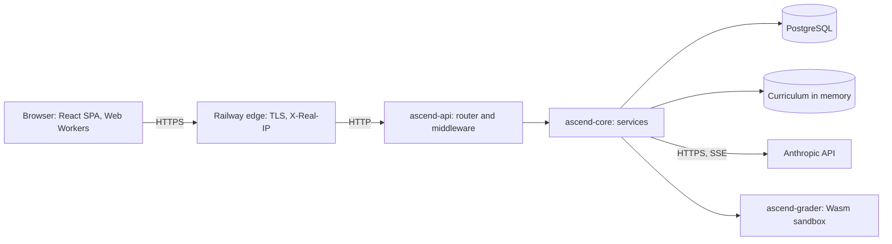

You join a team on Monday. By Wednesday you are reviewing a pull request against a service you have never seen, and on Friday someone in a design review asks whether it survives ten times the traffic. Nobody gives you a week to read the code. What separates a senior engineer here is not reading speed; it is knowing *what* to read, in *which order*, and what to be suspicious of.

This track practises that on a codebase you already know from the outside: the one serving this page. Ascend is small enough to hold in your head (about 11,200 lines of Rust, of which 1,000 are migrations and 1,600 tests, and 22,500 lines of TypeScript, 17,000 of which are the visualisation engine, at the time of writing) and real enough to contain trade-offs, shortcuts and a history of bugs you can read in its fix commits. This lesson gives you the map, the one boundary that organises the backend, and a reading protocol you can reuse anywhere.

## The system on one screen



Three facts shape almost every other decision:

1. **One process, nearly stateless.** A single binary serves the JSON API under `/api` and the built React app for every other path. Sessions, AI budgets and the security rate limits are rows in Postgres; only a loose per-IP flood bucket lives in process memory, on purpose.
2. **The hottest reads never touch the database.** The curriculum is Markdown compiled into the binary and parsed once at boot into an immutable graph behind an `Arc`. Serving a lesson is a hash lookup plus JSON serialisation. Postgres only holds per-user rows: progress, submissions, sessions, conversations.
3. **Learner code runs twice.** Python (Pyodide) and JavaScript run in Web Workers in the browser for instant feedback; for a signed-in learner the server runs the same code again in a WebAssembly sandbox and records only its own verdict (ADR 0005). Module 2 covers both in [Running code in the browser](/learn/case-study-ascend/product-systems/running-code-in-the-browser).

## The map

| Path | What lives there | Read it when |
|---|---|---|
| `crates/core` | Domain layer: config, `AppError`, SeaORM entities, content engine, auth, AI client, services. No HTTP server types. | You change behaviour |
| `crates/api` | HTTP adapter: router, middleware, extractors, routes, static SPA hosting. A library plus a thin `main.rs`. | You add an endpoint or change request handling |
| `crates/grader` | Server-side grading: CPython and QuickJS on WASI, run by Wasmtime under limits | You change how submissions are judged |
| `crates/api/tests` | Integration tests that drive the production router against a real Postgres (`api.rs`), and shutdown over real sockets (`shutdown.rs`) | You want to know what the API actually promises |
| `migration` | SeaORM migrations, append-only | You touch the schema |
| `content` | Curriculum and practice problems as Markdown with YAML front matter, plus the authoring contract | You write or fix content |
| `web` | React SPA, code runners (`web/src/runner`), visualisation engine (`web/src/viz`) | You change the UI |
| `scripts` | Problem validator that executes every reference solution; the grader runtimes, pinned by SHA-256 | CI fails on content |
| `docs` | `ARCHITECTURE.md` and five architecture decision records | First, before any code |
| `Dockerfile`, `.railway/railway.ts`, `.github/workflows/` | How it is built, deployed and gated | You need to know what "done" means |

## A one-hour reading protocol

| Minutes | Read | Question it answers |
|---|---|---|
| 0–10 | README, architecture doc, ADRs | What did the authors intend, and what did they decide against? |
| 10–15 | Build manifests | What is the stack, and which capabilities were pulled in? |
| 15–25 | The entry point | What happens at boot, in what order, and what makes it refuse to start? |
| 25–35 | The router | What is the public surface, and what wraps it? |
| 35–50 | One vertical slice, route to SQL | Where does logic live, and how does an error travel? |
| 50–60 | Tests, CI and recent fix commits | What is guaranteed, as opposed to claimed, and where has it broken before? |

The order is deliberate: intent first, evidence last. Documentation records what someone believed when they wrote it; code and tests record what is true today.

### Docs are claims to verify

The five ADRs in `docs/adr/` are the most valuable ten minutes in the repository: one Rust binary with embedded content (0001), server-side sessions instead of JWTs (0002), learner code run in the browser (0003), bounded, cache-friendly LLM usage (0004), and grading on the server in a WebAssembly sandbox (0005, amending 0003). Each lists the alternatives considered, which is where the design actually lives, and ends with "Revisit when" conditions (a second replica, content editors who do not use Git, a second model provider); [Documentation and ADRs](/learn/senior-craft/software-craft/documentation-and-adrs) covers the format. Write each claim down as a question. `ARCHITECTURE.md` used to say "the service is stateless apart from the in-process rate limiter", and ADR 0001 still says a second replica means "move rate limiting to Redis first". The first was true, and it is why the security limits moved, to Postgres rather than Redis (commit `427ed78`); the architecture doc changed with them, ADR 0001 did not. Is the service stateless now? Nearly: the hourly sweeper runs in every process (harmless), the flood bucket is per process by design, and an in-flight AI reply lives in a task that shutdown waits for up to 30 seconds.

### Manifests show the stack on one screen

The workspace `Cargo.toml` groups its dependencies by purpose, and reading it tells you most of the architecture before you open a source file: Axum and tower-http for HTTP, SeaORM on Postgres, `governor` for the in-process flood limit, `argon2`, `sha2`, `rand` and `secrecy` for credentials, `include_dir` and `gray_matter` for content compiled into the binary, `reqwest` plus `eventsource-stream` for a streaming AI client, and `wasmtime` for the grader.

Now check the manifest against the code, because that check has already paid off once. Until fix commit `7154e9f`, the manifests also listed `moka`, an in-memory cache, in both `ascend-core` and `ascend-api`, and no source file used it. A dead dependency costs compile time and supply-chain surface, and it signals intent: someone planned a cache that was never built. The fix removed it, along with `once_cell` (replaced by the standard library's `LazyLock`) and two crates the API never used. Two fossils survive in the workspace file: a `# --- caching ---` heading with nothing under it, and `pulldown-cmark`, declared but used by no crate. Manifests tell you what was *planned*; only the code tells you what was *done*.

### Boot order is a design decision

`crates/api/src/main.rs`, inside `main`:

```rust
dotenvy::dotenv().ok();
let config = Config::from_env().map_err(|e| anyhow::anyhow!("configuration: {e}"))?;
telemetry::init(config.log_json);

tracing::info!(env = ?config.env, addr = %config.bind_addr, "booting ascend-api");

let db = state::connect_db(&config).await?;
match ascend_api::migrate::run(&db).await? {
    migrate::Plan::Apply(applied) => tracing::info!(?applied, "migrations applied"),
    migrate::Plan::SchemaAhead(unknown) => {
        tracing::warn!(?unknown, "database schema is ahead of this build (a rollback?); starting without migrating")
    }
    _ => tracing::info!("schema up to date"),
}

let content_source = match std::env::var("CONTENT_DIR") {
    Ok(dir) => ascend_core::content::ContentSource::Disk(dir.into()),
    Err(_) => ascend_core::content::ContentSource::Embedded,
};
let curriculum = ascend_core::content::load_curriculum(&content_source)?;
```

Trace a production boot step by step, with what each step changes and what happens when it fails:

| Step | Code | Side effect | If it fails |
|---|---|---|---|
| 0 | `--check-content` (build time) | None: loads the embedded curriculum strictly, prints counts, exits | The Docker build fails; nothing deploys |
| 1 | `Config::from_env` | None | Exit with `configuration: ...`, for example `COOKIE_SECURE` false in production |
| 2 | `connect_db` | Opens a pool: 2 to 20 connections, 5 s acquire timeout | Exit; the old deployment keeps serving |
| 3 | `migrate::run` | Takes a Postgres advisory lock, compares the build's migrations with `seaql_migrations`, **applies pending ones to the shared schema** | Exit non-zero, and the readiness probe never passes; a database *ahead* of the build (a rollback) boots without migrating |
| 4 | `load_curriculum` | None | Exit, *after* step 3 has already migrated |
| 5 | `load_grader`, `AppState::build`, `password::warm_up` | Compiles the grader's Wasm runtimes; builds every service; computes the dummy Argon2 hash | A missing grader is fatal in production; a missing API key only disables AI features |
| 6 | Hourly maintenance task | Prunes the flood bucket and expired shared limiter keys; deletes expired and idle sessions | A warning in the log |
| 7 | Bind and serve | `/api/readyz` runs `SELECT 1` and reports the build id; Railway waits up to 120 s for it | The deploy is not promoted |
| 8 | `SIGTERM` | Stop accepting; wait up to 25 s (`DRAIN_TIMEOUT`) for open connections, then up to 30 s for tracked AI tasks, inside Railway's 60 s drain window | Warnings for connections still open and for tasks cut off |

Three decisions are visible in the table: configuration fails at boot, not at the first request, so a missing variable is a crash loop with a clear message instead of a 500 an hour later; migrations run before the server binds, so a process that passes its readiness probe has a current schema; and the binary validates its own content at build time.

The table also shows the flaw. Step 4 is pure and takes milliseconds; step 3 mutates a shared database. Cheap, side-effect-free checks belong first. Today it costs nothing, because step 0 already validated the embedded content, but with `CONTENT_DIR` pointing at a broken directory the process would apply a migration and then crash-loop. Swapping the two blocks is a small improvement you could propose in your first week.

### The router is the table of contents

`crates/api/src/app.rs` mounts eight route modules under `/api` (about forty endpoints) and falls back to the SPA for everything else. The middleware wrapped around them is the subject of [Anatomy of a request](/learn/case-study-ascend/the-system/anatomy-of-a-request); for now, notice that the whole public surface fits on one screen, and that is itself a design goal.

### One vertical slice

Pick the most common write: marking a lesson complete. The route in `crates/api/src/routes/progress.rs`:

```rust
async fn set_lesson(
    State(state): State<AppState>,
    CurrentUser(user): CurrentUser,
    Path((t, m, l)): Path<(String, String, String)>,
    AppJson(body): AppJson<LessonBody>,
) -> ApiResult<Json<ascend_core::entities::lesson_progress::Model>> {
    Ok(Json(state.progress.set_lesson_status(user.id, &format!("{t}/{m}/{l}"), body.status).await?))
}
```

The handler's signature *is* its contract: it requires a session (`CurrentUser`), three path segments and a JSON body (`AppJson`, a thin wrapper whose parse errors use the API's error shape), and it does exactly one thing with them. The service it calls validates the slug against the in-memory curriculum, performs a single-statement upsert and records today in the learner's activity log; [Data and migrations](/learn/case-study-ascend/the-system/data-and-migrations) shows the SQL. If the slug does not exist, the service returns `AppError::NotFound("lesson")` and the API maps it to a 404 in one place. Fifteen minutes on one slice tells you more about the codebase's conventions than an hour of browsing directories.

### Tests say what is guaranteed

The integration test names in `crates/api/tests/api.rs` read like a specification: `auth_lifecycle_and_session_storage`, `login_errors_do_not_leak_account_existence`, `csrf_rejects_requests_without_header_or_with_foreign_origin`, `lesson_payload_hides_quiz_answers`, `ai_budget_reservation_cannot_be_overshot_by_concurrency`, `concurrent_registrations_for_one_email_yield_one_account_and_conflicts`, `deleting_an_account_requires_the_password_and_keeps_discussions_readable`, `throttled_responses_say_when_to_retry`, `replicas_share_the_security_limits`, `submissions_are_graded_on_the_server`, `grading_freezes_the_transcript_and_a_failed_grade_reopens_the_interview`, and twenty-one more, thirty-two in all. CI (`.github/workflows/ci.yml`) runs four jobs: Rust checks and these tests against Postgres, every practice problem's reference solution, the web typecheck and unit tests (one renders every visualisation in the curriculum), and `image`, which runs the production image end to end with Playwright on desktop and mobile. The integration tests skip themselves when no database is configured, which keeps `cargo test` usable offline, but assert that this never happens when `CI` is set, so CI cannot go green by skipping.

Anything not in that list is a hope. `main` promises in a comment that shutdown lets in-flight AI replies "finish persisting (bounded, so a hung upstream cannot block the deploy)"; `has_active_solo` promises that "an abandoned tab cannot lock the coach forever"; `begin_grading` promises that a `grading` row older than five minutes "may be graded again". All three were once true on reading and tested by nothing; all three are now pinned. `an_abandoned_solo_interview_releases_the_coach_and_a_dead_grade_can_be_retried` backdates a 30-minute interview to 44 minutes (still locked) and 46 (released), then a `grading` row by six minutes, and grades it again. The drain first needed a refactor, because it lived inline in `main`: commit `95b6623` moved it into `crates/api/src/serve.rs` (`serve` returns `Drain::Clean` or `Drain::TimedOut`; `finish_tasks` bounds the background work), so a test can supply its own trigger and deadlines. `crates/api/tests/shutdown.rs` then checks over real sockets that an in-flight request finishes while new connections are refused, idle keep-alive connections do not delay shutdown, a stalled stream is abandoned at the deadline, and background tasks finish but cannot hold the process forever; the `image` job requires `docker stop` to exit 0 within 25 seconds. Code you cannot call from a test is a promise you cannot check.

### History shows where it has broken

The last ten minutes are also when to read `git log`: fix commits are a map of where a codebase has been fragile, written by the people who paid for it. Two review commits fixed, among others, a CSRF check that matched origins by prefix, a streak computed from an overwritten column, a cascade that deleted other people's comments and a registration race that answered 500. Later commits are narrower: heading ids (`ec1cdd0`), a transcript frozen before grading (`c4c5de7`), rollbacks that boot (`8f82820`), budget holds (`bd0dcf0`), rate limits shared across replicas (`427ed78`), streak days in the learner's time zone (`0203d76`) and grading on the server (`25fd477`). Most reappear in this track as before-and-after examples, because the diff between a plausible design and a correct one is where the learning is.

## The core and api boundary

The backend is two crates with one rule, plus `ascend-grader`, a leaf crate that core calls to run code. `crates/core/src/lib.rs` opens with the rule:

```rust
//! # ascend-core
//!
//! The domain layer of Ascend. Everything here is transport-agnostic: no Axum,
//! no HTTP types. The API crate is a thin adapter that maps HTTP to these
//! services and back. That boundary is what makes the domain testable without
//! a web server and reusable from other binaries (CLI tools, workers).
```

Services in `crates/core/src/services` each own one bounded context (progress, quizzes, submissions, comments, roadmap, interviews, the shared rate limiter, plus a small `activity` module that the others call), take a cloned `DatabaseConnection` (a pool handle) and often an `Arc<Curriculum>`, and return `AppResult<T>`. The API crate wires them together exactly once, in `crates/api/src/state.rs`:

```rust
Ok(Self {
    auth: match &config.pwned_passwords_url {
        Some(url) => AuthService::new(db.clone(), config.session_ttl, config.session_idle)
            .with_breach_check(ascend_core::auth::breached::BreachedPasswords::new(url.clone())?),
        None => AuthService::new(db.clone(), config.session_ttl, config.session_idle),
    },
    progress: ProgressService::new(db.clone(), curriculum.clone()),
    quiz: QuizService::new(db.clone(), curriculum.clone()),
    submissions: SubmissionService::new(db.clone(), curriculum.clone(), grader),
    comments: CommentService::new(db.clone(), curriculum.clone()),
    roadmap: Arc::new(RoadmapService::new(curriculum.clone())),
    interviews: InterviewService::new(db.clone(), curriculum.clone()),
    coach,
    limiter: Arc::new(crate::middleware::rate_limit::Limiters::new(SharedLimiter::new(db.clone()))),
    tasks: tokio_util::task::TaskTracker::new(),
    content_etag: crate::build_info::content_etag(&curriculum.version, crate::app::index_html()).into(),
    config,
    db,
    curriculum,
})
```

This is a *composition root*: the one place that knows how the pieces fit (the general pattern is covered in [Architecture and boundaries](/learn/senior-craft/software-craft/architecture-and-boundaries)). Every field is an `Arc`, a pool handle or a handle with an `Arc` inside (the `TaskTracker` that tracks background AI work), so cloning `AppState` into each handler is a few reference-count increments. The last two fields arrived with later fixes, and both are HTTP concerns: which spawned tasks shutdown must wait for, and the validator for content responses. That they live in the API crate's state, not in a core service, is the boundary rule working.

**Why it pays.** The boundary is already used by a second binary: `crates/core/examples/validate_content.rs` loads and reports on the curriculum with no web server at all, and CI runs it. Swapping Axum for another framework would touch only `crates/api`. Every business rule ("a progress row must reference a real lesson") lives in one service instead of being re-checked in each handler.

**What was rejected.** The first alternative is a single crate where handlers query the database directly. It is faster to start, but rules spread across handlers and drift apart, and nothing is reusable from a CLI or a worker. The second is full ports-and-adapters: a repository trait per table, services generic over them, mocks in unit tests. It is clean, and for a one-maintainer codebase the indirection costs more than it buys. Ascend chose the middle: a real domain crate, concrete SeaORM types inside it, and integration tests against a real Postgres instead of mocks.

**What it costs.** Services depend on a concrete `DatabaseConnection`, so there are no fast unit tests of service logic with in-memory fakes; the pure functions (streaks, slugify, token checks, the rate limiter's GCRA step) have unit tests, and everything else is tested through the API with a database. That is a defensible trade; say it out loud.

**Where the rule bends.** Run `cargo tree -p ascend-core -i http` and you find that `http`, `hyper` and even `tower-http` *are* in core's dependency graph, pulled in by `reqwest` for the Anthropic client. The rule is really "no *inbound* transport types in the domain's API": no Axum extractors, no status codes, no request objects. An outbound HTTP client living inside the domain crate is a reasonable shortcut at this size. At a larger size you would move the AI client behind a trait in its own crate and turn the rule into a check that CI enforces, because a rule enforced only by review decays the first time someone is in a hurry. The exercise builds that check.

```exercise
id: forbidden-dependencies
title: A dependency fitness function
prompt: |
  The repository rule "crates/core must not depend on HTTP types" is only enforced by review. Write the check CI could run instead.

  `graph` maps a crate name to the list of crates it depends on directly; a crate with no entry has no dependencies. Return the **sorted** list of names from `forbidden` that are reachable from `start` by following one or more dependency edges. The graph can contain cycles and shared dependencies, so visit each crate at most once.
languages: [python, javascript]
entry: forbidden_reachable
starter:
  python: |
    def forbidden_reachable(graph, start, forbidden):
        # your code here
        return []
  javascript: |
    function forbidden_reachable(graph, start, forbidden) {
      // your code here
      return [];
    }
tests:
  - args: [{"ascend-api": ["ascend-core", "axum", "migration"], "ascend-core": ["sea-orm", "reqwest", "serde"], "reqwest": ["http", "hyper"], "axum": ["http", "hyper", "tower"], "sea-orm": ["sqlx"], "migration": ["sea-orm-migration"], "sea-orm-migration": ["sea-orm"]}, "ascend-core", ["axum", "http", "hyper", "tower"]]
    expected: ["http", "hyper"]
    label: core reaches http through reqwest
  - args: [{"ascend-api": ["ascend-core", "axum", "migration"], "ascend-core": ["sea-orm", "reqwest", "serde"], "reqwest": ["http", "hyper"], "axum": ["http", "hyper", "tower"], "sea-orm": ["sqlx"], "migration": ["sea-orm-migration"], "sea-orm-migration": ["sea-orm"]}, "ascend-api", ["axum", "http", "hyper", "tower"]]
    expected: ["axum", "http", "hyper", "tower"]
    label: the adapter may depend on anything
  - args: [{"ascend-api": ["ascend-core", "axum", "migration"], "ascend-core": ["sea-orm", "reqwest", "serde"], "reqwest": ["http", "hyper"], "axum": ["http", "hyper", "tower"], "sea-orm": ["sqlx"], "migration": ["sea-orm-migration"], "sea-orm-migration": ["sea-orm"]}, "sea-orm", ["axum", "http", "hyper", "tower"]]
    expected: []
  - args: [{"a": ["b"], "b": ["a", "x"]}, "a", ["x"]]
    expected: ["x"]
    label: cycles terminate
  - args: [{"a": ["b"]}, "b", ["a"]]
    expected: []
    hidden: true
    label: a leaf crate reaches nothing
  - args: [{"a": ["b", "c"], "b": ["d"], "c": ["d"], "d": ["http"]}, "a", ["http", "d"]]
    expected: ["d", "http"]
    hidden: true
    label: diamond dependency, visited once
hints:
  - "This is reachability in a directed graph: a DFS or BFS from `start` with a visited set."
  - "Seed the traversal with the neighbours of `start`, not `start` itself, so the start only counts if a cycle leads back to it."
  - "Intersect the visited set with `forbidden`, then sort."
```

## One binary, one database

ADR 0001 records the decision: a single Rust binary serves the API and the built SPA, with the curriculum compiled in, and Postgres is the only stateful dependency. Rehearse the alternatives it rejects; you will argue each of them in design reviews.

| Alternative | What it buys | Why it lost here | Failure mode the chosen design prevents |
|---|---|---|---|
| SPA on a CDN, API as a separate service | Edge caching of assets, independent deploys | Two pipelines, CORS, cross-origin cookies | Front end and back end drifting apart between deploys |
| Content in a database or headless CMS | Non-developers can edit | Content needs migrations, backups and a sync story; no review or CI | "Content missing in prod"; unreviewed edits |
| Microservices (auth, content, AI) | Independent scaling and ownership | No team or traffic reason; each hop adds latency and failure modes | Distributed failures in a system run by one person |

Compare Ascend with the textbook web stack. Step through it, then map each box.

```viz
{"type": "system", "algorithm": "request-flow", "title": "The textbook request path", "caption": "Map each box to Ascend: the CDN is the browser cache plus immutable hashed assets, the load balancer is Railway's edge in front of one replica, and there is no Redis because the hot data is compiled into the binary."}
```

Concretely, Ascend sets `Cache-Control: public, max-age=31536000, immutable` on content-hashed files under `/assets/` and `no-cache` on `index.html`, which gets most of a CDN's benefit for a single-region product.

One claim deserves a correction. Shipping the SPA inside the API binary does not remove version skew: a tab opened before a deploy keeps running the old JavaScript against the new API, and its lazily loaded chunks name files the new build no longer has (until `8f82820` the server answered those with `index.html`; now it sends a 404 and the SPA reloads once, as [The content engine](/learn/case-study-ascend/the-system/the-content-engine) describes). For the API itself the mitigation is discipline, not architecture: additive changes, and fields old clients can ignore.

## What changes at 100x

| Concern | Today | At 100x | Why |
|---|---|---|---|
| Replicas | One, in one region | Several behind Railway's balancer | Availability during deploys and failures |
| Rate limiting | Security limits in Postgres, one upsert per check; a per-replica flood bucket | The shared table on its own store if its writes show up on the primary | Every login, model call and graded run writes a row |
| Grading | A semaphore of half the cores (1 to 4) per replica, 20 s queue | Its own service behind the `Grader` interface (ADR 0005) | Sandboxed runs compete with request handling for CPU |
| Database connections | Pool of 20 per process | A connection pooler and a budget per replica | 20 x N must stay under Postgres's `max_connections` |
| Lesson responses | Serialised and compressed per request | Pre-serialised and pre-compressed at boot, assets on a CDN | CPU per request goes to zero for the hottest path |
| AI streaming | A tracked task inside the web process, drained for up to 30 s after connections close | A job queue and worker, streaming through a broker | No reply is cut off by a deploy, however long it runs |
| Migrations | Run at boot under an advisory lock; other replicas wait, then find nothing to do | A separate release step | A long migration holds every booting replica behind the lock |

None of these are needed today. Knowing the order in which they become necessary is the point. The in-process rate limiter was the one thing that would have been *wrong* with two replicas, so it moved first, while Ascend still ran one; everything left in the table is merely slower.

## When comments and code disagree

When this track was first drafted, reading Ascend closely turned up four places where a comment made a claim the code did not keep:

| Where | What the comment claimed | What the code did |
|---|---|---|
| `crates/api/src/app.rs` | The body limit sits between the timeout and compression | It is applied only to the `/api` sub-router |
| `crates/api/src/middleware/rate_limit.rs` | Limits are "by client IP (and by user for AI routes)" | Every limiter is keyed by `IpAddr`; the per-user cap is the daily budget, a different mechanism |
| `crates/core/src/content/blocks.rs` | Heading ids "follow the same rule the frontend uses" | The frontend used a different algorithm, so some table-of-contents links went nowhere |
| `migration/src/lib.rs` | DB-side timestamp defaults mean the app "can never forget to set them" | Defaults apply on `INSERT` only; nothing maintains `updated_at` on `UPDATE` |

All four were corrected in `7154e9f`. Three changed the comment to describe the code (the `/api` layers listed separately, the budget named as the per-user cap, timestamp defaults promised only for inserts); one changed the code, because the claim mattered: the anchors now follow the frontend's algorithm, with a test. The timestamp rewording removed a false promise without fixing the behaviour (the comment soft-delete still leaves `updated_at` at the creation time), which is legitimate as long as someone decided it. The same commit created a new drift, an activity-log write inserted under a comment about the upsert, which [Data and migrations](/learn/case-study-ascend/the-system/data-and-migrations) follows to its fix.

Drift of this kind never runs out. Writing this track turned up three more, and they show the three possible outcomes:

- `crates/api/src/middleware/security_headers.rs` said the CSP allowed the Pyodide CDN "and nothing else", and that the runners' Web Workers "get a separate, stricter policy via the worker script itself". The policy also allows PyPI and Google Fonts, and there was never a second policy. The comment now lists every third-party origin; a stricter worker policy is a separate decision, weighed in [Authentication and security](/learn/case-study-ascend/the-system/authentication-and-security).
- The module comment at the top of `crates/api/tests/api.rs` said that without `TEST_DATABASE_URL` "the tests print a notice and pass". Since the code-review commit they only do that off CI; the comment now says both halves.
- In `migration/src/m0004_community.rs`, the comment above `idx_comments_target` says "all comments on target X, oldest first", while `CommentService::list` fetches the newest 500 and reverses them. The index serves both directions. This one stays wrong on purpose: shipped migrations are never edited, comments included, because the file is a record of what ran.

The senior response is neither outrage nor indifference. Trust the code, fix the comment in the same change, and where the claim matters (the anchors did), add a test that makes the claim true by construction.

## Failure modes of this architecture

| Failure | Symptom | Diagnosis | Fix |
|---|---|---|---|
| `CONTENT_DIR` points at a broken directory | Crash loop right after a deploy; the schema is already one migration ahead | Logs show `running migrations` followed by a loader error; `seaql_migrations` has the new row | Load content before migrating; the embedded path is already covered by the build-time check |
| Postgres is unreachable for a minute | Lessons still load, but logins, model calls and graded runs answer 503 `unavailable` | `shared rate limit unavailable` in the log; `/api/readyz` reports `database: false` | Intended: the shared limiter fails closed because it guards passwords and spend; restore the database rather than fail open |
| A deploy lands during a long AI reply | A reply saved half-written, or not at all | `background tasks still running at shutdown` with a `remaining` count | Today up to 25 s for connections and 30 s for tasks, inside a 60 s window; at scale a job queue that outlives the web process |
| A tab opened before a deploy | 4xx errors from one browser on an endpoint whose shape changed; before `8f82820`, a blank screen when it lazily loaded a chunk | Request ids on the errors, all within minutes of the deploy; 404s for `/assets/` names the new build lacks | Additive API changes; the content ETag includes the build id; missing assets are 404 and the SPA reloads once |
| Twenty slow queries hold the pool | Requests fail after exactly 5 s with a pool timeout, while Postgres looks idle | The acquire timeout in `connect_db`; `pg_stat_activity` shows 20 busy connections | Fix the slow query first; a pooler and a per-replica budget before adding replicas |

## Interviewer follow-ups

**"Why one binary serving the SPA and the API, rather than a CDN plus an API service?"** Model answer: ADR 0001 buys one artifact, one pipeline and same-origin cookies with no CORS; content-hashed assets marked `immutable` and a `no-cache` `index.html` get most of a CDN's benefit for a single-region product. What it gives up is edge latency far from the region and independent front-end deploys, and version skew survives in open tabs. Common wrong answer: "a monolith is simpler", with no statement of what it costs or when to revisit it.

**"What breaks first at 100 times the users?"** Model answer: separate *incorrect* from *slower*. The things that used to become wrong at two replicas are fixed: the security rate limits are shared in Postgres, and migrations, which used to race, queue behind an advisory lock; only the loose flood bucket multiplies, by design. Then 20 connections per replica against `max_connections`, then grading CPU, then AI spend, bounded per user but not in total. Serving lessons stays cheap because the content is in memory. Common wrong answer: "the database", without a number or a mechanism.

**"Why integration tests against Postgres instead of repository traits and mocks?"** Model answer: the correctness of this codebase lives in SQL semantics: a row lock for the budget hold, a conditional upsert for the shared rate limits, a partial unique index for one active interview, a `WHERE status = 'active'` on appends. A mock returns whatever the test author believed, so it would pass exactly the races those statements exist to stop. The cost is a database in CI, paid once. Common wrong answer: "mocks are faster, so unit-test everything", which tests the author's model of Postgres instead of Postgres.

**"How would you stop the core crate depending on HTTP types?"** Model answer: turn the review rule into a CI check over `cargo metadata`: compute everything reachable from `ascend-core` and fail on a forbidden list, with an explicit allowance for the outbound client or, better, the client moved to its own crate. Reachability, not direct imports, because `http` arrives transitively through `reqwest`. Common wrong answer: "a lint that forbids `use axum`", which misses every transitive path.

## What mid-level engineers get wrong

- **Reading directories top-down.** 17,000 of the 22,500 lines of TypeScript are the visualisation engine, which nothing on the backend depends on; an afternoon there teaches nothing about how a request is served.
- **Treating the manifest, a comment or an ADR as fact.** `moka` sat in two manifests with no caller; the worker CSP comment described a policy that never existed.
- **Proposing Redis, a CDN and microservices on day one.** Each adds a failure mode and an operational duty without a traffic reason, and the curriculum is already cached in the binary.
- **Adding a replica while limits live in process memory.** Every limit silently multiplies by the replica count, which is why Ascend moved its security limits to Postgres first.
- **Putting side effects before validation in a boot sequence.** A migration that applies and a process that then crashes is the worst of both.
- **Counting a documented guarantee as tested.** Three promises in this codebase had no test, and the shutdown drain needed a refactor before it could have one; you find them only by asking which test would fail.

## Senior signals

- You read a new codebase in a fixed order (intent, stack, boot, surface, one slice, guarantees) and come out with a list of *verified* claims and open questions, not a vague impression.
- You describe the architecture by its boundaries and its state: "one process, shared state in Postgres except a per-replica flood bucket, hot reads from memory, learner code graded in a sandbox".
- You can say what a boundary rule really means ("no inbound transport types in the domain") and where it bends, and you propose turning review-only rules into CI checks.
- You name the rejected alternatives for each big decision and the failure mode each choice prevents, which is what makes a decision defensible.
- You order the 100x changes by what becomes *incorrect* first (per-process rate limits, fixed before the second replica) versus what merely gets slower.
- You read fix commits as a map of past fragility, and you check whether each fix came with the test that would have caught it.

## Check yourself

```quiz
- q: >-
    You have one hour with an unfamiliar service before a design review. Which reading order produces the most reliable mental model?
  options: ["Open source files at random until the overall structure starts to emerge", "Tests and CI first, then the docs, then the entry point and the router", "Only the ADRs, since between them they record every decision the team made", "Docs and ADRs, manifests, entry point, router, one slice, then tests"]
  answer: 3
  explanation: >-
    Reading intent first turns every documented claim into a question, and reading tests and CI last tells you which claims are actually enforced. Starting with tests is not wrong, but without intent you cannot tell a deliberate behaviour from an accident. ADRs alone describe what someone decided, not what the code does today.
- q: >-
    cargo tree shows that ascend-core transitively depends on the http and hyper crates through reqwest. What is the best assessment against the rule that core must not depend on HTTP types?
  options: ["Tolerable: the rule bans inbound HTTP types; the outbound client can move behind a trait", "A violation that has to be fixed by removing reqwest from ascend-core before the next release", "Fine, because the rule was only ever meant to apply to the React frontend", "Irrelevant, because transitive dependencies never affect how a crate is designed or built"]
  answer: 0
  explanation: >-
    The boundary exists so domain logic never sees requests, extractors or status codes. An outbound AI client is an adapter that happens to live in the domain crate, acceptable at this size and worth isolating later. Removing it immediately treats a shortcut as an emergency, and claiming transitive dependencies never matter ignores compile time, supply chain and the day someone imports http types directly.
- q: >-
    main.rs runs database migrations and then loads the curriculum. Why would a senior reviewer suggest swapping them?
  options: ["Migrations run noticeably faster once the curriculum is already in memory", "Loading content is pure and cheap, so it should fail before any schema change", "Railway's readiness probe expects the content to be loaded before any migration runs", "The curriculum loader needs the new schema before it can parse lessons"]
  answer: 1
  explanation: >-
    Order boot steps so that side-effect-free validation happens before irreversible work. Content never reads the database, so nothing depends on the current order; the swap only removes the failure mode where a process applies a migration and then crashes on a broken CONTENT_DIR.
- q: >-
    ADR 0001 says shipping the SPA inside the API binary avoids front-end/back-end drift. In which situation does skew still occur?
  options: ["Only when the content version changes and the ETag forces every page to reload", "Only while Postgres restarts and the API serves a cached copy of the schema", "A tab opened before a deploy keeps running the old JavaScript against the new API", "Never, because one artifact always ships the SPA and the API as one version"]
  answer: 2
  explanation: >-
    The artifact is atomic but browsers are not. index.html is served no-cache so a reload picks up the new bundle, but an open tab keeps the old code in memory. API changes must stay backward compatible for at least one release; a single artifact does not remove that duty.
- q: >-
    Ascend goes from one replica to three. The password-attempt limit lives in Postgres, while the 1,200-a-minute general bucket stays in each process. What changes for a client whose requests are spread across all three?
  options: ["Password attempts triple; the general allowance stays the same for every client", "Both limits roughly triple, since each replica keeps its own copy of the state", "Both stay the same, since every replica reads its limits from the same database", "Password attempts stay at ten a minute; the general allowance roughly triples"]
  answer: 3
  explanation: >-
    The password bucket is one GCRA row per account in a shared table, so every replica charges the same allowance, which replicas_share_the_security_limits pins with two app instances over one database. The general bucket is governor state in each process, so three replicas give a client up to three times 1,200 a minute. That is accepted on purpose: it only stops floods of cheap reads, and a database write on every request would cost more than it protects.
- q: >-
    The security-headers module once said the code runners' Web Workers get a separate, stricter CSP. Reading the code, you find that every response, worker scripts included, gets the same policy. What is the most useful response?
  options: ["Trust the code, fix the comment, and decide if a stricter worker policy is worth it", "Assume browsers give workers a stricter default policy, so the comment is effectively right", "Leave it alone, since comments always go stale and readers should only ever trust the code", "Delete every comment in the file so that none of them can drift again in future"]
  answer: 0
  explanation: >-
    Comments are claims and the code is the evidence. Correcting the comment keeps the next reader from believing in a defence that does not exist, and asking whether the promised policy is worth building turns a wording problem into a design decision. Browsers give a worker the policy sent with its own script, which here is the same one every page gets.
```
