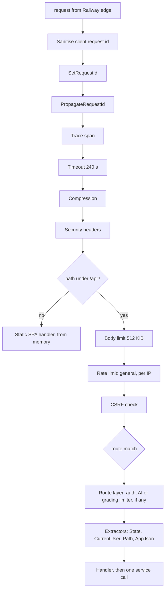
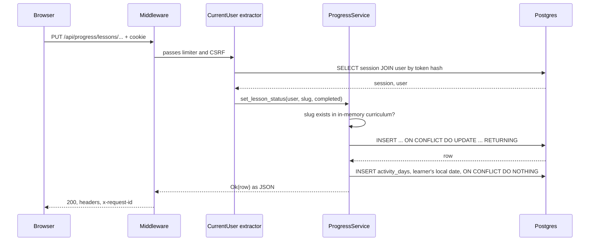

You tap "Mark complete" at the end of a lesson and the button turns green about thirty milliseconds later. In between, the request crossed a TLS terminator, seven layers of middleware wrapped around the whole app, three more wrapped around the API, four extractors, one service, three database round trips and a single function that turns domain errors into status codes, and then went back out through most of those layers in reverse.

Every one of those steps is ordinary. The interesting part is the *order*. Move the request-ID layer inside the tracer and every log line says `request_id=-`. Put the timeout outside the tracer and timed-out requests vanish from your logs. Check the body before the session and you parse JSON for strangers. This lesson follows one real request through `crates/api` in the order the code applies it, and shows what each position buys.

## The request we will follow

```text
PUT /api/progress/lessons/algorithms/sorting-searching/binary-search HTTP/1.1
Host: ascend.example
Origin: https://ascend.example
Cookie: ascend_session=<43 characters of URL-safe base64>
X-Requested-With: fetch
Content-Type: application/json
X-Real-IP: 203.0.113.7

{"status":"completed"}
```

The browser sends everything except the last header. Railway's edge terminates TLS, adds `X-Real-IP` with the address it saw, and forwards plain HTTP to the container on port 8080. From the binary's point of view the request arrives unencrypted from a proxy it trusts, which is why the rate limiter believes `X-Real-IP` and nothing else (the next lessons explain why `X-Forwarded-For` would be a mistake). The `X-Requested-With` header is added by the frontend's API client, `web/src/lib/api.ts`, for the CSRF check you will meet shortly.

On the wire it is an ordinary HTTP/1.1 exchange. Step through one, including the conditional GET that Ascend's lesson endpoints answer with a 304:

```viz
{"type": "network", "scenario": "http-request", "title": "One request and a revalidation", "caption": "Ascend's lesson and curriculum endpoints return an ETag derived from the content version and the build, so a revisit costs a 304 with no body."}
```

## The stack, in the order the code applies it

`crates/api/src/app.rs`, the outer router in `build`:

```rust
Router::new()
    .nest("/api", api)
    .fallback(get(static_handler))
    .layer(middleware::from_fn(security_headers::apply))
    .layer(CompressionLayer::new().br(true).gzip(true))
    .layer(TimeoutLayer::with_status_code(StatusCode::SERVICE_UNAVAILABLE, Duration::from_secs(240)))
    .layer(
        TraceLayer::new_for_http()
            .make_span_with(|req: &Request<Body>| {
                let request_id = req.headers().get("x-request-id").and_then(|v| v.to_str().ok()).unwrap_or("-");
                tracing::info_span!("request", method = %req.method(), uri = %req.uri().path(), request_id)
            })
            .on_response(DefaultOnResponse::new().level(Level::INFO)),
    )
    .layer(PropagateRequestIdLayer::x_request_id())
    .layer(SetRequestIdLayer::x_request_id(MakeRequestUuid))
    // Outermost: a client-supplied id is kept only if it is a UUID, so
    // logs cannot be polluted or correlated with attacker-chosen values.
    .layer(middleware::from_fn(crate::middleware::request_id::sanitise))
    .with_state(state)
```

The rule that makes this readable: **each `.layer()` wraps everything built before it**, so the *last* call is the *outermost* layer. Read the chain bottom-up to get the order a request sees; the response unwinds top-down. The API sub-router, built earlier in the same function, gets its own three layers:

```rust
let api = Router::new()
    .merge(routes::health::router())
    .nest("/auth", routes::auth::router(state.clone()))
    .merge(routes::curriculum::router())
    .merge(routes::problems::router(state.clone()))
    .merge(routes::progress::router())
    .merge(routes::comments::router())
    .merge(routes::coach::router(state.clone()))
    .merge(routes::interviews::router(state.clone()))
    .fallback(api_not_found)
    .layer(middleware::from_fn_with_state(state.clone(), csrf::enforce))
    .layer(middleware::from_fn_with_state(state.clone(), |s, r, n| {
        crate::middleware::rate_limit::limit(crate::middleware::rate_limit::Bucket::General, s, r, n)
    }))
    .layer(DefaultBodyLimit::max(512 * 1024));
```

Put together, the request path looks like this:



### Why each layer sits where it does

| Layer | What it does | Why this position | What breaks if you move it |
|---|---|---|---|
| `request_id::sanitise` | Drops a client-supplied `x-request-id` unless it parses as a UUID | Outermost, before anything reads the header | Inside `SetRequestId`, a forged id such as `<script>` would already have been adopted as the request's id, and removing it afterwards would leave later layers with none |
| `SetRequestId` | Puts a fresh UUID in `x-request-id` if none survived sanitising | Outside everything that logs, so every other layer can read it | Inside `Trace`, every span logs `request_id=-` because `make_span_with` reads the header before it exists |
| `PropagateRequestId` | Copies the id onto the response | Outside the timeout | Inside it, a timed-out request returns without an id, which is exactly the one a user will report |
| `Trace` | One span per request, one INFO line per response with status and latency | Outside the timeout, inside the id | Inside the timeout, a timed-out request's span is dropped and it never logs a response |
| `Timeout` | Returns 503 if the handler has not produced a response within 240 s | Outside compression and headers so it bounds all inner work | Inner layers could hold a connection indefinitely |
| `Compression` | Brotli or gzip by `Accept-Encoding` | Outside the handlers; its default predicate skips `text/event-stream` | SSE tokens would be buffered by the compressor and arrive in lumps |
| `Security headers` | CSP, HSTS, `X-Frame-Options`, `nosniff` on every response it wraps | Innermost of the outer group so it sees routes, SPA, 404s and rejections | Outside `Timeout` it would also decorate the timeout's 503; today it does not |
| `DefaultBodyLimit` | Sets the 512 KiB limit that body extractors enforce | `/api` only; the SPA takes no bodies | Nothing reads bodies outside `/api` |
| Rate limit, general | 1,200 requests per minute per IP, kept in memory per replica | Before CSRF, so rejected cross-site attempts still spend tokens | After it, a flood of CSRF-rejected requests would be free |
| CSRF | Origin and custom-header checks on POST, PUT, PATCH, DELETE | Closest to the routes, after the cheap per-IP check | Before the limiter, it would do work for traffic the limiter was about to drop |

Two subtleties are worth knowing precisely.

**The timeout bounds the response head, not the body.** tower-http's `Timeout` races the inner service's response future against a sleep. A streaming coach reply returns its headers immediately and then streams for as long as the model talks, so the 240 s limit never cuts an SSE stream. It exists for the slow non-streaming AI calls (quiz generation, interview evaluation). An earlier version answered with tower-http's default, 408 Request Timeout; HTTP lets a client that receives 408 repeat the request, which is the wrong signal for a server-side deadline on a POST, and a code review changed it to 503. The Anthropic client's own timeout is 180 s by default, *inside* the 240 s, so the specific `AiUpstream` error fires first and the generic timeout is a backstop. Inner deadlines shorter than outer ones is the general rule.

**The body limit is not middleware in the usual sense.** `DefaultBodyLimit` reads nothing; it stores a limit in the request that body-consuming extractors such as `Json` enforce when they buffer the body. A handler with no body extractor is unaffected, and so is every route outside `/api`.

Route-level layers sit inside all of this. `routes/auth.rs` wraps only `/register` and `/login` in a tighter `Bucket::Auth` limiter (30 per minute per IP), the routes that call the model (coach messages, quiz generation, roadmap suggestions, interview turns, the interview assistant and grading) are wrapped in `Bucket::Ai`, 20 per minute per session, and `POST /api/submissions`, which runs code on the server, in `Bucket::Grade`, also 20 per minute per session. Those three buckets live in Postgres, so every replica charges the same allowance; the general bucket stays in process memory, deliberately loose, because a whole class can share one NAT address and every expensive route has its own bucket. A login therefore spends one token from the general bucket *and* one from the auth bucket, and the handler then charges one password attempt to the account it names, or to the browser's own bucket if it is a known device for that account, a limiter the next lesson covers.

A rejection short-circuits. When the rate limiter returns 429, nothing inside it runs (no CSRF check, no handler), but everything outside it still runs on the way out: the 429 carries a request ID, security headers and a log line. The exercise makes that onion explicit.

```exercise
id: middleware-onion
title: Trace a request through the onion
prompt: |
  Axum applies `.layer()` calls so that the **last** call is the outermost layer, and a nested router's layers sit inside its parent's.

  `groups` lists routers from outermost to innermost (for example the root router, then the `/api` router, then a route's own layers). Within each group the names appear in the order `.layer()` was called in the source. `reject_at` is the name of a layer that short-circuits with an error response, or `null`/`None` if nothing rejects.

  Return the list of events: `"in:<name>"` when the request enters a layer, `"handler"` if the handler runs, and `"out:<name>"` as the response leaves a layer. A rejecting layer is entered, produces the response itself and is then left; layers inside it never run.
languages: [python, javascript]
entry: trace_request
starter:
  python: |
    def trace_request(groups, reject_at):
        # your code here
        return []
  javascript: |
    function trace_request(groups, reject_at) {
      // your code here
      return [];
    }
tests:
  - args: [[["a", "b"]], null]
    expected: ["in:b", "in:a", "handler", "out:a", "out:b"]
    label: last layer call is outermost
  - args: [[["a", "b"], ["c"]], null]
    expected: ["in:b", "in:a", "in:c", "handler", "out:c", "out:a", "out:b"]
    label: nested router sits inside
  - args: [[["a", "b"], ["c"]], "a"]
    expected: ["in:b", "in:a", "out:a", "out:b"]
    label: rejection short-circuits
  - args: [[[]], null]
    expected: ["handler"]
    label: no layers at all
  - args: [[["a", "b"]], "b"]
    expected: ["in:b", "out:b"]
    hidden: true
    label: outermost layer rejects
  - args: [[["security_headers", "compression", "timeout", "trace", "propagate_request_id", "set_request_id", "sanitise_request_id"], ["csrf", "rate_limit", "body_limit"]], "rate_limit"]
    expected: ["in:sanitise_request_id", "in:set_request_id", "in:propagate_request_id", "in:trace", "in:timeout", "in:compression", "in:security_headers", "in:body_limit", "in:rate_limit", "out:rate_limit", "out:body_limit", "out:security_headers", "out:compression", "out:timeout", "out:trace", "out:propagate_request_id", "out:set_request_id", "out:sanitise_request_id"]
    hidden: true
    label: Ascend's stack returning a 429
  - args: [[["security_headers", "compression"], ["csrf", "rate_limit_general"], ["rate_limit_auth"]], null]
    expected: ["in:compression", "in:security_headers", "in:rate_limit_general", "in:csrf", "in:rate_limit_auth", "handler", "out:rate_limit_auth", "out:csrf", "out:rate_limit_general", "out:security_headers", "out:compression"]
    hidden: true
    label: a login passes two limiters
hints:
  - "Flatten the groups outermost-first, reversing each group because the last `.layer()` call is its outermost layer."
  - "Walk inward emitting `in:` events and remember what you entered; stop early at `reject_at`."
  - "Unwind the entered layers in reverse order with `out:` events."
```

## Extractors: authentication as a type

After routing, Axum runs the handler's arguments left to right. Every argument but the last must be extractable from the request *parts* (method, URI, headers, extensions); only the last may consume the body. For `set_lesson` the order is `State`, `CurrentUser`, `Path`, `AppJson`, and that order is policy: an unauthenticated request with a malformed body gets 401, not a JSON parse error, because the session is checked before a single byte of the body is read.

`CurrentUser` and `MaybeUser` share one resolver, `crates/api/src/extractors.rs`:

```rust
/// Sessions are resolved once per request and cached in extensions, so a
/// handler using both extractors still costs one lookup.
async fn resolve(parts: &mut Parts, state: &AppState) -> Result<Option<User>, ApiError> {
    if let Some(cached) = parts.extensions.get::<MaybeUser>() {
        return Ok(cached.0.clone());
    }
    let jar = CookieJar::from_headers(&parts.headers);
    let user = match jar.get(SESSION_COOKIE) {
        Some(cookie) => state.auth.authenticate(cookie.value()).await?,
        None => None,
    };
    parts.extensions.insert(MaybeUser(user.clone()));
    Ok(user)
}
```

`CurrentUser` turns `None` into `AppError::Unauthorized` (401); `MaybeUser` never fails, which is how `GET /api/roadmap` personalises for signed-in learners and still works for everyone else. The lookup itself is one primary-key query on `sessions` joined to `users`, plus an update of `last_seen_at` at most once an hour; [Authentication and security](/learn/case-study-ascend/the-system/authentication-and-security) covers what the token is and why only its hash is stored.

**The rejected alternative** is an authentication middleware that resolves the session for every `/api` request and attaches the user. It is common and it is simpler to reason about, but most of Ascend's traffic is public (curriculum, lessons, problems, search), and that middleware would add a database query to every one of them. The extractor is *lazy*: only handlers that name a user pay for one. **The failure mode it prevents** is putting Postgres on the hot read path that was designed to avoid it.

**What it costs.** Authentication is opt-in per handler. A new mutating endpoint that forgets `CurrentUser` is public, and nothing but review and tests catches it; a `route_layer` that requires a session for a whole group of routes would make the safe choice the default. And because middleware runs before extractors, the rate limiter cannot ask who the user is. For a long time that meant every limiter was keyed by IP. The AI limiter now sidesteps the problem without authenticating anyone: it keys on a 16-byte SHA-256 digest of the session cookie, falling back to the IP when there is no cookie. The grading limiter uses the same key. That is safe precisely because of the order. A forged cookie earns a fresh bucket, but only for a request the `CurrentUser` extractor then rejects with 401 before any model or sandbox runs, and it still pays the per-IP general bucket on the way in.

### Where authentication can run

| Option | Session queries on public reads | Safe by default for a new route | Limiter can key by user | Cost |
|---|---|---|---|---|
| Middleware on all of `/api` | One per request, including lessons and search | Yes | Yes, it runs first | Postgres on the hottest path |
| Lazy extractor (Ascend) | None | No: a handler without `CurrentUser` is public | No; a cookie digest stands in | Review and tests must catch a forgotten extractor |
| `route_layer` requiring a session per router group | None outside the group | Yes, inside the group | Only inside the group | Routers split by audience, public and private |

The third row is the one to move to as the surface grows: it keeps the public paths free and makes the private default safe. If the layer stores its result in the same `MaybeUser` extension that `resolve` caches in, a handler that also names `CurrentUser` does not pay for a second lookup.

## Thin routes

The progress router, `crates/api/src/routes/progress.rs`, is the whole HTTP surface for progress and quizzes:

```rust
pub fn router() -> Router<AppState> {
    Router::new()
        .route("/progress", get(summary))
        .route("/progress/lessons/{track}/{module}/{lesson}", put(set_lesson))
        .route("/progress/modules/{track}/{module}", put(set_module))
        .route("/quizzes/{track}/{module}/{lesson}/grade", post(grade))
        .route("/quizzes/{track}/{module}/{lesson}/generated", post(record_generated))
}
```

Each handler behind it parses input, calls one service method, and maps the result; none touches the database. Keeping them that way is what lets `crates/core` be tested and reused without HTTP, and it is what would let you move a service into a worker process at 100x without rewriting endpoints. The rejected alternative, fat handlers that validate, query and compute inline, is faster to write for the first ten endpoints and then duplicates rules across the next thirty.

Honest exceptions exist. The coach's `send` handler spawns a task, pumps a model stream into a channel and returns an SSE response: that orchestration is a transport concern, so it lives in `routes/sse.rs` rather than the domain, and it is covered in [Building the AI coach](/learn/case-study-ascend/product-systems/building-the-ai-coach). The roadmap handler calls two services (progress summary, then roadmap build). A useful review heuristic: when a handler calls two services, ask whether a service method is missing.

Here is the full round trip for our request, including all three database round trips:



In the same region each database round trip is roughly a millisecond, so the three cost a few milliseconds; most of the thirty goes on the network between the browser and the edge, and the ten layers of middleware cost microseconds. The count has moved twice, and both moves were deliberate. An earlier version of the service ran the upsert and then re-read the row with a separate `SELECT`; returning the row from the upsert itself removed a round trip from the most frequent write in the product. Then the streak fix added one back: the activity-log insert that makes streaks correct ([Data and migrations](/learn/case-study-ascend/the-system/data-and-migrations)). One millisecond for correct streaks is a good trade; if it ever was not, a data-modifying CTE could send both writes as one statement.

## From AppError to HTTP

The domain speaks in *semantic* errors, `crates/core/src/error.rs`:

```rust
#[derive(Debug, thiserror::Error)]
pub enum AppError {
    #[error("{0}")]
    Validation(String),
    #[error("authentication required")]
    Unauthorized,
    #[error("forbidden")]
    Forbidden,
    #[error("{0} not found")]
    NotFound(&'static str),
    #[error("{0}")]
    Conflict(String),
    #[error("rate limit exceeded: {message}")]
    RateLimited {
        message: String,
        /// When a retry can succeed, if known; sent as `Retry-After`.
        retry_after_secs: Option<u64>,
    },
    #[error("AI features are not configured on this deployment")]
    AiDisabled,
    /// A capacity or configuration problem on our side; the request itself
    /// was fine.
    #[error("{message}")]
    Unavailable {
        message: String,
        /// When a retry can succeed, if known; sent as `Retry-After`.
        retry_after_secs: Option<u64>,
    },
    #[error("upstream AI provider error: {0}")]
    AiUpstream(String),
    #[error("database error")]
    Database(#[from] sea_orm::DbErr),
    #[error("internal error: {0}")]
    Internal(String),
}
```

Each variant also has a stable machine code (`validation_error`, `not_found`, `rate_limited`, …). The API maps variants to statuses in exactly one place, `crates/api/src/error.rs`:

```rust
let status = match &e {
    AppError::Validation(_) => StatusCode::UNPROCESSABLE_ENTITY,
    AppError::Unauthorized => StatusCode::UNAUTHORIZED,
    AppError::Forbidden => StatusCode::FORBIDDEN,
    AppError::NotFound(_) => StatusCode::NOT_FOUND,
    AppError::Conflict(_) => StatusCode::CONFLICT,
    AppError::RateLimited { .. } => StatusCode::TOO_MANY_REQUESTS,
    AppError::AiDisabled | AppError::Unavailable { .. } => StatusCode::SERVICE_UNAVAILABLE,
    AppError::AiUpstream(_) => StatusCode::BAD_GATEWAY,
    AppError::Database(_) | AppError::Internal(_) => StatusCode::INTERNAL_SERVER_ERROR,
};
// Internal details are logged, never returned.
let message = match &e {
    AppError::Database(inner) => {
        tracing::error!(error = %inner, "database error");
        "internal error".to_string()
    }
    AppError::Internal(inner) => {
        tracing::error!(error = %inner, "internal error");
        "internal error".to_string()
    }
    other => other.to_string(),
};
let mut res = (status, Json(ErrorBody { code: e.code(), message })).into_response();
if let AppError::RateLimited { retry_after_secs: Some(secs), .. }
| AppError::Unavailable { retry_after_secs: Some(secs), .. } = e
{
    res.headers_mut().insert(axum::http::header::RETRY_AFTER, secs.max(1).into());
}
```

The client always receives `{"code": "...", "message": "..."}`, and the frontend branches on `code` (`e.code === "rate_limited"`), never on English text. Database and internal errors are logged with full detail inside the request's span, so the log line carries the request ID the user can quote, while the response says only "internal error".

**Rejected alternatives** (the general design space is in [API and error design](/learn/senior-craft/software-craft/api-and-error-design)). `anyhow` all the way up makes every failure a 500 and loses the difference between "no such lesson" and "Postgres is down". Choosing status codes inside each handler produces thirty slightly different conventions. Passing database errors through leaks constraint names, column names and SQL fragments to anyone who can trigger them. **The failure mode prevented** is both inconsistency and information disclosure, fixed in one function, and pinned by a unit test, `internal_details_are_not_returned`, that builds an `Internal` error containing a connection string and asserts the response body does not contain it.

The same rule reaches upstream errors through one constructor. `AiUpstream(String)` used to be built from whatever the provider or the HTTP client said, so a reqwest error or a JSON parse failure (which can quote the text it choked on) went straight into the response. Now every call site uses `AppError::ai_upstream(public, detail)`, which logs `detail` and keeps only the short `public` text, such as "could not reach the AI provider". A variant that carries a message is a promise that the message is safe to show; a constructor that separates the two is how you keep that promise at every call site.

**Where the contract leaked.** When this module was first drafted, reading rather than testing found four gaps between the error contract as designed and as enforced. Three have since been closed, and each fix is worth reading as a before and after.

1. *Misclassification.* Registration used to check for an existing email and then insert. Two simultaneous registrations for the same address both passed the check, and the second insert hit the unique index. That error was a `DbErr`, so the loser saw 500 `database_error` instead of 409. The one-place mapping is only as good as the classification feeding it. The fix classifies at the source: `AuthService::register` now hashes the password first, inserts, and maps `SqlErr::UniqueConstraintViolation` to `AppError::Conflict`, so the race ends in a clean 409 (the test fires four registrations for one email at once and expects one 200 and three 409s). Hashing first also removed a timing difference the check-first version had, which the next lesson explains.
2. *Framework rejections, and then statuses.* Axum's own extractor rejections respond with plain-text bodies, not the `{code, message}` shape, which is why the frontend's `api.ts` falls back to `err.code ?? "http_error"`. The first fix introduced `AppJson<T>`, a derived wrapper over `Json<T>` whose rejection converted into `AppError::Validation`. That fixed the shape and broke the status: a body with a syntax error, one over the 512 KiB limit and one without a JSON content type all answered 422. The current `JsonError` keeps both:

   ```rust
   // crates/api/src/extractors.rs
   impl From<axum::extract::rejection::JsonRejection> for JsonError {
       fn from(rejection: axum::extract::rejection::JsonRejection) -> Self {
           Self { status: rejection.status(), message: format!("invalid request body: {}", rejection.body_text()) }
       }
   }
   ```

   and its `IntoResponse` picks a code from the status: 400 `bad_request` for malformed JSON, 413 `payload_too_large`, 415 `unsupported_media_type`, and 422 `validation_error` only for well-formed JSON of the wrong shape. The difference matters to clients: a 400 means "your bytes are broken", a 422 means "your fields are wrong", and a client that treats them alike cannot tell a serialisation bug from a form error. `malformed_json_uses_the_api_error_shape` now asserts 400. `Path` and `Query` rejections still answer in plain text, and two coach handlers still take an optional body through Axum's own `Json`.
3. *Retry hints.* The middleware's 429 always said `Retry-After: 60`, though the general bucket refilled far faster. GCRA, the algorithm behind every bucket, knows exactly when the next request would be allowed, and the middleware now says so, rounded up to whole seconds (`throttled_responses_say_when_to_retry` checks the header). The client uses it: `web/src/main.tsx` retries failed *queries* on 429, 5xx and network errors, waiting as long as `Retry-After` asks (at most ten seconds), and never retries a mutation. The 429s that come from the domain rather than the middleware used to carry no hint at all, because `RateLimited(String)` had nowhere to put one, even though the AI budget knows exactly when it resets. The variant now carries `retry_after_secs`, the mapping above turns it into the header, the budget fills it with the seconds until the next UTC midnight, and a provider's own 429 asks for 30 seconds. The fix was a type change, not a header tweak: once the domain error could express "when", every producer could say it and one place could send it (`rate_limited_errors_carry_retry_after_when_known` pins the mapping). The newest variant reused the idea: `Unavailable` arrived with server-side grading, and when every sandbox slot stays busy for 20 seconds it answers 503 with `Retry-After: 5`. It says the server cannot do the work right now, which is different from `RateLimited` (the client is sending too much), and a client that can tell them apart knows whether slowing down will help.
4. *The timeout is outside everything.* Still open. The timeout's 503 has an empty body and, because it is produced outside the security-headers layer, no CSP or HSTS header. The status is honest; the shape is not.

## The way back out, and the 100x view

The handler's `Json(row)` becomes a response and unwinds: through the CSRF and rate-limit layers untouched, gains security headers, is compressed if the browser accepted Brotli or gzip, passes the timeout, is logged by `Trace` with its status and latency, and leaves with `x-request-id` attached. In production the log is one JSON line per request carrying that ID, which is the whole observability story today.

At 100x the order stays and the parameters change:

- **Per-route deadlines.** A single 240 s timeout is sized for the slowest AI endpoint and applied to everything. A stuck query on an ordinary route can hold one of the pool's 20 connections for four minutes; twenty of those and every route waits the pool's 5 s acquire timeout and fails. Give CRUD routes deadlines of a few seconds, set a Postgres `statement_timeout`, and keep long deadlines for the AI routes only.
- **Load shedding.** A concurrency limit in front of the database-backed routes fails fast under overload instead of queueing until the timeout.
- **Traces as well as IDs.** Replace the request ID with W3C trace context and export spans (OpenTelemetry), so a slow request shows which of its queries was slow ([Observability in code](/learn/senior-craft/software-craft/observability-in-code) covers the instrumentation). The sanitiser already has the right shape for this: accept a propagated identifier only when it is well formed, generate one otherwise.

## Failure modes

| Failure | Symptom | Diagnosis | Fix |
|---|---|---|---|
| `SetRequestId` moved inside `Trace` | Every log line reads `request_id=-`; users quote ids that match nothing | `make_span_with` reads the header before the layer that sets it has run | Id layers outermost; `request_ids_are_server_controlled` pins the sanitiser, not the order, so add an assertion on a log line |
| A new mutating endpoint without `CurrentUser` | Anonymous writes succeed; rows with no owner, or a 500 when the service expects one | An integration test that calls every non-GET route without a cookie and expects 401 | A `route_layer` that requires a session for the private router group |
| One slow query with no `statement_timeout` (none is set today) | Every route, including health checks, fails after exactly 5 s | Pool acquire timeouts in the logs; `pg_stat_activity` shows 20 busy connections running the same statement | `statement_timeout` for the app role, per-route deadlines of a few seconds, 240 s only on AI routes |
| The global timeout fires | A 503 with an empty body and no CSP or HSTS; the frontend shows its generic `http_error` | The `Trace` line shows status 503 and a latency of 240,000 ms | Produce the timeout inside the security-headers layer, with the API's `{code, message}` body |
| A database error returned verbatim | Constraint and column names in a response body | `internal_details_are_not_returned` fails, or a scanner finds SQL text in a 500 | One mapping function; `Database` and `Internal` log the detail and say "internal error" |

## Interviewer follow-ups

**"Why does the general rate limiter sit outside the CSRF check?"** Model answer: every rejection should cost the attacker a token. Outside CSRF, a flood of cross-site POSTs is throttled like any other traffic; inside it, rejected requests would be free, and the CSRF layer would do work for traffic the limiter was about to drop. Common wrong answer: "order does not matter, both reject bad requests", which ignores who pays for a rejection.

**"You resolve sessions lazily. How can the AI limiter be per user if middleware runs before extractors?"** Model answer: it keys on the first 16 bytes of a SHA-256 of the session cookie, falling back to the IP. A forged cookie gets a fresh bucket, but the `CurrentUser` extractor then answers 401 before any model call, and the request has already spent a token from the per-IP general bucket, so forging buys nothing. Common wrong answer: "look the user up in the middleware", which puts a query on every request the limiter sees.

**"A learner reports a 503 after exactly four minutes on quiz generation. Walk me through it."** Model answer: 240 s is the outer `TimeoutLayer`; the AI client's own timeout is 180 s and would have produced a 502 `ai_upstream` first, so the model call was not the slow part. Find the request id's log line, then look at what else the handler awaited: a pool acquire is bounded at 5 s, a statement is not. Common wrong answer: "raise the timeout", which hides the unbounded wait and holds a pool connection longer.

**"Why does malformed JSON get 400 while a missing field gets 422?"** Model answer: they are different client bugs. 400 says the bytes are not JSON, a serialisation fault; 422 says valid JSON has the wrong fields, a form or contract fault. `JsonError` keeps the rejection's own status (400, 413, 415) and uses 422 only for shape errors, and `malformed_json_uses_the_api_error_shape` asserts it. Common wrong answer: "any 4xx will do", which leaves a client unable to tell its serialiser from its validation.

## What mid-level engineers get wrong

- **Reading a `.layer()` chain top-down.** The last call is the outermost layer; reading it the other way puts the timeout in the wrong place in every argument that follows.
- **Authenticating in middleware for every request.** It adds a database query to reads that were designed to come from memory.
- **One global deadline.** A 240 s limit sized for AI calls lets a stuck CRUD query hold one of 20 pooled connections for four minutes.
- **Using 408 for a server-side deadline.** It invites the client to repeat a POST.
- **Formatting a database error into the response.** It leaks schema detail to anyone who can trigger it.
- **Trusting the first `X-Forwarded-For` entry.** The client wrote it; only a header the proxy sets and overwrites, such as Railway's `X-Real-IP`, identifies the connection.

## Senior signals

- You can read an Axum (or Tower, or Express) middleware chain and state the request order without running it, and explain what each position protects.
- You put request IDs outermost, logging outside timeouts, and inner deadlines shorter than outer ones, and you can say what breaks otherwise.
- You treat extractor order as policy: authenticate before parsing bodies, and make the safe default (auth required) the easy one.
- You know that lazy per-request auth keeps public hot paths off the database, that it stops middleware from keying limits by an authenticated user, and how keying on a cookie digest sidesteps that safely.
- You map domain errors to HTTP in one place, log internals with the request ID, and then look for the leaks: misclassified database errors, framework rejections that lose their status, and timeouts that bypass the contract.
- You size timeouts per route rather than globally, and you know which status codes invite automatic retries.

## Check yourself

```quiz
- q: >-
    An Axum router is built as Router::new().route(...).layer(A).layer(B). Which layer does an incoming request reach first, and which layer does the response leave last?
  options: ["B first, and the response leaves A last", "B first, and the response leaves B last", "A first, and the response leaves A last", "A first, and the response leaves B last"]
  answer: 1
  explanation: >-
    Each .layer() wraps everything built before it, so B wraps A. The request enters B, then A, then the route; the response leaves A, then B. Reading the chain bottom-up gives the request order, and the response unwinds in the reverse.
- q: >-
    The general rate limiter rejects a request with 429. Which statement about that response is true in Ascend's stack?
  options: ["It carries a request id and security headers and is logged; those layers are outside", "It skips compression and the security headers, because a rejection bypasses the router", "It is not logged, because the Trace layer only records responses that succeeded", "It has no x-request-id, because the handler that would have set one never ran"]
  answer: 0
  explanation: >-
    A rejection short-circuits only the layers inside the limiter (CSRF, extractors, handler). Everything outside it, including SetRequestId, PropagateRequestId, Trace, Compression and the security-headers layer, still processes the response on the way out. The request id is set by middleware, not by handlers.
- q: >-
    Why does the Anthropic client use a 180 s timeout when the global TimeoutLayer is 240 s?
  options: ["It is an accident, and the two numbers should be made to match", "Railway requires every request to finish in under 200 seconds", "The client timeout only applies to streaming responses anyway", "The inner deadline fires first, so the specific AI error wins out"]
  answer: 3
  explanation: >-
    When the inner deadline fires first, the domain can classify the failure and return AiUpstream (502 with a clear code) instead of the generic 503 with an empty body. If the outer one fired first, the domain would never know. The global layer is a backstop; inner deadlines shorter than outer ones is the general rule.
- q: >-
    Ascend resolves sessions in an extractor rather than in a middleware that runs for every /api request. What is the main benefit, and what is the main cost?
  options: ["Benefit: public reads skip the session query. Cost: opt-in auth per handler", "Benefit: CSRF checks are no longer needed. Cost: logins become slower", "Benefit: sessions are cached across requests. Cost: a revoked session may go stale", "Benefit: fewer lines of code. Cost: none worth naming in review"]
  answer: 0
  explanation: >-
    The extractor is lazy, so only handlers that name CurrentUser or MaybeUser pay for a lookup, which keeps public hot paths off Postgres. The flip side is that a handler that forgets CurrentUser is public, and middleware such as the rate limiter cannot ask who the user is. Sessions are resolved per request, never cached across requests.
- q: >-
    Two registrations for the same new email arrive at the same moment. What does the losing client receive today, and why is the password hashed before the insert?
  options: ["422, because the second request fails validation once the email is already claimed", "409: the unique violation maps to Conflict, and hashing first equalises timing", "It waits, because the insert blocks on the first transaction until the timeout", "500, because a unique violation is a database error, and all of those map to 500"]
  answer: 1
  explanation: >-
    The service lets the unique index decide and maps SqlErr::UniqueConstraintViolation to AppError::Conflict, so the race ends in a 409. Before the fix, a check-then-insert let both requests pass the check and the loser's DbErr surfaced as a 500. Hashing first also removes the fast path that made already-registered emails answer about 100 ms sooner.
- q: >-
    An unauthenticated client sends PUT /api/progress/lessons/a/b/c with a malformed JSON body and a valid X-Requested-With header. Which status does it get, and why?
  options: ["401, because CurrentUser is extracted before the body is read", "400, because the body is parsed first and it is not valid JSON", "403, because the CSRF check rejects bodies that fail to parse", "422, because validation of the body runs before authentication"]
  answer: 0
  explanation: >-
    Extractors run left to right and CurrentUser precedes AppJson in the handler signature, so the session is checked before a byte of the body is read. An authenticated client with the same body would get 400 bad_request. Rejecting strangers first is cheaper and reveals nothing about the expected payload.
```
