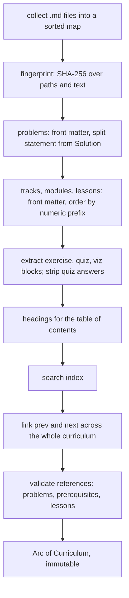

Ascend's curriculum is about 9 MB of Markdown: hundreds of lessons and 180 practice problems, each with YAML front matter and embedded quizzes, exercises and visualisations. Whatever system serves it has to satisfy five requirements at once. Content must be *reviewable* like code, *validated* before it reaches a learner (a broken quiz is a bug report), *fast* to serve (it is the hottest read path), *consistent* with the code that renders it, and it must not leak quiz answers to anyone who opens the network tab.

Most teams reach for a CMS or a content table in the database. Ascend compiles the Markdown into the executable, parses it once at boot into an immutable graph, and serves every lesson from memory. This lesson reads that engine (`crates/core/src/content`), the choices behind it, and the places where it is weaker than it looks.

## Content as code

`crates/core/src/content/loader.rs`:

```rust
static EMBEDDED: Dir<'static> = include_dir!("$CARGO_MANIFEST_DIR/../../content");

#[derive(Debug, Clone)]
pub enum ContentSource {
    Embedded,
    Disk(std::path::PathBuf),
}
```

`include_dir!` reads the whole `content/` directory at compile time and bakes it into the binary's read-only data. In production the loader reads that embedded tree; locally, `CONTENT_DIR=./content` reads the same files from disk so an author can edit a lesson and restart without recompiling. Both sources are first flattened into a sorted map of `(relative path, text)` pairs, so the parser never touches a filesystem and there is exactly one code path to test.

**The rejected alternative** is a CMS or a content table (ADR 0001). A CMS lets non-developers edit, but content then needs its own migrations, backups and synchronisation with the code that renders it, and edits bypass review and CI. **The failure modes this prevents** are specific: "the lesson references a problem that does not exist in production", "the renderer expects a field the content service has not deployed yet", and "someone fixed a typo and broke a quiz". With content in the same commit as the code, a reviewed pull request is the only way to change either, and the same build validates both.

**What it costs.** Every content change is a deploy, about a minute with cached dependency layers. A typo fix cannot be hot-patched. The binary carries the raw Markdown and the process holds the parsed curriculum in memory (tens of megabytes at most, which is cheap). And editing requires Git, which is fine while the authors are engineers and becomes the first thing to revisit if they stop being.

## The pipeline, once at boot



A few decisions hide in that diagram:

- **Identity comes from front matter, order from directory names.** `03-binary-search.md` sorts third because `order_of` parses the prefix, but the lesson's identity is the `slug:` inside the file, and progress rows reference `track/module/lesson` slugs. Renumbering files is free; renaming a slug orphans every learner's progress for that lesson, which is why the authoring guide calls slugs "stable forever". Nothing in the code enforces that.
- **Problems load first** so that a lesson's `problems:` list can be checked while the lesson is parsed.
- **The editorial is split off** at the first `## Solution` heading and marked `#[serde(skip)]`, so it only leaves the server through `GET /api/problems/{slug}/solution`, which requires a session.
- **The result is immutable.** Every request clones an `Arc<Curriculum>` (one atomic increment) and does hash lookups. There are no locks because nothing ever writes.

## Blocks inside Markdown

Interactive components are ordinary fenced code blocks whose info string is `exercise`, `quiz` or `viz`. The extractor in `crates/core/src/content/blocks.rs` finds them with one regular expression:

```rust
static FENCE: LazyLock<Regex> = LazyLock::new(|| {
    // Matches ```lang\n...\n``` (non-greedy, multiline). Info string may carry
    // attributes after the language, which we ignore.
    Regex::new(r"(?ms)^```(exercise|quiz|viz)[^\n]*\n(.*?)^```[ \t]*$").expect("static regex")
});
```

Reusing fences instead of inventing a directive syntax means every Markdown editor, GitHub's preview and the raw file all stay readable, and the frontend only special-cases three info strings. Each block is parsed (YAML for exercises and quizzes, JSON for visualisations) and **re-emitted as canonical JSON** into the body the client receives. The quiz arm is the security-relevant one:

```rust
"quiz" => {
    if out.quiz.is_some() {
        return Err(BlockError::MultipleQuizzes { file: file.into() });
    }
    let questions: Vec<QuizQuestion> =
        serde_yaml_ng::from_str(inner).map_err(|source| BlockError::Quiz { file: file.into(), source })?;
    validate_quiz(file, &questions)?;
    let spec = QuizSpec { questions };
    public.push_str("```quiz\n");
    public.push_str(&serde_json::to_string(&spec.public()).expect("serialisable"));
    public.push_str("\n```");
    out.quiz = Some(spec);
}
```

`validate_quiz` rejects malformed questions before anything is emitted (more on that below), and `spec.public()` keeps only questions and options. The full spec, with answers and explanations, is stored on the `Lesson` in a field marked `#[serde(skip)]`, so it cannot be serialised by accident, and `POST /api/quizzes/{track}/{module}/{lesson}/grade` compares the learner's choices server-side. The integration test `lesson_payload_hides_quiz_answers` asserts that neither `"answer"` nor an explanation string appears in the lesson payload.

Re-emitting JSON has two further benefits. YAML's traps (an unquoted colon, a stray `#`) are caught once, at build time, with a file name in the error, instead of in a learner's browser. And the frontend bundle needs a JSON parser, which it already has, rather than a YAML one.

### What "hidden" means

Be precise about the trust model. Quiz answers are hidden *until the first graded attempt*, whose response includes every answer and explanation. Exercise tests and practice-problem tests, including those marked `hidden: true`, are sent to the browser in full, because the browser is what runs them (ADR 0003). "Hidden" means "not displayed before you submit", not "secret". That is the right call for a practice product where a learner who cheats only cheats themselves; the day Ascend adds leaderboards or certificates, hidden tests must move to server-side execution, and the ADR says so.

### Where a regex parser bites

The extractor is not a Markdown parser. It does not know that a fence can be nested inside a longer fence, so a documentation example that starts a line with three backticks followed by `quiz`, inside a four-backtick fence, is extracted as a real quiz; an info string such as `quizzes` also matches, because the pattern allows trailing text. The heading scanner toggles its in-fence state on any line that starts (after indentation) with three backticks, and ignores tilde fences. This lesson was written around those rules: it never starts a line with that sequence except for its own quiz.

Why accept it? The failure modes are loud. A mis-extracted block almost always fails YAML parsing or trips the "more than one quiz block" check, so the build breaks with a file name rather than shipping something subtly wrong. A CommonMark event parser would be correct by construction, and `pulldown-cmark` is already listed in the workspace manifest, unused. Swapping it in is the right move the first time a silent mis-parse happens, not before.

## Heading anchors: two slugifiers, then one algorithm

The table of contents is computed server-side: `headings` scans the lesson body for `##` and `###` lines outside code fences and gives each an id, and the lesson page renders them as `href="#id"` links. The browser gives the rendered headings their ids independently, with `rehype-slug` in `web/src/components/Markdown.tsx`. Two components derive the same value, and until the latest fix commit they derived it differently.

### Before: a slugifier that looked right

```rust
// crates/core/src/content/blocks.rs, before 7154e9f
pub fn slugify(text: &str) -> String {
    let mut s = String::with_capacity(text.len());
    let mut prev_dash = false;
    for ch in text.chars() {
        if ch.is_alphanumeric() {
            s.extend(ch.to_lowercase());
            prev_dash = false;
        } else if !prev_dash && !s.is_empty() {
            s.push('-');
            prev_dash = true;
        }
    }
    s.trim_end_matches('-').to_string()
}
```

It kept letters and digits, lowercased them, turned any run of other characters into one hyphen and trimmed the ends. Its doc comment said the ids "follow the same rule the frontend uses". They did not. `rehype-slug` uses the `github-slugger` algorithm: lowercase, *delete* punctuation, turn *each* space into a hyphen, keep underscores, and append `-1`, `-2` to repeated headings. Run both on real headings:

| Heading text | Old backend id (TOC link) | Browser id (DOM) |
|---|---|---|
| `Big-O: the intuition` | `big-o-the-intuition` | `big-o-the-intuition` |
| `Why O(1) is a lie` | `why-o-1-is-a-lie` | `why-o1-is-a-lie` |
| `snake_case vs kebab-case` | `snake-case-vs-kebab-case` | `snake_case-vs-kebab-case` |
| `C++ & Rust` | `c-rust` | `c--rust` |
| Second heading named `Example` | `example` | `example-1` |

Plain-word headings agreed, which is why nobody noticed and why the only unit test (on `Big-O: the intuition`) passed. Any heading with parentheses, underscores, symbols between words or a repeated name produced a TOC link that silently went nowhere: the learner tapped it and nothing happened. Across more than three hundred lessons written by many authors, that is not an edge case.

### After: port the algorithm exactly, then test the seam

```rust
// crates/core/src/content/blocks.rs
#[derive(Default)]
pub struct Slugger {
    seen: std::collections::HashMap<String, usize>,
}

impl Slugger {
    pub fn slug(&mut self, text: &str) -> String {
        let base = slugify(text);
        let mut result = base.clone();
        while self.seen.contains_key(&result) {
            let n = self.seen.entry(base.clone()).or_insert(0);
            *n += 1;
            result = format!("{base}-{n}");
        }
        self.seen.insert(result.clone(), 0);
        result
    }
}

/// Characters github-slugger removes: everything except alphabetic
/// characters, combining marks, decimal digits, connector punctuation
/// (`_`, `‿`), spaces and hyphens. Superscripts, fractions and emoji go.
static SLUG_STRIP: LazyLock<Regex> =
    LazyLock::new(|| Regex::new(r"[^\p{Alphabetic}\p{M}\p{Nd}\p{Pc} -]").expect("static regex"));

/// One slug without de-duplication (see [`Slugger`] for documents), exactly
/// as github-slugger computes it: lowercase, strip, then spaces to hyphens.
pub fn slugify(text: &str) -> String {
    SLUG_STRIP.replace_all(&text.to_lowercase(), "").replace(' ', "-")
}
```

Three details make it exact rather than close. First, the input is the *rendered* text: `plain_heading_text` strips link targets, emphasis markers, backticks and `$`, so a heading written as ``The `Vec` type`` is slugged from "The Vec type", which is what the browser sees. Second, de-duplication counts headings at every level, `#` through `######`, because `rehype-slug` numbers every heading on the page although the TOC lists only `##` and `###`; a unit test pins a document where an `h4` named Summary pushes the next `h3` to `summary-2`. Third, the `while` loop in `slug` handles a trap: in a document with headings `a`, `a-1` and `a`, the third must become `a-2`, because `a-1` is already a real heading.

Then the fix tested the seam, not just the function. `heading_ids_match_github_slugger` pins the cases where the old algorithm disagreed, and the Playwright crawl (`web/e2e/crawl.spec.ts`) now opens every lesson in a real browser and checks that every table-of-contents link lands on an element with that id. The crawl takes long enough that it runs on demand (`CRAWL=1`) rather than on every push, so between crawls the unit tests are the guard.

### And after that: the port that was only nearly exact

The seam test earned its keep at once. The first port kept a character when Rust's `char::is_alphanumeric` said so, and translated github-slugger's rule from its README ("letters and digits") rather than from its code. The next full crawl, 597 pages, found three links that still went nowhere, in headings such as "Pivot choice and the O(n²) adversary" and "Why the height is at most 2 log₂(n + 1)". `is_alphanumeric` is true for `²` and `₂`, because Unicode classes them as numbers (category No, "other number"). github-slugger's generated regex keeps only the *Alphabetic* property, combining marks, *decimal* digits (Nd) and connector punctuation, so it drops them, along with `½` and emoji. The backend wrote `on²`, the browser wrote `on`.

The fix states the rule in the same vocabulary as the reference, Unicode properties, as one character class in the `regex` crate (above). The combining-mark range special case disappeared, because `\p{M}` covers every mark, not just U+0300 to U+036F. And the test changed kind: `slugs_match_github_slugger_on_unicode_edge_cases` holds fifteen inputs whose expected ids were produced by running github-slugger 2.0.0 itself, from the project's `node_modules`, over superscripts, subscripts, fractions, emoji, Arabic-Indic and full-width digits, `µ`, `ª`, `‿`, Roman numerals and tabs. When a component must agree with a reference implementation, generate the expected values from the reference (an *oracle*), because hand-written expectations encode the same misreading as the code.

**Why port rather than derive the id once?** An earlier draft of this lesson argued for removing the duplication: send ids from the API and have the renderer use them. That is cleaner on paper and harder in practice. `rehype-slug` ids every heading wherever Markdown is rendered (problem statements, editorials and module intros too), and making it use the API's ids means a custom plugin that matches rendered headings to TOC entries by position, which must agree with the backend's line scanner about what counts as a heading. That is the same duplicated derivation in a new place. Porting a small, stable, well-specified algorithm and checking agreement end to end in a real browser removes the drift where it bites. The general rule survives: when two components must agree on a derived value, either derive it once or test the agreement where both of them run.

```exercise
id: heading-slugify
title: Generate heading ids the way the browser does
prompt: |
  Implement `heading_ids(headings)`, the pair of `slugify` and `Slugger` in
  `crates/core/src/content/blocks.rs`, which follow the `github-slugger`
  algorithm that the browser's `rehype-slug` uses.

  `headings` is the list of heading texts of one document, in order. Return
  the list of ids. For each heading:

  - Lowercase the whole text.
  - Then map each character: a space becomes `-`; `-`, letters, combining
    marks, decimal digits and connector punctuation such as `_` are kept
    (Unicode-aware, so `é`, `٣` and `_` stay); every other character is
    dropped, including superscripts like `²`, fractions and emoji. Nothing
    is collapsed or trimmed.
  - De-duplicate across the document: if the slug is already taken, try
    `slug-1`, `slug-2`, and so on, until one is free. Every id you return
    counts as taken, including suffixed ones.
languages: [python, javascript]
entry: heading_ids
starter:
  python: |
    def heading_ids(headings):
        ids = []
        # your code here
        return ids
  javascript: |
    function heading_ids(headings) {
      const ids = [];
      // your code here
      return ids;
    }
tests:
  - args: [["Big-O: the intuition"]]
    expected: ["big-o-the-intuition"]
  - args: [["Why O(1) is a lie", "TCP vs. UDP: which?"]]
    expected: ["why-o1-is-a-lie", "tcp-vs-udp-which"]
    label: punctuation is deleted, not replaced
  - args: [["Two  spaces", "snake_case & more"]]
    expected: ["two--spaces", "snake_case--more"]
    label: every space becomes a hyphen and underscores stay
  - args: [["Déjà vu", "Café Über"]]
    expected: ["déjà-vu", "café-über"]
    label: Unicode letters are kept and lowercased
  - args: [["Summary", "Summary", "Summary"]]
    expected: ["summary", "summary-1", "summary-2"]
    label: repeated headings are numbered
  - args: [["a", "a-1", "a"]]
    expected: ["a", "a-1", "a-2"]
    hidden: true
    label: a suffix never collides with a real heading
  - args: [["Café", "HTTP/2 -> HTTP/3"]]
    expected: ["café", "http2---http3"]
    hidden: true
    label: combining marks survive and runs are not collapsed
  - args: [["!!!", "???", "C++ & Rust"]]
    expected: ["", "-1", "c--rust"]
    hidden: true
    label: empty slugs are de-duplicated too
  - args: [["The O(n²) adversary", "Height ≤ 2 log₂ n", "Digits ٣ and 7"]]
    expected: ["the-on-adversary", "height--2-log-n", "digits-٣-and-7"]
    hidden: true
    label: superscripts and symbols go, decimal digits in any script stay
hints:
  - "Lowercase first, then map character by character. An ASCII-only test fails the Unicode cases, but so does Python's `str.isalnum()`: it is true for `²`, which the browser drops."
  - "Test Unicode categories. Python: `unicodedata.category(c)` starts with `L` or `M`, or is `Nd`, `Nl` or `Pc`. JavaScript: `/[\\p{Alphabetic}\\p{M}\\p{Nd}\\p{Pc}]/u.test(c)`."
  - "Keep a map from slug to the last number used for it. While the candidate is taken, bump the counter of the original slug and try `slug-n`; then record the id you return as taken too."
```

## Validation is the CI for content

In strict mode the loader refuses to produce a curriculum if any file has front matter that does not deserialise into its typed struct (a key the struct does not know included), two lessons share a slug, a lesson lists a problem that does not exist, a module lists a prerequisite module that does not exist, a problem points to a lesson that does not exist, a block fails to parse or carries an unknown key, a lesson has two quizzes, a quiz question has fewer than two options, duplicate options or an answer index out of range, an exercise has no tests, an empty entry or a declared language without starter code, or a problem has no signature or no tests. That one function runs in four places: the `embedded_curriculum_loads` unit test, the CI step `validate_content`, the Docker build (`ascend-api --check-content`) and every boot. A separate script, `scripts/validate_problems.py`, executes every problem's Python reference solution against its own tests. Visualisations are checked on the other side of the stack: the backend only confirms that a `viz` block is valid JSON, and a Vitest suite, `web/src/viz/content.test.ts`, runs every `viz` block in `content/` through the same spec-to-frames function the lesson page uses, so a misnamed algorithm or an input that crashes a generator fails CI. That check lives in TypeScript because the registry does; put each validation where the knowledge it needs already lives. A broken lesson fails the build, not the deploy.

That list is longer than it was. When this track was first drafted, three kinds of mistake loaded without complaint and reached learners, and each is a small case study in silent failure:

- **Unknown keys.** No front-matter struct used `#[serde(deny_unknown_fields)]`, so a lesson with `problem:` instead of `problems:` simply had no practice problems, and a quiz question with `explaination:` lost its explanation, because the real field has a default. serde ignores unknown keys unless told otherwise, and a typo in a key is indistinguishable from a field that was meant to be absent. Every front-matter, quiz, exercise and test-case struct now denies unknown fields, and the same typo fails the build with the file name.
- **Quiz answer indices.** `answer: 7` on a four-option question deserialised perfectly (it is a valid `usize`) and marked every learner wrong. `validate_quiz` now bounds-checks it, and also rejects a question with fewer than two options or with two options that are equal after trimming.
- **Exercise starters.** Exercises declare Python and JavaScript unless they say otherwise, and nothing checked that each declared language had starter code. `validate_exercise` now requires one per language, which is why an exercise that only makes sense in one language must say `languages: [python]`.

The fix is the same shape each time: the type or the validator encodes what "well formed" means, so a mistake becomes an error with a file name at build time instead of wrong behaviour on a phone. What is still *not* validated is just as instructive:

- **Internal links.** A `/learn/...` link to a lesson that does not exist is not checked by the loader, and the crawl checks table-of-contents anchors and render errors, not links in prose.
- **Lesson exercises.** Problems execute a reference solution; lesson exercises have no reference solution to execute, so a wrong `expected` value ships. The authoring brief asks authors to run one by hand, and nothing enforces it.

Then there is the escape hatch. `CONTENT_LENIENT=1` downgrades reference errors to warnings and skips files that fail to parse, so several authors can write interdependent lessons concurrently. The Dockerfile declares `ARG CONTENT_LENIENT=0` with the comment "Keep 0 for releases"; Railway exposes service variables to Dockerfile `ARG`s at build time, and the booting process reads the same variable. Until recently `.railway/railway.ts` declared it with `preserve()`, meaning "keep whatever value is set in the dashboard", so a `1` left over from an authoring sprint would have quietly turned both the build gate and the boot check lenient. The infrastructure file now pins it, `CONTENT_LENIENT: "0"`, with a comment that a dangling cross-reference or malformed block fails the build. That moves the gate from someone's memory into reviewed configuration. It is still configuration rather than an invariant: the binary honours the flag in production if it is ever set some other way, and refusing to boot with `APP_ENV=production` and lenient mode together would make the mistake impossible rather than unlikely.

## Versions and ETags

The whole corpus gets one fingerprint, computed before anything is parsed:

```rust
let mut hasher = Sha256::new();
for (path, text) in &files {
    hasher.update(path.as_bytes());
    hasher.update(text.as_bytes());
}
let version: String = hasher.finalize().iter().take(8).map(|b| format!("{b:02x}")).collect();
```

Because `files` is a `BTreeMap`, iteration order is deterministic, so the same content always yields the same 16-hex-character version on every replica and after every restart.

### Before: an ETag that hashed only the content

Content endpoints used to turn that version directly into an ETag:

```rust
// crates/api/src/routes/curriculum.rs, before 7154e9f
let etag = format!("\"{}\"", state.curriculum.version);
```

That was correct in one direction: if any lesson changed, every ETag changed, so nobody saw stale content. It was wrong in the other. The version hashed *content*, not *code*. A deploy that changed the shape of a response but no Markdown (a new field on the lesson JSON, a different set of stripped quiz fields) kept the same ETag, so a returning browser sent `If-None-Match`, got a 304, and kept rendering the old body without the new field until the next content edit. A cache key must include everything the response depends on.

### After: content, build and SPA shell in one validator

```rust
// crates/api/src/build_info.rs
pub const BUILD_ID: &str = match option_env!("ASCEND_BUILD_ID") {
    Some(id) if !id.is_empty() => id,
    _ => concat!("dev-", env!("CARGO_PKG_VERSION")),
};

pub fn content_etag(content_version: &str, index_html: &[u8]) -> String {
    let mut h = Sha256::new();
    h.update(content_version.as_bytes());
    h.update([0]);
    h.update(BUILD_ID.as_bytes());
    h.update([0]);
    h.update(index_html);
    let digest: String = h.finalize().iter().take(10).map(|b| format!("{b:02x}")).collect();
    format!("\"{digest}\"")
}
```

The Dockerfile turns Railway's `RAILWAY_GIT_COMMIT_SHA` build argument into `ASCEND_BUILD_ID`, which `option_env!` bakes in at compile time, and `index_html()` is the embedded SPA shell, whose asset hashes change whenever the frontend does. `AppState::build` computes the validator once, and every content endpoint uses it:

```rust
// crates/api/src/routes/curriculum.rs
fn with_etag(state: &AppState, headers: &HeaderMap, body: impl Serialize) -> Response {
    let etag: &str = &state.content_etag;
    if headers.get(header::IF_NONE_MATCH).and_then(|v| v.to_str().ok()) == Some(etag) {
        return StatusCode::NOT_MODIFIED.into_response();
    }
    let mut res = Json(body).into_response();
    res.headers_mut().insert(header::ETAG, HeaderValue::from_str(etag).expect("hex etag"));
    res.headers_mut().insert(header::CACHE_CONTROL, HeaderValue::from_static("private, max-age=0, must-revalidate"));
    res
}
```

The first visit to a lesson returns 200 with a 20-hex-character ETag. `max-age=0, must-revalidate` tells the browser it may keep the body but must ask before reusing it; on the next visit the browser sends `If-None-Match` on its own and gets a 304 with no body. Note the ordering inside the function: the 304 check happens *before* serialisation, so a revalidation skips JSON encoding and compression. `private` keeps shared caches out of it, which is conservative (these responses are identical for everyone). The integration test `content_etag_revalidates_and_names_the_build` asserts that the ETag is no longer the bare content version, and `/api/readyz` now reports the same `build` id, so you can see which build a replica is serving.

Why this fix rather than the alternatives? Hashing each serialised body would always be exact, but it serialises every response to compute the validator, which throws away the cheap 304 path. A hand-bumped "schema version" constant is exact only as long as nobody forgets to bump it. The build id is automatic and errs in the safe direction. Its costs are worth stating:

- **Over-invalidation, now per deploy.** Every deploy changes every content ETag, even one that only touched a log line, and the fingerprint still covers every `.md` under `content/`, including the authoring guide. Harmless at this scale; per-lesson hashes combined with the build id are the refinement.
- **Local builds share one id.** Outside Railway the build id is `dev-` plus the crate version, the same for every build, so there only the content and the SPA shell move the validator. The failure the fix targets is a production one, so that is acceptable.
- **Exact matching.** `If-None-Match` is compared as one exact string. A weak validator (`W/"…"`, which some proxies produce when they re-compress) or a list of ETags never matches, so the client silently gets full 200s. Correct, just slower.

Static assets use the other classic strategy: Vite puts a content hash in every file name under `/assets/`, and those files are served `public, max-age=31536000, immutable`, while `index.html` is `no-cache`. New code means new URLs, so the long cache can never serve stale JavaScript to a page that loaded the new `index.html`.

## Search without a search service

`crates/core/src/content/search.rs` builds a small inverted index at boot. Each document's tokens get weights by where they appear:

```rust
for t in tokenize(title) {
    *weights.entry(t).or_default() += 5.0;
}
for t in tokenize(slug) {
    *weights.entry(t).or_default() += 3.0;
}
for tag in tags {
    for t in tokenize(tag) {
        *weights.entry(t).or_default() += 4.0;
    }
}
for t in tokenize(description) {
    *weights.entry(t).or_default() += 2.0;
}
// Body words get a tiny weight, capped so long lessons don't dominate.
for t in tokenize(body).take(4000) {
    let w = weights.entry(t).or_default();
    if *w < 1.0 {
        *w += 0.05;
    }
}
```

A query sums the weights of exact token matches and, for query terms of three or more characters, adds half the weight of every indexed token that *starts with* the term, so `dijk` finds `dijkstra`. Worked example: the Dijkstra lesson has `dijkstra` in its title (5), its slug (3), its tags (4) and twice in its description (2 each), a weight of 16, so the query `dijk` scores it 8 through the prefix path. A lesson that mentions Dijkstra twice in its body has a weight of 0.1 for that token and scores 0.05. Body text can never contribute more than about 1, however often a word appears.

The prefix path is the part that does not scale. It iterates over the *entire vocabulary* for every query term, which is O(V) per term. With tens of thousands of distinct tokens that is well under a millisecond, and the handler truncates queries to 100 characters and results to 50, which bounds the worst case. A trie answers the same question in time proportional to the prefix length plus the number of matches:

```viz
{"type": "trie", "algorithm": "prefix-autocomplete", "title": "Prefix search without scanning the vocabulary", "caption": "Walking to the node for the prefix touches four nodes; everything below it is a match. The index in search.rs instead compares the prefix against every token it knows.", "operations": [["insert", "dijkstra"], ["insert", "dfs"], ["insert", "divide"], ["insert", "dp"], ["insert", "diameter"], ["prefix", "dijk"], ["prefix", "di"]]}
```

The tokenizer has quirks worth knowing before a learner reports them: it splits on anything non-alphanumeric and drops single-character tokens, so `C++` and `C#` are unsearchable and `O(n log n)` indexes only `log`. Scores are raw sums with no length normalisation, which the heavy title boost mostly hides. At 100x the corpus, the comment in the file names the answer: tantivy in-process (a real term dictionary and BM25 scoring) or Postgres full-text search, as covered in [Search engines](/learn/databases/nosql-and-specialised/search-engines).

## What changes at 100x

- **Pre-render responses.** Today each lesson request serialises the lesson to JSON and compresses it, identical work for every learner. At 100x traffic, serialise and Brotli-compress every lesson once at boot and serve the bytes; per-request CPU for the hottest path drops to nearly zero, and a CDN can cache them if they become `public`.
- **Per-lesson validators** that combine the lesson's content hash with the build identifier.
- **Search** moves to a real engine as described above.
- **Authoring at scale.** If content authors come to outnumber engineers, "every edit is a deploy" flips from feature to bottleneck. The next step keeps the good part (Git, review, the same validator) and loses the one-artifact guarantee: a content pipeline that validates and publishes versioned bundles to object storage, which the API loads and swaps atomically at runtime.

## Senior signals

- You can argue content-as-code versus a CMS in terms of failure modes (drift, unreviewed edits, missing content) and costs (deploy per edit, Git for authors), and say what would flip the decision.
- You keep secrets server-side by construction (`#[serde(skip)]`, a public projection) and pin it with a test that inspects the payload, and you state the trust model honestly: "hidden" tests shipped to the client are not secret.
- You prefer parsers whose failures are loud, and you know which silent failures a regex-based one can produce.
- You spot duplicated derivations (two slugifiers) and either derive the value once or test the agreement where both sides run, and you can say why you chose which.
- You design cache validators from everything a response depends on, content *and* code, and you know strong versus weak ETags and why `immutable` hashed assets are safe.
- You make malformed content unrepresentable with strict types (`deny_unknown_fields`, bounds checks), and you can say exactly what the validator still does not check.

## Check yourself

```quiz
- q: >-
    Why are the content ETags identical across replicas and restarts without any coordination?
  options: ["Railway pins every learner to one replica, so the ETags never have to agree", "Each replica writes its ETag to Postgres at boot, and every replica reads that shared value", "They hash the content, the build id and the SPA shell, which every process computes identically", "They include the process start time, which Railway keeps equal on all replicas"]
  answer: 2
  explanation: >-
    The validator is a pure function of inputs compiled into the binary: the sorted content files, the build id and the embedded index.html. Any process from the same build derives the same value. Mixing in start time would do the opposite and invalidate every cache on each restart.
- q: >-
    Before the latest fixes, a deploy that added a field to the lesson JSON but changed no Markdown left returning browsers without the field. Why, and what closed the gap?
  options: ["A lesson cache in Postgres went stale; clearing that table on every boot fixed it", "index.html was cached for a year, so the old SPA kept running; serving it no-cache fixed it", "The ETag hashed content only, so revalidation returned 304; adding the build id fixed it", "Railway kept serving the old container for an hour; gating on the readiness probe fixed it"]
  answer: 2
  explanation: >-
    The browser revalidated correctly, but the validator it compared against did not change, because it was derived from content alone. A cache key must include everything the response depends on. index.html was already served no-cache, and there is no lesson cache in Postgres.
- q: >-
    The extractor re-emits each quiz block as JSON containing only questions and options. What does that design achieve?
  options: ["Answers stay on the server until grading, and YAML errors surface at build time", "Learners can edit a quiz in the browser and save it back without any YAML parser", "Answers stay hidden for good, even after a learner's first graded attempt", "Payloads shrink, because YAML comments and indentation are dropped from each lesson"]
  answer: 0
  explanation: >-
    The public projection plus a serde(skip) field keeps answers server-side until POST grade, and parsing at build time moves YAML mistakes from a learner's browser to CI; the client also needs no YAML parser. Answers are deliberately revealed after one graded attempt, so the claim that they stay hidden for good is wrong.
- q: >-
    A lesson exercise marks two tests hidden: true. What does hidden mean in Ascend?
  options: ["The tests only run in CI, against the reference solution stored in the lesson file", "The tests never leave the server, which runs them after each submission", "The browser receives and runs them, but they are not shown before you submit", "The tests travel encrypted in the payload and are decrypted by the worker"]
  answer: 2
  explanation: >-
    Learner code runs in the browser, so the browser needs the tests, expected values included. That is acceptable under ADR 0003's practice-not-contest trust model; any competitive feature would need server-side execution for hidden tests. Encryption would not help, because the worker must decrypt them to run them.
- q: >-
    Which of these content mistakes still passes strict validation today and reaches learners?
  options: ["A link in the prose to a /learn/ page for a lesson that does not exist anywhere", "A module prerequisite that names a module the curriculum does not contain", "A front-matter key misspelled as problem: instead of the real key, which is problems:", "A quiz question whose answer index is 5 although it only has four options"]
  answer: 0
  explanation: >-
    Answer indices are bounds-checked, unknown front-matter keys are rejected by deny_unknown_fields, and prerequisites are resolved against the loaded modules. Links inside the prose are not checked by the loader, and the crawl only checks table-of-contents anchors and render errors.
- q: >-
    The table of contents lists only h2 and h3 headings. Why does the backend still count an h4 heading when it numbers duplicate ids?
  options: ["GitHub renders h4 as h3 on narrow screens, which changes which ids the page ends up using", "h4 headings are promoted to h3 when the table of contents is rendered on small phones", "It does not: h4 headings are ignored completely when duplicates are counted", "rehype-slug numbers headings at every level, so skipping h4 would shift later ids"]
  answer: 3
  explanation: >-
    The browser's ids come from github-slugger, which keeps one counter for the whole page. If an h4 named Summary takes summary-1, the next h3 named Summary is summary-2 in the DOM, so the TOC must say summary-2 as well. A unit test pins exactly that case.
```
