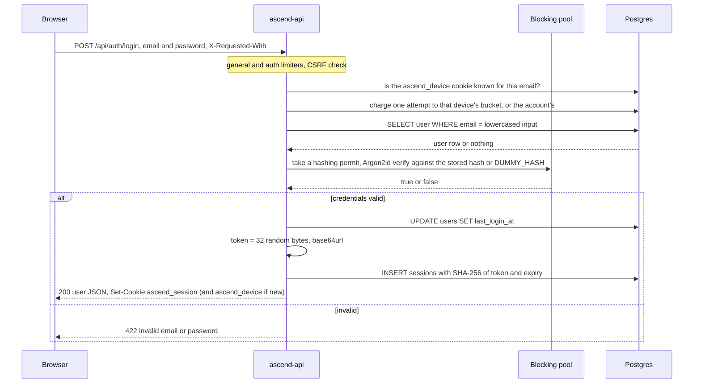
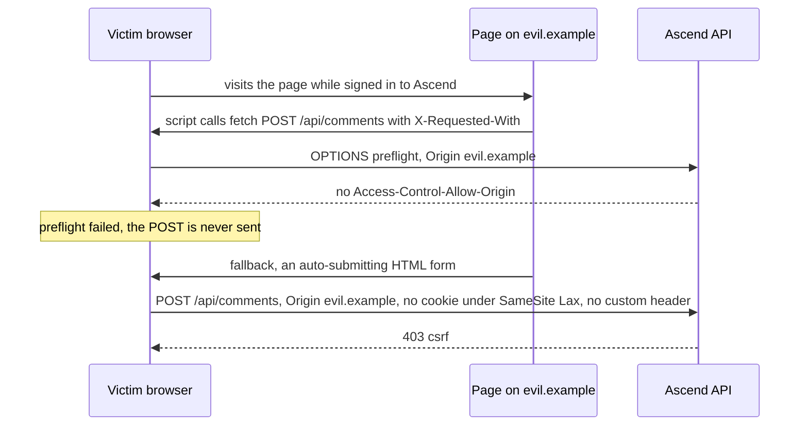

Ascend lets people sign up with an email and a password (by invite only, for now), and behind the login sits an API that costs real money per request. That attracts every classic attack: credential stuffing, a stolen database backup, a page that makes a signed-in learner's browser post on their behalf, script injection, bots enumerating accounts, and scripts that burn the AI budget. None of the defences is exotic; what is worth studying is how they are layered and what survives.

| Threat | Primary defence | Where |
|---|---|---|
| Offline cracking of a leaked database | Argon2id password hashes; only SHA-256 of session tokens stored | `crates/core/src/auth/password.rs`, `token.rs` |
| Guessable passwords | 15 characters minimum; new passwords screened against known breaches | `auth/service.rs`, `auth/breached.rs` |
| Session theft by script | `HttpOnly` cookie; a restrictive CSP; no user HTML rendered | `routes/auth.rs`, `middleware/security_headers.rs` |
| Cross-site request forgery | `SameSite=Lax`, Origin check, required custom header | `middleware/csrf.rs` |
| Account enumeration | Identical login and reset-request answers, timing equalised with a dummy hash or a background task | `auth/service.rs`, `password.rs`, `routes/auth.rs` |
| Takeover through recovery | A hashed, single-use, one-hour link token carried in the URL fragment | `auth/service.rs`, `email.rs` |
| Credential stuffing, scraping, budget burning | Rate limits per IP, account or known device, and session, shared by every replica; a per-user daily AI budget | `middleware/rate_limit.rs`, `services/rate_limit.rs`, `ai/budget.rs` |
| Downgrade and sniffing | TLS at the edge, HSTS, `Secure` cookie enforced in production | Railway, `config.rs` |

## Passwords: Argon2id on the blocking pool

`crates/core/src/auth/password.rs`:

```rust
fn hash_sync(password: &str) -> AppResult<String> {
    // Argon2id, default params (m=19456 KiB, t=2, p=1), random 16-byte salt.
    Argon2::default()
        .hash_password(password.as_bytes())
        .map(|h| h.to_string())
        .map_err(|e| AppError::Internal(format!("hash: {e}")))
}

/// Verifies `password` against `hash`, or against a dummy hash when `hash` is
/// `None`, so both branches cost the same.
pub async fn verify(password: String, hash: Option<String>) -> bool {
    let exists = hash.is_some();
    let Ok(_permit) = HASH_PERMITS.acquire().await else { return false };
    // The dummy hash is read on the blocking pool, inside the permit: its
    // first use computes it, which is Argon2 work like any other.
    let ok = tokio::task::spawn_blocking(move || verify_sync(&password, hash.as_deref().unwrap_or(&DUMMY_HASH)))
        .await
        .unwrap_or(false);
    ok && exists
}
```

**Why Argon2id.** Each guess against a stored hash costs 19 MiB of memory and two passes over it. An attacker with a GPU can compute billions of SHA-256 hashes per second but cannot give thousands of parallel cores 19 MiB each, so memory-hardness turns the attacker's advantage from thousands-to-one into something close to one-to-one. These are the crate defaults and match OWASP's minimum recommendation for Argon2id. **Rejected alternatives:** bcrypt is acceptable but not memory-hard and most implementations read only the first 72 bytes; PBKDF2 is GPU-friendly; a fast salted hash is a mistake.

**Why the blocking pool.** A hash takes tens of milliseconds of pure CPU; on a Tokio worker thread that time is stolen from every request multiplexed onto it, so `spawn_blocking` moves it to a separate pool.

**Before: nothing bounded concurrency.** Tokio's blocking pool grows to hundreds of threads by default, and each Argon2 computation holds 19 MiB. The auth rate limit was per IP, so a few hundred IPs submitting logins at once could make the process allocate gigabytes. Password hashing is a denial-of-service amplifier by design: the attacker sends a few bytes, the server spends tens of milliseconds and 19 MiB.

**After: a semaphore sized to the machine.** Commit `7154e9f` added this beside the hash functions, and both `hash` and `verify` take a permit before they spawn the blocking work:

```rust
// crates/core/src/auth/password.rs
/// Argon2 is deliberately expensive (~19 MiB and tens of ms per call). An
/// unbounded burst of logins would queue unlimited work on the blocking pool
/// and exhaust memory, so at most one hash per CPU runs at a time; the rest
/// wait here (and the auth rate limiter bounds how many can wait).
static HASH_PERMITS: LazyLock<tokio::sync::Semaphore> = LazyLock::new(|| {
    let cpus = std::thread::available_parallelism().map(|n| n.get()).unwrap_or(2);
    tokio::sync::Semaphore::new(cpus.max(2))
});
```

Memory for hashing is now bounded by CPUs times 19 MiB, and more concurrent hashes than cores would not finish sooner anyway. Requests beyond the limit *wait*: a waiter holds a small future, not 19 MiB, so a class signing in at 9:00 queues for a few hundred milliseconds, where `try_acquire` and an immediate 503 would turn every burst into failed logins. The rate limiters and the 240-second request timeout bound the queue.

### Length and breach screening

Hashing protects a stored password, not one an attacker guesses early. Commit `acab135` raised the sign-up minimum from 10 to 15 characters, because [NIST SP 800-63B-4](https://pages.nist.gov/800-63-4/sp800-63b.html) requires 15 for a password that is the only factor and forbids composition rules; sign-in accepts any length, so older accounts still work. The same standard requires checking a new password against a blocklist of commonly used or compromised ones. Commit `0897111` asks Have I Been Pwned's [Pwned Passwords range API](https://haveibeenpwned.com/API/v3): only the first five hex digits of the password's SHA-1 leave the server, `Add-Padding` makes every response 800 to 1,000 lines (padding carries a count of 0), and the suffixes are compared locally. A match is a 422 that says why, as NIST requires. After a 3-second timeout or any error the check fails open, so the blocklist cannot take sign-up (or a reset) down; `breached_passwords_are_refused_at_sign_up_and_an_outage_does_not_block_it` covers both cases.

### Timing, enumeration and the front door

When the email is unknown, `verify` still runs a full Argon2 verification against `DUMMY_HASH`, so "no such user" and "wrong password" take the same time and return the same body. The integration test `login_errors_do_not_leak_account_existence` pins the identical responses. The login sequence:



The same test registers an email that already has an account and asserts a **409 "an account with that email already exists"**: the front door to exactly what login hides. Before `7154e9f` it also leaked through timing, because registration checked the email before hashing and answered roughly 100 ms sooner; it now hashes first and lets the unique index decide ([Anatomy of a request](/learn/case-study-ascend/the-system/anatomy-of-a-request) tells the race). The 409 remains, and a comment in `register` says why: without an email round trip there is no way to avoid it, and it is rate limited. Mail now exists (below), so the complete fix, a sign-up that always answers "check your inbox" and signs in only from the link, costs product friction rather than infrastructure; for a learning platform, where membership is low-sensitivity, keeping instant sign-in is a defensible, written trade-off.

Since `ba89a60` production also runs with `SIGNUPS=invite`. A code is a 256-bit token sent as a `/register?invite=` link, stored only as its SHA-256 (`m0014_invites`) with a use limit and an optional expiry. `register` refuses a missing or malformed code before the Argon2 hash and the breach lookup, so junk sign-ups cost no hashing, and spends the code in the same transaction that inserts the user: a sign-up that fails leaves it unused, and concurrent sign-ups cannot exceed its uses. Unknown, spent, expired and revoked codes get one answer. A side effect narrows the 409: the code is spent before the insert, so only someone holding a valid invite can learn that an email is taken. Invites are made through `/api/admin/invites` with a bearer `ADMIN_TOKEN` (`0a34137`), because the distroless image has no shell for a command-line tool and Postgres has no public endpoint; without the token the routes answer 404.

Timing defences also fail at their edges. `DUMMY_HASH` is a lazily initialised static whose first read computes an Argon2 hash, so the first unknown-email login after each boot hashed *and* verified, twice as slow as any other. `password::warm_up()`, awaited before the port binds, now pays that cost; a lazy static is a hidden first-call cost.

### Deleting an account: a password, a 422 and a per-account limit

Until commit `7154e9f` there was no way to delete an account. `DELETE /api/auth/me` makes three security decisions:

```rust
// crates/api/src/routes/auth.rs — delete_account
// A stolen session must not become a password-guessing oracle.
let device = known_device(&state, &jar, &user.email).await?;
if let Some(throttled) = state.limiter.check_password_attempt(&user.email, device.as_deref()).await {
    return Ok(throttled);
}
state.auth.delete_account(user.id, body.password).await?;
let jar = jar.remove(Cookie::build(SESSION_COOKIE).path("/").build());
```

**It requires the password**: a session cookie proves that a browser signed in once, not that the person at it owns the account. **A wrong password is 422, not 401**: the SPA signs the learner out on a 401, which means "no valid session", so a typo would bounce them to the login page; here the session is valid and a field is wrong. **It shares the password limit with login**, so a stolen session cannot guess the password here at the loose general rate. What deletion does to the learner's data is in [Data and migrations](/learn/case-study-ascend/the-system/data-and-migrations).

### Account recovery: a link that works once, for an hour

Until commit `39052ce` a forgotten password was a lost account. Whoever holds a reset link holds the account, so each property is a decision:

1. `POST /api/auth/password/forgot` answers `{"ok": true}` whether or not the address has an account, and does the lookup and the send in a background task, so neither the body nor the timing tells. It charges `RESET_PER_ADDRESS`, three an hour per address, so nobody can flood a stranger's inbox.
2. The token comes from the session-token generator: 256 random bits, stored only as SHA-256 in `email_tokens` (migration `m0012_email_tokens`) with its purpose, address and expiry: one hour for a reset, which grants the account, seven days for a verification link.
3. The link carries the token in the fragment, `/reset-password#token=...`, which browsers never send to a server or in a `Referer`; the page POSTs it, then drops it from the address bar.
4. `consume_link` is one `DELETE ... WHERE token_hash = $1 AND purpose = $2 AND expires_at > now() RETURNING user_id, email`, so two clicks at once cannot both win, and a link whose address no longer matches the account is void.
5. A reset screens the new password first (15 characters, breach check), so a weak choice does not spend the link; then it deletes every session, signs this browser in and marks the address verified, since following the link proves it.

`a_forgotten_password_is_reset_by_email_and_signs_out_everywhere` walks that path; `reset_requests_reveal_nothing_and_links_expire` checks the unknown address, the expiry and the fourth request in an hour. Mail goes through Resend's HTTP API (`crates/core/src/email.rs`; its comment notes Railway blocks outbound SMTP on most plans); without `RESEND_API_KEY`, production reports recovery as unavailable and `/api/features` tells the UI to hide it. Sign-up also sends a verification link, but nothing is gated on it yet.

## Sessions: opaque tokens, hashed at rest

`crates/core/src/auth/token.rs`:

```rust
pub const TOKEN_BYTES: usize = 32;

/// A freshly generated opaque session token (URL-safe base64, 43 chars).
pub fn generate() -> String {
    let mut bytes = [0u8; TOKEN_BYTES];
    rand::rng().fill(&mut bytes);
    URL_SAFE_NO_PAD.encode(bytes)
}

/// Hex SHA-256 of the token — the only form persisted.
pub fn hash(token: &str) -> String {
    hex(&Sha256::digest(token.as_bytes()))
}

/// Sanity check before hitting the database: rejects garbage cookies cheaply.
pub fn looks_valid(token: &str) -> bool {
    token.len() == 43 && token.bytes().all(|b| b.is_ascii_alphanumeric() || b == b'-' || b == b'_')
}
```

The token is 256 bits from the thread-local CSPRNG, encoded as 43 URL-safe characters. The cookie carries the token; the `sessions` table stores only its SHA-256 as the primary key.

**Why a fast, unsalted hash is right here when it is wrong for passwords.** A password has perhaps 30 to 40 bits of real entropy, so an attacker tries likely passwords in order of popularity, and slowness and salt are the only defence. A session token has 256 bits and no dictionary. The hash exists so that a *read-only* leak (a backup, a replica, a logged query) cannot be replayed as a login; `auth_lifecycle_and_session_storage` asserts the raw token is not in the table.

Resolving a cookie, `crates/core/src/auth/service.rs`:

```rust
pub async fn authenticate(&self, raw_token: &str) -> AppResult<Option<CurrentUser>> {
    if !token::looks_valid(raw_token) {
        return Ok(None);
    }
    let hash = token::hash(raw_token);
    let Some((session, user)) = Sessions::find_by_id(&hash).find_also_related(Users).one(&self.db).await? else {
        return Ok(None);
    };
    let now = Utc::now();
    if session.expires_at < now || now - session.last_seen_at > self.session_idle {
        Sessions::delete_by_id(&hash).exec(&self.db).await?;
        return Ok(None);
    }
    let Some(user) = user else { return Ok(None) };
    if now - session.last_seen_at > Duration::hours(1) {
        let mut active: sessions::ActiveModel = session.into();
        active.last_seen_at = Set(now);
        active.update(&self.db).await?;
    }
    Ok(Some(user.into()))
}
```

One primary-key lookup joined to `users`, an in-band delete of an expired or idle row, and a `last_seen_at` write at most once an hour so that an active session does not cost a write per request. Looking up by the *hash* also defuses byte-by-byte timing attacks on the comparison: the attacker cannot choose the bytes being compared.

The cookie, from `crates/api/src/routes/auth.rs`:

```rust
Cookie::build((SESSION_COOKIE, token))
    .path("/")
    .http_only(true)
    .secure(state.config.cookie_secure)
    .same_site(SameSite::Lax)
    .max_age(time_duration(max_age))
    .build()
```

`HttpOnly` keeps it away from JavaScript, so even a successful script injection cannot read it. `Secure` keeps it off plain HTTP, and `Config::validate` refuses to boot in production if that flag would be false.

**ADR 0002 rejects JWTs** (the first interviewer follow-up gives the reasoning): server-side sessions make "log out everywhere" and "revoke that stolen laptop" a `DELETE`, where a JWT is a compromised token you cannot kill before it expires.

**Weaknesses a reviewer should raise:**

- **Absolute expiry, now with an idle limit.** `expires_at` is set once at login, 30 days out, and nothing extends it, so an active learner is signed out on day 30; a sliding window with an absolute cap is the usual design. The opposite gap is closed: until commit `427ed78` a forgotten laptop stayed signed in for all 30 days, and now a session unused for `SESSION_IDLE_DAYS` (default 14) is deleted on its next use and by the hourly sweep. `last_seen_at` moves at most hourly, so idleness is measured to the hour; `an_idle_session_is_signed_out` pins it.
- **No `__Host-` prefix.** Naming the cookie `__Host-ascend_session` makes the browser enforce `Secure`, `Path=/` and no `Domain`, so a sibling subdomain cannot set or shadow it.
- **A database round trip per authenticated request.** At 100x, a short-TTL cache of token hash to user removes most lookups, and revocation then takes up to one TTL to bite.

## CSRF: three independent layers

A session cookie is *ambient*: the browser attaches it to requests to Ascend no matter which page initiated them. Cross-site request forgery is a page on another site causing the victim's browser to send a state-changing request that carries that cookie. The middleware in `crates/api/src/middleware/csrf.rs` checks POST, PUT, PATCH and DELETE requests and delegates the decision to a pure function:

```rust
/// The decision, separated from Axum so it can be unit tested exhaustively.
pub fn allowed(headers: &HeaderMap, public_origin: &str) -> bool {
    if headers.get("x-requested-with").is_none() {
        return false;
    }
    let expected = public_origin.trim_end_matches('/');
    let header = |name: &str| headers.get(name).and_then(|v| v.to_str().ok());
    let claimed = match (header("origin"), header("referer")) {
        (Some(origin), _) => Some(origin.trim_end_matches('/')),
        (None, Some(referer)) => origin_of(referer),
        // Non-browser clients (curl, tests) send neither and carry no ambient
        // cookie credentials, so there is nothing to forge.
        (None, None) => return true,
    };
    match claimed {
        Some(o) => o == expected || is_local_dev(o, expected),
        None => false,
    }
}
```

`origin_of` reduces a Referer to `scheme://host[:port]`; `is_local_dev` accepts an `http://` origin on `localhost` or `127.0.0.1` only when the configured origin is itself local, so the Vite dev server works on a laptop and nowhere else.

**Layer 1: `SameSite=Lax`.** The browser does not attach the cookie to cross-site POSTs, iframes or `fetch` calls; it still attaches it to top-level GET navigations, which is why every GET in the API must be free of meaningful side effects. The catch is the word *site*: scheme plus registrable domain, not the origin. Ascend was first served from a subdomain of `up.railway.app`, which at the time of writing is on the Public Suffix List, so other Railway apps counted as different sites only because of an entry in a list Ascend does not control. It now serves from its own domain, `ascend.engineering`, and 308s the old host (`7b3c544`), so the site is one it owns, and every subdomain under it (`www`, and Grafana's host when it runs) is the same site; SameSite alone still cannot tell them apart.

**Layer 2: Origin, then Referer, compared exactly.** Browsers send `Origin` on every request whose method is not GET or HEAD, so a browser mutation is almost always checked against `Origin`. Scheme, host and port must all match: `http://` instead of `https://`, a different port, and `Origin: null` (which sandboxed frames send) are all rejected. If neither header is present the request is treated as a non-browser client, which carries no ambient cookie.

**Layer 3: `X-Requested-With`.** A cross-origin page can only add a non-safelisted header by passing a CORS preflight, and Ascend has no CORS layer at all, so the preflight gets no `Access-Control-Allow-Origin` and the browser never sends the real request. Plain HTML forms cannot set custom headers either.

An implicit fourth layer is deliberately not relied on: JSON extractors require `Content-Type: application/json`, which forces a preflight, but `POST /api/auth/logout` and `DELETE /api/comments/{id}` take no body.

An attack, played against all three:



### A bug that defence in depth absorbed

An earlier version of this middleware checked the Referer with `referer.starts_with(expected)`. With an origin of `https://ascend.example`, the Referer `https://ascend.example.evil.net/page` starts with the expected string and passed. The local-development rule had the same shape (`origin.starts_with("http://localhost")`), so `http://localhost.evil.net` passed whenever the configured origin was local.

It was a genuine bug and not exploitable from a browser: the Referer branch only runs when `Origin` is absent, which browsers do not do for cross-site mutations, and the custom header and SameSite would each have stopped the request anyway. One layer was wrong and nothing was exposed, which is also why the layers must be *independent*: three checks that trust the same header are one check.

The fix's shape is worth copying. The comparison became exact, Referers are reduced to their origin first, and the decision moved into `allowed`, a pure function over a header map, so unit tests enumerate a look-alike host, another scheme or port, `null`, a Referer with a path, a non-URL and a localhost look-alike. Security logic reachable only through an HTTP stack gets tested on the happy path; a pure function gets a table of adversarial inputs.

```exercise
id: csrf-decision
title: Would the CSRF middleware accept this request?
prompt: |
  Reproduce Ascend's CSRF decision (`enforce` plus `allowed` in `crates/api/src/middleware/csrf.rs`) as one pure function.

  - `method` is an upper-case HTTP method. Only POST, PUT, PATCH and DELETE are checked; anything else is accepted.
  - `headers` maps lower-case header names to string values.
  - A checked request is rejected if it has no `x-requested-with` header. Presence is what counts; an empty value is fine.
  - The expected origin is `public_origin` with trailing `/` characters removed.
  - If an `origin` header exists, the claimed origin is its value with trailing `/` removed. Otherwise, if a `referer` header exists, the claimed origin is the part of the Referer before the first `/`, `?` or `#` that follows `://`; a Referer without `://` is rejected. With neither header the request is accepted.
  - The claimed origin passes if it equals the expected origin exactly, or if both start with `http://` and the host of each (the text after `http://` up to the first `:`) is `localhost` or `127.0.0.1`.

  Return `true` if the request is accepted.
languages: [python, javascript]
entry: csrf_allows
starter:
  python: |
    def csrf_allows(method, headers, public_origin):
        # your code here
        return False
  javascript: |
    function csrf_allows(method, headers, public_origin) {
      // your code here
      return false;
    }
tests:
  - args: ["POST", {"origin": "https://ascend.example/", "x-requested-with": "fetch"}, "https://ascend.example"]
    expected: true
    label: same origin, trailing slash trimmed
  - args: ["POST", {"origin": "https://ascend.example"}, "https://ascend.example"]
    expected: false
    label: custom header missing
  - args: ["POST", {"origin": "https://ascend.example.evil.net", "x-requested-with": "fetch"}, "https://ascend.example"]
    expected: false
    label: look-alike host
  - args: ["GET", {}, "https://ascend.example"]
    expected: true
    label: safe methods are not checked
  - args: ["PATCH", {"referer": "http://localhost:5173/learn/foo?x=1", "x-requested-with": "fetch"}, "http://localhost:8080"]
    expected: true
    label: Referer reduced to its origin, local development
  - args: ["DELETE", {"x-requested-with": "fetch"}, "https://ascend.example"]
    expected: true
    hidden: true
    label: no Origin or Referer means a non-browser client
  - args: ["POST", {"origin": "null", "referer": "https://ascend.example/learn", "x-requested-with": "fetch"}, "https://ascend.example"]
    expected: false
    hidden: true
    label: Origin wins over Referer
  - args: ["POST", {"origin": "http://localhost.evil.net", "x-requested-with": "fetch"}, "http://localhost:8080"]
    expected: false
    hidden: true
    label: localhost look-alike
hints:
  - "Return early for methods that are not POST, PUT, PATCH or DELETE, then check for `x-requested-with`."
  - "Use `origin` if present, even when it is wrong; fall back to `referer` only when `origin` is absent."
  - "To reduce a Referer, find `://`, then cut at the first `/`, `?` or `#` after it. Compare strings exactly; never with a prefix test."
```

## Security headers and the CSP

`crates/api/src/middleware/security_headers.rs` sets `nosniff`, `X-Frame-Options: DENY`, a strict referrer policy, a permissions policy that disables camera, microphone and geolocation, HSTS for a year, and this Content Security Policy:

```rust
h.insert(
    header::CONTENT_SECURITY_POLICY,
    HeaderValue::from_static(concat!(
        "default-src 'self'; ",
        "script-src 'self' 'unsafe-eval' 'wasm-unsafe-eval' https://cdn.jsdelivr.net blob:; ",
        "worker-src 'self' blob:; ",
        "style-src 'self' 'unsafe-inline'; ",
        "font-src 'self' data:; ",
        "img-src 'self' data: blob:; ",
        "connect-src 'self' https://cdn.jsdelivr.net https://pypi.org https://files.pythonhosted.org; ",
        "frame-ancestors 'none'; base-uri 'self'; form-action 'self'; object-src 'none'"
    )),
);
```

Scripts come only from Ascend, jsDelivr (the Pyodide runtime) and `blob:` URLs the app creates; network calls go only to Ascend, jsDelivr and PyPI; framing is forbidden twice (`frame-ancestors`, plus `X-Frame-Options` for old browsers), and `base-uri` and `form-action` close two classic injection tricks. The XSS surface behind it is small by construction: comments and display names render as React text nodes, and lesson Markdown is rendered without raw HTML.

The honest weakness is `'unsafe-eval'`. The JavaScript runner builds learner code with `new Function` and Pyodide compiles WebAssembly, and because one middleware sets one policy on every response, the allowance covers the main page too. A worker is governed by the CSP on its own script's response, so the permissive policy could go only with the worker scripts. The timeout's 503 (previous lesson) carries none of these headers.

## Rate limiting

`crates/api/src/middleware/rate_limit.rs` defines two tiers:

```rust
/// Sign-up and login: 30 per minute per IP.
pub const AUTH_PER_IP: SharedQuota = SharedQuota::per_minute(30);
/// Password attempts: 10 per minute per account for unknown devices, and 10
/// per minute per known device.
pub const PASSWORD_ATTEMPTS: SharedQuota = SharedQuota::per_minute(10);
/// Model-calling routes: 20 per minute per session.
pub const AI_PER_SESSION: SharedQuota = SharedQuota::per_minute(20);
/// Graded submissions: 20 per minute per session.
pub const GRADE_PER_SESSION: SharedQuota = SharedQuota::per_minute(20);

pub struct Limiters {
    /// Everything else: 1,200 per minute per IP, per replica.
    pub general: Keyed<IpAddr>,
    pub shared: SharedLimiter,
}
```

Every bucket runs GCRA, the generic cell rate algorithm, which admits the same requests as a token bucket ([Rate-limiting algorithms](/learn/networking/network-algorithms/rate-limiting-algorithms) compares them): `per_minute(10)` is a bucket of 10 tokens that regains one every 6 seconds. `AUTH_PER_IP` wraps `/register`, `/login` and the reset and verification links; `PASSWORD_ATTEMPTS` is charged inside the login and account-deletion handlers, keyed by the trimmed, lowercased email or by a known device; the session buckets wrap the model-calling routes and graded submissions; the general bucket wraps all of `/api`. The daily budget in `ai_usage` (ADR 0004) sits behind the AI limiter as the cost fuse.

```viz
{"type": "system", "algorithm": "token-bucket", "title": "The token bucket behind every limiter", "caption": "Capacity sets the burst, refill rate sets the sustained rate. Ascend's per-account password bucket has capacity 10 and refills one token every 6 seconds.", "requests": 12}
```

The IP, where one is used, comes from a single function, and choosing it is a security decision:

```rust
fn client_ip(req: &Request<Body>, header: Option<&str>) -> IpAddr {
    if let Some(name) = header
        && let Some(ip) = req.headers().get(name).and_then(|v| v.to_str().ok()).and_then(|v| v.trim().parse().ok())
    {
        return ip;
    }
    req.extensions().get::<ConnectInfo<SocketAddr>>().map(|c| c.0.ip()).unwrap_or(IpAddr::from([0, 0, 0, 0]))
}
```

Only a header that the trusted proxy *sets and overwrites* is safe: the first entry of `X-Forwarded-For` is whatever the client wrote. Railway [sets `X-Real-IP`](https://docs.railway.com/networking/public-networking/specs-and-limits), so production uses `CLIENT_IP_HEADER=x-real-ip`, which only holds while the container is unreachable except through the proxy.

### Before and after: what a limiter is keyed by

When this track was first drafted, every limiter was keyed by client IP: 10 logins, 20 AI requests and 300 other requests per minute. A class behind one NAT would exhaust ten logins in seconds, and an attacker with many addresses gets a fresh bucket per address; the live test suites, many browsers from one IP, hit the first problem. The fix changed the keys as well as the numbers:

| Bucket | Before | After | Why |
|---|---|---|---|
| Model calls | 20 per minute per IP, every coach and interview route | 20 per minute per session, only routes that call the model | Learners behind one NAT stop throttling each other |
| Login and registration | 10 per minute per IP | 30 per minute per IP | A class can sign up together |
| Password guesses | Only the per-IP bucket | 10 per minute per account, or per known device | Stops a distributed attacker |
| Everything else | 300 per minute per IP | 1,200 per minute per IP | Expensive routes have their own buckets |

The session key is a 16-byte prefix of the cookie's SHA-256, computed without authenticating anyone, which the previous lesson showed is safe; `ai_throttling_is_per_session_and_only_for_model_calls` checks that a second learner at the same address is not throttled.

### Before and after: limits that multiplied with replicas

Until commit `427ed78` every bucket was a `governor` map in process memory, so N replicas allowed N times every limit, the ten password guesses included. The fix keeps GCRA and moves its one number per key into Postgres: the *theoretical arrival time* (TAT) at which the next request would be due at exactly the sustained rate. With interval T = 60 s / limit and tolerance τ = (limit − 1) × T, a request is allowed when TAT − now ≤ τ, and the TAT moves to max(TAT, now) + T. Check and update are one conditional upsert on `rate_limits(key, tat)`, an `UNLOGGED` table (migration `m0009_shared_rate_limits`):

```sql
INSERT INTO rate_limits (key, tat) VALUES ($1, now() + make_interval(secs => $2))
ON CONFLICT (key) DO UPDATE
   SET tat = GREATEST(rate_limits.tat, now()) + make_interval(secs => $2)
 WHERE GREATEST(rate_limits.tat, now()) - now() <= make_interval(secs => $3)
RETURNING tat
```

Trace the password quota (T = 6 s, τ = 54 s) for one account, TAT in seconds:

| Time | Request | TAT before | TAT − now | Outcome | TAT after |
|---|---|---|---|---|---|
| 0 s | 1st | none | | Inserted: allowed | 6 |
| 0 s | 10th | 54 | 54 ≤ 54 | Allowed | 60 |
| 0 s | 11th | 60 | 60 > 54 | No row returned: 429, `Retry-After: 6` | 60 |
| 6 s | 12th | 60 | 54 ≤ 54 | Allowed | 66 |

Two replicas racing for the last slot cannot both win: the second upsert waits for the first one's row lock, then evaluates its `WHERE` against the committed TAT and returns no row ([PostgreSQL's `INSERT`](https://www.postgresql.org/docs/current/sql-insert.html) documents both). `replicas_share_the_security_limits` spends ten guesses through one app instance and expects another, on the same database, to refuse the eleventh.

Three choices are worth defending. **Postgres, not Redis:** every replica already shares it; a new store adds a failure mode and no capability. **`UNLOGGED`:** skipping the write-ahead log makes each check cheaper; the table is [truncated after a crash and absent from standbys](https://www.postgresql.org/docs/current/sql-createtable.html), which only forgives some recent requests. **Fail closed:** if the query fails the middleware answers 503, because these limits guard passwords and spend. The general bucket stays in memory on purpose: it only stops floods of cheap reads.

### Before and after: a lockout anyone could trigger

The per-account bucket had a cost: anyone who knew a learner's email could keep them out by emptying it. Commit `427ed78` applies OWASP's [device cookie](https://community.owasp.org/Slow_Down_Online_Guessing_Attacks_with_Device_Cookies) pattern. After a successful login, sign-up or reset the browser gets `ascend_device`, a random token stored only as a hash in `login_devices` (migration `m0010_login_devices`): `HttpOnly`, `SameSite=Strict`, `Path=/api/auth`, 365 days, 20 per account. A login from a device known for that account is charged to the device's own bucket; unknown devices share the account's. `an_attacker_cannot_lock_the_owner_out_of_a_known_device` spends fifteen wrong guesses, shows a forged device cookie is refused, and signs the owner in from their browser. The cookie grants no access; it only chooses which bucket pays, and an owner on a new device still shares the attacker's.

What a reviewer should still raise:

- **IPv6.** An attacker who controls a /64 has more addresses than any per-IP bucket can track. Keying by /64 prefix for IPv6 closes it.
- **Fallbacks.** If the configured header is missing, the socket address is used, which behind a proxy is the proxy itself, so everyone shares one bucket. Without connection info, everyone shares `0.0.0.0`.

Two former items are fixed: the hourly task calls `Limiters::prune`, which trims the in-memory bucket and sweeps the shared table, and every 429 carries GCRA's exact earliest retry time instead of `Retry-After: 60`.

## TLS and secrets

TLS terminates at Railway's edge, which forwards plain HTTP to the container ([TLS and PKI](/learn/networking/fundamentals/tls-and-pki) covers the handshake):

```viz
{"type": "network", "scenario": "https-tls-handshake", "title": "TLS 1.3 at the edge", "caption": "The handshake happens between the browser and Railway's edge. Ascend never holds a certificate; it relies on HSTS and Secure cookies to keep browsers on HTTPS."}
```

The application makes plain HTTP useless to a browser: HSTS says never to try HTTP for a year, and `Secure` keeps the cookie off HTTP. `Config::validate` makes that a boot-time invariant:

```rust
fn validate(&self) -> Result<(), ConfigError> {
    if !self.database_url.expose_secret().starts_with("postgres") {
        return Err(ConfigError::Invalid { name: "DATABASE_URL", reason: "must be a postgres:// URL".into() });
    }
    if self.env == Environment::Production && !self.cookie_secure {
        return Err(ConfigError::Invalid {
            name: "COOKIE_SECURE",
            reason: "must be true in production (set PUBLIC_ORIGIN to an https:// URL)".into(),
        });
    }
    Ok(())
}
```

Secrets live only in the environment. `DATABASE_URL` and the Anthropic key are `SecretString`s, whose `Debug` output is redacted, and every use is an explicit, greppable `expose_secret()`. Until commit `8f82820` a failed database connect could quote its URL, password included, in the boot log; `connect_db` now passes the error through `redact_credentials`, with a unit test. `.railway/railway.ts` declares each secret with `preserve()`, so infrastructure-as-code never holds a value, and `.dockerignore` keeps `.env` out of the build context.

## Failure modes

| Failure | Symptom | Diagnosis | Fix |
|---|---|---|---|
| A login burst from hundreds of addresses | Memory climbs about 19 MiB per concurrent hash until the process is killed | Blocking-pool thread count and resident memory rise together during the burst | A semaphore of one permit per CPU (in place); waiters hold a future, not 19 MiB |
| A stranger locks a learner out of a new browser | The owner's correct password gets 429 on a device that never signed in | Many 422s for one email from several addresses, then the owner's 429 with no `ascend_device` cookie | Known devices have their own bucket (in place); charge failed attempts only |
| The client-IP header is misconfigured | Either everyone behind the proxy shares one bucket and mass 429s follow, or an attacker rotates a forged header | Every request logs the same client address, or addresses that change per request | `CLIENT_IP_HEADER=x-real-ip`, a header the edge overwrites; never the first `X-Forwarded-For` entry |
| Reset emails stop arriving | "Forgot password" answers as usual and no mail comes | `password reset email failed` in the logs; `ascend.emails` counts failures | Check the Resend key and sending domain; the answer cannot say, because it must not reveal the account |

## Interviewer follow-ups

**"Why server-side sessions rather than JWTs?"** Model answer: there is one service, so stateless verification buys nothing, and every session check is a primary-key lookup on the hashed token. Revocation is a `DELETE`, where a JWT needs a denylist, which is server state anyway, and the `HttpOnly` cookie is out of script's reach where a JWT in `localStorage` is not. JWTs earn their place when many services verify tokens without calling home. Common wrong answer: "JWTs scale better", with no account of revocation or of where the token is stored.

**"How do you stop a distributed attacker guessing one learner's password, and what does it cost?"** Model answer: key a limit by the thing being attacked: ten attempts per minute per account, shared by login and account deletion, so rotating addresses buys nothing. The bucket lives in Postgres, so landing on another replica buys nothing either. The cost is a targeted lockout; Ascend gives each known device its own bucket, so an attacker drains only the allowance for browsers that never signed in. Common wrong answer: "a tighter per-IP limit", which a botnet ignores and a classroom behind one NAT pays for.

**"Your login is timing-safe. Is account enumeration solved?"** Model answer: no. Registration still answers 409 for a taken email, which only a sign-up completed from an emailed link closes, and timing defences have edges: the lazy dummy hash made the first unknown-email login after each boot twice as slow. Common wrong answer: "yes, the error messages are identical", which checks one endpoint and one request.

**"Design the password-reset link."** Model answer: a 256-bit random token stored only as a hash, bound to its purpose and to the address it was sent to, valid for an hour, consumed by one `DELETE ... RETURNING` so it works once, carried in the URL fragment so it never reaches logs or a `Referer`, requested through an endpoint that answers the same for every address and is limited per address; a completed reset signs out every session. Common wrong answer: "a signed JWT with an expiry", which cannot be spent once and lives in the query string.

## What mid-level engineers get wrong

- **Hashing passwords with a fast hash, or running Argon2 on async worker threads without a bound.** The first is crackable offline; the second turns a login burst into gigabytes of memory.
- **Storing raw session tokens.** A read-only leak of the table becomes a set of working logins.
- **Treating `SameSite` as the CSRF defence.** It is about sites, not origins, and every app under the same registrable domain is the same site.
- **Relying on `Content-Type: application/json` for CSRF.** Bodyless routes such as logout never check it.
- **Putting a reset token in the query string.** It leaks to logs and `Referer`.
- **Keying limits on `X-Forwarded-For`.** Its first entry is whatever the client wrote.
- **Keeping a JWT in `localStorage`.** Any XSS reads it, and it cannot be revoked before it expires.

## What changes at 100x

- IPv6 grouped by /64 in per-IP keys, the limiter table off the primary if its writes show up there, and an edge WAF for volumetric floods.
- Charging only failed password attempts.
- Sliding session expiry with an absolute cap, the `__Host-` cookie prefix, and a session list so learners can revoke devices themselves.
- A per-path CSP, strict for documents and permissive only for worker scripts.
- Sign-up completed from an emailed link, closing the enumeration door; the mail path it needs now exists.

## Senior signals

- You can explain why passwords need slow, salted, memory-hard hashes while 256-bit session tokens are fine with plain SHA-256, and what the hashed token protects against (read-only leaks).
- You know that timing-safe login is pointless if registration answers "that email is taken", and present the fix and its cost as a written product trade-off.
- You treat a recovery link as a credential: random, hashed at rest, single-use, short-lived, out of logs, and requested through an endpoint that answers the same for every address.
- You describe CSRF defence as independent layers, and know SameSite is about sites, not origins.
- You look for the layer that is wrong (the old Referer prefix match), explain why the others made it unexploitable, and fix it as a pure function with adversarial tests.
- You treat password hashing as a DoS amplifier, bound it, and let a burst wait for permits rather than fail.
- You key each limit by what it protects (account, device, session, address), share it across replicas, and know how device cookies defuse the lockouts per-account limits invite.

## Check yourself

```quiz
- q: >-
    Ascend stores SHA-256 of each session token without a salt, yet uses slow, salted Argon2id for passwords. Why is that consistent?
  options: ["Session tokens are less valuable to an attacker than passwords are", "SHA-256 is slower than Argon2id once the token is 43 characters long", "Salts matter only for columns that serve as a table's primary key", "Tokens hold 256 random bits, so there is no dictionary to try"]
  answer: 3
  explanation: >-
    Password hashing is slow and salted because attackers guess likely passwords from a dictionary. A random 256-bit token cannot be guessed, so the only goal of hashing it is that a leaked table cannot be replayed as a login, which any preimage-resistant hash achieves. SHA-256 is far faster than Argon2id, which is fine here.
- q: >-
    Registration now hashes the password before it inserts, so an existing email no longer answers faster. How can an attacker still learn whether an email has an account?
  options: ["They cannot, since every auth endpoint now answers identically for all emails", "By timing the login endpoint, which still skips hashing for unknown emails", "By registering it: the endpoint still answers 409 when the account already exists", "By reading the session cookie, which embeds the account's email address"]
  answer: 2
  explanation: >-
    Login verifies against a dummy hash for unknown emails, so its timing and body reveal nothing, and a reset request answers the same for every address. Registration still says that an email is taken, and the code documents that as a deliberate trade-off; only a sign-up completed from an emailed link removes it. The cookie holds an opaque random token, not an email.
- q: >-
    A malicious page auto-submits an HTML form that POSTs to /api/auth/logout, an endpoint that takes no request body. Which defence does NOT help here?
  options: ["The required X-Requested-With header, which a plain form cannot set", "The Origin check rejecting a request that claims evil.example", "SameSite=Lax withholding the session cookie on the cross-site POST", "The JSON extractor's demand for Content-Type application/json"]
  answer: 3
  explanation: >-
    Logout has no JSON extractor, so the content-type requirement never applies to it. That is exactly why the middleware enforces an explicit rule for every mutating route instead of relying on body parsing. The other three are independent layers that each stop the forged request.
- q: >-
    A signed-in learner types the wrong password into the delete-account form. Why does the API answer 422 rather than 401?
  options: ["422 is required by the HTTP specification for any incorrect form field value", "422 tells rate limiters to charge the attempt, while a 401 is never counted", "Browsers show a native login prompt for every 401, and it cannot be suppressed", "401 means no valid session, and the SPA would treat the learner as signed out"]
  answer: 3
  explanation: >-
    The session is valid; only a field is wrong, which is what 422 says. The SPA's auth context sets the user to null on a 401, so a typo would bounce a signed-in learner to the login page. Browsers show a native prompt only when a 401 carries a WWW-Authenticate challenge, which this API never sends.
- q: >-
    The password-attempt quota is per_minute(10), keyed by account for devices that have never signed in. An attacker sends 15 login attempts for one email at t = 0 from 15 different IPs, and one more at t = 7 s. How many reach the password check?
  options: ["1 at t = 0, then one more every six seconds after it", "10 at t = 0, and the attempt at t = 7 s is refused as well", "11 in total: ten at t = 0 and then the one at t = 7 s", "15 at t = 0, since every attempt comes from a different address"]
  answer: 2
  explanation: >-
    The bucket is keyed by account and stored in Postgres, so rotating addresses or replicas buys nothing. Capacity is 10, so the first ten pass and five are refused; one token is replenished every 6 s, so by t = 7 s the next attempt passes. The owner signing in from a browser that has signed in before is unaffected, because a known device has its own bucket.
- q: >-
    Two replicas each receive a login for the same account at the same instant, and the account's password bucket has one slot left. What does the shared limiter's conditional upsert do?
  options: ["One upsert updates the row; the other waits on its lock, re-checks WHERE, and is refused", "Both read the same TAT before either writes, so both of the logins are allowed through", "The second insert fails with a unique violation, and the API answers 500 for that login", "Each replica holds its own copy of the TAT, so both logins pass and both get recorded"]
  answer: 0
  explanation: >-
    ON CONFLICT DO UPDATE locks the conflicting row. The waiting statement then evaluates its WHERE against the TAT the first one committed, which is past the tolerance, so it updates nothing and RETURNING yields no row: a 429. There is no read-then-write window for both to slip through, ON CONFLICT absorbs the duplicate key instead of raising an error, and since commit 427ed78 no replica keeps its own copy.
```
