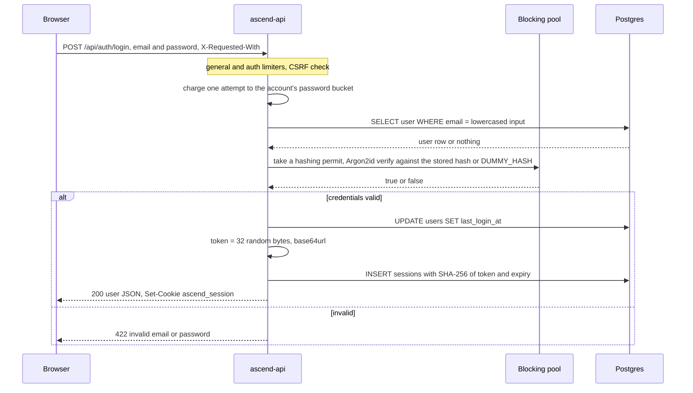
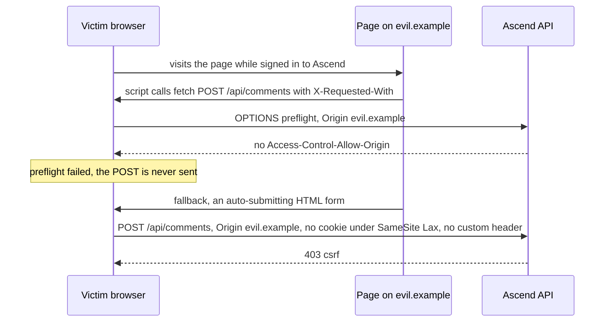

Ascend lets anyone sign up with an email address and a password, and behind the login sits an API that costs real money per request. That combination attracts every classic attack: credential stuffing against the login form, a stolen database backup, a malicious page that makes a signed-in learner's browser post on their behalf, script injection, bots enumerating which emails have accounts, and scripts that burn the AI budget. None of the defences is exotic. What is worth studying is how they are layered, where each one is placed, and which weaknesses survive.

| Threat | Primary defence | Where |
|---|---|---|
| Offline cracking of a leaked database | Argon2id password hashes; only SHA-256 of session tokens stored | `crates/core/src/auth/password.rs`, `token.rs` |
| Session theft by script | `HttpOnly` cookie; a restrictive CSP; no user HTML rendered | `routes/auth.rs`, `middleware/security_headers.rs` |
| Cross-site request forgery | `SameSite=Lax`, Origin check, required custom header | `middleware/csrf.rs` |
| Account enumeration | Identical login errors, timing equalised with a dummy hash | `auth/service.rs`, `password.rs` |
| Credential stuffing, scraping, budget burning | Rate limits per IP, per account and per session; a per-user daily AI budget | `middleware/rate_limit.rs`, `ai/budget.rs` |
| Downgrade and sniffing | TLS at the edge, HSTS, `Secure` cookie enforced in production | Railway, `config.rs` |

## Passwords: Argon2id on the blocking pool

`crates/core/src/auth/password.rs`:

```rust
fn hash_sync(password: &str) -> AppResult<String> {
    // Argon2id, default params (m=19456 KiB, t=2, p=1), random 16-byte salt.
    Argon2::default()
        .hash_password(password.as_bytes())
        .map(|h| h.to_string())
        .map_err(|e| AppError::Internal(format!("hash: {e}")))
}

/// Verifies `password` against `hash`, or against a dummy hash when `hash` is
/// `None`, so both branches cost the same.
pub async fn verify(password: String, hash: Option<String>) -> bool {
    let exists = hash.is_some();
    let Ok(_permit) = HASH_PERMITS.acquire().await else { return false };
    // The dummy hash is read on the blocking pool, inside the permit: its
    // first use computes it, which is Argon2 work like any other.
    let ok = tokio::task::spawn_blocking(move || verify_sync(&password, hash.as_deref().unwrap_or(&DUMMY_HASH)))
        .await
        .unwrap_or(false);
    ok && exists
}
```

**Why Argon2id.** Each guess against a stored hash costs 19 MiB of memory and two passes over it. An attacker with a GPU can compute billions of SHA-256 hashes per second but cannot give thousands of parallel cores 19 MiB each, so memory-hardness turns the attacker's advantage from thousands-to-one into something close to one-to-one. These are the crate defaults and match OWASP's minimum recommendation for Argon2id. **Rejected alternatives:** bcrypt is still acceptable but not memory-hard and silently truncates passwords at 72 bytes; PBKDF2 is compliance-friendly and GPU-friendly, which is the wrong kind of friendly; a fast hash with a salt is a mistake no reviewer should let through.

**Why the blocking pool.** A hash takes tens of milliseconds of pure CPU. On a Tokio worker thread, that time is stolen from every other request multiplexed onto the same thread, so one login would add latency to unrelated lesson reads. `spawn_blocking` moves it to a separate thread pool built for exactly this. The `HASH_PERMITS` line in `verify` is newer, and it exists because the blocking pool alone was not enough; so is the placement of `DUMMY_HASH` inside the blocking closure, which the timing section below explains.

**Before: nothing bounded concurrency.** `spawn_blocking` moves work off the async threads, but Tokio's blocking pool grows to hundreds of threads by default, and each Argon2 computation holds 19 MiB. The auth rate limit was per IP, so a few hundred IPs submitting logins at once could make the process allocate gigabytes. Password hashing is a denial-of-service amplifier by design: the attacker sends a few bytes, the server spends tens of milliseconds and 19 MiB.

**After: a semaphore sized to the machine.** Commit `7154e9f` added this beside the hash functions, and both `hash` and `verify` take a permit before they spawn the blocking work:

```rust
// crates/core/src/auth/password.rs
/// Argon2 is deliberately expensive (~19 MiB and tens of ms per call). An
/// unbounded burst of logins would queue unlimited work on the blocking pool
/// and exhaust memory, so at most one hash per CPU runs at a time; the rest
/// wait here (and the auth rate limiter bounds how many can wait).
static HASH_PERMITS: LazyLock<tokio::sync::Semaphore> = LazyLock::new(|| {
    let cpus = std::thread::available_parallelism().map(|n| n.get()).unwrap_or(2);
    tokio::sync::Semaphore::new(cpus.max(2))
});
```

Memory for hashing is now bounded by the number of CPUs times 19 MiB, and running more hashes than there are cores would not have finished any sooner anyway. Requests beyond the limit *wait* rather than fail: a waiting request holds a small future, not 19 MiB, and a burst of legitimate logins (a class signing in at 9:00) queues for a few hundred milliseconds instead of seeing errors. The alternative, `try_acquire` and an immediate 503, sheds load sooner but turns every burst into failed logins. What bounds the queue is everything in front of it: the rate limiters and the 240-second request timeout.

### Timing, enumeration and the front door

When the email is unknown, `verify` still runs a full Argon2 verification against `DUMMY_HASH`, so "no such user" and "wrong password" take the same time and return the same body. The integration test `login_errors_do_not_leak_account_existence` pins the identical responses. The login sequence:



The same test then registers an email that already has an account and asserts a **409 "an account with that email already exists"**. That is the front door to exactly the information the login path works to hide. Before `7154e9f` it leaked through timing as well: registration checked for the email *before* hashing, so "already registered" came back roughly 100 ms sooner than a real sign-up. Registration now hashes first and lets the unique index decide, which removes the timing difference and the race described in [Anatomy of a request](/learn/case-study-ascend/the-system/anatomy-of-a-request). The status code remains, and a comment in the code says why: "Registration still says when an email is taken: without an email round trip there is no way to avoid that, and it is rate limited. The login endpoint, which attackers probe at scale, reveals nothing." The complete fix is an email step (registration always answers "check your inbox"), which needs an email provider and a verification flow. For a learning platform, where knowing that someone studies here is low-sensitivity, skipping it is a defensible, written trade-off.

A smaller finding shows how timing defences fail at their edges. `DUMMY_HASH` is a lazily initialised static: the first read computes an Argon2 hash. The earlier `verify` read it on the async task, before taking a permit, so the first unknown-email login after each boot hashed *and* verified, roughly twice as slow as every other login: a one-off signal that this email has no account. The fix moved the read into the blocking closure, inside the permit, and added `password::warm_up()`, which `main` awaits before binding the port, so every unknown-email login costs exactly one verification. A lazy static is a hidden first-call cost, and a timing defence has to account for first calls too.

One small choice remains a matter of taste: a failed login returns 422 through `AppError::Validation`; 401 is more conventional, and either is fine as long as it is consistent.

### Deleting an account: a password, a 422 and a per-account limit

Until commit `7154e9f` there was no way to delete an account at all. `DELETE /api/auth/me` now exists, and three details in it are security decisions:

```rust
// crates/api/src/routes/auth.rs — delete_account
// A stolen session must not become a password-guessing oracle.
if let Some(throttled) = state.limiter.check_password_attempt(&user.email) {
    return Ok(throttled);
}
state.auth.delete_account(user.id, body.password).await?;
let jar = jar.remove(Cookie::build(SESSION_COOKIE).path("/").build());
```

**It requires the password.** A session cookie proves that a browser signed in at some point, not that the person at it now owns the account; an unattended laptop or a stolen cookie must not be enough to erase a learner's history. **A wrong password is 422, not 401.** `AuthService::delete_account` returns `AppError::Validation("password is incorrect")`. Everywhere else in the API, 401 means "you have no valid session", and the SPA's auth context treats a 401 as signed out, so answering a typo with 401 would bounce a learner who is still signed in back to the login page. The session is valid; the field is wrong, which is exactly what 422 says. The integration test asserts the 422 and that the account still exists afterwards. **It shares the per-account password limit with login.** Without that, a stolen session could guess the account's password through this endpoint at the loose per-IP rate for ordinary traffic; with it, guesses here and at `/login` draw on the same ten attempts per minute. What deletion does to the learner's data, and why their comments survive it, is in [Data and migrations](/learn/case-study-ascend/the-system/data-and-migrations).

## Sessions: opaque tokens, hashed at rest

`crates/core/src/auth/token.rs`:

```rust
pub const TOKEN_BYTES: usize = 32;

/// A freshly generated opaque session token (URL-safe base64, 43 chars).
pub fn generate() -> String {
    let mut bytes = [0u8; TOKEN_BYTES];
    rand::rng().fill(&mut bytes);
    URL_SAFE_NO_PAD.encode(bytes)
}

/// Hex SHA-256 of the token — the only form persisted.
pub fn hash(token: &str) -> String {
    hex(&Sha256::digest(token.as_bytes()))
}

/// Sanity check before hitting the database: rejects garbage cookies cheaply.
pub fn looks_valid(token: &str) -> bool {
    token.len() == 43 && token.bytes().all(|b| b.is_ascii_alphanumeric() || b == b'-' || b == b'_')
}
```

The token is 256 bits from the thread-local CSPRNG, encoded as 43 URL-safe characters. The cookie carries the token; the `sessions` table stores only its SHA-256 as the primary key.

**Why a fast, unsalted hash is right here when it is wrong for passwords.** A password has perhaps 30 to 40 bits of real entropy, so an attacker with the hash tries likely passwords in order of popularity; slowness and salt are the only defence. A session token has 256 bits of entropy and no dictionary, so inverting SHA-256 on a random input is infeasible at any speed. The hash exists so that a *read-only* leak (a backup, a replica, a log line with a query) cannot be replayed as a login. The integration test `auth_lifecycle_and_session_storage` queries the table for the raw token and asserts it is not there.

Resolving a cookie, `crates/core/src/auth/service.rs`:

```rust
pub async fn authenticate(&self, raw_token: &str) -> AppResult<Option<CurrentUser>> {
    if !token::looks_valid(raw_token) {
        return Ok(None);
    }
    let hash = token::hash(raw_token);
    let Some((session, user)) = Sessions::find_by_id(&hash).find_also_related(Users).one(&self.db).await? else {
        return Ok(None);
    };
    let now = Utc::now();
    if session.expires_at < now {
        Sessions::delete_by_id(&hash).exec(&self.db).await?;
        return Ok(None);
    }
    let Some(user) = user else { return Ok(None) };
    if now - session.last_seen_at > Duration::hours(1) {
        let mut active: sessions::ActiveModel = session.into();
        active.last_seen_at = Set(now);
        active.update(&self.db).await?;
    }
    Ok(Some(user.into()))
}
```

One primary-key lookup joined to `users`, an in-band delete of an expired row, and a `last_seen_at` write at most once an hour so that an active session does not cost a write per request. Looking up by the *hash* also defuses byte-by-byte timing attacks on the comparison: the attacker cannot choose the bytes being compared.

The cookie, from `crates/api/src/routes/auth.rs`:

```rust
Cookie::build((SESSION_COOKIE, token))
    .path("/")
    .http_only(true)
    .secure(state.config.cookie_secure)
    .same_site(SameSite::Lax)
    .max_age(time_duration(max_age))
    .build()
```

`HttpOnly` keeps it away from JavaScript, so even a successful script injection cannot read it. `Secure` keeps it off plain HTTP, and `Config::validate` refuses to boot in production if that flag would be false.

**ADR 0002 rejects JWTs,** and the reasoning generalises. Stateless verification helps when many services must verify tokens without calling home; Ascend has one service. Revoking a JWT before it expires needs a denylist, which is server-side state anyway. And JWTs are commonly kept in JavaScript-readable storage, where any XSS steals them. Server-side sessions make "log out", "log out everywhere" and "revoke that stolen laptop" a `DELETE`. **The failure mode prevented** is the one incident responders dread: a compromised token you cannot kill.

**Weaknesses a reviewer should raise:**

- **Absolute, not sliding, expiry.** `expires_at` is set once at login, 30 days out, and `last_seen_at` never extends it. An active learner is logged out on day 30, possibly mid-lesson. A sliding window (extend `expires_at` when refreshing `last_seen_at`) with an absolute cap is the usual design.
- **No `__Host-` prefix.** Naming the cookie `__Host-ascend_session` makes the browser enforce `Secure`, `Path=/` and no `Domain`, so a sibling subdomain cannot set or shadow it.
- **A database round trip per authenticated request.** Fine now. At 100x, a short-TTL in-process cache of token hash to user removes most lookups, at the price of revocation taking up to one TTL to bite.

## CSRF: three independent layers

A session cookie is *ambient*: the browser attaches it to requests to Ascend no matter which page initiated them. Cross-site request forgery is a page on another site causing the victim's browser to send a state-changing request that carries that cookie. The middleware in `crates/api/src/middleware/csrf.rs` checks POST, PUT, PATCH and DELETE requests and delegates the decision to a pure function:

```rust
/// The decision, separated from Axum so it can be unit tested exhaustively.
pub fn allowed(headers: &HeaderMap, public_origin: &str) -> bool {
    if headers.get("x-requested-with").is_none() {
        return false;
    }
    let expected = public_origin.trim_end_matches('/');
    let header = |name: &str| headers.get(name).and_then(|v| v.to_str().ok());
    let claimed = match (header("origin"), header("referer")) {
        (Some(origin), _) => Some(origin.trim_end_matches('/')),
        (None, Some(referer)) => origin_of(referer),
        // Non-browser clients (curl, tests) send neither and carry no ambient
        // cookie credentials, so there is nothing to forge.
        (None, None) => return true,
    };
    match claimed {
        Some(o) => o == expected || is_local_dev(o, expected),
        None => false,
    }
}
```

`origin_of` reduces a Referer URL to `scheme://host[:port]` by cutting at the first `/`, `?` or `#` after the `://`, and returns nothing for a string without a scheme. `is_local_dev` accepts an `http://` origin whose host is exactly `localhost` or `127.0.0.1`, but only when the configured origin is itself local, so the Vite dev server can talk to the API on a laptop and nowhere else.

**Layer 1: `SameSite=Lax`.** The browser does not attach the cookie to cross-site POSTs, iframes or `fetch` calls; it still attaches it to top-level GET navigations, which is why every GET in the API must be free of meaningful side effects. The catch is the word *site*: it means the registrable domain, not the origin. Ascend's public origin is a subdomain of a shared hosting domain, and unless that parent domain is on the Public Suffix List, every other application on it counts as the same site. Whether it is on the list is outside Ascend's control, so SameSite alone is not a boundary this codebase owns.

**Layer 2: Origin, then Referer, compared exactly.** Browsers send `Origin` on every request whose method is not GET or HEAD, so for a browser-initiated mutation this check almost always runs against `Origin`. Scheme, host and port must all match: `http://` instead of `https://`, a different port, and `Origin: null` (which sandboxed frames send) are all rejected. If neither header is present the request is treated as a non-browser client, which carries no ambient cookie.

**Layer 3: `X-Requested-With`.** A cross-origin page can only add a non-safelisted header by passing a CORS preflight, and Ascend has no CORS layer at all, so the preflight gets no `Access-Control-Allow-Origin` and the browser never sends the real request. Plain HTML forms cannot set custom headers either.

There is an implicit fourth layer, and it is instructive that the design does not rely on it: JSON extractors require `Content-Type: application/json`, which also forces a preflight. But `POST /api/auth/logout` and `DELETE /api/comments/{id}` take no body, so a rule that depends on the content type leaves them open. The explicit header check covers every mutating route uniformly.

An attack, played against all three:



### A bug that defence in depth absorbed

An earlier version of this middleware checked the Referer with `referer.starts_with(expected)`. With an origin of `https://ascend.example`, the Referer `https://ascend.example.evil.net/page` starts with the expected string and passed. The local-development rule had the same shape (`origin.starts_with("http://localhost")`), so `http://localhost.evil.net` passed whenever the configured origin was local.

It was a genuine bug and it was not exploitable from a browser. The Referer branch only runs when `Origin` is absent, which browsers do not do for cross-site mutations, and even if it had run, the custom-header requirement and SameSite would each have stopped the request on their own. That is what defence in depth looks like in real code: one layer is wrong and nothing is exposed. It is also why the layers must be *independent*; three checks that all trust the same header are one check.

The fix, from a code review, is worth copying in its shape as much as its content. The comparison became exact, Referers are reduced to their origin before comparing, and the decision moved out of the Axum middleware into `allowed`, a pure function over a header map, so that the unit tests can enumerate the cases that matter: a look-alike host, a different scheme, a different port, `null`, a Referer with a path and query, a string that is not a URL, and a localhost look-alike. Security logic that can only be exercised through an HTTP stack tends to be tested once, on the happy path; security logic that is a pure function gets a table of adversarial inputs.

```exercise
id: csrf-decision
title: Would the CSRF middleware accept this request?
prompt: |
  Reproduce Ascend's CSRF decision (`enforce` plus `allowed` in `crates/api/src/middleware/csrf.rs`) as one pure function.

  - `method` is an upper-case HTTP method. Only POST, PUT, PATCH and DELETE are checked; anything else is accepted.
  - `headers` maps lower-case header names to string values.
  - A checked request is rejected if it has no `x-requested-with` header. Presence is what counts; an empty value is fine.
  - The expected origin is `public_origin` with trailing `/` characters removed.
  - If an `origin` header exists, the claimed origin is its value with trailing `/` removed. Otherwise, if a `referer` header exists, the claimed origin is the part of the Referer before the first `/`, `?` or `#` that follows `://`; a Referer without `://` is rejected. With neither header the request is accepted.
  - The claimed origin passes if it equals the expected origin exactly, or if both start with `http://` and the host of each (the text after `http://` up to the first `:`) is `localhost` or `127.0.0.1`.

  Return `true` if the request is accepted.
languages: [python, javascript]
entry: csrf_allows
starter:
  python: |
    def csrf_allows(method, headers, public_origin):
        # your code here
        return False
  javascript: |
    function csrf_allows(method, headers, public_origin) {
      // your code here
      return false;
    }
tests:
  - args: ["POST", {"origin": "https://ascend.example/", "x-requested-with": "fetch"}, "https://ascend.example"]
    expected: true
    label: same origin, trailing slash trimmed
  - args: ["POST", {"origin": "https://ascend.example"}, "https://ascend.example"]
    expected: false
    label: custom header missing
  - args: ["POST", {"origin": "https://ascend.example.evil.net", "x-requested-with": "fetch"}, "https://ascend.example"]
    expected: false
    label: look-alike host
  - args: ["GET", {}, "https://ascend.example"]
    expected: true
    label: safe methods are not checked
  - args: ["PATCH", {"referer": "http://localhost:5173/learn/foo?x=1", "x-requested-with": "fetch"}, "http://localhost:8080"]
    expected: true
    label: Referer reduced to its origin, local development
  - args: ["DELETE", {"x-requested-with": "fetch"}, "https://ascend.example"]
    expected: true
    hidden: true
    label: no Origin or Referer means a non-browser client
  - args: ["POST", {"origin": "null", "referer": "https://ascend.example/learn", "x-requested-with": "fetch"}, "https://ascend.example"]
    expected: false
    hidden: true
    label: Origin wins over Referer
  - args: ["POST", {"origin": "http://localhost.evil.net", "x-requested-with": "fetch"}, "http://localhost:8080"]
    expected: false
    hidden: true
    label: localhost look-alike
hints:
  - "Return early for methods that are not POST, PUT, PATCH or DELETE, then check for `x-requested-with`."
  - "Use `origin` if present, even when it is wrong; fall back to `referer` only when `origin` is absent."
  - "To reduce a Referer, find `://`, then cut at the first `/`, `?` or `#` after it. Compare strings exactly; never with a prefix test."
```

## Security headers and the CSP

`crates/api/src/middleware/security_headers.rs` sets `nosniff`, `X-Frame-Options: DENY`, a strict referrer policy, a permissions policy that disables camera, microphone and geolocation, HSTS for a year, and this Content Security Policy:

```rust
h.insert(
    header::CONTENT_SECURITY_POLICY,
    HeaderValue::from_static(concat!(
        "default-src 'self'; ",
        "script-src 'self' 'unsafe-eval' 'wasm-unsafe-eval' https://cdn.jsdelivr.net blob:; ",
        "worker-src 'self' blob:; ",
        "style-src 'self' 'unsafe-inline' https://fonts.googleapis.com; ",
        "font-src 'self' https://fonts.gstatic.com data:; ",
        "img-src 'self' data: blob:; ",
        "connect-src 'self' https://cdn.jsdelivr.net https://pypi.org https://files.pythonhosted.org; ",
        "frame-ancestors 'none'; base-uri 'self'; form-action 'self'; object-src 'none'"
    )),
);
```

Scripts come only from Ascend itself, from jsDelivr (the Pyodide runtime) and from `blob:` URLs the app creates; network calls go only to Ascend, jsDelivr and PyPI (Python packages); framing is forbidden twice (`frame-ancestors` for modern browsers, `X-Frame-Options` for old ones), and `base-uri` and `form-action` close two classic injection tricks. The XSS surface behind it is small by construction: comments and display names are rendered as React text nodes, never as HTML, and lesson Markdown is rendered without raw-HTML support.

The honest weakness is `'unsafe-eval'`. The JavaScript runner builds learner code with `new Function`, and Pyodide needs WebAssembly compilation, so the policy allows eval, and because one middleware sets one policy on every response, the allowance covers the main page too. A script injected into the page could then turn strings into code. Both runners are dedicated workers loaded from their own same-origin script URLs, and such a worker is governed by the CSP on its own script response, so the permissive policy could be sent only with the worker scripts while HTML pages get a strict one. Remember also from the previous lesson that the 503 produced by the timeout layer sits outside this middleware and carries none of these headers.

## Rate limiting

`crates/api/src/middleware/rate_limit.rs` defines four keyed limiters:

```rust
impl Limiters {
    pub fn new() -> Self {
        let per_min = |n: u32| Quota::per_minute(NonZeroU32::new(n).expect("non-zero"));
        Self {
            auth: RateLimiter::keyed(per_min(30)),
            password_attempts: RateLimiter::keyed(per_min(10)),
            general: RateLimiter::keyed(per_min(1200)),
            ai: RateLimiter::keyed(per_min(20)),
        }
    }
}
```

`governor` implements GCRA, which behaves exactly like a token bucket (compared with the alternatives in [Rate-limiting algorithms](/learn/networking/network-algorithms/rate-limiting-algorithms)): `per_minute(10)` is a bucket of 10 tokens that regains one every 6 seconds, so a client can burst ten attempts and then sustain one every 6 s. `auth` (30 per minute per IP) wraps `/register` and `/login`; `password_attempts` (10 per minute per account, keyed by the trimmed, lowercased email) is charged inside the login and account-deletion handlers; `ai` (20 per minute per session) wraps the routes that call the model; `general` (1,200 per minute per IP) wraps all of `/api`. The per-user daily budget in `ai_usage` (ADR 0004) sits behind the AI limiter as the cost fuse.

```viz
{"type": "system", "algorithm": "token-bucket", "title": "The token bucket behind every limiter", "caption": "Capacity sets the burst, refill rate sets the sustained rate. Ascend's per-account password bucket has capacity 10 and refills one token every 6 seconds.", "requests": 12}
```

The IP, where one is used, comes from a single function, and choosing it is a security decision:

```rust
fn client_ip(req: &Request<Body>, header: Option<&str>) -> IpAddr {
    if let Some(name) = header
        && let Some(ip) = req.headers().get(name).and_then(|v| v.to_str().ok()).and_then(|v| v.trim().parse().ok())
    {
        return ip;
    }
    req.extensions().get::<ConnectInfo<SocketAddr>>().map(|c| c.0.ip()).unwrap_or(IpAddr::from([0, 0, 0, 0]))
}
```

Only a header that the trusted proxy *sets and overwrites* is safe. The first entry of `X-Forwarded-For` is whatever the client wrote, so keying on it lets an attacker pick a fresh identity per request. Railway sets `X-Real-IP`, so production is configured with `CLIENT_IP_HEADER=x-real-ip`. The deployment topology is part of the security model: if the container were reachable without the proxy, that header would be forgeable too.

### Before and after: what a limiter is keyed by

When this track was first drafted, every limiter was keyed by client IP: 10 logins per minute, 20 AI requests per minute on every coach and interview route, and 300 requests per minute for everything else. A reviewer could see two problems on paper. A university or an office behind one NAT shares one address, so a class signing in together would exhaust ten logins in seconds; and an attacker with many addresses gets a fresh bucket per address, so a per-IP limit does little against a distributed guess at one account.

The live tests found the first problem before any learner did. The AI and smoke suites run many browsers against one server, and every one of them has the same IP, exactly like that class. The per-IP buckets throttled legitimate test learners, reading coach history included. The fix changed the keys as well as the numbers:

| Bucket | Before | After | Why |
|---|---|---|---|
| Model calls | 20 per minute per IP, every coach and interview route | 20 per minute per session, only routes that call the model | Learners behind one NAT stop throttling each other; reading history is ordinary traffic |
| Login and registration | 10 per minute per IP | 30 per minute per IP | Loose enough for a class signing up together |
| Password guesses | Covered only by the per-IP bucket | 10 per minute per account, shared by login and account deletion | Stops a distributed attacker, whatever addresses they use |
| Everything else | 300 per minute per IP | 1,200 per minute per IP | Every expensive route has its own bucket; this one only stops floods of cheap reads |

The session key is a 16-byte prefix of the SHA-256 of the cookie, so raw tokens never sit in the limiter's memory, and it is computed without authenticating anyone, which the previous lesson showed is safe because the extractor rejects a forged cookie before any model call. `ai_throttling_is_per_session_and_only_for_model_calls` checks that one learner is throttled while a second learner from the same address is not, and the throttling test now checks that case and whitespace in the email do not buy a fresh allowance.

The per-account bucket has a cost you should be able to name, still open as a documented trade-off: anyone who knows a learner's email can *delay their login*. Ten wrong guesses, which the per-IP bucket allows from one address, empty the account's bucket, and the owner's correct password is refused with 429 until a token refills; a script that repeats the burst keeps them out. The bucket also charges successful logins. The usual mitigations are to charge only failures, to exempt a device that has signed in before, or to ask for a CAPTCHA instead of refusing.

What a reviewer should still raise:

- **Per replica.** Each process keeps its own buckets, so N replicas allow N times every limit. This is the first thing that becomes *incorrect* when you scale out; the `Limiters` type is the seam where a shared store (Redis running GCRA atomically) would go.
- **IPv6.** An attacker who controls a /64 has more addresses than the per-IP buckets have memory. Keying by /64 prefix for IPv6 closes it.
- **Fallbacks.** If the configured header is missing, the socket address is used, which behind a proxy is the proxy itself, so everyone shares one bucket. Without connection info, everyone shares `0.0.0.0`.

Two former items are fixed. The keyed maps only grew, because governor drops idle keys only when `retain_recent` is called and nothing called it; the hourly task in `main` now calls `Limiters::prune` on every limiter. And every 429 used to say `Retry-After: 60`; it now sends governor's exact earliest retry time, rounded up to whole seconds.

## TLS and secrets

TLS terminates at Railway's edge. The browser negotiates TLS with the edge, which forwards plain HTTP to the container over Railway's network ([TLS and PKI](/learn/networking/fundamentals/tls-and-pki) covers the handshake in depth):

```viz
{"type": "network", "scenario": "https-tls-handshake", "title": "TLS 1.3 at the edge", "caption": "The handshake happens between the browser and Railway's edge. Ascend never holds a certificate; it relies on HSTS and Secure cookies to keep browsers on HTTPS."}
```

The application's part is to make plain HTTP useless to a browser: HSTS tells the browser never to try HTTP for a year, and the `Secure` flag keeps the session cookie off any HTTP request. `Config::validate` turns that into a boot-time invariant:

```rust
fn validate(&self) -> Result<(), ConfigError> {
    if !self.database_url.expose_secret().starts_with("postgres") {
        return Err(ConfigError::Invalid { name: "DATABASE_URL", reason: "must be a postgres:// URL".into() });
    }
    if self.env == Environment::Production && !self.cookie_secure {
        return Err(ConfigError::Invalid {
            name: "COOKIE_SECURE",
            reason: "must be true in production (set PUBLIC_ORIGIN to an https:// URL)".into(),
        });
    }
    Ok(())
}
```

Secrets live only in the environment. `DATABASE_URL` and the Anthropic key are `SecretString`s, whose `Debug` output is redacted, so logging the whole `Config` cannot leak them, and every use is an explicit, greppable `expose_secret()`. One path escaped that rule until commit `8f82820`: a failed database connect could quote the URL it used, password included, in the boot log. `connect_db` now passes the error through `redact_credentials`, which keeps the user name and replaces the password with `***`, and a unit test pins it. `.railway/railway.ts` declares the key with `preserve()`, so infrastructure-as-code never contains the value; `.dockerignore` keeps `.env` out of the build context. The AI key is optional: without it the product runs, the coach reports itself disabled, and routes that need the model return 503 with code `ai_disabled`.

## Failure modes

| Failure | Symptom | Diagnosis | Fix |
|---|---|---|---|
| A login burst from hundreds of addresses | Memory climbs about 19 MiB per concurrent hash until the process is killed | Blocking-pool thread count and resident memory rise together during the burst | A semaphore of one permit per CPU (in place); waiters hold a future, not 19 MiB |
| A stranger locks a learner out | The owner's correct password gets 429 | Many 422s for one email from several addresses, then the owner's 429 | Charge failed attempts only; exempt devices that signed in before |
| The client-IP header is misconfigured | Either everyone behind the proxy shares one bucket and mass 429s follow, or an attacker rotates a forged header | Every request logs the same client address, or addresses that change per request | `CLIENT_IP_HEADER=x-real-ip`, a header the edge overwrites; never the first `X-Forwarded-For` entry |
| Absolute session expiry | An active learner is signed out mid-lesson on day 30 | `expires_at` equals login time plus `SESSION_TTL_DAYS`; `last_seen_at` is recent | Sliding expiry with an absolute cap |
| A GET route with a side effect | A cross-site link changes state for signed-in learners | `SameSite=Lax` still sends the cookie on top-level GET navigations, and CSRF checks only mutating methods | Keep GETs safe; move the side effect to POST |

## Interviewer follow-ups

**"Why server-side sessions rather than JWTs?"** Model answer: there is one service, so stateless verification buys nothing, and every session check is a primary-key lookup on the hashed token. Revocation is a `DELETE` ("log out everywhere" is one statement), where a JWT needs a denylist, which is server state anyway. The cookie is `HttpOnly`, so script cannot read it. JWTs earn their place when many services verify tokens without calling home. Common wrong answer: "JWTs scale better", with no account of revocation or of where the token is stored.

**"How do you stop a distributed attacker guessing one learner's password, and what does it cost?"** Model answer: key a limit by the thing being attacked: ten attempts per minute per account, shared by login and account deletion, so rotating addresses buys nothing. The cost is a targeted lockout, since anyone who knows the email can drain the bucket; charge only failures or trust known devices to soften it. Common wrong answer: "a tighter per-IP limit", which a botnet ignores and a classroom behind one NAT pays for.

**"Your login is timing-safe. Is account enumeration solved?"** Model answer: no. Registration still answers 409 for a taken email, a documented trade-off that only an email-verification flow closes, and timing defences have edges: the lazily computed dummy hash made the first unknown-email login after each boot twice as slow until `warm_up` moved that cost before the port binds. Common wrong answer: "yes, the error messages are identical", which checks one endpoint and one request.

**"The Referer check matched by prefix. Why was that not exploitable, and what do you conclude?"** Model answer: browsers send `Origin` on cross-site mutations, so the Referer branch did not run, and the custom header and `SameSite` would each have stopped the request anyway. Conclude that layers must be independent, and move the decision into a pure function so adversarial inputs (look-alike hosts, other schemes and ports, `null`) are table-tested. Common wrong answer: "no harm done", which misses that one more wrong layer would have been an exposure.

## What mid-level engineers get wrong

- **Hashing passwords with a fast hash, or running Argon2 on async worker threads without a bound.** The first is crackable offline; the second turns a login burst into gigabytes of memory.
- **Storing raw session tokens.** A read-only leak of the table becomes a set of working logins.
- **Treating `SameSite` as the CSRF defence.** It is about sites, not origins, and every app under the same registrable domain is the same site.
- **Relying on `Content-Type: application/json` for CSRF.** Bodyless routes such as logout never check it.
- **Keying limits on `X-Forwarded-For`.** Its first entry is whatever the client wrote.
- **Keeping a JWT in `localStorage`.** Any XSS reads it, and it cannot be revoked before it expires.

## What changes at 100x

- A shared rate-limit store with the same keys (session, account and IP, with IPv6 addresses grouped by /64), with an edge WAF absorbing volumetric floods before they reach the app.
- Lockout-resistant password limits: charge only failed attempts, and let a device that has signed in before through.
- Sliding session expiry with an absolute cap, the `__Host-` cookie prefix, and a session list so learners can revoke devices themselves.
- A per-path CSP, strict for documents and permissive only for worker scripts.
- Email verification on registration, closing the enumeration door, once there is an email provider anyway.
- A short-TTL session cache in front of Postgres, with the revocation delay stated in the ADR.

## Senior signals

- You can explain why passwords need slow, salted, memory-hard hashes while 256-bit session tokens are fine with plain SHA-256, and what the hashed token protects against (read-only leaks).
- You know that timing-safe login is pointless if registration answers "that email is taken", and you can present the fix and its cost as a product trade-off, written down where the next reader will find it.
- You describe CSRF defence as independent layers, know that SameSite is about sites rather than origins, and know that custom headers work because of preflights, not magic.
- You look for the layer that is wrong (the old Referer prefix match), explain why the other layers made it unexploitable, and fix it by turning the decision into a pure function with adversarial test cases.
- You treat password hashing as a DoS amplifier and bound it, and you can say why waiting for a permit beats failing fast for a login burst.
- You key each limit by the thing it protects (an account, a session, an address), and you know that per-account limits invite targeted lockouts.
- You know which client-IP header is trustworthy behind your specific proxy, and that per-process limiters are wrong the moment you add a replica.

## Check yourself

```quiz
- q: >-
    Ascend stores SHA-256 of each session token without a salt, yet uses slow, salted Argon2id for passwords. Why is that consistent?
  options: ["Session tokens are less valuable to an attacker than passwords are", "SHA-256 is slower than Argon2id once the token is 43 characters long", "Salts matter only for columns that serve as a table's primary key", "Tokens hold 256 random bits, so there is no dictionary to try"]
  answer: 3
  explanation: >-
    Password hashing is slow and salted because attackers guess likely passwords from a dictionary. A random 256-bit token cannot be guessed, so the only goal of hashing it is that a leaked table cannot be replayed as a login, which any preimage-resistant hash achieves. SHA-256 is far faster than Argon2id, which is fine here.
- q: >-
    Registration now hashes the password before it inserts, so an existing email no longer answers faster. How can an attacker still learn whether an email has an account?
  options: ["They cannot, since every auth endpoint now answers identically for all emails", "By timing the login endpoint, which still skips hashing for unknown emails", "By registering it: the endpoint still answers 409 when the account already exists", "By reading the session cookie, which embeds the account's email address"]
  answer: 2
  explanation: >-
    Login verifies against a dummy hash for unknown emails, so its timing and body reveal nothing. Registration still has to say that an email is taken, and the code documents that as a deliberate trade-off; only an email-based registration flow removes it. The cookie holds an opaque random token, not an email.
- q: >-
    A malicious page auto-submits an HTML form that POSTs to /api/auth/logout, an endpoint that takes no request body. Which defence does NOT help here?
  options: ["The required X-Requested-With header, which a plain form cannot set", "The Origin check rejecting a request that claims evil.example", "SameSite=Lax withholding the session cookie on the cross-site POST", "The JSON extractor's demand for Content-Type application/json"]
  answer: 3
  explanation: >-
    Logout has no JSON extractor, so the content-type requirement never applies to it. That is exactly why the middleware enforces an explicit rule for every mutating route instead of relying on body parsing. The other three are independent layers that each stop the forged request.
- q: >-
    A signed-in learner types the wrong password into the delete-account form. Why does the API answer 422 rather than 401?
  options: ["422 is required by the HTTP specification for any incorrect form field value", "422 tells rate limiters to charge the attempt, while a 401 is never counted", "Browsers show a native login prompt for every 401, and it cannot be suppressed", "401 means no valid session, and the SPA would treat the learner as signed out"]
  answer: 3
  explanation: >-
    The session is valid; only a field is wrong, which is what 422 says. The SPA's auth context sets the user to null on a 401, so a typo would bounce a signed-in learner to the login page. Browsers show a native prompt only when a 401 carries a WWW-Authenticate challenge, which this API never sends.
- q: >-
    The per-account password limiter is Quota::per_minute(10). An attacker sends 15 login attempts for one email at t = 0 from 15 different IPs, and one more at t = 7 s. How many reach the password check?
  options: ["10 at t = 0, and the attempt at t = 7 s is refused as well", "1 at t = 0, then one more every six seconds after it", "11 in total: ten at t = 0 and then the one at t = 7 s", "15 at t = 0, since every attempt comes from a different address"]
  answer: 2
  explanation: >-
    The bucket is keyed by account, so rotating addresses buys nothing. Capacity is 10, so the first ten pass and five are refused; one token is replenished every 6 s, so by t = 7 s the next attempt passes. The same arithmetic shows the cost: the owner's own login shares that bucket.
- q: >-
    You move Ascend to three replicas behind Railway's balancer without changing the limiter. What happens to an attacker's per-IP budget?
  options: ["Unchanged, because every limit is keyed by the client's IP address", "It drops to a third, because traffic is split across three processes", "It roughly triples, because each replica keeps its own set of buckets", "Logins stop working, because sessions are pinned to the first replica"]
  answer: 2
  explanation: >-
    governor state lives in each process. With requests spread across three processes, the same key gets three independent buckets, per IP, per account and per session alike. A shared store is required for a limit to mean what it says; sessions live in Postgres, so nothing is pinned.
```
