The schema is the part of a system you cannot redeploy your way out of. Code can be rolled back in a minute; a column that was dropped, a constraint that was never added, or a table whose rows reference content that no longer exists stays wrong until someone writes a migration and a backfill. That is why a senior reviewer reads the migrations before the services.

Ascend's database is small: sixteen tables across fourteen migrations (twelve and seven when this lesson was first written; the newest, `m0014_invites`, holds the hashed codes for invite-only sign-up), and almost every row is owned directly or indirectly by a user (the exceptions are the rate limiter's keys, invite codes, and comments whose author deleted their account, one of this lesson's stories). What makes it worth a lesson is what is *not* in it (the curriculum), how its writes avoid read-modify-write races, how it forgets, and how the schema changes while the previous version of the code is still serving traffic.

## The schema in one diagram

```mermaid
erDiagram
  users ||--o{ sessions : "signs in with"
  users ||--o{ lesson_progress : tracks
  users ||--o{ module_preferences : sets
  users ||--o{ quiz_attempts : takes
  users ||--o{ submissions : submits
  users ||--o{ conversations : has
  conversations ||--o{ messages : contains
  users ||--o{ ai_usage : "spends per day"
  users |o--o{ comments : writes
  comments ||--o{ comments : "replied to by"
  users ||--o{ interviews : runs
  users ||--o{ activity_days : "active on"
  users ||--o{ login_devices : "signs in from"
  users ||--o{ email_tokens : "is sent"
  users {
    uuid id PK
    varchar email UK
    varchar password_hash
    varchar timezone "m0011, IANA name"
    timestamptz email_verified_at "m0012"
  }
  email_tokens {
    text token_hash PK "m0012"
    uuid user_id FK
    varchar purpose "reset or verify"
    timestamptz expires_at
  }
  login_devices {
    text token_hash PK "m0010"
    uuid user_id FK
    timestamptz last_used_at
  }
  rate_limits {
    text key PK "m0009, UNLOGGED"
    timestamptz tat
  }
  sessions {
    varchar token_hash PK "SHA-256 of the cookie token"
    uuid user_id FK
    timestamptz expires_at
    timestamptz last_seen_at
  }
  lesson_progress {
    uuid user_id PK
    varchar lesson_slug PK "track/module/lesson"
    varchar status
    timestamptz completed_at
  }
  module_preferences {
    uuid user_id PK
    varchar module_slug PK
    varchar preference
  }
  quiz_attempts {
    uuid id PK
    uuid user_id FK
    varchar lesson_slug
    jsonb answers
  }
  submissions {
    uuid id PK
    uuid user_id FK
    varchar target_slug
    text code
    jsonb results
  }
  conversations {
    uuid id PK
    uuid user_id FK
    jsonb context
  }
  messages {
    uuid id PK
    uuid conversation_id FK
    text content
  }
  ai_usage {
    uuid user_id PK
    date day PK
    int requests
    bigint input_tokens
    bigint output_tokens
    bigint cache_read_tokens "m0006"
    bigint cache_write_tokens "m0006"
    bigint reserved_output_tokens "m0008, and input"
  }
  comments {
    uuid id PK
    uuid user_id FK "nullable since m0007"
    uuid parent_id FK
    timestamptz deleted_at
  }
  interviews {
    uuid id PK
    uuid user_id FK
    varchar status "active, grading, completed or abandoned"
    jsonb transcript
  }
  activity_days {
    uuid user_id PK
    date day PK
  }
```



Four identity patterns appear, and each is a deliberate choice:

- **UUIDv7 surrogate keys** for event-like rows (attempts, submissions, messages, comments, interviews). Version 7 UUIDs start with a millisecond timestamp, so inserts append near the right edge of the B-tree instead of splitting random pages as v4 keys do. The trade-off: an ID reveals when it was created, so the `author_id` in comment responses tells anyone roughly when each commenter signed up.
- **Composite natural keys** where the identity *is* the combination: a learner's progress on a lesson, their preference for a module, their AI usage on a day, the fact that they studied on a given day.
- **A hash as the key** for sessions, so the cookie's secret never touches the database (previous lesson).
- **A self-reference** for one level of comment threading.

Semi-structured payloads (quiz answers, test results, interview transcripts, coach context) are `jsonb`: stored, returned and occasionally inspected, never joined on: the right boundary for JSON in a relational schema.

## Content by slug, not by foreign key

The notable absence is a `lessons` or `problems` table. `migration/src/m0002_learning.rs` says why:

```rust
//! Learning progress: lesson completion, roadmap personalisation, quiz attempts,
//! and code submissions.
//!
//! Curriculum content itself is *not* in the database: it is versioned Markdown
//! compiled into the binary (see `ascend_core::content`). Rows here reference
//! content by stable slug, so content can be edited and redeployed without a
//! migration, and progress survives content re-ordering.
```

**The rejected alternative** is to load content into tables on each deploy and point foreign keys at them. That buys referential integrity and costs a synchronisation step that can fail halfway, plus a migration whenever the content model changes. **The failure mode prevented** is the one where a content edit needs a schema change, and where reordering lessons (renaming `03-foo.md` to `04-foo.md`) loses anyone's progress: identity is the slug in the front matter, never the file position.

**What it costs** is integrity. The database will accept `lesson_slug = 'nonsense'`; the only guard is the service, which checks the slug against the in-memory curriculum and returns `NotFound("lesson")`. A deleted or renamed lesson leaves orphan rows: the dashboard's `lessons_completed` counts them, while the per-track bars count only lessons that still exist. A slug rename is a *coupled* change, content plus a data migration, and nothing enforces that the two ship together. At scale, give each lesson an immutable `id` in its front matter and treat the slug as an alias.

## Composite keys and single-statement upserts

Marking a lesson complete, `crates/core/src/services/progress.rs`:

```rust
// Upsert returning the row: one statement, one round trip, no
// read-modify-write race.
let row = LessonProgress::insert(model)
    .on_conflict(
        sea_query::OnConflict::columns([lesson_progress::Column::UserId, lesson_progress::Column::LessonSlug])
            .update_columns([
                lesson_progress::Column::Status,
                lesson_progress::Column::CompletedAt,
                lesson_progress::Column::UpdatedAt,
            ])
            .to_owned(),
    )
    .exec_with_returning(&self.db)
    .await?;
// Only saved progress counts toward today's streak.
super::activity::record(&self.db, user_id).await?;
Ok(row)
```

The SQL it produces has this shape:

```sql
INSERT INTO lesson_progress (user_id, lesson_slug, status, completed_at, created_at, updated_at)
VALUES ($1, $2, 'completed', $3, $3, $3)
ON CONFLICT (user_id, lesson_slug) DO UPDATE
   SET status = excluded.status,
       completed_at = excluded.completed_at,
       updated_at = excluded.updated_at
RETURNING *;
```

Three details matter. The conflict target is the composite primary key, so the *natural* identity of a progress row is enforced with one index instead of a surrogate id plus a unique constraint. `created_at` is deliberately missing from the update list, so it keeps the moment the learner first opened the lesson while `updated_at` moves. And the statement is **idempotent**: sending it twice leaves exactly the state that sending it once did, which the integration test `progress_quiz_and_roadmap` checks by repeating the PUT.

The call after the upsert was first placed *above* it, which recorded activity even when the upsert then failed. The two writes are still two statements, not one transaction, and the order decides which failure you get: if the log write fails, the learner sees an error for progress that was saved, and the retry is harmless because the upsert is idempotent.

Compare the version everyone writes first: `SELECT` the row; if absent `INSERT`, else `UPDATE`. Two tabs or a client retry run it concurrently, both `SELECT`s see nothing, both `INSERT`, and the second fails on the primary key: a 500 for what should have been a no-op. With the upsert, Postgres resolves the conflict inside one statement and both requests succeed.

The same primary-key index also serves the dashboard's `WHERE user_id = $1`, because a B-tree on `(user_id, lesson_slug)` is also an index on `user_id` alone (its leftmost prefix). One index, two access patterns; [Indexes](/learn/databases/relational-fundamentals/indexes) explains the leftmost-prefix rule.

### Check, then act: a race fixed twice

The per-user AI budget in `ai_usage` shows the same principle applied to a limit, and its history is a better lesson than its final form. An early `BudgetService::check_and_reserve` read today's row, compared the count with the limit in Rust, and then ran an increment upsert. Each statement was atomic; the *sequence* was not. Two requests arriving at 149 of 150 both read 149, both passed the check and both incremented, ending at 151. The overshoot was bounded by concurrency, which made it easy to miss. Commit `1d3da0c` made the check and the act one statement:

```sql
INSERT INTO ai_usage (user_id, day, input_tokens, output_tokens, requests)
VALUES ($1, $2, 0, 0, 1)
ON CONFLICT (user_id, day) DO UPDATE
   SET requests = ai_usage.requests + 1
 WHERE ai_usage.requests < $3
   AND (ai_usage.input_tokens + ai_usage.cache_write_tokens * 5 / 4 + ai_usage.cache_read_tokens / 10) < $4
   AND ai_usage.output_tokens < $5
RETURNING requests
```

`ON CONFLICT … DO UPDATE … WHERE` only updates when the condition holds, and `RETURNING` produces a row only if something was inserted or updated. No row back meant "over budget", and nothing changed. Trace two requests from a learner at 149 of 150, under Postgres's default READ COMMITTED isolation:

| Step | Request A | Request B | `requests` in the row |
|---|---|---|---|
| 1 | Insert conflicts; locks the row; `149 < 150` holds; sets 150 | | 150, uncommitted |
| 2 | | Insert conflicts; waits for A's row lock | |
| 3 | Commits; `RETURNING` gives 150: allowed | | 150 |
| 4 | | Re-evaluates the `WHERE` against the newly committed row: `150 < 150` fails; no update, no row back: refused | 150 |

Step 4 is the mechanism: when a conflicting row changed while an update waited, Postgres re-checks the condition against the latest committed version, so the check and the increment behave as one step. The test `ai_budget_reservation_cannot_be_overshot_by_concurrency` fires 30 reservations at once against a limit of 10 and asserts that exactly 10 succeed. The shared rate limiter (`427ed78`) uses the same one-statement shape on its `rate_limits` table.

The budget then outgrew one statement. A budget hold (`bd0dcf0`, migration `m0008_budget_holds`) is sized from the row, `max_tokens` capped at the output left, so `reserve` takes the lock explicitly in one transaction: `INSERT … ON CONFLICT DO NOTHING` to make sure the row exists, `SELECT … FOR UPDATE`, the checks in Rust, then an `UPDATE` adding the request and the holds to `reserved_input_tokens` and `reserved_output_tokens`. Step 4 survives the change: the [PostgreSQL documentation](https://www.postgresql.org/docs/current/transaction-iso.html) says that a `SELECT FOR UPDATE` that waited for a concurrent updater returns "the updated version of the row", so request B reads 150 and refuses, and the 30-way test still grants exactly ten.

The rule generalises: **the check and the act must be the same statement, or run under a lock** (`SELECT … FOR UPDATE` inside a transaction); the budget has now used both. When this track was first drafted, review found three more places where they were not. Two have since been closed at the database level:

| Invariant | Enforced by, before | What a race did | Enforced by, now |
|---|---|---|---|
| One account per email | `SELECT` by email, then hash, then `INSERT` | The unique index caught the loser, whose `DbErr` surfaced as a 500 instead of a 409 | Hash first, then `INSERT` and let the unique index decide; the unique violation maps to `Conflict` (409) |
| One active interview per learner | `UPDATE … SET status = 'abandoned'`, validate, then `INSERT` | Two concurrent starts both inserted: two active interviews | A partial unique index plus a transaction around abandon-and-insert; the loser gets a 409 |
| Emails compared case-insensitively | The service lowercases before every read and write | Any other writer (a script, a future service) can insert `Alice@…` beside `alice@…` | Unchanged: still a service convention |

The registration fix in `AuthService::register` is small and worth reading whole:

```rust
// crates/core/src/auth/service.rs — AuthService::register
let password_hash = password::hash(input.password).await?;
// ... build the users::ActiveModel
.insert(&self.db)
.await
.map_err(|e| match e.sql_err() {
    Some(SqlErr::UniqueConstraintViolation(_)) => {
        AppError::Conflict("an account with that email already exists".into())
    }
    _ => AppError::Database(e),
})?;
```

Checking for the email first was also a timing oracle, because skipping the Argon2 hash made "already registered" answer roughly 100 ms faster ([Authentication and security](/learn/case-study-ascend/the-system/authentication-and-security)); letting the unique index decide makes the race harmless. The test `concurrent_registrations_for_one_email_yield_one_account_and_conflicts` fires four registrations for one address at once and asserts exactly one 200 and three 409s.

The interview fix uses both tools at once, because each covers a different gap. `migration/src/m0007_integrity.rs` adds the index:

```rust
// migration/src/m0007_integrity.rs
m.create_index(
    Index::create()
        .name("uq_interviews_one_active_per_user")
        .table(Interviews::Table)
        .col(Interviews::UserId)
        .unique()
        .and_where(Expr::col(Interviews::Status).eq("active"))
        .to_owned(),
)
```

That is `CREATE UNIQUE INDEX … ON interviews (user_id) WHERE status = 'active'`: uniqueness only among active rows, so a learner can have any number of completed interviews. `InterviewService::start` then abandons the old interview and inserts the new one inside one transaction, mapping a unique violation to `AppError::Conflict("another interview was started at the same moment; try again")`. The transaction makes one request atomic: if the insert fails, the old interview is not left abandoned. The index makes two requests safe: under READ COMMITTED the second transaction cannot see the first one's uncommitted insert, so without the index both would insert; with it, the second insert waits on the first's index entry and fails once it commits. The test `a_learner_has_at_most_one_active_interview_and_solo_locks_the_coach` races five starts and asserts exactly one active row. The old `start` also abandoned the active interview *before* validating the requested duration, so a bad request ended a running interview; it now validates first.

Status columns are `varchar(16)` guarded by Rust enums on the way in. A `CHECK (status IN ('in_progress', 'completed'))` constraint costs nothing and makes the database reject a typo from any writer that is not this binary.

## Idempotency beyond upserts

The progress PUT is idempotent by construction. `POST /api/submissions` and `POST /api/comments` are not: a double click or a retry inserts twice, a cosmetic duplicate for submissions ("solved" uses `DISTINCT`) and a visible one for comments. The web client respects that: `web/src/main.tsx` retries only *queries*, never a mutation. The general fix is an idempotency key per *intent* ([Idempotency and retries](/learn/system-design/building-blocks/idempotency-and-retries)).

```viz
{"type": "system", "algorithm": "idempotency-key", "requests": 3, "client": "Browser", "service": "Ascend API", "request": "POST /api/comments", "key": "k1", "effect": "insert comment 812", "target": "", "record": "comment 812", "response": "201 comment 812", "effects": "comments", "changed": "edited text",
 "title": "Making a non-idempotent POST safe to retry",
 "caption": "Ascend's PUT endpoints are idempotent by construction; its POST endpoints would need a key like this before any retry logic is added to the client."}
```

For Ascend a client UUID per comment or submission and a unique constraint on `(user_id, client_id)` would do: a retry hits the constraint and returns the existing row.

## Streaks: a derived value built on a mutable column

The dashboard's streak, as it was computed until commit `7154e9f`:

```rust
// crates/core/src/services/progress.rs — summary, before 7154e9f
// Streak: consecutive UTC days (ending today or yesterday) with any activity.
let mut days: Vec<chrono::NaiveDate> = progress.iter().map(|p| p.updated_at.date_naive()).collect();
days.extend(quizzes.iter().map(|q| q.created_at.date_naive()));
days.sort_unstable();
days.dedup();
let streak = compute_streak(&days, Utc::now().date_naive());
```

`compute_streak` walks backwards from today (or yesterday) while each day is in the set. The walk was correct; the inputs were not:

1. **Days were UTC days.** A learner in California (UTC−7 in summer) who studies at 20:00 on Monday and 09:00 on Tuesday produces activity at 03:00 and 16:00 UTC on *Tuesday*: two consecutive local days, a streak of one. Someone who studies late in the evening could equally earn two UTC days from one session.
2. **The input was a mutable column.** `updated_at` on `lesson_progress` is overwritten by every upsert, so a later write to an old lesson's row *moved* that lesson's day, and the earlier day vanished from the streak. That is "the last time each lesson was touched", not a history, and overwritten history cannot be recounted.
3. **Practice did not count.** A day spent solving problems broke the streak.

The fix replaced the input, not the walk. `m0007` adds an append-only fact table, `activity_days (user_id, day)` with a composite primary key, and every service that records learning (lesson progress, quiz attempts, submissions) calls one function, shown as it is today:

```rust
// crates/core/src/services/activity.rs
const LOCAL_TODAY: &str = "(now() AT TIME ZONE COALESCE(u.timezone, 'UTC'))::date";

pub async fn record<C: ConnectionTrait>(db: &C, user_id: Uuid) -> AppResult<()> {
    db.execute_raw(Statement::from_sql_and_values(
        DatabaseBackend::Postgres,
        format!(
            "INSERT INTO activity_days (user_id, day) SELECT u.id, {LOCAL_TODAY} FROM users u WHERE u.id = $1 \
             ON CONFLICT (user_id, day) DO NOTHING"
        ),
        [user_id.into()],
    ))
    .await?;
    Ok(())
}
```

One row per learner per day, idempotent by construction (the second write of the day does nothing, which `activity_counts_toward_the_streak_and_is_recorded_once_per_day` checks), and the summary reads the last 400 days of it. The migration backfills the table from `quiz_attempts`, `submissions` and `lesson_progress.updated_at`, and that backfill is the lesson in miniature: it can only recover what had not been overwritten. Derived values need an event log, and the sooner it exists, the more history it holds.

The first problem outlived that fix, because `record` inserted `Utc::now().date_naive()`. Commit `0203d76` closed it: `m0011_user_timezones` adds `users.timezone`, an IANA name (NULL means UTC) validated against `pg_timezone_names`, and `record` and the streak's `today()` use the expression above, so Postgres's zone database both validates and converts. Sign-up sends the browser's zone (an unknown one falls back to UTC). Replay the California learner with `America/Los_Angeles`: 03:00 UTC Tuesday is 20:00 Monday, 16:00 UTC is 09:00 Tuesday, a streak of two. `a_day_of_learning_is_the_learners_own_day` records one instant for learners on `Pacific/Kiritimati` (UTC+14) and `Pacific/Pago_Pago` (UTC−11), 25 hours apart, and expects different days; `time_zones_are_validated` refuses a made-up zone. 

```exercise
id: streak-days
title: Reproduce the streak calculation
prompt: |
  Implement `streak(days, today)` exactly as `compute_streak` in `crates/core/src/services/progress.rs` behaves.

  `days` is a list of dates with activity as `"YYYY-MM-DD"` strings, unsorted and possibly repeated. `today` is a date string in the same format. If `today` is not in `days`, start counting from yesterday instead (a streak stays alive until the day ends). Then count consecutive days going backwards while each day is present.

  Dates are calendar dates, so month and year boundaries must work.
languages: [python, javascript]
entry: streak
starter:
  python: |
    def streak(days, today):
        # your code here
        return 0
  javascript: |
    function streak(days, today) {
      // your code here
      return 0;
    }
tests:
  - args: [["2026-09-24", "2026-09-25", "2026-09-26"], "2026-09-26"]
    expected: 3
  - args: [["2026-09-25", "2026-09-24"], "2026-09-26"]
    expected: 2
    label: still alive from yesterday
  - args: [["2026-09-20"], "2026-09-26"]
    expected: 0
  - args: [[], "2026-09-26"]
    expected: 0
    label: no activity
  - args: [["2026-09-26", "2026-09-26", "2026-09-25", "2026-09-23"], "2026-09-26"]
    expected: 2
    label: duplicates and a gap
  - args: [["2026-02-28", "2026-03-01", "2026-02-27"], "2026-03-01"]
    expected: 3
    hidden: true
    label: month boundary in a non-leap year
  - args: [["2025-12-31", "2026-01-01"], "2026-01-02"]
    expected: 2
    hidden: true
    label: year boundary, alive from yesterday
  - args: [["2026-09-25"], "2026-09-27"]
    expected: 0
    hidden: true
    label: two days ago is too late
hints:
  - "Put the days in a set first; duplicates and order stop mattering."
  - "In Python use `datetime.date.fromisoformat` and `timedelta(days=1)`. In JavaScript parse the parts and use `Date.UTC(y, m - 1, d)`, stepping by 86,400,000 ms; local-time Date methods reintroduce the very time-zone bug this section describes."
  - "Format the cursor back to `YYYY-MM-DD` (or keep everything as UTC timestamps) before each membership test."
```

## Deletes, cascades and soft deletes

`migration/src/lib.rs` records the conventions every migration follows:

```rust
//! Conventions (worth copying in your own projects):
//! * One migration per bounded context, applied in order. Migrations are
//!   append-only: never edit a migration that has shipped; add a new one.
//! * Mutable tables have `created_at`/`updated_at` with DB-side defaults (the
//!   `timestamps` helper); append-only tables (sessions, messages, quiz
//!   attempts, submissions) have only `created_at`.
//! * Foreign keys always declare an `ON DELETE` policy. Rows a user owns
//!   privately cascade (deleting a user removes their data). Shared content
//!   (comments) survives as "deleted user" via SET NULL, so other people's
//!   replies are not destroyed (m0007).
```

The third convention used to be simpler: ownership rows cascade, and audit rows cascade too, "because deleting a user must remove all of their data". That rule had a flaw nobody had exercised.

### Before: erasing one person erased other people's words

`m0004` created `comments.user_id` as `NOT NULL` with `ON DELETE CASCADE`, and `comments.parent_id` with `ON DELETE CASCADE` too. When a learner deletes one of their own comments, the service soft-deletes it (sets `deleted_at` and empties the body), and the thread keeps its shape; `comments_threading_and_authorisation` asserts that replies survive a soft-deleted parent. But deleting an *account* would have hard-deleted that user's comments, and the second cascade would then have deleted every reply other people wrote to them. The listing even had a "deleted user" branch that the cascade guaranteed could never run. Nobody noticed because no account-deletion endpoint existed yet.

### After: set null, keep the text, require the password

`m0007` makes `comments.user_id` nullable and replaces its foreign key with `fk_comments_user_set_null`, `ON DELETE SET NULL`. Everything else a learner owns (sessions, devices, email links, progress, quiz attempts, submissions, conversations, interviews, usage, activity) still cascades. `DELETE /api/auth/me` requires the account's password and deletes the user row; Postgres does the rest in one statement. `deleting_an_account_requires_the_password_and_keeps_discussions_readable` checks that a wrong password leaves the account in place, the right one removes the user and their sessions, and the comment is still listed with `author_name: "deleted user"`.

Why this over the alternatives?

| Option | Other people's replies | Personal data kept | Cost to every query |
|---|---|---|---|
| Cascade (before) | Deleted with the parent | None | None |
| Stop the cascade at `parent_id` | Orphaned, stripped of the question they answer | None | None |
| Soft-delete users | Kept | The whole user row | A "not deleted" filter on every `users` query |
| `SET NULL` on the author (now) | Kept, under "deleted user" | The comment text only | None |

`SET NULL` removes the identity and keeps the conversation. It is also a product and legal decision, which the profile page states ("Your comments stay, shown as written by a deleted user"): a learner who wants their words gone deletes those comments first. Whether that satisfies every erasure request is a question for a lawyer, not a migration.

A smaller detail: `m0004` never named the `user_id` foreign key, so `m0007` looks the generated name up in `pg_constraint` inside a `DO` block before dropping it. Name every constraint you might one day change.

## Indexes follow queries

Every index in the migrations sits next to a comment naming the query it serves, which makes unused ones easy to spot:

| Index | Query it serves |
|---|---|
| `sessions` primary key (`token_hash`) | Resolving a cookie on each authenticated request |
| `idx_sessions_user_id` | Log out everywhere |
| `idx_sessions_expires_at` | The hourly sweep of expired sessions |
| `lesson_progress` primary key (`user_id`, `lesson_slug`) | The upsert's conflict target, and the dashboard by `user_id` prefix |
| `idx_quiz_attempts_user_lesson` | The dashboard, again by `user_id` prefix |
| `idx_submissions_user_target` (`user_id`, `target_slug`, `created_at`) | "My submissions for this problem, newest first", served in index order |
| `idx_comments_target` (`target_kind`, `target_slug`, `created_at`) | A lesson's thread, newest 500 |
| `uq_interviews_one_active_per_user`, partial unique on `user_id` where `status = 'active'` | Enforcing one active interview; also serves "does this learner have an active solo interview" |
| `activity_days` primary key (`user_id`, `day`) | The once-per-day insert, and the streak's range scan by `user_id` |
| `rate_limits` primary key; `idx_rate_limits_tat` | The limiter's upsert target; the hourly sweep of passed keys |
| `idx_login_devices_user` (`user_id`, `last_used_at DESC`) | Keeping each learner's 20 newest devices |
| `idx_messages_conversation_created` | A coach conversation in order |
| `idx_submissions_created`, `idx_conversations_updated`, `idx_interviews_started`, `idx_ai_usage_day`, `idx_activity_days_day` (`m0013`) | The retention round's scans by age |

### Before and after: rows kept forever

Until commit `531f48d` nothing was deleted unless a learner deleted it: `submissions` kept up to 64 KiB of code per graded run, and conversations, interviews and daily counters grew without bound, which a privacy page cannot honestly describe. `crates/core/src/services/retention.rs` now enforces the page, and its header says to change both together: submissions 180 days, coach conversations 365 days after the last message, interviews 365 days after they started, AI usage 90 days, activity days 400 (streaks look back that far), recognised browsers 365 days unused.

Submissions are the subtle rule, because "solved" is computed from passing submissions and deleting history must never unsolve a problem. An old attempt goes only when a newer attempt at the same target exists and, if it passed, a newer pass too. Trace `retention_keeps_what_the_privacy_page_promises` for one target with attempts 200, 190, 185 and 1 day old, where only the 190-day one passed:

| Age | Passed | Newer attempt | Newer pass | Outcome |
|---|---|---|---|---|
| 200 days | No | Yes | (not needed) | Deleted |
| 190 days | Yes | Yes | No | Kept: the latest pass |
| 185 days | No | Yes | (not needed) | Deleted |
| 1 day | No | No | (not needed) | Kept: too new |

Each rule is a `DELETE ... WHERE id IN (SELECT ... LIMIT 5000)`, repeated at most 20 times per kind per hourly round, so a backlog drains over several rounds, and `m0013` indexes each timestamp so the scans stay cheap. Each batch is its own transaction, which first takes `pg_try_advisory_xact_lock`: with several replicas only one deletes at a time, and a replica that finds the lock taken ends its round, which the test checks by holding the lock and expecting `ran: false`. The first version ran the whole round in one transaction, so every batch's row locks stayed held until the round committed, up to 100,000 rows per kind, and the batches bounded statement size but not lock duration. Commit `2f1daaa` gave each batch its own commit, so a batch's locks last one statement and a crash loses at most one batch's work. One cost remains: `m0013` builds its indexes with plain `CREATE INDEX`, harmless on today's tables and the lock hazard the next section describes once `submissions` is large.

The other growth risk remains: the dashboard loads a learner's *entire* progress and quiz history on every visit and aggregates in Rust.

## Migrations: append-only, on boot, compatible with the past

The rules are short. Migrations are **append-only**: `seaql_migrations` records which ones a database has applied, so editing a shipped file changes nothing on any database that already ran it, and development, CI and production silently diverge. `m0006` is the textbook example of the alternative:

```rust
m.alter_table(
    Table::alter()
        .table(AiUsage::Table)
        .add_column_if_not_exists(ColumnDef::new(Cache::CacheReadTokens).big_integer().not_null().default(0))
        .add_column_if_not_exists(ColumnDef::new(Cache::CacheWriteTokens).big_integer().not_null().default(0))
        .to_owned(),
)
.await
```

`m0006_ai_usage_cache_tokens.rs` adds two columns to a table created by `m0003` instead of editing it, and `m0008` adds the two hold columns the same way. Adding a `NOT NULL` column with a constant default is a metadata-only change in modern Postgres, and old code that does not know the columns keeps working; that second property is the important one, and `m0011`'s nullable `timezone` and `m0012`'s `email_verified_at` have it too.

`m0007_integrity.rs` is the harder kind, because it changes data as well as shape, and it shows three habits. It backfills `activity_days` in the migration that creates it (`INSERT … SELECT … ON CONFLICT DO NOTHING`), so the table is useful from the first boot. It cleans up before it constrains: an `UPDATE` first abandons every active interview except each learner's newest, because `CREATE UNIQUE INDEX` fails outright if existing rows already violate it. And its `down` is honest about being lossy: restoring `NOT NULL` on `comments.user_id` requires deleting the anonymised comments first.

Migrations **run on boot, before the server binds**, through `crates/api/src/migrate.rs`. `run` opens a transaction on one pooled connection and takes `pg_advisory_xact_lock` with a fixed key, so a second replica booting at the same moment waits and then finds nothing to do; a replica that crashes drops its connection and releases the lock. Under the lock, `plan` compares the migrations this build knows with the versions in `seaql_migrations`:

| This build knows | The database has applied | Plan | Boot does |
|---|---|---|---|
| `m0001` to `m0014` | nothing (a fresh database) | `Apply` all fourteen | Runs them, logs `migrations applied` |
| `m0001` to `m0014` | `m0001` to `m0014` | `UpToDate` | Nothing |
| `m0001` to `m0013` (a rollback) | `m0001` to `m0014` | `SchemaAhead(["m0014_invites"])` | Warns and starts without migrating |
| `m0001` to `m0013` plus a new `m0015` from another branch | `m0001` to `m0014` | `Diverged` | Refuses to boot |

The third row is new in commit `8f82820`. Before it, `main` called `Migrator::up` directly, which refuses to start when the database records a migration the binary has no file for, so after any release that migrated, rollback did not work. Inside `Apply`, `sea-orm-migration` runs each migration in its own transaction together with its bookkeeping row, so a failure leaves no half-applied schema; the process exits non-zero, the new deployment never passes `/api/readyz`, and Railway keeps the old one serving. `boot_migrations_are_locked_and_tolerate_a_newer_schema` runs two boots at once and then plants a version from the future.

Now the consequence that catches teams out. During a rollout the *old* code is still serving traffic against the *new* schema until the new deployment is healthy. Every migration must therefore be compatible with the release before it, which is the **expand and contract** pattern from [Schema migrations at scale](/learn/databases/data-modeling-and-evolution/schema-migrations-at-scale):

| Release | Schema change | Code change |
|---|---|---|
| N | Add `name` beside `display_name`; backfill | Write both columns, read `display_name` |
| N+1 | None | Read `name` |
| N+2 | Drop `display_name` | Stop writing it |

A rename in a single release breaks the old deployment the moment the migration commits. `m0007` shows a subtler version: relaxing `comments.user_id` to nullable is an expand step, harmless to the old code when it runs. But the previous release decodes `user_id` as a non-null `Uuid`, so once the new code has deleted one account, rolling back to that release would turn every thread containing an anonymised comment into a 500. An expand step is only safe for rollback until the new code starts writing values the old code cannot read. Two further hazards are worth naming before they happen:

- **Locks.** A plain `CREATE INDEX` blocks writes to the table while it builds. On a large `submissions` table that is an outage for the old deployment that is still serving. `CREATE INDEX CONCURRENTLY` avoids it but cannot run inside a transaction, so such a migration must opt out of the automatic one (`sea-orm-migration` exposes `use_transaction`).
- **Long migrations at boot.** Every replica waits behind whichever one is migrating, and a failing migration crash-loops them all; a migration measured in minutes belongs in a separate release step.

The migrations also define `down` functions. They are for local development; in production you roll forward with a new migration, because a `down` that drops a column also drops the data written since.

## Failure modes

| Failure | Symptom | Diagnosis | Fix |
|---|---|---|---|
| Select-then-insert on a composite key | A double click answers 500 | A primary-key violation for what should be a no-op | `INSERT … ON CONFLICT … DO UPDATE … RETURNING` (in place) |
| A lesson slug renamed in a content pull request | The dashboard's completed count disagrees with the track bars | `SELECT DISTINCT lesson_slug FROM lesson_progress` finds slugs the curriculum no longer has | A data migration in the same release; immutable lesson ids with the slug as an alias |
| A plain `CREATE INDEX` on a large `submissions` table | Writes hang during the build; the old release times out | `pg_locks` shows a `SHARE` lock held by the migration | `CREATE INDEX CONCURRENTLY` in a migration that opts out of its transaction |
| Retention falls behind | `ascend.retention.deleted` reads 100,000 for one kind every hour | A backlog after a policy change or an outage | It drains over rounds by design |
| A rollback after `m0007` deleted an account | Threads with an anonymised comment answer 500 on the old release | The old code decodes `user_id` as a non-null `Uuid` | Roll forward; an expand step stops being rollback-safe once new values are written |

## Interviewer follow-ups

**"Why is there no foreign key from progress to a lessons table?"** Model answer: the curriculum is compiled into the binary, so a lessons table would need a sync step on every deploy that can fail halfway; the stable slug keeps content edits migration-free. The price is integrity: renames orphan rows unless a data migration ships with them. Common wrong answer: "foreign keys are slow", which is neither the reason nor true at this size.

**"How do you guarantee one active interview per learner when two starts race?"** Model answer: a partial unique index, `ON interviews (user_id) WHERE status = 'active'`, makes the second insert wait on the first's index entry and fail once it commits (a 409); the transaction around abandon-and-insert makes each request atomic. Common wrong answer: "a transaction is enough", which under READ COMMITTED lets both inserts succeed.

**"What in this schema hurts first at 100 times the users?"** Model answer: `submissions`, which retention now bounds to 180 days plus each learner's latest attempt and pass, but which still holds up to 64 KiB of code per row; then the dashboard, which loads a learner's whole history per visit; then connections, 15 per replica in production and doubled during a rolling deploy; then boot time, as replicas queue behind the migration lock. Code in object storage or monthly partitions, counters maintained in SQL, PgBouncer past about four replicas and a release step for long migrations, in that order. Common wrong answer: "shard the database", years early.

**"Rename a column in this codebase without downtime."** Model answer: migrations run on boot while the old release still serves, so a rename breaks it the moment the migration commits. Expand (add the new column, write both, backfill), switch reads in the next release, contract in the one after. Common wrong answer: "rename it in one migration; it is in a transaction", which makes it atomic, not compatible.

## What mid-level engineers get wrong

- **Select, then insert or update.** Two tabs or a retry turn it into a 500 on the primary key.
- **Checking a limit, then incrementing atomically.** Each statement is atomic; the sequence is not.
- **Deriving history from `updated_at`.** Every write overwrites the evidence, and a backfill can only recover what survives.
- **Cascading deletes into shared content.** One deleted account took other people's replies with it.
- **Editing a shipped migration.** Databases that already ran it never see the edit.
- **Shipping a concurrency fix without a concurrent test.** A sequential test proves nothing about a race.

## What changes at 100x

- **Reads move to a replica, carefully.** Dashboards can read from a replica, except right after a write: a lesson marked complete that then shows unticked is replication lag. Route read-your-writes paths to the primary (and keep `rate_limits` there: unlogged tables are not replicated).
- **Connections are already a budget.** `DATABASE_POOL_MAX` (default 20, 15 in production) caps each replica, and boot warns when its pool would leave under 10 of Postgres's `max_connections` free. Four replicas during a deploy use 60 of 100; past that, PgBouncer in transaction mode in front of the app.
- **Invariants move into the database:** `CHECK` constraints and a case-insensitive email index, so correctness does not depend on every writer being this binary.
- **Partitioning** for submissions, so retention drops a month instead of deleting rows.
- **Migrations become a release step** (the lock already exists), and expand and contract becomes a checklist item in review.

## Senior signals

- You explain why the curriculum is not in the database, its price (orphans on rename) and the mitigation (immutable ids).
- You reach for single-statement upserts, conditional upserts with `RETURNING` or an explicit row lock, and you can spot the check-then-act sequence that looks atomic because each statement is.
- You insist that a concurrency fix comes with a concurrent test.
- You move invariants into the database where they are cheap: partial unique indexes, `CHECK` constraints.
- You read cascade rules and retention periods as product decisions, write them where learners can read them, and make sure deleting history can never change a derived fact such as "solved".
- You write migrations that are compatible with the previous release, and you know which DDL takes locks that the still-serving old version will feel.

## Check yourself

```quiz
- q: >-
    Ascend stores lesson progress keyed by a slug string instead of a foreign key to a lessons table. What is the main cost of this choice?
  options: ["Every content edit now requires a schema migration before it can deploy", "Progress is lost whenever the lesson files are renumbered or reordered on disk", "Nothing stops a slug from naming a lesson that was renamed or deleted", "Lookups by a string slug are much slower than lookups by an integer key"]
  answer: 2
  explanation: >-
    Reordering is safe because identity is the front-matter slug, and content edits need no migration; those are the benefits. The price is integrity: only the service checks slugs, so a rename leaves orphaned rows unless a data migration ships with it, and nothing enforces that the two ship together.
- q: >-
    Two browser tabs send PUT /api/progress/lessons/.../binary-search with status completed at the same instant. What happens with Ascend's upsert, and what would happen with SELECT-then-INSERT?
  options: ["Upsert: two rows appear. SELECT-then-INSERT: exactly one row appears as expected", "Upsert: both succeed. SELECT-then-INSERT: one can hit the key and return 500", "Both approaches behave identically, because Postgres serialises concurrent writes", "Upsert: both fail on the conflict. SELECT-then-INSERT: both succeed as expected"]
  answer: 1
  explanation: >-
    INSERT ... ON CONFLICT DO UPDATE resolves the conflict inside one statement, so one request inserts and the other updates. In the read-then-write version both SELECTs can see no row, both INSERT, and the loser violates the primary key. Postgres does not serialise the two sequences for you.
- q: >-
    An early budget check read today's usage, compared it with the limit in Rust, then ran an atomic increment. Why could 30 concurrent requests exceed a limit of 10, and what fixed it?
  options: ["Postgres drops some concurrent upserts, so a unique index on the user and day fixed it", "The limit was cached in each process, so reading it from the environment fixed it", "The increment was not atomic, so wrapping it in a transaction with a retry loop fixed it", "All read the same under-limit count; one conditional upsert with RETURNING fixed it"]
  answer: 3
  explanation: >-
    Each statement was atomic, but the check and the act were separate, so all 30 could pass the check before any increment landed. Folding the condition into the upsert's WHERE clause made the database decide and increment in one step, and a concurrent test asserting exactly 10 successes proves it; today's budget holds get the same guarantee from SELECT ... FOR UPDATE. A transaction alone under READ COMMITTED, without the lock, would not have helped.
- q: >-
    A learner whose account has timezone America/Los_Angeles (UTC-7 in summer) studies on Monday at 20:00 and Tuesday at 09:00 local time. What streak does Ascend show on Tuesday at 10:00?
  options: ["0, because the Monday session was recorded after UTC midnight", "1, because both sessions fall on the same UTC day, Tuesday", "2, because each insert computes the day in the learner's own zone", "It depends on the time zone of the server that ran the insert"]
  answer: 2
  explanation: >-
    Since 0203d76, record inserts (now() AT TIME ZONE COALESCE(u.timezone, 'UTC'))::date, so 03:00 UTC on Tuesday is stored as Monday and 16:00 UTC as Tuesday: two consecutive local days. Before that commit it stored Utc::now().date_naive(), both sessions landed on the UTC Tuesday, and the streak was 1. The server's zone never mattered, because the day comes from the database's clock and the learner's stored zone.
- q: >-
    Alice deletes her account. Bob had replied to one of Alice's comments. What happens to the two comments?
  options: ["Alice's comment is deleted and Bob's reply becomes a top-level comment on the lesson", "The deletion fails with a foreign-key violation until Alice deletes her comments", "Both stay; Alice's loses its author link and is shown as written by a deleted user", "Both are deleted, because Alice's comment cascades from users and Bob's from its parent"]
  answer: 2
  explanation: >-
    Since m0007, comments.user_id is ON DELETE SET NULL, so Alice's comment survives without an author and Bob's reply keeps its parent. Before that migration, both foreign keys cascaded, so an account deletion would have removed Bob's words too; the account-deletion endpoint and the SET NULL change shipped together for exactly that reason.
- q: >-
    Release N+1 renames a column in its migration and updates the code to use the new name. Railway rolls it out with a health-gated deploy. What breaks?
  options: ["Only the down migration breaks, and production never runs down migrations", "The old code, still serving during the switch, queries a column that is gone", "Nothing, because each migration runs inside its own transaction", "The new deployment cannot start, because the old one still holds a table lock"]
  answer: 1
  explanation: >-
    The migration commits before the new code takes traffic, while the old code is still serving with queries that name the old column, so they fail in that window. The transaction makes the migration atomic, not compatible. Expand and contract avoids it: add the new column and write both, switch reads in the next release, drop the old column in the one after.
```
