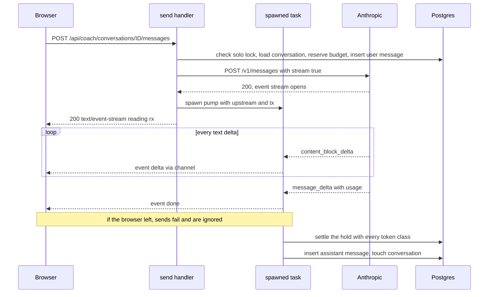

The coach is the most expensive thing Ascend does. Every reply is a call to a paid API that bills per token, takes anywhere from a few seconds to a minute to finish, and is made on behalf of a user who signed up for free. The user is probably on a phone, and phones close tabs, lose signal and switch apps in the middle of a reply.

That gives three requirements that pull against each other. Text must appear as it is generated, or a 40-second reply feels broken. The reply and its cost must be recorded even if the user leaves halfway, or closing the tab buys free tokens. And no single user, script or bug may spend the shared budget. This lesson reads the code that meets them (`crates/core/src/ai/`, `crates/api/src/routes/{coach.rs,sse.rs}`, `web/src/lib/api.ts`, `web/src/pages/Coach.tsx`), including a React route change that dropped a reply, the weaknesses a design review found and the code has since fixed, and what is still open.

## A small typed client instead of an SDK

There is no official Anthropic SDK for Rust, so `crates/core/src/ai/anthropic.rs` is a client of about 370 lines, plus 90 of tests, that covers exactly what the product uses: one-shot completions for JSON outputs and streamed text for chat. The whole request shape lives in one function:

```rust
// crates/core/src/ai/anthropic.rs — AnthropicClient::builder
fn builder(&self, req: &Request, stream: bool) -> AppResult<reqwest::RequestBuilder> {
    let body = Body {
        model: &req.model,
        max_tokens: req.max_tokens,
        system: std::iter::once(SystemBlock {
            kind: "text",
            text: &req.system,
            cache_control: Some(CacheControl { kind: "ephemeral" }),
        })
        .chain(req.context.as_deref().map(|text| SystemBlock { kind: "text", text, cache_control: None }))
        .collect(),
        messages: &req.messages,
        thinking: Thinking { kind: "adaptive" },
        output_config: OutputConfig {
            effort: req.effort,
            format: req.json_schema.clone().map(|schema| OutputFormat { kind: "json_schema", schema }),
        },
        cache_control: req.cache_conversation.then_some(CacheControl { kind: "ephemeral" }),
        stream,
    };
```

Five decisions are visible in those lines. The system prompt is split in two: a stable block (`req.system`) with a cache breakpoint, then an optional per-request context block (`req.context`) without one; a top-level `cache_control` turns on automatic caching of the conversation. Thinking is adaptive, and `effort` is the dial: `Medium` for the coach, `High` for the interview grader. JSON-schema output is optional per request, which is how quizzes and evaluations get parseable JSON without a retry loop. And streaming is a boolean on the same body, so the two paths cannot drift apart. Two unit tests, `stable_prefix_is_cached_and_context_is_not` and `single_shot_requests_skip_conversation_caching`, serialise a request and assert the block layout, because a silent change here would break nothing visibly; it would only raise the bill.

The streaming method has a contract written in its doc comment: *the returned stream always ends with exactly one `Done` or `Error` event.*

```rust
// crates/core/src/ai/anthropic.rs — AnthropicClient::stream
while let Some(item) = events.next().await {
    match item {
        Ok(ev) => match serde_json::from_str::<SseEvent>(&ev.data) {
            Ok(SseEvent::MessageStart { message }) => {
                usage.input_tokens = message.usage.input_tokens;
                usage.cache_read_input_tokens = message.usage.cache_read_input_tokens;
                usage.cache_creation_input_tokens = message.usage.cache_creation_input_tokens;
            }
            Ok(SseEvent::ContentBlockDelta { delta: Delta::Text { text } }) => yield StreamEvent::Delta(text),
            Ok(SseEvent::MessageDelta { delta, usage: u }) => {
                usage.output_tokens = u.output_tokens;
                finished = true;
                yield StreamEvent::Done { usage, stop_reason: delta.stop_reason };
                break;
            }
            // ... Error events and transport errors set `finished` and yield Error
        },
    }
}
if !finished {
    yield StreamEvent::Done { usage, stop_reason: None };
}
```

The invariant matters because everything downstream settles accounts on the terminal event. If the upstream connection ends without a `message_delta` (a proxy cut it, the provider restarted), the `finished` flag still produces a `Done`, so the consumer records whatever usage it saw. Notice also what is *not* forwarded: thinking deltas fall into `Delta::Other` and are dropped. While the model thinks, no bytes flow to the browser, which is why the SSE response sends a keep-alive comment every 15 seconds.

Errors are translated once, in `map_status`: a provider 429 becomes `AppError::RateLimited` with a 30-second retry hint, 529 and 503 become "overloaded, try again shortly", 401/403 become "the AI coach is temporarily unavailable" (a credentials problem is ours to fix, and the learner only needs to know the feature is down), and a 400 becomes a generic "the AI provider rejected the request". The provider's error body is logged and never forwarded, because it can echo request content.

That rule used to have a hole. `map_status` runs only when the HTTP status is an error, before streaming starts. Once a 200 stream was open, a provider `error` event (`overloaded_error` halfway through a reply) or a transport failure became `StreamEvent::Error` carrying the provider's own text, which `sse::respond` forwarded as it was, and non-streaming failures built `AiUpstream` from a reqwest or JSON error the same way. The fix logs the provider's words and shows the learner a classified message:

```rust
// crates/core/src/ai/anthropic.rs
/// What the learner sees when a reply stops part-way. Provider error text is
/// logged, never shown: it can echo request content or internal details.
fn interrupted_message(kind: &str) -> &'static str {
    match kind {
        "overloaded_error" => "The AI provider is overloaded, so the reply stopped early. Try again shortly.",
        "rate_limit_error" => "The AI provider is busy, so the reply stopped early. Try again in a moment.",
        _ => "The reply was interrupted. Try again.",
    }
}
```

and every non-streaming failure goes through `AppError::ai_upstream(public, detail)`, which logs `detail` and returns only `public`. Two unit tests pin it against a real socket: a one-shot local HTTP server replays a stream whose `error` event contains the word SECRET, and `provider_error_text_never_reaches_the_learner` asserts that the learner's event mentions "overloaded" and not SECRET; `upstream_throttling_carries_a_retry_hint` does the same for a 429. A rule enforced in one function covers exactly that function, so every path that turns someone else's text into yours needs its own check.

**Rejected alternative:** a multi-provider LLM library or an unofficial crate. It would save a few hundred lines and cost control over the exact bytes sent, which is where prompt caching lives. **Failure mode prevented:** a silent change in how the system prompt is serialised, turning every cache read into a cache write. **At 100x:** the client has no retries and no circuit breaker, so a provider overload becomes an error bubble in the chat. Add bounded, jittered retries for 529s before the first byte, and a breaker that flips AI features to the existing "unavailable" state when the error rate crosses a threshold.

## Streaming through a channel, not through the handler

The obvious way to stream is to return the upstream stream from the handler, mapped to SSE events, and persist the reply when the stream ends. It works in every demo and fails on a disconnect: when the browser goes away, Axum drops the response body, and with it every future it owns. The upstream request is cancelled mid-reply, the "persist when done" code never runs, and the tokens already generated are never recorded, so closing the tab would buy free output and a conversation with a missing reply.

Ascend inverts ownership. The upstream stream is moved into a background task that owns persistence; the HTTP response is only a reader of a channel.

```rust
// crates/api/src/routes/coach.rs — send
let client = state.coach.client()?.clone();
ensure_coach_unlocked(&state, user.id).await?;
let (conv, _) = state.coach.get_conversation(user.id, id).await?;
let progress = state.progress.summary(user.id).await.ok();
// Builds the request, reserves budget for it, then stores the learner's message.
let (request, hold) = state.coach.prepare_turn(user.id, &conv, input, progress.as_ref()).await?;
// A failure to start the stream drops `hold`, which releases it.
let upstream = client.stream(&request).await?;

let (tx, rx) = sse::channel();
let coach = state.coach.clone();
// The spawned task outlives the request; `.instrument` carries the request
// span (method, path, request id) into its logs.
state.tasks.spawn(
    async move {
        futures::pin_mut!(upstream);
        let (reply, usage, error) = sse::pump(upstream, &tx).await;
        if let Some(e) = &error {
            tracing::warn!(error = %e, conversation = %conv.id, "coach stream error");
        }
        // ... one log line with every token class, then:
        if let Err(e) = coach.finish_turn(conv.id, reply, usage, hold).await {
            tracing::error!(error = %e, "failed to persist coach reply");
        }
    }
    .instrument(tracing::Span::current()),
);
Ok(sse::respond(rx))
```

The pump forwards every event and deliberately ignores send failures: a closed receiver means the browser left, and the task keeps consuming so the reply is persisted and its usage recorded.

```rust
// crates/api/src/routes/sse.rs — pump
while let Some(ev) = upstream.next().await {
    match &ev {
        StreamEvent::Delta(t) => full.push_str(t),
        StreamEvent::Done { usage: u, .. } => usage = *u,
        StreamEvent::Error(e) => error = Some(e.clone()),
    }
    let _ = tx.send(ev).await;
}
(full, usage, error)
```



Four details make this correct.

**Backpressure.** `sse::channel()` is `mpsc::channel(64)`. If the browser is slow, `tx.send(...).await` waits once 64 deltas are buffered, so the task stops reading and TCP flow control pushes back upstream. Only a *closed* receiver makes `send` return immediately, and then the task drains the rest of the reply at full speed.

**No database connection is held while streaming.** `prepare_turn` uses the pool before the call; `finish_turn` uses it after. A thousand concurrent streams need a thousand small tasks and no connections from the pool (15 per replica in production). `a_reply_is_saved_and_billed_when_the_learner_hangs_up_mid_stream` (stub model, `70f15c7`) reads one frame, drops the body and finds the whole reply saved and billed.

**Bounded lifetime.** The HTTP client is built with `timeout(AI_TIMEOUT_SECS)` (180 s by default), and a reqwest total timeout covers reading the body, so a stuck upstream ends the task with an `Error` and the invariant above still produces a terminal event.

**Tracked as well as spawned.** The first version used a bare `tokio::spawn`. That protected a reply from a closed tab but not from a deploy: on SIGTERM, Axum's graceful shutdown waits for in-flight *requests*, and a stream whose browser had gone was only a task nobody waited for. When `main` returned, the runtime dropped it mid-reply. Now the task is spawned on `state.tasks`, a `TaskTracker` from `tokio_util`, and once the server has stopped accepting connections `main` calls this with a 30-second timeout, logging `background tasks still running at shutdown` with the count when it returns `false`:

```rust
// crates/api/src/serve.rs — finish_tasks
pub async fn finish_tasks(tasks: &TaskTracker, timeout: Duration) -> bool {
    tasks.close();
    tokio::time::timeout(timeout, tasks.wait()).await.is_ok()
}
```

The wait is bounded because a hung upstream must not block a deploy. Before it, `serve` bounds the connection drain to 25 s, so a browser still reading a stream cannot hold the process. Both bounds sit inside Railway's 60-second draining window, which until `8f82820` was the default of 0 seconds, so SIGKILL followed SIGTERM at once and none of this ran in production. Replies finishing within about a minute of SIGTERM are persisted. Since `95b6623` it is tested rather than argued: the drain moved from `main` into `crates/api/src/serve.rs`, where `crates/api/tests/shutdown.rs` drives it over real sockets (`a_stalled_stream_cannot_hold_shutdown_past_the_drain_timeout`, `background_tasks_get_to_finish_but_not_forever`), and CI's `image` job sends the production container SIGTERM and requires a clean exit within 25 s.

There is a cost to this design worth saying out loud. The Stop button in `useStreamingChat` aborts the `fetch`, which closes the connection, which the server treats exactly like a closed tab: it keeps generating and bills the full reply. Stop saves the learner's attention, not tokens. Distinguishing "stop" from "disconnect" needs a cancellation token the stop endpoint can trigger; the code does not have one.

```viz
{"type": "network", "scenario": "long-polling-vs-sse", "title": "Why SSE fits a one-way token stream", "caption": "Ascend uses SSE over a POST: one request, a response that keeps sending delta events, and a 15-second keep-alive comment while the model thinks."}
```

### Why not EventSource or WebSockets

`EventSource` is the browser's built-in SSE client, and it can only issue GET requests with no body and no custom headers. The coach needs to POST the message plus the learner's editor contents, and every mutating request must carry `X-Requested-With` for CSRF. So `streamPost` in `web/src/lib/api.ts` uses `fetch` and hands the decoded text to a parser in `web/src/lib/sse.ts`:

```typescript
// web/src/lib/sse.ts — the line splitter inside createSseParser
const drain = (final: boolean) => {
  let start = 0;
  for (let i = 0; i < buffer.length; i++) {
    const c = buffer[i];
    if (c === "\n") {
      line(buffer.slice(start, i));
      start = i + 1;
    } else if (c === "\r") {
      if (i + 1 === buffer.length && !final) break; // maybe half a CRLF: wait
      line(buffer.slice(start, i));
      if (buffer[i + 1] === "\n") i++;
      start = i + 1;
    }
  }
  buffer = buffer.slice(start);
};
```

Network reads split anywhere, including inside a UTF-8 character and inside a line, which is why the decoder runs with `stream: true` and only complete lines are processed. A blank line dispatches the event; several `data:` lines join with `\n`; lines starting with `:` are the server's keep-alive comments.

**Before: a parser that was right for the common case.** The first version, inline in `streamPost`, split lines on `\n` only, stripping one trailing `\r`. But SSE also ends a line at a lone CR, and axum's encoder splits a payload at every CR or LF inside it, each piece with its own `data:` prefix: the delta `"sunset bye\r"` goes on the wire as `data: sunset bye\rdata: \n`, which the old parser read as one line, showing the learner `sunset bye\rdata: `. Model output rarely contains a carriage return, so nothing noticed until a review against the axum source (fixed in `527d3d1`).

**After: follow the spec, and test with the server's own bytes.** CRLF, LF and a lone CR now all end a line. The subtle part is the chunk boundary: a chunk ending in `\r` may be followed by one starting with the `\n` of the same CRLF, and ending the line at once would make that LF look like a blank line and dispatch a half-built event, so a trailing CR waits for the next chunk or the end of the stream. `web/src/lib/sse.test.ts` feeds it axum's own encodings (copied from axum's tests), splits a stream at every byte offset and checks the result never changes, and covers comments, the event-name reset and a final event with no closing blank line. When you reimplement one side of a wire format, test against bytes the other side really produces.

WebSockets were never seriously considered: the data flows one way, and SSE is plain HTTP through the same middleware (cookies, CSRF, request IDs, timeouts). See [Real-time transports](/learn/networking/application-protocols/real-time-transports) for the general comparison.

## The incident: a route change that dropped the reply

The first version of the coach page had two routes, `/coach` and `/coach/:id`, both rendering `CoachPage`. A learner on a fresh `/coach` page types a question. `send` creates a conversation, then navigates to `/coach/<new id>` so the URL is shareable and survives a reload, then starts streaming.

In React Router, two sibling `<Route>` elements are two positions in the tree, so navigating from one to the other unmounted the first `CoachPage` and mounted a new one. The stream kept writing deltas into the closure of the *old* instance; the new one started empty and hydrated from the server, which at that moment held only the user's message. The reply never appeared, yet a reload showed it, because the spawned task had persisted it: exactly the kind of bug that looks like a flaky network in manual testing.

It was caught by the live AI Playwright test, which asserts that the reply renders *before* reloading and that the URL changed:

```typescript
// web/e2e/ai.spec.ts
test("coach streams a grounded reply and keeps the conversation", async ({ page }) => {
  await register(page);
  await page.goto("/coach");
  await page.getByTestId("coach-input").fill("In one sentence: what does a hash table's load factor measure?");
  await page.keyboard.press("Enter");
  // The assistant bubble fills in as SSE deltas arrive.
  await expect(page.locator("text=/entries|slots|buckets/i").first()).toBeVisible({ timeout: 120_000 });
  await expect(page).toHaveURL(/\/coach\/[0-9a-f-]+$/);
  await page.reload();
  await expect(page.locator("text=/load factor/i").first()).toBeVisible();
});
```

The fix has two parts. One route with an optional segment keeps the element at the same tree position, so navigation re-renders the same instance instead of remounting it:

```typescript
// web/src/App.tsx
{/* One route with an optional segment: creating a conversation navigates
    /coach -> /coach/:id without remounting the page mid-stream. */}
<Route path="/coach/:id?" element={<RequireAuth><CoachPage /></RequireAuth>} />
```

And a guard stops server hydration from overwriting a stream this instance owns:

```typescript
// web/src/pages/Coach.tsx — CoachPage
// The conversation this page instance created and is streaming into. Its
// turns live in local state; server history must not overwrite them.
const localConv = useRef<string | null>(null);
// ...
useEffect(() => {
  if (!id) {
    if (!chat.busy) chat.setTurns([]);
    return;
  }
  if (id === localConv.current) return;
  chat.setTurns(detail.data?.conversation.id === id ? ChatHistoryToTurns(detail.data.messages) : []);
}, [detail.data, id]);
```

Component identity is part of your state model: a URL change is more than navigation when a long-lived operation lives in component state, and only a test with a real stream reproduces the timing.

## Prompt caching: from one breakpoint to three blocks

Prompt caching is a prefix match: a later request whose bytes up to a `cache_control` breakpoint are identical reads the cached prefix instead of reprocessing it. The prompt renders tools, then system, then messages, so a change anywhere invalidates everything after it. On the configured model (`claude-opus-5-5`, $4 per million input tokens), a cache write costs 1.25x the input price ($5 per million), a read costs 0.05x ($0.20 per million), and an entry lives for five minutes, refreshed by every read. Caches are per API workspace, so learners share identical prefixes.

### Before: a stable-first prompt with a single breakpoint

The first version assembled one system prompt, stable parts first: the persona and a curriculum map, then the lesson text (up to 24,000 characters), the learner's editor contents (up to 12,000) and a progress line. The ordering was the right instinct, but the client sent the whole prompt as *one* block with one breakpoint at its end. The cacheable unit was therefore the entire system prompt, volatile tail included, and the conversation history after it was never cached at all:

| Situation | Cache behaviour with one block |
|---|---|
| Turn 2..n of the same dock conversation within 5 minutes | System prompt hit (same lesson, same editor snapshot, same progress); history paid in full |
| Learner finishes a lesson between turns | Miss: the progress line changed, so the whole prompt was written again |
| Same lesson, different learner or different code | Miss: the persona and curriculum map, identical for everyone, were re-written |
| The conversation history | Never cached: only the system block carried a breakpoint |

The client also parsed `cache_read_input_tokens` and `cache_creation_input_tokens`, and `record` threw them away, so nobody could see the hit rate; and since the provider's `input_tokens` counts only uncached input, `ai_usage.input_tokens` under-reported what was billed.

### After: stable block, context block, cached conversation

The AI hardening commit (`1d3da0c`) split the prompt along its rates of change:

```rust
// crates/core/src/ai/coach.rs — CoachService::prepare_turn
Ok(Request {
    model: self.model.clone(),
    system: self.stable_prompt(),
    context: Some(self.context_prompt(&context, progress)),
    cache_conversation: true,
    messages: msgs,
    max_tokens: 4000,
    effort: Effort::Medium,
    json_schema: None,
})
```

`stable_prompt` (persona and curriculum map, identical for every learner and turn) carries its own breakpoint; `context_prompt` (the lesson or problem, the editor contents, the progress line) follows it, so changing the context never invalidates the stable block. `cache_conversation: true` sets the top-level `cache_control`, which places a breakpoint on the last cacheable block and moves it forward as the conversation grows, so each turn reads everything up to the previous turn and writes only what is new. How the history's cap moves decides whether that survives a long conversation. `prepare_turn` used to send the last 30 messages (`MAX_HISTORY`), and from the sixteenth turn that window slid by one exchange every turn: the history's first message changed on every request, the cached prefix ended at the context block, and every turn rewrote its whole history at 1.25x, so the longer the conversation, the more each turn cost. The window now moves in steps:

```rust
// crates/core/src/ai/coach.rs
/// Index of the first message to send, for a conversation of `total`
/// messages: 0 until the window is full, then advancing in whole steps so
/// between `MAX_HISTORY - HISTORY_STEP` and `MAX_HISTORY` messages are kept.
fn history_start(total: u64) -> u64 {
    if total <= MAX_HISTORY {
        return 0;
    }
    (total - MAX_HISTORY).div_ceil(HISTORY_STEP) * HISTORY_STEP
}
```

With `HISTORY_STEP` at 10, the start jumps ten messages at once and then stays put for five turns, so four turns in five read their whole history from cache and one in five pays for a rewrite; the model sees between 21 and 30 messages instead of exactly 30. The unit test `history_window_moves_in_steps_so_the_cached_prefix_survives` checks both the jump and the bounds for every length up to 500. Trading a little context for a stable prefix is a typical cache design move: make the thing that changes change rarely, in big steps. `m0006` added `cache_read_tokens` and `cache_write_tokens` columns, the budget stores them, and every coach turn logs all four token classes.

A worked example makes the difference concrete. Take a 10-turn dock conversation, every turn within five minutes, with a 2,000-token stable block, a 6,000-token context block, and 1,100 tokens of new history per turn (a 100-token question and a 1,000-token reply):

| Design | Input tokens and their price | Input cost |
|---|---|---|
| No caching | 130,500 tokens at $4/M | $0.52 |
| One block, one breakpoint (before) | system: 8,000 written, 72,000 read; history: 50,500 uncached | $0.26 |
| Stable, context, cached conversation (after) | 18,000 written, 112,500 read | $0.11 |

Output is the same in all three (10,000 tokens at $20 per million, $0.20), so caching the history more than halves the input bill here. Two caveats keep the table honest. The context block sits *before* the history, so when it changes (the progress line moves) the stable block is still read but the whole history is written again at 1.25x. And a learner who reads for seven minutes between questions finds every entry expired except, usually, the stable block, which other learners keep warm. Caching also moved almost every input token into the cache columns, which the budget below must count. See [LLM system design](/learn/ai-and-llms/building-with-llms/llm-system-design) for caching strategy in general.

## Budgets: hold before, settle after

Every model call goes through `BudgetService`, the only code that touches `ai_usage` (one row per user per UTC day). `Bucket::Ai`, 20 model calls per minute per session, stops bursts ([Authentication and security](/learn/case-study-ascend/the-system/authentication-and-security) explains its key); the daily budget is the cost fuse. Production sets 150 requests and 120,000 output tokens a day in `.railway/railway.ts` and keeps the default of 2,000,000 billed input tokens. The budget went through four versions, each closing a hole the previous one left.

### Before: a check and an increment

```rust
// crates/core/src/ai/budget.rs — BudgetService::check_and_reserve, before 1d3da0c
pub async fn check_and_reserve(&self, user_id: Uuid) -> AppResult<()> {
    let status = self.status(user_id).await?;
    if status.requests_used >= status.requests_limit {
        return Err(AppError::RateLimited(format!(
            "daily AI request limit reached ({} / day). Resets at midnight UTC.",
            status.requests_limit
        )));
    }
    if status.output_tokens_used >= status.output_tokens_limit {
        return Err(AppError::RateLimited("daily AI token budget reached. Resets at midnight UTC.".into()));
    }
    self.bump(user_id, 0, 0, 1).await
}
```

`bump` was an atomic `INSERT ... ON CONFLICT (user_id, day) DO UPDATE SET requests = ai_usage.requests + $n`. Read the function as an adversary, though: the check was a read, the increment a separate statement. Two requests arriving together at 149 of 150 both read 149, both passed, both incremented: 151.

### Then: the database decides

```rust
// crates/core/src/ai/budget.rs — BudgetService::check_and_reserve, 1d3da0c to bd0dcf0
let sql = format!(
    r#"
    INSERT INTO ai_usage (user_id, day, input_tokens, output_tokens, requests)
    VALUES ($1, $2, 0, 0, 1)
    ON CONFLICT (user_id, day) DO UPDATE
       SET requests = ai_usage.requests + 1
     WHERE ai_usage.requests < $3
       AND {BILLED_INPUT_SQL} < $4
       AND ai_usage.output_tokens < $5
    RETURNING requests
    "#
);
// ... bind the user, today and the three daily limits, then:
match self.db.query_one_raw(stmt).await? {
    Some(_) => Ok(()),
    None => Err(AppError::RateLimited {
        message: /* "daily AI budget reached ... Resets at midnight UTC." */,
        retry_after_secs: Some(seconds_until_reset()),
    }),
}
```

No row back means "over budget" and nothing changed. The row lock taken by the conflicting update serialises concurrent reservations for the same user, and the waiter re-checks the `WHERE` against the committed row ([Data and migrations](/learn/case-study-ascend/the-system/data-and-migrations) traces how a conditional upsert behaves under that lock). The test `ai_budget_reservation_cannot_be_overshot_by_concurrency` fires 30 reservations at once against a limit of 10 and asserts that exactly 10 succeed. The same commit added a daily *input* token limit (`AI_DAILY_INPUT_TOKENS`, two million by default), which had a gap of its own.

### Before and after: a limit on the wrong column

The input limit first compared against `ai_usage.input_tokens`, the provider's *uncached* count, while the same commit turned on conversation caching, which drives that count close to zero. The input that actually costs money in a coach turn is cache writes, billed at 1.25x, recorded in `cache_write_tokens` and checked against nothing: a client that sent different editor contents with every message could make each request a near-complete cache write and never approach the limit. Two correct features had combined into a fuse that no longer measured the current flowing through it.

The fix (`22e4321`) changed what the limit counts: billed input is `input_tokens + cache_write_tokens * 5 / 4 + cache_read_tokens / d`, and `status()` reports the same figure. The test `cache_writes_count_against_the_input_budget_and_the_refusal_says_when_to_retry` records 90,000 cache-write tokens with zero uncached input and asserts that the next reservation is refused and that the learner's usage reads 112,500. The refusal also says when to come back: `RateLimited` carries `retry_after_secs`, the seconds until the next UTC midnight, which the API sends as `Retry-After`. The divisor `d` was a flat 10 until `ac7532b`, which counted reads on `claude-opus-5-5` (billed at 0.05x) twice over; it now comes from `cache_read_divisor(model)`: 20 for Opus 5.5, 40 for Fable 5.1 and Mythos 5.1 (0.025x), 10 otherwise.

### Before and after: a hold, like a card authorisation

Every version so far checked the day's usage before a call and charged the actual usage after it. That left overshoot: a learner at 119,999 of 120,000 output tokens could still start a call with `max_tokens` 4,000 (the coach) or 16,000 (quizzes, roadmap suggestions and grading share `STRUCTURED_MAX_TOKENS`), and a few concurrent calls multiplied that. Commit `bd0dcf0` makes each call reserve its worst case first, the way a card terminal places a hold before the final amount is known:

```rust
// crates/core/src/ai/budget.rs — BudgetService::reserve (condensed)
let input_hold = request.estimated_billed_input(); // bytes / 3 + 16 per message, x 5/4
let max_output = i64::from(request.max_tokens);
// Below this much remaining output the reply would be cut off mid-answer.
let min_output = Ord::min((max_output / 4).clamp(256, 4_000), max_output);
let txn = self.db.begin().await?;
// INSERT ... ON CONFLICT DO NOTHING creates the day's row, then SELECT ... FOR UPDATE:
let row = AiUsage::find_by_id((user_id, day)).lock_exclusive().one(&txn).await? /* ... */;
let remaining_output = self.limits.daily_output_tokens - row.output_tokens - row.reserved_output_tokens;
let within_requests = row.requests < self.limits.daily_requests;
let within_input =
    billed_input(&row, &self.limits) + row.reserved_input_tokens + input_hold <= self.limits.daily_input_tokens;
if !within_requests || !within_input || remaining_output < min_output {
    txn.rollback().await?;
    return Err(self.exhausted()); // 429, Retry-After until UTC midnight
}
let output_hold = Ord::min(max_output, remaining_output);
// UPDATE: requests + 1, reserved_input_tokens + input_hold, reserved_output_tokens + output_hold
txn.commit().await?;
request.max_tokens = u32::try_from(output_hold).unwrap_or(request.max_tokens);
```

Three details make the per-user bound hard. The check runs under the row lock, so one learner's concurrent reservations queue as they did on the upsert (the 30-way test still grants exactly ten). The hold lowers the request's own `max_tokens` to what is left, so generation stops at the budget. And the returned `Reservation` must be settled: `settle(usage)` releases both holds and adds every token class in one `UPDATE`; a reservation dropped unsettled (an early return before the call) releases itself from a task spawned in `Drop`; a hold orphaned by a crash sits in `reserved_input_tokens` and `reserved_output_tokens` (migration `m0008_budget_holds`) on the day's row and expires with it. The request slot is never refunded, so a call that fails upstream still costs one: a client retrying in a loop runs out quickly.

Trace `a_budget_hold_caps_the_call_at_what_is_left_and_releases_itself`, whose test config allows 1,000 output tokens a day:

| Step | Call | Output left | Minimum to start | Result |
|---|---|---|---|---|
| 1 | reserve, `max_tokens` 800 | 1,000 | min(clamp(200, 256, 4,000), 800) = 256 | Holds 800 |
| 2 | reserve 800 while the first is held | 200 | 256 | Refused: better a 429 than a reply cut at 200 tokens |
| 3 | settle the first with 300 used | 700 | | Hold released, 300 recorded |
| 4 | reserve 800 | 700 | 256 | Holds 700; the request's `max_tokens` is now 700 |
| 5 | drop that reservation unsettled | 700 | | `reserved_output_tokens` returns to 0 |

The order inside `prepare_turn` changed too: it builds the request in memory, reserves against its real size, and only then stores the learner's message, so a refused turn leaves nothing behind. What remains open is the unit: the limits are weighted tokens, so a change of model or price moves the bound, and a budget in money would survive both.

**Rejected alternatives:** counting in process memory (lost on every deploy, wrong with a second replica); Redis (a second stateful dependency, when Postgres already has the row and its lock); only a spend limit at the provider (it protects the company's card, not fairness, and fails everyone at once). **Failure mode prevented:** a looping client, or a burst of concurrent calls, spending past the day's budget. **At 100x:** the table is already shared by every replica; a budget in money and a global cap are what remain, and the final module prices why.

## What the coach deliberately is not

The coach makes one model call per user turn and has no tools, so a turn costs one request slot and one hold of at most `max_tokens`. Give it tools ("look up my last submission") and each turn becomes a loop of model calls, each re-sending the growing transcript.

```viz
{"type": "ml", "algorithm": "agent-loop", "text": "Why does my two_sum submission fail the hidden test?", "title": "What the coach would become with tools", "caption": "Every iteration re-reads the whole transcript. A per-request budget undercounts an agent; you budget per iteration and cap iterations."}
```

The persona rule "never hand over a full solution" is an instruction, not an enforcement mechanism; the product accepts that because a learner who extracts a solution only cheats themselves. See [Agents](/learn/ai-and-llms/building-with-llms/agents) for when that trade changes.

## Exercise

```exercise
id: parse-sse-stream
title: Parse an SSE byte stream into events
prompt: |
  Implement `parse_sse(chunks)`, the parser from `web/src/lib/sse.ts`.
  `chunks` is a list of strings in the order they were read from the
  network; a chunk may end anywhere, even in the middle of a line or
  between the CR and LF of a CRLF.

  Return a list of `[event, data]` pairs, using these rules:

  - A line ends at `\r\n`, `\n` or a lone `\r`. A `\r` at the very end
    of a chunk may be half of a `\r\n`, so decide only once you see what
    follows it (or the input ends).
  - An empty line dispatches the pending event if at least one `data:` line
    was collected. After any empty line the event name resets to `"message"`.
  - A line starting with `:` is a comment (keep-alive) and is ignored.
  - Otherwise the field name is the text before the first `:` and the value
    is the rest, with at most one leading space removed. `event` sets the
    event name; `data` appends the value, and several data lines are joined
    with `\n`. Other fields are ignored.
  - When the input ends, process any unterminated final line, then dispatch
    any pending data.
languages: [python, javascript]
entry: parse_sse
starter:
  python: |
    def parse_sse(chunks):
        events = []
        # your code here
        return events
  javascript: |
    function parse_sse(chunks) {
      const events = [];
      // your code here
      return events;
    }
tests:
  - args: [["event: delta\ndata: Hello\n\n"]]
    expected: [["delta", "Hello"]]
  - args: [["event: del", "ta\nda", "ta: Hel", "lo\n", "\n"]]
    expected: [["delta", "Hello"]]
    label: chunks split mid-line
  - args: [["event: delta\ndata: line one\ndata: line two\n\n"]]
    expected: [["delta", "line one\nline two"]]
    label: multi-line data
  - args: [[": ping\n\n", "event: done\ndata: {\"output_tokens\": 12}\n\n"]]
    expected: [["done", "{\"output_tokens\": 12}"]]
    label: keep-alive comment
  - args: [["data: hi\r\n\r\n"]]
    expected: [["message", "hi"]]
    label: CRLF and the default event name
  - args: [["event: delta\ndata: a\n\ndata: b\n\n"]]
    expected: [["delta", "a"], ["message", "b"]]
    hidden: true
    label: event name resets after dispatch
  - args: [["event: done\ndata: {}\n", "data: partial"]]
    expected: [["done", "{}\npartial"]]
    hidden: true
    label: end of stream flushes the last line and event
  - args: [["data: sunset bye\rdata: \n\n"]]
    expected: [["message", "sunset bye\n"]]
    hidden: true
    label: a lone CR ends a line, as axum emits it
  - args: [["data: a\r", "\ndata: b\r\n\r", "\n"]]
    expected: [["message", "a\nb"]]
    label: a CRLF split across chunks is one line end
  - args: [["data:x\n\ndata:  y\n\n"]]
    expected: [["message", "x"], ["message", " y"]]
    hidden: true
    label: only one leading space is stripped
hints:
  - "Keep a string buffer across chunks. Scan it for `\\n` or `\\r`; on `\\r`, if it is the last character and more input may come, stop and wait, otherwise end the line and skip a following `\\n`."
  - "Keep three pieces of state between lines: the buffer, the current event name, and the list of data lines."
  - "Write dispatch as a small function that does nothing when there is no data, and call it once more after the loop."
```

## Failure modes

| Failure | Symptom | Diagnosis | Fix |
|---|---|---|---|
| The handler owns the upstream stream | Replies missing after a tab closes; `ai_usage` totals below the provider's invoice | Conversations with a user message and no assistant reply after it | Stream through a tracked task and a channel (in place) |
| A volatile value lands before the stable breakpoint | Spend rises with flat traffic | `cache_read_tokens` near zero in the `coach turn complete` log lines after a deploy | Keep the stable block byte-identical; the layout tests pin where each block goes |
| History trimmed one exchange per turn | Long conversations cost more per turn than short ones | `cache_write_tokens` per turn grows with conversation length | Step the window by 10 messages (in place) |
| A budget on uncached input only | Heavy users are never refused although spend climbs | `input_tokens` near zero while `cache_write_tokens` is large in `ai_usage` | Budget billed input: writes 1.25, reads 0.1 (in place) |
| A reply still streaming when the bounded drain ends (25 s, then 30 s) | A reply cut off by a deploy | `background tasks still running at shutdown` with `remaining` | A job queue that outlives the web process |

## Interviewer follow-ups

**"Why not return the model stream from the handler?"** Model answer: in Axum, a disconnect drops the response body and every future it owns, so the upstream call is cancelled, the reply is never persisted and its tokens never recorded. Moving the stream into a tracked task that owns persistence, with the response as a reader of a 64-slot channel, keeps backpressure for slow readers and completeness for departed ones. Common wrong answer: "save the reply in a `finally` block", which never runs when the future is dropped.

**"How do you know prompt caching is working in production?"** Model answer: from the counters, not the configuration. Every turn logs input, output, cache-read and cache-write tokens, `ai_usage` keeps all four per user per day, `ascend.ai.tokens` exports them by kind, and the hit rate is reads over all input; a prefix under the model's minimum or a changed byte fails silently, with no error. Common wrong answer: "we set `cache_control`, so it is cached".

**"What stops one user or script spending the shared key?"** Model answer: two layers keyed differently. Twenty model calls a minute per session, shared by every replica, stops bursts; the daily budget in billed tokens caps cost. Each call holds its worst case under the row lock before it runs, with `max_tokens` lowered to what is left, and settles after, so no call can overshoot; a refusal carries `Retry-After` to UTC midnight. Then name the gaps: the per-user cap does not cap the total, and it is in weighted tokens, not money. Common wrong answer: "check the usage before the call", which lets every call in flight run past the limit.

## What mid-level engineers get wrong

- **Letting the HTTP response own work that must finish.** A closed tab cancels it, and with it the persistence and the bill.
- **An unbounded channel between a fast producer and a slow reader.** Memory grows with every slow phone; 64 slots and an awaited send push back on the provider instead.
- **Holding a pooled database connection for the length of a stream.** A thousand streams would need a thousand connections from a pool of 15.
- **Checking a budget before a call and charging after it.** Every call in flight can run past the limit; hold the worst case first.
- **A bare `tokio::spawn` for work that must survive shutdown.** Nothing waits for it, and its log lines lose the request id.
- **Splitting SSE on `\n` alone.** A lone CR is a line end, and the server's encoder emits one for any CR in the payload.
- **Forwarding the provider's error text.** It can quote the request, including another learner's content in a shared prompt.

## Senior signals

- You separate **who owns the work** from **who watches it**: the model stream belongs to a task that persists and bills; the HTTP response is a disposable consumer.
- You read a budget as an adversary: a check and an increment in two statements race, and a check before the call lets the call overshoot; you reserve the worst case under a lock, settle after, and know which column the limit measures.
- You explain prompt caching as a **prefix match up to a breakpoint** with a TTL and a write premium, split prompts by rate of change, and check where the breakpoints are before claiming ordering helps.
- You track background work that must outlive a request, and you state the shutdown guarantee with its bound.
- You treat component identity and route structure as state, and you want an end-to-end test with a real stream before trusting streaming UI.
- You know that thinking tokens bill as output, so `effort` is a cost dial as well as a quality dial.

## Check yourself

```quiz
- q: >-
    A learner closes the tab two seconds into a 30-second coach reply. What happens on the server?
  options: ["The partial reply is discarded, but its tokens are still recorded from the message_start event", "The request is queued and replayed automatically when the learner opens the page again", "Axum drops the response body, which cancels the upstream call, so nothing is stored or billed", "The background task keeps reading, ignores the failed sends, and stores and bills the reply"]
  answer: 3
  explanation: >-
    The upstream stream is owned by a tracked background task, not by the response. When the receiver is dropped, tx.send fails and pump ignores the error, so the task drains the stream and calls finish_turn, which settles the budget hold with the real usage and stores the reply. Cancellation on drop is what happens when a handler returns the upstream stream directly, the naive design this code avoids.
- q: >-
    Before the AI hardening commit, two requests from one user arrived together when ai_usage showed 149 of 150 requests. What happened, and what prevents it now?
  options: ["Exactly one succeeded, because the increment was already atomic; nothing had to change", "The second waited for the first model call to end; a per-user mutex now serialises them", "Both failed with a serialisation error; a retry loop around the check now handles it", "Both succeeded and the count reached 151; a check under the row lock now decides"]
  answer: 3
  explanation: >-
    Each request read 149 in status(), passed the comparison, then ran its own atomic increment. Atomic increments do not make a check-then-act sequence atomic. The fix moved the check under the day row's lock, first as one ON CONFLICT DO UPDATE ... WHERE ... RETURNING and now as reserve's SELECT ... FOR UPDATE in a transaction, so reservations queue and an over-budget request changes nothing. A mutex around the model call would serialise minutes of work, not one short check.
- q: >-
    A learner asks the coach a question in the dock, completes the lesson (so the progress line changes), and asks again 30 seconds later. What does the prompt cache do on the second request?
  options: ["Reads the whole prompt from cache, because the five-minute lifetime has not expired", "Reads the context and the history, and re-writes only the stable persona block", "Misses everything, because any change anywhere in a request invalidates the entire cache", "Reads the stable block, then re-writes the context block and the history after it"]
  answer: 3
  explanation: >-
    Caching is a prefix match in render order: system blocks, then messages. The stable block is unchanged, so it is read. The context block changed, and everything after it, including the conversation history, must be written again at the write premium. A change invalidates only what follows it, not what precedes it.
- q: >-
    Why does the frontend parse SSE by hand with fetch instead of using the browser's EventSource?
  options: ["EventSource does not decode UTF-8, so multi-byte characters arrive split", "EventSource cannot POST a body or set custom headers, and the coach needs both", "fetch streams deliver tokens faster because they skip the event parser", "EventSource cannot reconnect after a network drop, which phones need"]
  answer: 1
  explanation: >-
    The message and editor contents travel in a POST body, and every mutating request must carry X-Requested-With for the CSRF middleware. EventSource can do neither. It does reconnect automatically, a feature this app gives up, but reconnecting would not make sense for a POST that creates a message anyway.
- q: >-
    The coach page used separate routes for /coach and /coach/:id. Why did replacing them with one route, /coach/:id?, fix the dropped reply?
  options: ["Optional segments match faster, so the navigation finishes before the stream begins", "It stops React Router from refetching the conversation while a stream is running", "It makes navigate() synchronous, so the new page mounts before the very first delta arrives", "The element keeps its tree position, so React re-renders instead of remounting the page"]
  answer: 3
  explanation: >-
    React preserves component state when the element type and position are unchanged. Two sibling routes are two positions, so navigating between them unmounted the page whose closure held the live stream. The localConv guard handles the second half of the bug, hydration overwriting a stream in progress.
- q: >-
    A learner presses Stop 5 seconds into a reply that would have used 3,000 output tokens. Roughly what is billed and stored?
  options: ["Nothing at all, because the provider does not bill aborted requests", "The full reply is generated, billed, stored and counted in ai_usage", "About five seconds of tokens, because Stop cancels the upstream call", "The partial text is stored, and the daily budget refunds the difference"]
  answer: 1
  explanation: >-
    Aborting the fetch closes the connection, which the server cannot tell apart from a closed tab. The background task finishes the stream by design. Saving tokens on Stop needs an explicit cancel signal that the task checks, which trades against the guarantee that disconnects never lose replies.
```
