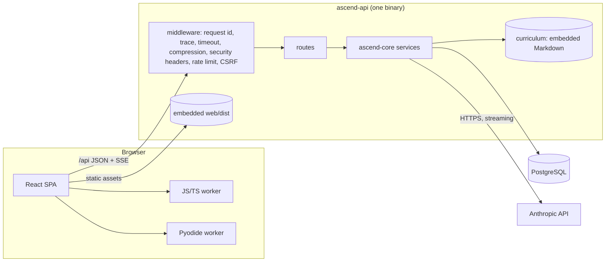

# Architecture

Ascend is one Rust binary that serves a JSON API under `/api` and a React single-page app for everything
else, backed by one PostgreSQL database. The curriculum is Markdown compiled into the binary. The only
external runtime dependency is the Anthropic API, and the app degrades gracefully without it.



## Repository layout

```
crates/core      domain layer: config, errors, entities, content engine, auth, AI, services (no HTTP)
crates/api       HTTP adapter: router, middleware, extractors, routes, static hosting (lib + bin)
crates/grader    server-side grading: learner code in a WebAssembly sandbox (Wasmtime, CPython, QuickJS)
migration        SeaORM migrations, append-only
content          curriculum (tracks/modules/lessons) and practice problems, Markdown + YAML
web              React SPA, code runners (Web Workers), visualisation engine
scripts          problem validator, grader runtime fetcher, dev helpers
runtimes         (gitignored) the grader's WebAssembly runtimes, from `make grader`
docs             this file and architecture decision records
```

## Request lifecycle

1. **Edge.** Railway terminates TLS and forwards to the container; it sets `X-Real-IP`, which is the only
   client-IP source the rate limiter trusts (`CLIENT_IP_HEADER=x-real-ip`).
2. **Middleware** (outermost first, `crates/api/src/app.rs`): request ID (generated, then propagated to the
   response), tracing span, 240 s timeout, Brotli/gzip compression, security headers (CSP, HSTS, frame
   denial). Under `/api` only: a 512 KiB body limit, a loose per-IP rate limit, and CSRF enforcement.
   Tighter buckets sit on the expensive routes: sign-up and login per IP, password attempts per account,
   and model calls and graded submissions per session, so learners sharing one NAT address do not throttle each other. A 429
   always carries `Retry-After`, and the client's retry policy honours it.
3. **Extractors** resolve the session cookie once per request and cache the user in request extensions
   (`crates/api/src/extractors.rs`). `CurrentUser` rejects with 401; `MaybeUser` never fails.
4. **Routes** are thin: parse input, call one service, map the result. They never touch the database
   directly.
5. **Services** (`crates/core/src/services`, `crates/core/src/auth`, `crates/core/src/ai`) own the logic and
   return `AppResult<T>`. `AppError` is semantic (`NotFound`, `Conflict`, `RateLimited`, `AiDisabled`, …); the
   API maps it to HTTP in exactly one place (`crates/api/src/error.rs`) and never leaks internal details.

## Data

Twelve tables in seven append-only migrations: `users`, `sessions`, `lesson_progress`, `module_preferences`,
`quiz_attempts`, `submissions`, `activity_days`, `conversations`/`messages`, `ai_usage`, `comments`,
`interviews`. Everything a user owns cascades on account deletion, except comments: they keep their text
with a null author so replies keep their context. Progress and preferences use composite primary keys
and single-statement upserts (`INSERT … ON CONFLICT DO UPDATE`), so there is no read-modify-write race.
Invariants live in the schema where they can: a partial unique index allows one active interview per
learner, and `activity_days` has one row per learner per day, which is what streaks are computed from. A
day is the learner's own calendar day in the IANA zone on their account (`users.timezone`, set from the
browser and validated against `pg_timezone_names`); Postgres does the conversion.

Content is **not** in the database. Rows reference content by stable slug (`track/module/lesson`), so
lessons can be edited and redeployed without a migration, and progress survives re-ordering.

## Content engine

`crates/core/src/content` embeds `content/` with `include_dir!`, parses front matter, extracts the special
fenced blocks (`exercise`, `quiz`, `viz`), strips quiz answers from what the client receives, builds a table
of contents, links previous/next lessons, validates every cross-reference and every quiz and exercise block
(unknown keys are errors), fingerprints the corpus for ETags (combined with the build id and SPA shell, so a
deploy that changes a response's shape invalidates cached copies), and builds an in-memory search index. It runs once at boot and again in the Docker build
(`ascend-api --check-content`), so a broken lesson fails the build, not the deploy.

## Authentication

- Argon2id password hashing on Tokio's blocking pool; login verifies against a dummy hash for unknown
  emails so timing does not reveal which emails are registered.
- Opaque 256-bit session tokens in an `HttpOnly`, `SameSite=Lax`, `Secure` cookie. The database stores only
  the SHA-256 of the token, so a database leak cannot be replayed. Sessions are revocable individually or
  all at once; an hourly task sweeps expired rows.
- CSRF: `SameSite=Lax`, plus an `Origin`/`Referer` check against the configured origin, plus a required
  `X-Requested-With` header that cross-origin pages cannot send without a CORS preflight (which is never
  granted).

See [ADR 0002](adr/0002-server-side-sessions.md).

## AI features

`crates/core/src/ai` holds a small typed client for the Anthropic Messages API (non-streaming and SSE
streaming, JSON-schema constrained output, adaptive thinking with an effort level, prompt caching on the
system prompt). Three products sit on top:

- **Coach**: the system prompt is ordered stable-first (persona, curriculum map) and volatile-last (the
  current lesson, the learner's code, progress) so repeated turns hit the prompt cache. It is instructed to
  give hints and questions, never full solutions to exercises.
- **Quiz generation**: JSON-schema output, validated again server-side.
- **Mock interviews**: an interviewer persona per round type; in assisted mode a separate pair-programmer
  endpoint is enabled and everything the candidate asks it is recorded in the transcript; the evaluation is a
  JSON-schema rubric with an extra "AI direction and verification" dimension for assisted rounds.

Every model call first places a hold on the day's budget in `ai_usage` (per user per UTC day, under a row
lock): its estimated input plus its `max_tokens` of output, capped at what is left, which also lowers the
call's `max_tokens`. Settling replaces the hold with the tokens actually billed, so no call can overshoot
the limit. Streaming replies run in a spawned task that persists the reply even if
the browser disconnects; the HTTP response is only a consumer of a channel. See
[ADR 0004](adr/0004-llm-cost-controls.md).

## Code execution

Learner code runs twice. The browser runs it for instant feedback: `web/src/runner` runs
JavaScript/TypeScript (TypeScript stripped by Sucrase) and Python (Pyodide) in dedicated Web Workers with
network APIs removed, and enforces wall-clock limits by terminating the worker. For a signed-in learner the
code also goes to `/api/submissions`, and the server grades it itself in a WebAssembly sandbox
(`crates/grader`: CPython and QuickJS compiled to WASI, run by Wasmtime with time, memory, stack and
concurrency limits, and compared with the expected values on the host). Only the server's verdict is
recorded. See [ADR 0003](adr/0003-client-side-code-execution.md) and
[ADR 0005](adr/0005-server-side-grading.md).

## Visualisations

`web/src/viz` is a frame-based engine: each algorithm is a pure generator from input to a list of frames
(full state snapshot plus one explanatory sentence), capped at 600 frames. The player scrubs, steps and
plays at variable speed; renderers share one set of primitives and tones. Content embeds a visualisation
with a JSON fence (` ```viz {"type": "graph", "algorithm": "dijkstra", …} `).

## Operations

- **Config** is read once from the environment and validated at boot (`crates/core/src/config.rs`);
  production refuses to start with insecure cookies.
- **Logs** are JSON in production, one line per request with the request ID.
- **Health**: `/api/healthz` (liveness) and `/api/readyz` (database reachable, AI configured, content
  version). Railway gates rollouts on `/api/readyz`.
- **Migrations** run on boot before the server binds; a failing migration exits non-zero and the previous
  deployment keeps serving.
- **Shutdown** drains in-flight requests on SIGTERM.

## Scaling notes

Replicas share everything that matters through Postgres: sessions, budgets and the security rate limits
(sign-up, login, password attempts and model calls, as GCRA state in an `UNLOGGED` table updated by one
conditional upsert). Only the loose general bucket is per replica, which is fine for what it guards. So
more replicas need no other change. Postgres is the
bottleneck long before the app servers; the hot read paths (curriculum, lessons, problems) never touch it.
